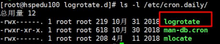

# 整体介绍


#  基本指令

- Linux 刚面世时并没有图形界面，所有的操作全靠命令完成，如磁盘操作、文件存取、目录操作、进程管理、文件权限 设定等
- 在职场中，大量的 服务器维护工作 都是在 远程 通过 SSH 客户端 来完成的，并没有图形界面，所有的维护工作都需要通过命令来完成
- 在职场中，作为后端程序员，必须要或多或少的掌握一些 Linux 常用的终端命令
- Linux 发行版本的命令大概有 200 多个，但是常用的命令只有 10 多个而已

## 关机/重启

关机

```shell
shutdown -h now     #立刻关机
shutdown -h 5       #5分钟后关机
poweroff            #立刻关机
halt				#关机，作用和上面一样
reboot				#现在重新启动计算机
sync				#把内存的数据同步到磁盘
```

重启

```shell
shutdown -r now      #立刻重启
shutdown -r 5        #5分钟后重启
reboot               #立刻重启
```

## 帮助指令

help命令

```shell
shutdown --help：
ifconfig --help：#查看网卡信息
```

man命令（命令说明书） 

```shell
man shutdown
#注意：man shutdown打开命令说明书之后，使用按键q退出
```

## 常用的几个基本命令


## 自动补全

在敲出 文件 ／ 目录 ／ 命令 的前几个字母之后，按下 **tab 键**，如果输入的没有歧义，系统会自动补全；如果还存在其他 文件 ／ 目录 ／ 命令 ，再按一下 tab 键，系统会提示可能存在的命令。

**小技巧**

按 **上 ／ 下 光标键**可以在曾经使用过的命令之间来回切换

如果想要退出选择，并且不想执行当前选中的命令，可以按 **ctrl + c**

# 目录切换cd

### pwd指令

基本语法：pwd（功能描述：显示当前工作目录的绝对路径）

实例：

## 目录切换 cd

是英文单词 change directory 的简写，其功能为更改当前的工作目录，也是用户**最常用的命令之一**

```shell
cd /        #切换到根目录
cd /usr     #切换到根目录下的usr目录
cd ../      #切换到上一级目录 或者  cd ..
cd ~        #切换到home目录
cd -        #切换到上次访问的目录
cd .		#保持在当前目录不变
```

## 目录查看 ls

- ls 是英文单词 list 的简写，其功能为列出目录的内容，是用户最常用的命令之一，类似于 DOS下的 dir 命令

### Linux 下文件和目录的特点

- Linux **文件** 或者 **目录** 名称最长可以有 256 个字符参数含义
- **以 . 开头的文件为隐藏文件，需要用 -a 参数才能显示**
- . 代表当前目录
- … 代表上一级目录

### 常用选项


### ls通配符的使用


## 目录操作【增，删，改，查】

### 创建目录【增】 mkdir

命令：mkdir 目录

```shell
mkdir    aaa         #在当前目录下创建一个名为aaa的目录
mkdir    /usr/aaa    #在指定目录下创建一个名为aaa的目录
```


### 删除目录或文件【删】rm

命令：rm [-rf] 目录

```shell
#删除文件：
rm 文件       #删除当前目录下的文件
rm -f 文件    #删除当前目录的的文件（不询问）

#删除目录：
rm -r aaa    #递归删除当前目录下的aaa目录
rm -rf aaa   #递归删除当前目录下的aaa目录（不询问）

#全部删除：
rm -rf *     #将当前目录下的所有目录和文件全部删除
rm -rf /*    #【自杀命令！慎用！慎用！慎用！】将根目录下的所有文件全部删除
```

注意：rm不仅可以删除目录，也可以删除其他文件或压缩包，为了方便大家的记忆，无论删除任何目录或文件，都直接使用 rm -rf 目录/文件/压缩包


### 目录修改【改】mv 和 cp

1. 重命名目录

   命令：mv 当前目录  新目录

   ```shell
   mv aaa bbb    #将目录aaa改为bbb
   ```

   注意：mv的语法不仅可以对目录进行重命名而且也可以对各种文件，压缩包等进行    重命名的操作

2. 剪切目录

   命令：mv 目录名称 目录的新位置

   ```shell
   mv /usr/tmp/aaa /usr	#将/usr/tmp目录下的aaa目录剪切到 /usr目录下面
   ```

   注意：mv语法不仅可以对目录进行剪切操作，对文件和压缩包等都可执行剪切操作

3. 拷贝目录

   命令：cp -r 目录名称 目录拷贝的目标位置   -r代表递归

   ```shell
   cp /usr/tmp/aaa  /usr	#将/usr/tmp目录下的aaa目录复制到 /usr目录下面
   ```

   注意：cp命令不仅可以拷贝目录还可以拷贝文件，压缩包等，拷贝文件和压缩包时不    用写-r递归

### 搜索目录【查】find

find指令将从指定目录向下递归地遍历其各个子目录，将满足条件的文件或者目录显示在终端。

find 目录 参数 文件名称

```shell
find /usr/tmp -name 'a*'    #查找/usr/tmp目录下的所有以a开头的目录或文件
```

**参数**


**举例**

案例1:按文件名:根据名称查找/home目录下的hello.txt 文件

# 文件操作命令

## 文件操作【增，删，改，查】

###  新建文件【增】touch

命令：touch 文件名

```shell
touch  aa.txt	#在当前目录创建一个名为aa.txt的文件
```

### 删除文件 【删】 rm

命令：rm -rf 文件名

```shell
rm 文件       #删除当前目录下的文件
rm -r 文件	#递归删除整个文件夹
rm -f 文件    #删除当前目录的的文件（不询问）
```

### 修改文件【改】 vi或vim

**vi编辑器的3种模式**

基本上vi可以分为三种状态，分别是**命令模式（command mode）**、**插入模式（Insert mode）**和**底行模式（last line mode）**，各模式的功能区分如下：

1. 命令行模式command mode）

   控制屏幕光标的移动，字符、字或行的删除，查找，移动复制某区段及进入Insert mode下，或者到 last line mode。

   **命令行模式下的常用命令：**

   ```
   【1】控制光标移动：↑，↓，j
   【2】删除当前行：dd 
   【3】查找：/字符
   【4】进入编辑模式：i o a
   【5】进入底行模式：:
   ```

2. 编辑模式（Insert mode）

   只有在Insert mode下，才可以做文字输入，按「ESC」键可回到命令行模式。

   **编辑模式下常用命令：**

   ```
   【1】ESC 退出编辑模式到命令行模式；
   ```

3. 底行模式（last line mode）

   将文件保存或退出vi，也可以设置编辑环境，如寻找字符串、列出行号……等。

   **底行模式下常用命令：**

   ```
   【1】退出编辑：   :q
   【2】强制退出：   :q!
   【3】保存并退出：  :wq
   ```


#### 示例

#### 打开文件(查)

命令：vi 文件名

```shell
vi aa.txt 
vim aa.txt	#示例：打开当前目录下的aa.txt文件     
```

注意：使用vi编辑器打开文件后，并不能编辑，因为此时处于命令模式，点击键盘i/a/o进入编辑模式。

#### 编辑文件

使用vi编辑器打开文件后点击按键：i ，a或者o即可进入编辑模式。

```shell
i:在光标所在字符前开始插入
a:在光标所在字符后开始插入
o:在光标所在行的下面另起一新行插入
```

#### 保存或者取消编辑

**保存文件：**

```shell
第一步：ESC  #进入命令行模式
第二步：:    #进入底行模式
第三步：wq   #保存并退出编辑
```

**取消编辑：**

```shell
第一步：ESC  #进入命令行模式
第二步：:    #进入底行模式
第三步：q!   #撤销本次修改并退出编辑
```


### 文件的查看【查】

**文件的查看命令：cat/more/less/tail**

#### cat：看最后一屏

```shell
#使用cat查看/etc/sudo.conf文件，只能显示最后一屏内容
cat sudo.conf	
```


#### more：百分比显示

```shell
#使用more查看/etc/sudo.conf文件
#可以显示百分比
#回车可以向下一行
#空格可以向下一页
#q可以退出查看
more sudo.conf
```


#### less：翻页查看

```shell
#使用less查看/etc/sudo.conf文件
#可以使用键盘上的PgUp和PgDn向上和向下翻页
#q结束查看
less sudo.conf
```

#### tail：指定行数或者动态查看

```shell
#使用tail -10 查看/etc/sudo.conf文件的后10行
#Ctrl+C结束  
tail -10 sudo.conf
```

## 权限管理

### 文件/目录授权

rwx：r代表可读，w代表可写，x**代表该文件是一个可执行文件**，如果rwx任意位置变为-则代表不可读或不可写或不可执行文件。

```shell
-rwxrw-r-- l root root 1213 Feb 2 09:39 abc

#第一个字符代表文件类型: -ldcb
#l是链接，相当于windows的快捷方式
#d是目录，相当于windows的文件夹
#c是字符设备文件，鼠标，键盘
#b是块设备，比如硬盘

#第一组rwx:文件拥有者的权限是读、写和执行
#第二组rw-:与文件拥有者同一组的用户的权限是读、写但不能执行
#第三组r--:不与文件拥有者同组的其他用户的权限是读不能写和执行

#可用数字表示为:r=4,w=2,x=1因此rwx= -4+2+1=7,数字可以进行组合

l 				#文件:硬连接数或目录: 子目录数
root			#用户
root			#组
1213			#文件大小(字节)，如果是文件夹，显示4096 字节
Feb 2 09:39		#最后修改日期
abc				#文件名
```

### 权限修改

通过chmod指令，可以修改文件或者目录的权限。

#### 第一种方式(+、-、=)

u:所有者  g:所有组  o:其他人  a:所有人(u、g、o的总和)

 chmod	u= rwx,g=rx,0=x	文件/目录名
 chmod	o+w	文件/目录名
 chmod	a-x	文件/目录名

```shell
#给abc文件的所有者读写执行的权限，给所在组读执行权限，给其它组读执行权限。
chmod u=rwx,g=rx,o=rX abc
#给abc文件的所有者除去执行的权限，增加组写的权限
chmod u-x,g+w abe
#给abc文件的所有用户添加读的权限
chmod a+r abc
```

#### 第二种方式

r=4 w=2 x=1	rwx=4+2+1=7

```shell
chmod u=rwx,g=rx,0=x	文件目录名
#相当于
chmod	751		文件/目录名
```

# 压缩文件操作

## 压缩和解压

### gzip和gunzip指令

gzip用于压缩，gunzip用户解压

**基本语法**

gzip 文件 （功能描述：压缩文件，只能将文件压缩为*.gz文件）

gunzip 文件.gz （功能描述：解玉缩文件命令）

**示例**

```shell
#gzip压缩，将/home下的hello.txt 文件进行压缩
gzip /home/hello.txt
```

```shell
#gunzip压缩，将/home 下的hello.xt.gz 文件进行解压缩
gunzip /home/hello.txt.gz
```

### zip/unzip指令

zip用于压缩文件，unzip用于解压的，这个在项目打包发布中很有用的。

**基本语法**

zip	[选项]XXX.zip	将要压缩的内容（功能描述:压缩文件和目录的命令）

-r：递归压缩，级压缩目录

unzip	[选项]XXX.zip（功能描述:解压缩文件）

-d<目录>：指定解压后文件的存放目录

**示例**

案例1:

```shell
#将/home下的所有文件/文件夹进行压缩成myhome.zip
zip -r myhome. .zip /home/ [将 home目录及其包含的文件和子文件夹都压缩]
```

案例2:

```shell
#将myhome.zip 解压到/opt/tmp 目录下
mkdir /opt/tmp
unzip -d /opt/tmp /home/myhome.zip
```

### tar指令

tar 指令是**打包**指令，最后打包后的文件是.tar.gz 的文件。

**基本语法**

tar  [选项] XX.tar.gz  打包的内容（功能描述: 打包目录，压缩后的文件格式tar.gz）

-c：产生.tar打包文件
-v：显示详细信息
-f：指定压缩后的文件名
-z：打包同时压缩
-x：解包.tar文件

**示例**

```shell
#压缩多个文件，将/home/pig.txt和/home/cat.txt 压缩成pc.tar.gz
tar -zcvf pc.tar.gz /home/pig.txt /home/cat.txt

#将/home 的文件夹压缩成myhome.tar.gz
tar -zcvf myhome.tar.gz /home/

#将pc.tar.gz解压到当前目录
tar -zxvf pc.tar.gz

#将myhome.targz解压到 /op/mp2目录下
mkdir /opt/mp2
tar -zxvf /home/myhome.tar.gz-C /opt/tmp2
```

# 查找命令

## grep

**grep命令是一种强大的文本搜索工具，用于过滤查找**

使用实例：

```shell
ps -ef | grep sshd  #查找指定ssh服务进程 
ps -ef | grep sshd | grep -v grep #查找指定服务进程，排除gerp身 
ps -ef | grep sshd -c #查找指定进程个数 
```


## find

**find命令在目录结构中搜索文件**，并对搜索结果执行指定的操作。 

find 默认搜索当前目录及其子目录，并且不过滤任何结果（也就是返回所有文件），将它们全都显示在屏幕上。

使用实例：

```shell
find . -name "*.log" -ls  #在当前目录查找以.log结尾的文件，并显示详细信息。 
find /root/ -perm 600   #查找/root/目录下权限为600的文件 
find . -type f -name "*.log"  #查找当目录，以.log结尾的普通文件 
find . -type d | sort   #查找当前所有目录并排序 
find . -size +100M  #查找当前目录大于100M的文件
```

## locate

**locate 让使用者可以很快速的搜寻某个路径**。默认每天自动更新一次，所以使用locate 命令查不到最新变动过的文件。为了避免这种情况，可以在使用locate之前，**先使用updatedb命令**，手动更新数据库。如果数据库中没有查询的数据，则会报出`locate: can not stat () '/var/lib/mlocate/mlocate.db': No such file or directory`该错误！updatedb即可！

yum -y install mlocate 如果是精简版CentOS系统需要安装locate命令

使用实例：

```shell
updatedb
locate /etc/sh #搜索etc目录下所有以sh开头的文件 
locate pwd #查找和pwd相关的所有文件
```

由于locate指令基于数据库进行查询，所以第一次运行前， 必须使用updatedb指令创建locate数据库。

## whereis

**whereis命令是定位可执行文件、源代码文件、帮助文件在文件系统中的位置**。这些文件的属性应属于原始代码，二进制文件，或是帮助文件。

使用实例：

```shell
whereis ls    #将和ls文件相关的文件都查找出来
```

## which

**which命令的作用是在PATH变量指定的路径中**，搜索某个系统命令的位置，并且**返回第一个搜索结果**。

使用实例：

```shell
which pwd   #查找pwd命令所在路径 
which java  #查找path中java的路径
```

# 用户管理

## 基本操作（增、删、改、查）

### 添加用户

```shell
useradd 用户名
```

1. 当创建用户成功后，会自动的创建和用户同名的家目录

2. 也可以通过useradd -d 指定目录新的用户名， 给新创建的用户指定家目录

### 指定/修改密码

```shell
passwd 用户名
```

实例

```
passwd milan
```


补充，显示当前用户所在的目录pwd 

### 删除用户

```shell
userdel 用户名
```

1. 删除用户milan， 但是要保留家目录

   ```
   userdel milan
   ```

2. 删除用户以及用户主目录，比如tom

   ```
   userdel - tom
   ```

### 查询用户信息指令

```shell
id 用户名
```

当用户不存在时，返回无此用户

## 切换用户 su

**su用于用户之间的切换**。但是切换前的用户依然保持登录状态。如果是root 向普通或虚拟用户切换不需要密码，反之普通用户切换到其它任何用户都需要密码验证。

```shell
su test:切换到test用户，但是路径还是/root目录
su - test : 切换到test用户，路径变成了/home/test
su : 切换到root用户，但是路径还是原来的路径
su - : 切换到root用户，并且路径是/root
```


su不足：如果某个用户需要使用root权限、则必须要把root密码告诉此用户。

退出返回之前的用户：exit

## sudo

**sudo是为所有想使用root权限的普通用户设计的**。可以让普通用户具有临时使用root权限的权利。只需输入自己账户的密码即可。

进入sudo配置文件命令：

```
vi /etc/sudoer或者visudo
```

**示例**

```shell
#允许hadoop用户以root身份执行各种应用命令，需要输入hadoop用户的密码。
hadoop  ALL=(ALL)   ALL
```

```shell
#只允许hadoop用户以root身份执行ls 、cat命令，并且执行时候免输入密码。 
配置文件中： 
hadoop  ALL=NOPASSWD:  /bin/ls, /bin/cat 
```

## 组管理

### 查看当前用户/登录用户

```
whoami
```

### 新增组

```shell
groupadd 组名
```

### 删除组

```shell
groupdel 组名
```

### 修改用户的组

```shell
usermod -g 新组名 用户名
usermod -d 目录名 用户名 #改变该用户登陆的初始目录。特别说明:用户需要有进入到新目录的权限。
```

## 组管理—高级管理

### 文件/目录 所有者

#### 查看文件所有者

```shell
ls-ahl
```

#### 修改文件所有者

```shell
chown 用户名 文件名
```

实例：

使用root创建一个文件apple.txt，然后将其所有者改为tom

```shell
chown tom apple.txt
```

### 文件/目录 所在组

#### 查看所在组

```shell
ls-ahl
```

#### 修改所在组

```shell
chgrp 组名 文件名
```

实例：

使用 root 用户创建文件orange.txt，看看当前这个文件属于哪个组，然后将这个文件所在组，修改到fruit 组。

1. groupadd fuit
2. touch orange.txt
3. 看看当前这个文件属于哪个组-> toot组
4. chgrp fruit orange.txt

## 用户和组的相关操作

**/etc/passwd文件**

用户(user) 的配置文件，记录用户的各种信息

每行的含义：

用户名：口令：用户标识号：组标识号：注释性描述：主目录：登录Shell

**/etc/shadow文件**

口令的配置文件

每行的含义：

登录名：加密口令：最后一次修改时间：最小时间间隔：最大时间间隔；警告时间：不活动时间：失效时间：标志

**/etc/group文件**

组(group)的配置文件，记录Linux包含的组的信息

每行含义：组名：口令：组标识号：组内用户列表

# 系统服务

```shell
service iptables status  #查看iptables服务的状态
service iptables start  #开启iptables服务
service iptables stop  #停止iptables服务
service iptables restart  #重启iptables服务

chkconfig iptables off  #关闭iptables服务的开机自启动
chkconfig iptables on  #开启iptables服务的开机自启动
```

# 网络管理

## 主机名配置

```shell
[root@node1 ~] # vi /etc/sysconfig/network
NETWORKING=yes
HOSTNAME=node1
```

设置主机名

```shell
为了方便记忆，可以给linux系统设主机名，也可以根据需要修改主机名
指令hostname :查看主机名
修改文件在/ete/hostname 指定
修改后，重启生效
```

## IP 地址配置

```shell
[root@node1 ~]# vi /etc/sysconfig/network-scripts/ifcfg-eth0
```

ifefg-ens33文件说明

```shell
DEVICE=eth0					#接口名(设备,网卡)
HWADDR=00:0C:2x:6x:0xxx		#MAC地址
TYPE= -Ethernet				#网络类型(通常是Ethemet)
UUID=926a57ba-92c6-4231-bacb-27e5e6a9f44 	#随机 id
#系统启动的时候网络接口是否有效(yes/no)
ONBOOT-yes
#IP的配置方法[none|static|bootp|dhcp](引导时不使用协议|静态分配IP|BOOTP协议|DHCP协议)
BOOTPROTO-static
#IP地址
IPA DDR =192.168.200.130
#网关
GATEWAY=192.168.200.2
#城名解析器
DNS1-192.168.200.2

重启网络服务或者重启系统生效
service network restart、reboot
```

## 域名映射

/etc/hosts文件用于在通过主机名进行访问时做ip地址解析之用。所以，你想访问一个什么样的主机名，就需要把这个主机名和它对应的ip地址。

```shell
[root@node1 ~]# vi /etc/hosts
#在最后加上
192.168.52.201  node1
192.168.52.202  node2
192.168.52.203  node3
```

设置hosts映射

在/etc/hosts 文件指定

## 查看配置网卡信息


### ifconfig

ifconfig 可以查看／配置计算机当前的网卡配置信息

```
# 查看网卡配置信息
$ ifconfig
# 查看网卡对应的 IP 地址
$ ifconfig | grep inet
```

提示：一台计算机中有可能会有一个 **物理网卡** 和 **多个虚拟网卡**，在 Linux 中物理网卡的名字通常以 ensXX 表示

127.0.0.1 被称为 **本地回环/环回地址**，一般用来测试本机网卡是否正常

### ping

ping 一般用于检测当前计算机到目标计算机之间的网络 是否通畅，数值越大，速度越慢

```shell
# 检测到目标主机是否连接正常
$ ping IP地址
# 检测本地网卡工作正常
$ ping 127.0.0.1
```

ping 的工作原理与潜水艇的声纳相似， ping 这个命令就是取自 声纳的声音
网络管理员之间也常将 ping 用作动词 —— ping 一下计算机X，看他是否开着

## 主机名解析过程

**Hosts：**一个文本文件，用来**记录IP和Hostname(主机名)**的映射关系

**DNS：**是Domain Name System的缩写，翻译过来就是域名系统是互联网上**作为域名和IP地址相互映射的一个分布式教据库**

1. 浏览器先检查浏览器缓存中有没有该域名解析IP地址，有就先调用这个IP完成解析：如果没有，就检查DNS解析器缓存，如果有直接返回IP完成解析。这两个缓存，可以理解为本地解析器缓存。
2. 一般来说，当电脑第一次成功访问某-网站后，在-一定时间内，浏览器或操作系统会缓存他的IP地址(DNS解析记录)，如在cmd窗口中输入。

```
ipconfig /displaydns	//DNS域名解析缓存
ipconfig /flushdns		//手动清理dns缓存
```

3. 如果本地解析器缓存没有找到对应映射，检查系统中hosts文件中有没有配置对应的域名IP映射，如果有，则完成解析并返回。
4. 如果本地DNS解析器缓存和hosts文件中均没有找到对应的IP，则到域名服务DNS进行解析域。


# 定时任务指令crontab 配置

crontab是Unix和Linux用于设置定时任务的指令。通过crontab命令，可以在固定间隔时间,执行指定的系统指令或shell脚本。时间间隔的单位可以是分钟、小时、日、月、周及以上的任意组合。

crontab安装：

```shell
yum install crontabs
```


服务操作说明：

```shell
service crond start   # 启动服务 
service crond stop    # 关闭服务 
service crond restart # 重启服务
```

## 命令格式

crontab [-u user] file

crontab [-u user] [ -e | -l | -r ]

**参数说明：**

-u user：用来设定某个用户的crontab服务  

file：file是命令文件的名字,表示将file做为crontab的任务列表文件并载入crontab。

-e：编辑某个用户的crontab文件内容。如果不指定用户，则表示编辑当前用户的crontab文件。

-l：显示某个用户的crontab文件内容。如果不指定用户，则表示显示当前用户的crontab文件内容。

-r：删除定时任务配置，从/var/spool/cron目录中删除某个用户的crontab文件，如果不指定用户，则默认删除当前用户的crontab文件。

**命令示例：**

```shell
crontab file [-u user] ## 用指定的文件替代目前的crontab
crontab -l [-u user]  ## 列出用户目前的crontab
crontab -e [-u user]  ## 编辑用户目前的crontab
```

## 配置说明、实例

命令：*   *   *   *   *   command  

解释：分  时  日  月  周  命令

第1列表示分钟1～59 每分钟用*或者 */1表示    

第2列表示小时0～23（0表示0点）

第3列表示日期1～31  

第4列表示月份1～12  

第5列标识号星期0～6（0表示星期天）  

第6列要运行的命令

配置实例：

```shell
先打开定时任务所在的文件：
crontab -e

每分钟执行一次date命令 
*/1 * * * * date >> /root/date.txt

每晚的21:30重启apache。 
30 21 * * * service httpd restart

每月1、10、22日的4 : 45重启apache。  
45 4 1,10,22 * * service httpd restart

每周六、周日的1 : 10重启apache。 
10 1 * * 6,0 service httpd restart

每天18 : 00至23 : 00之间每隔30分钟重启apache。
0,30   18-23    *   *   *   service httpd restart
晚上11点到早上7点之间，每隔一小时重启apache

*  23-7/1    *   *   *   service httpd restart
```

# 其他命令

## 查看当前目录：pwd

命令：

```shell
pwd     #查看当前目录路径
```

## 查看进程：ps -ef

命令：

```shell
ps -ef    #查看所有正在运行的进程
```

## 结束进程：kill

命令：

```shell
kill pid 
#或者 
kill -9 pid(强制杀死进程)     
#pid:进程号
```

## 网络通信命令

ifconfig：查看网卡信息

命令：

```shell
ifconfig 或 ifconfig | more
```

ping：查看与某台机器的连接情况

命令：

```shell
ping ip
```

netstat -an：查看当前系统端口

命令：

```shell
netstat -an
```

搜索指定端口
命令：

```shell
netstat -an | grep 8080
```

## 配置网络

命令：

```shell
setup
```

## 重启网络

命令：

```shell
service network restart
```

## 切换用户

命令：

```shell
su - 用户名
```

## 关闭防火墙

命令：

```shell
chkconfig iptables off
```

或者：

```shell
iptables -L;
iptables -F;
service iptables stop
```

## 修改文件权限

命令：

```shell
chmod 777
```

## 清屏

命令：

```shell
ctrl + l
```

## >指令和>>指令

 `>`输出重定向、`>>`追加

```shell
ls-l>文件 		#(功能描述:列表的内容写入文件a.txt中(覆盖写) )
ls-al>>文件		#(功能描述: 列表的内容追加到文件aa.txt 的末尾)
cat 文件1> 文件2   #(功能描述: 将文件1的内容覆盖到文件2)
echo "内容">> 	#文件(追加)
```

## history

查看已经执行过的历史命令，也可以执行历史指令

基本语法：

```shell
history		#查看已经执行过的历史命令
```

实例

查看所有历史命令

```shell
history
```

查看最近十条指令

```shell
history 10
```

查看编号为5的指令

```shell
history !5
```

## vi模式下快捷键

esc后:

保存并退出快捷键：shift+z+z

光标跳到最后一行快捷键：shift+g

删除一行：dd

复制一行内容：y+y

粘贴复制的内容：p

## 防火墙

### **firewalld的基本使用**

启动： systemctl start firewalld

查看状态： systemctl status firewalld 

停止：systemctl stop firewalld 

禁用：systemctl disable firewalld

### **systemctl**

systemctl是CentOS7的服务管理工具中主要的工具，它融合之前service和chkconfig的功能于一体。

启动一个服务：systemctl start firewalld.service

关闭一个服务：systemctl stop firewalld.service

重启一个服务：systemctl restart firewalld.service

显示一个服务的状态：systemctl status firewalld.service

在开机时启用一个服务：systemctl enable firewalld.service

在开机时禁用一个服务：systemctl disable firewalld.service

查看服务是否开机启动：systemctl is-enabled firewalld.service

查看已启动的服务列表：systemctl list-unit-files|grep enabled

查看启动失败的服务列表：systemctl --failed

### **配置firewalld-cmd**

查看版本： firewall-cmd --version

查看帮助： firewall-cmd --help

显示状态： firewall-cmd --state

查看所有打开的端口： firewall-cmd --zone=public --list-ports

更新防火墙规则： firewall-cmd --reload

查看区域信息:  firewall-cmd --get-active-zones

查看指定接口所属区域： firewall-cmd --get-zone-of-interface=eth0

拒绝所有包：firewall-cmd --panic-on

取消拒绝状态： firewall-cmd --panic-off

查看是否拒绝： firewall-cmd --query-panic

### **如何开启一个端口**

添加

firewall-cmd --zone=public --add-port=80/tcp --permanent   （--permanent永久生效，没有此参数重启后失效）

重新载入

firewall-cmd --reload

查看

firewall-cmd --zone= public --query-port=80/tcp

删除

firewall-cmd --zone= public --remove-port=80/tcp --permanent

# Linux项目部署

## rpm和yum

### rpm

#### 查询指令

**rpm-qa：查询所安装的所有pm软件包**

```
rpm -qa |more

rpm -qa | grep X [rpm -qa | grep firefox]
```

**rpm-q 软件包名：查询软件包是否安装**

案例: 

```
pm -q firefox
```

**rpm-qi 软件包名：查询软件包信息**

案例: 

```
pm -qi firefox
```

**rpm-ql 软件包名：查询软件包中的文件**

比如: 

```
rpm -ql firefox
```

**rpm-qf 文件全路径名 查询文件所属的软件包**

```
rpm -qf /etc/passwd

rpm -qf rotintall.log
```

#### 安装

**基本语法**

```
rpm -ivh  RPM包全路径名称
```


**参数说明**

```
i=install	#安装
v=verbose	#提示
h=hash		#进度条
```


**应用实例**

```shell
#演示卸载和安装firefox浏览器
rpm -e firefox
rpm -ivh firefox
```

#### 卸载

**基本语法**

```
rpm-e RPM  包的名称  //erase
```

**应用案例**

```shell
#删除firefox	软件包
rpm-e	firefox
```

**强制删除**

当其他软件依赖于你要删除的包时，会报错。此时需要用到强制删除

```shell
$ rpm -e --nodeps foo
```

### yum

**yum 的基本指令**

```shell
yum list|grep xx软件列表
```

**安装指定的yum包**

```shell
yum install xxx下载安装
```

**应用实例**

```shell
rpm -e firefox
yum list | grep firefox
yum install firefox
```

## 安装jdk1.8

先卸载open-jdk

```shell
java -version
rpm -qa | grep java

rpm -e --nodeps java-1.7.0-openjdk-1.7.0.45-2.4.3.3.el6.x86_64
rpm -e --nodeps java-1.6.0-openjdk-1.6.0.0-1.66.1.13.0.el6.x86_64
```

开始安装：

```shell
mkdir /usr/local/src/java
```

rz 上传jdk tar包

```shell
tar -zxvf jdk-8u181-linux-x64.tar.gz
yum install glibc.i686
```

配置环境变量：

```shell
 vi /etc/profile
```

 在末尾行添加

```shell
 #set java environment
  JAVA_HOME=/usr/local/src/jdk8/jdk1.8.0_181
  CLASSPATH=.:$JAVA_HOME/lib.tools.jar
  PATH=$JAVA_HOME/bin:$PATH
  export JAVA_HOME CLASSPATH PATH
```

保存退出

```shell
source /etc/profile  #使更改的配置立即生效
java -version  #查看JDK版本信息，如果显示出1.8证明成功
```

## 安装MySQL

### 上传MySQL的tar包

创建目录：

```shell
mkdir /usr/local/src/mysql8.0
```

上传：MySQL-5.6.34-1.rhel5.x86_64.rpm-bundle.tar 到上面的目录中

### 安装

第一步：解压

```shell
#命令：
tar -xvf MySQL-5.6.34-1.rhel5.x86_64.rpm-bundle.tar
```

第二步：检测是否已经安装了mysql

```shell
#命令：
rpm -qa | grep mysql   

#如果已经安装了，将其卸载，如：

rpm -e --nodeps  mysql-libs-5.1.71-1.el6.x86_64
```

第三步：安装MySQL的服务端

```shell
#命令：
rpm -ivh MySQL-server-5.6.34-1.rhel5.x86_64.rpm
```

第四步：安装MySQL的客户端

```shell
#命令：
rpm -ivh MySQL-client-5.6.34-1.rhel5.x86_64.rpm
```

第五步：查看MySQL服务运行状态

```shell
#命令：
service mysql status
```

第六步：启动MySQL服务

```shell
#命令：
service mysql start
```

第七步：使用root账号登录mysql

在安装mysql server时有句提示：

```
随机生成的root用户密码保存在/root/.mysql_secret中
```

**注意：这个密码是不安全的，所有需要修改初始密码。**

1. **使用密码登录mysql账号：mysql -uroot -p**

2. **修改root密码：SET PASSWORD = PASSWORD('root');**

### 开机自动启动设置

加入到系统服务：

```shell
chkconfig --add mysql
```

自动启动：

```shell
chkconfig mysql on
```

查询列表：

```shell
chkconfig
```

说明：都没关闭（off）时是没有自动启动。

### 开启远程访问

登录：

```shell
mysql -uroot –proot
```

设置远程访问（使用root密码）：

```shell
grant all privileges on *.* to 'root' @'%' identified by 'root';

flush privileges;
```

退出mysql，在centos环境下打开3306防火墙

```shell
/sbin/iptables -I INPUT -p tcp --dport 3306 -j ACCEPT

/etc/rc.d/init.d/iptables save

/etc/init.d/iptables status
```

## 安装tomcat部署项目

准备工作：将web项目打成war包，改名为ROOT.war

### 创建ucenter用户

一般情况下，发布应用程序都不是使用root用户的，需要创建一个普通用户来发布程序；

创建ucenter用户：

```shell
useradd -d /ucenter ucenter
```

设置密码：

```shell
passwd ucenter （密码 ucenter）
```

切换用户：

```shell
su - ucenter
```

### 安装Tomcat

tomcat只要解压就可以使用。

1. 创建web目录

```shell
mkdir /ucenter/web
```

2. 上传apache-tomcat-7.0.57.tar.gz

3. 解压：

   ```shell
   tar -xvf apache-tomcat-7.0.57.tar.gz
   ```

4. 重命名：

   ```shell
   mv apache-tomcat-7.0.57 itcast-usermanage
   ```

5. 启动tomcat：

   ```shell
   cd itcast-usermanage/bin/
   ./startup.sh 或者 sh startup.sh
   ```

6. 查看日志：

   ```shell
   tail -f ../logs/catalina.out
   ```

7. 查看效果 http://192.168.0.160:8080/

   发现无法访问

8. 防火墙打开 8080 端口

```shell
/sbin/iptables -I INPUT -p tcp --dport 8080 -j ACCEPT

/etc/rc.d/init.d/iptables save
```

9. 安装成功

### 部署用户管理项目

1. 上传usermanage.sql和ROOT.war到/ucenter/web

2. 执行数据库脚本

```shell
cat user_manager.sql | mysql -uroot -p123456
```

3. 部署web程序

   1. 删除webapps下的所有文件

      ```shell
      cd /ucenter/web/usermanage/webapps
      
      rm -rf *
      ```

   2. 拷贝ROOT.war到webapps

      ```shell
      cp /ucenter/web/ROOT.war .
      ```

   3. 重新启动tomcat

      ```shell
      cd ../bin/
      
      sh startup.sh && tail -f ../logs/catalina.out
      ```

   4. 启动浏览器测试

注意事项：Centos环境下部署项目中文乱码问题解决方案

今天在一台新的CentOS机器上使用**c3p0连接池**操作mysql数据库出现**中文乱码问题**，具体表现为：查询时无中文乱码问题，写数据时中文乱码，查看了机器上数据库字符集也是UTF8，应该不会出现中文乱码才对，最后在c3p0配置文件中 jdbcUrl后加上：?useUnicode=true&characterEncoding=UTF8 中文就不会乱码了。

【C3P0配置文件】

```xml
<?xml version="1.0" encoding="UTF-8"?>
<c3p0-config>
  <default-config>
    <property name="driverClass">com.mysql.jdbc.Driver</property>
	<property name="jdbcUrl">jdbc:mysql://localhost:3306/user_manager_yun6?useUnicode=true&amp;characterEncoding=UTF8 </property>
	<property name="user">root</property>
	<property name="password">root</property>
	<property name="acquireIncrement">2</property>
	<property name="initialPoolSize">5</property>
	<property name="minPoolSize">1</property>
	<property name="maxPoolSize">5</property>
  </default-config>
</c3p0-config>
```

## 安装Elasticsearch

需要虚拟机JDK1.8及以上

### 新建一个用户leyou

出于安全考虑，elasticsearch默认不允许以root账号运行。

创建用户：

```shell
useradd leyou
```


设置密码：

```shell
passwd leyou
```


切换用户：

```shell
su - leyou
```

### 上传安装包,并解压

我们将安装包上传到：/home/leyou目录

解压缩：

```shell
tar -zxvf elasticsearch-6.2.4.tar.gz
```


我们把目录重命名：

```shell
mv elasticsearch-6.3.0/ elasticsearch
```

进入，查看目录结构

### 修改配置

我们进入config目录：cd config

需要修改的配置文件有两个：


1. jvm.options

**Elasticsearch基于Lucene的，而Lucene底层是java实现，因此我们需要配置jvm参数**。

编辑jvm.options：

```shell
vim jvm.options
```


默认配置如下：

```shell
-Xms1g
-Xmx1g
```

内存占用太多了，我们调小一些：

```shell
-Xms512m
-Xmx512m
```

2. elasticsearch.yml

```shell
vim elasticsearch.yml
```


修改数据和日志目录：

```shell
path.data: /home/leyou/elasticsearch/data # 数据目录位置
path.logs: /home/leyou/elasticsearch/logs # 日志目录位置
```


我们把data和logs目录修改指向了elasticsearch的安装目录。但是这两个目录并不存在，因此我们需要创建出来。

进入elasticsearch的根目录，然后创建：

```shell
mkdir data
mkdir logs
```


修改绑定的ip：

```shell
network.host: 0.0.0.0 # 绑定到0.0.0.0，允许任何ip来访问
```


默认只允许本机访问，修改为0.0.0.0后则可以远程访问

### 运行

进入elasticsearch/bin目录，可以看到下面的执行文件：


然后输入命令：

```shell
./elasticsearch
```


或者后台运行：

```shell
./elasticsearch -d
```

### 错误1：内核过低


修改elasticsearch.yml文件，在最下面添加如下配置： 然后重启

```
bootstrap.system_call_filter: false
```

### 错误2：文件权限不足


我们用的是leyou用户，而不是root，所以文件权限不足。

**首先用root用户登录。直接输入exit命令**

然后修改配置文件:

```
vim /etc/security/limits.conf
```


添加下面的内容：

```shell
* soft nofile 65536

* hard nofile 131072

* soft nproc 4096

* hard nproc 4096
```

### 错误3：线程数不够

```shell
 [1]: max number of threads [1024] for user [leyou] is too low, increase to at least [4096]
```

继续修改配置：

```
vim /etc/security/limits.d/90-nproc.conf 
```


修改下面的内容：

```
* soft nproc 1024
```


改为

```
* soft nproc 4096
```

### 错误4：进程虚拟内存

```shell
[3]: max virtual memory areas vm.max_map_count [65530] likely too low, increase to at least [262144]
```

vm.max_map_count：限制一个进程可以拥有的VMA(虚拟内存区域)的数量，继续修改配置文件， ：

```shell
vim /etc/sysctl.conf 
```


添加下面内容：

```shell
vm.max_map_count=655360
```


然后执行命令：

```shell
sysctl -p
```

### 重启终端窗口

所有错误修改完毕，一定要重启你的 Xshell终端，否则配置无效。

## 安装RabbitMQ

```shell
cd /usr/local/myapp

mkdir rabbitmq

cd rabbitmq
```

### 安装Erlang

1、在线安装

```shell
yum install esl-erlang_17.3-1~centos~6_amd64.rpm

yum install esl-erlang-compat-R14B-1.el6.noarch.rpm
```

2、离线安装


依次执行命令：

```shell
rpm -ivh esl-erlang-17.3-1.x86_64.rpm --force --nodeps

rpm -ivh esl-erlang_17.3-1~centos~6_amd64.rpm --force --nodeps

rpm -ivh esl-erlang-compat-R14B-1.el6.noarch.rpm --force --nodeps
```

注意centos版本

### 安装RabbitMQ


安装：

```shell
rpm -ivh rabbitmq-server-3.4.1-1.noarch.rpm
```

### 设置配置文件

```shell
cp /usr/share/doc/rabbitmq-server-3.4.1/rabbitmq.config.example
/etc/rabbitmq/rabbitmq.config
```


开启用户远程访问

```shell
vi /etc/rabbitmq/rabbitmq.config
```


注意要去掉后面的逗号。

### 启动、停止

```shell
service rabbitmq-server start

service rabbitmq-server stop

service rabbitmq-server restart
```

### 开启web界面管理工具

```shell
rabbitmq-plugins enable rabbitmq_management

service rabbitmq-server restart
```

### 设置开机启动

```shell
chkconfig rabbitmq-server on
```

### 防火墙开放15672端口

```shell
/sbin/iptables -I INPUT -p tcp --dport 15672 -j ACCEPT

/etc/rc.d/init.d/iptables save
```

## redis安装和配置

### 安装

解压

```shell
tar -xvf redis-4.0.9.tar.gz
```


编译安装

```shell
 mv redis-4.0.9 redis
 cd redis
 make && make install
```

### 配置

修改安装目录下的redis.conf文件

```shell
vim redis.conf
```


修改以下配置：

```shell
#bind 127.0.0.1 # 将这行代码注释，监听所有的ip地址，外网可以访问
protected-mode no # 把yes改成no，允许外网访问
daemonize yes # 把no改成yes，后台运行
```

### 启动或停止

redis提供了服务端命令和客户端命令：

- redis-server 服务端命令，可以包含以下参数： start 启动 stop 停止


- redis-cli 客户端控制台，包含参数： -h xxx 指定服务端地址，缺省值是127.0.0.1 -p xxx 指定服务端端口，缺省值是6379


### 设置开机启动

1) 输入命令，新建文件

```
vim /etc/init.d/redis
```


输入下面内容：

```mysql
#!/bin/sh

# chkconfig:   2345 90 10

# description:  Redis is a persistent key-value database

PATH=/usr/local/bin:/sbin:/usr/bin:/bin

REDISPORT=6379
EXEC=/usr/local/bin/redis-server
REDIS_CLI=/usr/local/bin/redis-cli

PIDFILE=/var/run/redis.pid

CONF="/usr/local/leyou/redis/redis.conf"

case "$1" in  
    start)  
        if [ -f $PIDFILE ]  
        then  
                echo "$PIDFILE exists, process is already running or crashed"  
        else  
                echo "Starting Redis server..."  
                $EXEC $CONF  
        fi  
        if [ "$?"="0" ]   
        then  
              echo "Redis is running..."  
        fi  
        ;;  
    stop)  
        if [ ! -f $PIDFILE ]  
        then  
                echo "$PIDFILE does not exist, process is not running"  
        else  
                PID=$(cat $PIDFILE)  
                echo "Stopping ..."  
                $REDIS_CLI -p $REDISPORT SHUTDOWN  
                while [ -x ${PIDFILE} ]  
               do  
                    echo "Waiting for Redis to shutdown ..."  
                    sleep 1  
                done  
                echo "Redis stopped"  
        fi  
        ;;  
   restart|force-reload)  
        ${0} stop  
        ${0} start  
        ;;  
  *)  
    echo "Usage: /etc/init.d/redis {start|stop|restart|force-reload}" >&2  
        exit 1  
esac
```


然后保存退出

注意：以下信息需要根据安装目录进行调整：

> EXEC=/usr/local/bin/redis-server # 执行脚本的地址
>
> REDIS_CLI=/usr/local/bin/redis-cli # 客户端执行脚本的地址
>
> PIDFILE=/var/run/redis.pid # 进程id文件地址
>
> CONF="/usr/local/src/redis-3.0.2/redis.conf" #配置文件地址

2）设置权限

```shell
chmod 755 /etc/init.d/redis
```

3）启动测试

```shell
/etc/init.d/redis start
```


启动成功会提示如下信息：

Starting Redis server...
Redis is running...

4）设置开机自启动

```shell
chkconfig --add /etc/init.d/redis
chkconfig redis on
```

# 快捷键

## 移动类


## 编辑类


## 控制类


## 历史类


# 实用指令

### 找回密码

1. 首先，启动系统，进入开机界面，在界面中按“e”进入编辑界面。如图

   

2. 进入编辑界面，使用键盘上的上下键把光标往下移动，找到以“'Linux16'开头内容所在的行数”，在行的最后面输入：init=/bin/sh。如图

   

3. 接着，输入完成后，直接按快捷键：Ctrl+x 进入**单用户模式**。

4. 接着，在光标闪烁的位置中输入：mount -o remount,rw /（注意：各个单词间有空格），完成后按键盘的回车键（Enter）。如图

   

5. 在新的一行最后面输入：passwd， 完成后按键盘的回车键（Enter）。输入密码，**然后再次确认密码即**可(提示: **密码长度最好8位以上，但不是必须的**), 密码修改成功后，会显示passwd.....的样式，说明密码修改成功

   

6. 接着，在鼠标闪烁的位置中（最后一行中）输入：touch /.autorelabel（注意：touch与 /后面有一个空格），完成后按键盘的回车键（Enter）

7. 继续在光标闪烁的位置中，输入：exec /sbin/init（注意：exec与 /后面有一个空格），完成后按键盘的回车键（Enter）,等待系统自动修改密码(提示：**这个过程时间可能有点长，耐心等待**)，完成后，系统会自动重启, **新的密码生效**了

   

# 进程管理

## 显示系统中执行的进程

ps命令是用来查看目前系统中，有哪些正在执行，以及它们执行的状况。可以不加任何参数。

```
ps -a: 显示当前终端的所有进程信息
ps -u: 以用户的格式显示进程信息
ps -x: 显示后台进程运行的参数
```

**ps显示的信息选项**

USER：进程执行用户

PID：进程号

%CPU：占用CPU的百分比

%MEM：占用物理内存的百分比

VSZ：进程占用虚拟内存的大小

RSS：进程占用物理内存的大小

TT：终端名称

STAT：运行的状态，s表示sleep休眠，r表示卞状态

START：执行的开始时间

TIME：占用CPU的时间

COMMAND：进程名

**实例**

以全格式显示当前所有的进程，查看进程的父进程。查看 sshd 的父进程信息

ps-ef是以全格式显示当前所有的进程

-e显示所有进程。-f全格式。

```shell
ps -e|fgrep sshd
```

## 终止进程

kill  [选项] 进程号 (功能描述：通过进程号杀死/终止进程)

killall 进程名称 (功能描述：通过进程名称杀死进程，也支持通配符，这在系统因负载过大而变得很慢时很有用)

-9:表示强迫进程立即停止

**实例**

案例1：踢掉某个非法登录用户

```shell
##kill 进程号，比如
kill 11421
```

案例2：终止远程登录服务sshd，在适当时候再次重启sshd服务

```
kill sshd对应的进程号; /bin/systemctl start sshd.service
```

案例3：终止多个gedit，演示

```
killall gedit
```

案例4：强制杀掉一个终端，指令

```
kill -9 bash对应的进程号
```

## 查看进程树

**基本语法**

pstree [选项]，可以更加直观的来看进程信息

**常用选项**

-p :显示进程的PID

-u :显示进程的所属用户

**实例**

案例1:请你树状的形式显示进程的pid

```
pstree -P
```

案例2:请你树状的形式进程的用户

```
pstree -u
```

## 服务管理

### 管理指令

```
service 服务名 [start|stop|restart|reload|status]
```

在CentOS7.0后很多服务不再使用service，而是systemctl

 service 指令管理的服务在 /etc/init.d 查看

### 服务的运行级别

Linux系统有7种运行级别(runlevel):常用的是**级别3和5** 

运行级别0:系统停机状态，系统默认运行级别不能设为0，否则不能正常启动

运行级别1:单用户工作状态，root 权限，用于系统维护，禁止远程登陆

运行级别2:多用户状态(没有NFS),不支持网络

运行级别3:完全的多用户状态(有NFS),无界面，登陆后进入控制台命令行模式

运行级别4:系统未使用，保留

运行级别5: X11控制台，登陆后进入图形GUI模式

运行级别6:系统正常关闭并重启，默认运行级别不能设为6，否则不能正常启动

**开机流程**


### chkconfig指令

通过chkconfig命令可以给服务的各个运行级别设置自启动/关闭

chkconfig指令管理的服务在/etc/init.d 查看

注意: Centos7.0后，很多服务使用systemctl管理

#### 基本语法

```
查看服务	chkconfig	--list [ grep XXX ]
chkconfig	服务名		--list
chkconfig	--level 5	服务名		on/off
```

#### 实例

案例演示：对network服务进行各种操作，把network在3运行级别，关闭自启动

```shell
chkconfig --level 3 network off

chkconfig --level 3 network on
```

使用细节

**chkconfig重新设置服务后自启动或关闭，需要重启机器reboot生效。**

## systemctl

### 管理指令

基本语法：

```shell
systemctl [start|stop|restart|status] 服务名
```

systemctl指令管理的服务在 /usr/lib/systemd/system 查看

### 设置服务的自启动状态

```
systemctl list-unit-files [|grep 服务名] (查看服务开机启动状态，grep可以进行过滤)
systemctl enable 服务名 (设置服务开机启动)
systemctl disable 服务名 (关闭服务开机启动)
systemctl is-enabled 服务名 (查询某个服务是否是自启动的)
```

### 防火墙

查看当前防火墙的状况，关闭防火墙和重启防火墙。=> 

```
firewalld.service systemctl status firewalld

systemctl stop firewalld 

systemctl start firewalld
```

关闭或者启用防火墙后，立即生效。[telnet 测试某个端口即可]

这种方式只是临时生效，当重启系统后，还是回归以前对服务的设置。

如果希望设置某个服务自启动或关闭永久生效，要使用

```
systemctl [enable|isable] 服务名
```

#### 相关指令

打开端口：

```shell
firewall-cmd --permanent --add-port=端口号/协议
```

关闭端口: 

```shell
firewall-cmd --permanent --remove-port=端口号/协议
```

重新载入，才能生效：

```shell
firewall-cmd --reload
```

查询端口是否开放：

```shell
firewall-cmd --query-porte=端口/协议
```

**开放111端口**

```shell
firewall-cmd --permanent --add-port=111/tcp;
```

需要firewall-cmd --reload

**关闭111端口**

```shell
firewall-cmd --permanent --remove-port=111/tcp;
```

需要firewall-cmd --reload

## 动态监控进程-top

top与ps命令很相似。它们都用来显示正在执行的进程。Top与ps最大的不同之处，在于top在执行一段时间可以更新正在运行的的进程。.

**选项说明**


**交互操作说明**


### 实例

**案例1：监视特定用户，比如我们监控tom用户**

top：输入此命令，按回车键，查看执行的进程。

u:然后输入“u”回车，再输入用户名，即可,

**案例2：终止指定的进程，比如我们要结束tom登录**

top:输入此命令，按回车键，查看执行的进程。

k:然后输入“k”回车，再输入要结束的进程ID号

**案例3:指定系统状态更新的时间(每隔10秒自动更新)，默认是3秒**

top-d 10

## 监控网络状态

netstat [选项]

**选项说明**

-an	按一定顺序排列输出

-p	  显示哪个进程在调用

**举例**

```
netstat -anp | grep sshd
```

# 日志管理


## 日志轮替机制原理

日志轮替就是把旧的日志文件移动并改名，同时建立新的空日志文件，当旧日志文件超出保存的范围之后，就会进删除

日志轮替之所以可以在指定的时间备份日志，是依赖系统定时任务。在/etc/cron.daily/目录， 就会发现这个目录中是有logrotate 文件(可执行)，logrotate 通过这个文件依赖定时任务执行的。



# 备份与恢复

linux的备份和恢复很简单，有 两种方式：

1. 把需要的文件(或者分区)用TAR打包就行，下 次需要恢复的时候，再解压开覆盖即可
2. 使用dump和restore命令

## 安装dump和restore

如果linux上没有dump 和restore 指令，需要先按照

```
yum -y install dump
yum -y install restore
```

## 使用dump备份

dump支持分卷和增量备份(所谓增量备份是指备份上次备份后修改/增加过的文件，也称差异备份)

### 语法说明

dump [ -cu] [-123456789] [-f<备份后文件名>] [-T<日期>] [ 目录或文件系统]

dump []-wW

-c：创建新的归档文件，并将由一个或多个文件参数所指定的内容写入归档文件的开头。

-0123456789：备份的层级。0为最完整备份，会备份所有文件。若指定0以上的层级，则备份至上一次备份以来。修改或新增的文件,到9后，可以再次轮替。

-f<备份后文件名>：指定备份后文件名

-j：调用bzlib 库压缩备份文件，也就是将备份后的文件压缩成bz2 格式，让文件更小

-T<日期>：指定开始备份的时间与日期

-u：备份完毕后，在/etc/dumpdares中记录备份的文件系统，层级，日期与时间等。

-t：指定文件名，若该文件已存在备份文件中，则列出名称

-W：显示需要备份的文件及其最后一-次备份的层级，时间，日期。

-w ：与-W类似，但仅显示需要备份的文件。

**如果是重要的备份文件，比如数据区，建议将文件上传到其它服务器保存，不要将鸡蛋放在同一个篮子。**

### 实例

**将/boot分区所有内容备份到/opt/boot.bak0.bz2文件中，备份层级为“0”**

```
dump -0uj -f /opt/boot.bak0.bz2 /boot
```

**在/boot目录下增加新文件，备份层级为“1”(只备份上次使用层次“0”备份后发生过改变的数据)，注意比较看看这次生成的备份文件bootl.bak 有多大**

```
dump	-1uj	-f	/opt/boot.bak1.bz2 /boot
```


通过dump命令在配合crontab可以实现无人值守备份

**查看备份时间文件**

```
cat /etc/dumpdates
```

**dump 备份文件或者目录**

前面我们在备份分区时，是可以支持增量备份的，如果备份文件或者目录，不再支持增量备份，即只能使用0级别备份

案例，使用 dump备份/etc整个目录

```
dump -0j -f /opt/etc.bak.bz2/etc/

#下面这条语句会报错，提示DUMP: Only level 0 dumps are allowed on a subdirectory

dump -1j -f /opt/etc.bak.bz2/etc/
```

## 使用restore恢复

restore命令用来恢复已备份的文件，可以从dump生成的备份文件中恢复原文件

### 基本语法

```
restore [模式选项] [选项]
```

说明下面**四个模式**，不能混用， 在一次命令中，只能指定一种。

-C：使用对比模式，将备份的文件与已存在的文件相互对比。

-i：使用交互模式，在进行还原操作时，restors指令将依序询问用户

-r：进行还原模式

-t：查看模式，看备份文件有哪些文件

**选项**

-f<备份设备>：从指定的文件中读取备份数据，进行还原操作

### 实例

**restore 命令比较模式，比较备份文件和原文件的区别**

测试

```
mv /boot/hello.java/boot/hello100.java
restore -C -f boot.bakl.bz2 //注意和最新的文件比较
```


```
mv /boot/hello 100.java/boot/hello.java
restore -C -f boot.bakl.bz2
```


**restore命令查看模式，看备份文件有哪些数据/文件**

测试

```
restore -t -f boot.bak0.bz2
```

**restore命令还原模式，注意细节：如果你有增量备份，需要把增量备份文件也进行恢复，有几个增量备份文件，就要恢复几个，按顺序来恢复即可。**

测试

```
mkdir /opt/boottmp

cd /opt/boottmp

restore -r -f /opt/boot.bak0.bz2 //恢复到第1次完全备份状态

restore -r -f /opt/boot.bak1.bz2 //恢复到第2次增量备份状态
```

**restore命令恢复备份的文件，或者整个目录的文件**

基本语法: restore-f 备份好的文件

测试

```
[root@hspedul 00 opt]# mkdir etctmp
[root@hspedu1 00 opt]# cd etctmp/
[root@hspedul 00 etctmp]# restore -r -f/opt/etc.bak0.bz2
```

# Centos7启动流程分析

# 快速部署

linux快速部署

**docker**

```
yum -y install yum-utils device-mapper-persistent-data lvm2  #下载环境
yum-config-manager --add-repo http://mirrors.aliyun.com/docker-ce/linux/centos/docker-ce.repo #指定阿里云的镜像源
yum makecache fast #快速建立缓存
yum -y install docker-ce #开始安装docker
systemctl start docker #启动docker
docker run hello-world #测试docker是否安装成功
```

tomcat

```
docker pull tomcat:8.5.15-jre8
docker run -d -p 8080:8080 --name tomcat 镜像id #启动
```

mysql

```
docker pull mysql:8.0.16
docker run -d -p 3306:3306 -e MYSQL_ROOT_PASSWORD=root --name mysql aa5364eb3d85
```

redis

```
docker pull redis
```

nginx

```
docker pull nginx
```

rabbitMQ

```
docker run -d -it --rm --name rabbitmq -p 5672:5672 -p 15672:15672 rabbitmq:3.8-management
```

docker-compose

> 批量管理容器，通过docker-compose.yml文件来进行管理
>
> 1.安装docker-compose
>
> ​	1.1 将提供的docker-compose-Linux-x86_64文件上传到linux中
>
> ​	1.2 将-docker-compose-Linux-x86_64改名  mv docker-compose-Linux-x86_64 docker-compose   
>
> ​     1.3 chmod 777 docker-compose    #赋予权限
>
> ​	 1.4 mv docker-compose /usr/local/bin
>
> ​	 1.5 vi /etc/profile
>
> ​	 1.6 `export PATH=$JAVA_HOME/bin:/usr/local/bin:$PATH`
>
> ​	 1.7 source /etc/profile   #让修改的属性生效
>
> ​	 1.8 docker-compose

```
1.docker-compose up -d #批量启动容器
2.docker-compose down #批量停止删除容器
3.docker-compose start|stop|restart #启动停止重启 所有的容器
4.docker-compose logs -f #查看日志
5.docker-compose ps #查看docker-compose管理的容器
```

内容

```yml
version: '3.1'
services:
    mysql:
        restart: always
        image: mysql:8.0.16
        container_name: mysql
        ports:
            - 3306:3306
        environment:
            MYSQL_ROOT_PASSWORD: root
            TZ: Asia/Shanghai
        volumes:
            - /opt/docker_mysql_tomcat/mysql_data:/var/lib/mysql
    tomcat:
        restart: always
        image: tomcat:8.5.15-jre8
        container_name: tomcat
        ports:
            - 8999:8080
        environment:
             TZ: Asia/Shanghai
        volumes:
            - /opt/docker_mysql_tomcat/tomcat_data:/usr/local/tomcat/webapps
            - /opt/docker_mysql_tomcat/tomcat_log:/usr/local/tomcat/logs
    redis:
        restart: always
        image: redis
        container_name: redis
        ports:
            - 6379:6379
        environment:
            TZ: Asia/Shanghai
    nginx:
        restart: always
        image: nginx
        container_name: nginx
        ports:
            - 9999:80
            - 8887:8080
        environment:
            TZ: Asia/Shanghai
        volumes:
            - /opt/docker_nginx/html:/usr/share/nginx/html 
            - /opt/docker_nginx/conf:/etc/nginx/conf.d
```

容器命令

```
进入容器
docker exec -it 0411d1108ed4 /bin/bash
运行容器
docker run -d -p 8080:8080 --name 容器的名称  镜像id dockerimage
```

