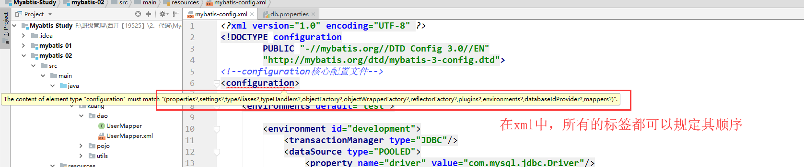
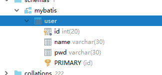
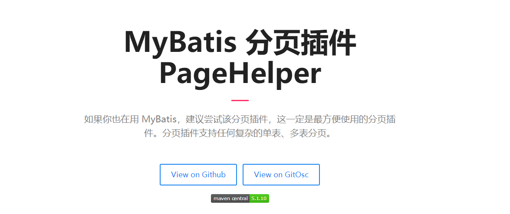

# MyBatis自学笔记

## Mybatis-9.28

环境：

- JDK1.8
- Mysql 5.8
- maven 3.6.1
- IDEA

回顾：

- JDBC
- Mysql
- Java基础
- Maven
- Junit


SSM框架：配置文件的。  最好的方式：看官网文档；

## 1、简介

### 1.1、什么是Mybatis


- MyBatis 是一款优秀的**持久层框架**
- 它支持定制化 SQL、存储过程以及高级映射。
- MyBatis 避免了几乎所有的 JDBC 代码和手动设置参数以及获取结果集。
- MyBatis 可以使用简单的 XML 或注解来配置和映射原生类型、接口和 Java 的 POJO（Plain Old Java Objects，普通老式 Java 对象）为数据库中的记录。
- MyBatis 本是[apache](https://baike.baidu.com/item/apache/6265)的一个开源项目[iBatis](https://baike.baidu.com/item/iBatis), 2010年这个项目由apache software foundation 迁移到了google code，并且改名为MyBatis 。
- 2013年11月迁移到Github。


如何获得Mybatis？

- maven仓库：

  ```xml
  <!-- https://mvnrepository.com/artifact/org.mybatis/mybatis -->
          <dependency>
              <groupId>org.mybatis</groupId>
              <artifactId>mybatis</artifactId>
              <version>3.5.2</version>
          </dependency>
  ```

- Github ： https://github.com/mybatis/mybatis-3/releases

- 中文文档：https://mybatis.org/mybatis-3/zh/index.html


### 1.2、持久化

数据持久化

- 持久化就是将程序的数据在持久状态和瞬时状态转化的过程
- 内存：**断电即失**
- 数据库(Jdbc)，io文件持久化。
- 生活：冷藏. 罐头。

**为什么需要需要持久化？**

- 有一些对象，不能让他丢掉。

- 内存太贵了


### 1.3、持久层

Dao层，Service层，Controller层….

- 完成持久化工作的代码块
- 层界限十分明显。


### 1.4 为什么需要Mybatis？

- 帮助程序猿将数据存入到数据库中。
- 方便
- 传统的JDBC代码太复杂了。简化。框架。自动化。
- 不用Mybatis也可以。更容易上手。 **技术没有高低之分**
- 优点：
  - 简单易学
  - 灵活
  - sql和代码的分离，提高了可维护性。
  - 提供映射标签，支持对象与数据库的orm字段关系映射
  - 提供对象关系映射标签，支持对象关系组建维护
  - 提供xml标签，支持编写动态sql。


**最重要的一点：使用的人多！**

Spring   SpringMVC    SpringBoot


## 2、第一个Mybatis程序

思路：搭建环境-->导入Mybatis-->编写代码-->测试！

### 2.1、搭建环境

搭建数据库

```java
CREATE DATABASE `mybatis`;

USE `mybatis`;

CREATE TABLE `user`(
  `id` INT(20) NOT NULL PRIMARY KEY,
  `name` VARCHAR(30) DEFAULT NULL,
  `pwd` VARCHAR(30) DEFAULT NULL
)ENGINE=INNODB DEFAULT CHARSET=utf8;

INSERT INTO `user`(`id`,`name`,`pwd`) VALUES 
(1,'狂神','123456'),
(2,'张三','123456'),
(3,'李四','123890')
```

新建项目

1. 新建一个普通的maven项目

2. 删除src目录

3. 导入maven依赖

   ```xml
       <!--导入依赖-->
       <dependencies>
           <!--mysql驱动-->
           <dependency>
               <groupId>mysql</groupId>
               <artifactId>mysql-connector-java</artifactId>
               <version>8.0.25</version>
           </dependency>
   
           <!--mybatis-->
           <dependency>
               <groupId>org.mybatis</groupId>
               <artifactId>mybatis</artifactId>
               <version>3.5.2</version>
           </dependency>
   
           <!--junit-->
           <dependency>
               <groupId>junit</groupId>
               <artifactId>junit</artifactId>
               <version>4.12</version>
               <scope>test</scope>
           </dependency>
       </dependencies>
   ```

### 2.2、创建一个模块

- 编写mybatis的核心配置文件

  ```xml
  <?xml version="1.0" encoding="UTF-8" ?>
  <!DOCTYPE configuration
          PUBLIC "-//mybatis.org//DTD Config 3.0//EN"
          "http://mybatis.org/dtd/mybatis-3-config.dtd">
  <configuration>
  
      <environments default="development">
          <environment id="development">
              <transactionManager type="JDBC"/>
              <dataSource type="POOLED">
                  <property name="driver" value="com.mysql.cj.jdbc.Driver"/>
                  <property name="url"
                            value="jdbc:mysql://localhost:3306/mybatis?characterEncoding=utf8&amp;useSSL=false&amp;serverTimezone=UTC&amp;allowPublicKeyRetrieval=true"/>
                  <property name="username" value="root"/>
                  <property name="password" value="132736602xm824"/>
              </dataSource>
          </environment>
      </environments>
  
  
      <mappers>
          <mapper resource="com/mybatisTest/mapper/UserMapper.xml"/>
      </mappers>
  </configuration>
  ```

- 编写mybatis工具类

  ```java
  //sqlSessionFactory-->sqlSession
  public class MyBatisUitls {
  
      private static SqlSessionFactory sqlSessionFactory;
  
      static {
          try {
              //使用Mybatis第一步；获取sqlSessionFactory对象
              String resource = "mybatis-config.xml";
              InputStream inputStream = Resources.getResourceAsStream(resource);
              sqlSessionFactory = new SqlSessionFactoryBuilder().build(inputStream);
          } catch (IOException e) {
              e.printStackTrace();
          }
      }
  
      //既然有了SqlSessionFactory,顾名思义，我们就可以从中获的SqlSession的实例了
      //SqlSession完全包含了面向数据库执行的sql指令所需的所有方法
      public static SqlSession getSqlSession()  {
          return sqlSessionFactory.openSession();
      }
  
  }
  ```

### 2.3、编写代码

- 实体类

  ```java
  //实体类
  public class User {
  
      private int id;
      private String name;
      private String pwd;
  
      public User() {
      }
  
      public User(int id, String name, String pwd) {
          this.id = id;
          this.name = name;
          this.pwd = pwd;
      }
  
      public int getId() {
          return id;
      }
  
      public void setId(int id) {
          this.id = id;
      }
  
      public String getName() {
          return name;
      }
  
      public void setName(String name) {
          this.name = name;
      }
  
      public String getPwd() {
          return pwd;
      }
  
      public void setPwd(String pwd) {
          this.pwd = pwd;
      }
  
      @Override
      public String toString() {
          return "User{" +
                  "id=" + id +
                  ", name='" + name + '\'' +
                  ", pwd='" + pwd + '\'' +
                  '}';
      }
  }
  ```
  
- Dao接口

  ```java
  public interface UserMapper {
  
      //模糊查询
      List<User> getUserLike(String name);
  
      List<User> getUserList();
  
      User getUserById(int id);
  
      int addUser(User user);
  
      int updateUser(User user);
  
      int deleteUserById(int id);
  
      //当数据库中字段或表过多时，我们可以考虑用map添加数据
      int addUsers(Map<String, Object> map);
  
  }
  ```

- 接口实现类由原来的UserDaoImpl转变为一个 Mapper配置文件.

  ```xml
  <?xml version="1.0" encoding="UTF-8" ?>
  <!DOCTYPE mapper
          PUBLIC "-//mybatis.org//DTD Mapper 3.0//EN"
          "http://mybatis.org/dtd/mybatis-3-mapper.dtd">
  
  <!--对应mapper/Dao文件-->
  <mapper namespace="com.mybatisTest.mapper.UserMapper">
  
      <select id="getUserLike" resultType="com.mybatisTest.pojo.User">
          select *from mybatis.user where name like #{value}
      </select>
  
      <select id="getUserList" resultType="com.mybatisTest.pojo.User">
          select *
          from mybatis.user
      </select>
  
      <select id="getUserById" parameterType="int" resultType="com.mybatisTest.pojo.User">
          select *
          from mybatis.user
          WHERE id = #{id}
      </select>
  
      <insert id="addUser" parameterType="com.mybatisTest.pojo.User">
          insert into mybatis.user (id, name, pwd)
          VALUES (#{id}, #{name}, #{pwd});
      </insert>
  
      <update id="updateUser" parameterType="com.mybatisTest.pojo.User">
          update mybatis.user
          set name=#{name},
              pwd=#{pwd}
          where id = #{id};
      </update>
  
      <delete id="deleteUserById" parameterType="int">
          delete
          from mybatis.user
          where id = #{id};
      </delete>
  
      <!--先记住，现在不常用，以后会用到-->
      <insert id="addUsers" parameterType="map">
          insert into mybatis.user (id, name, pwd)
          VALUES (#{userid}, #{username}, #{password});
      </insert>
  
  
  </mapper>
  ```

### 2.4、测试

注意点：

org.apache.ibatis.binding.BindingException: Type interface com.kuang.dao.UserDao is not known to the MapperRegistry.

**MapperRegistry是什么？**

核心配置文件中注册 mappers

- junit测试

  ```java
  public class UserDaoTest {
  
      @Test
      public void getUserLike() {
          SqlSession sqlSession = MyBatisUitls.getSqlSession();
          UserMapper mapper = sqlSession.getMapper(UserMapper.class);
  
          List<User> userList = mapper.getUserLike("%李%");
  
          for (User user : userList) {
              System.out.println(user);
          }
  
          sqlSession.close();
      }
  
      @Test
      public void getUserListTest() {
          //第一步：获取SqlSession对象
          SqlSession sqlSession = MyBatisUitls.getSqlSession();
          //执行sql
          //方式一：getMapper
  
          try {
              UserMapper mapper = sqlSession.getMapper(UserMapper.class);
              List<User> userList = mapper.getUserList();
  
  
              //方式二(不推荐）
              List<User> users = sqlSession.selectList("com.mybatisTest.mapper.UserMapper.getUserList");
  
  
              for (User user : userList) {
                  System.out.println(user);
              }
          } catch (Exception e) {
              e.printStackTrace();
          } finally {
              sqlSession.close();
          }
  
      }
  
      @Test
      public void getUserById() {
          SqlSession sqlSession = MyBatisUitls.getSqlSession();
  
          UserMapper mapper = sqlSession.getMapper(UserMapper.class);
  
          User user = mapper.getUserById(1);
  
          System.out.println(user.toString());
  
          sqlSession.close();
      }
  
      @Test
      public void addUser() {
          SqlSession sqlSession = MyBatisUitls.getSqlSession();
          UserMapper mapper = sqlSession.getMapper(UserMapper.class);
  
          int i = mapper.addUser(new User(5, "admins", "admins"));
  
          if (i > 0) {
              System.out.println("提交成功");
          }
  
          //增删改必须提交事务
          sqlSession.commit();
          sqlSession.close();
  
      }
  
      @Test
      public void updateUser() {
          SqlSession sqlSession = MyBatisUitls.getSqlSession();
  
          UserMapper mapper = sqlSession.getMapper(UserMapper.class);
  
          int admins = mapper.updateUser(new User(3, "admins", "123456"));
  
          if (admins > 0) {
              System.out.println("提交成功");
          }
  
          sqlSession.commit();
          sqlSession.close();
  
      }
  
      @Test
      public void deleteUser() {
          SqlSession sqlSession = MyBatisUitls.getSqlSession();
          UserMapper mapper = sqlSession.getMapper(UserMapper.class);
  
          int i = mapper.deleteUserById(5);
  
          if (i > 0) {
              System.out.println("操作成功");
          }
  
          sqlSession.commit();
          sqlSession.close();
      }
  
      @Test
      public void addUsers() {
          SqlSession sqlSession = MyBatisUitls.getSqlSession();
          UserMapper mapper = sqlSession.getMapper(UserMapper.class);
  
          HashMap<String, Object> map = new HashMap<String, Object>();
  
          map.put("userid", 5);
          map.put("username", "adminmap");
          map.put("password", "123456");
  
          int i = mapper.addUsers(map);
  
          if (i > 0) {
              System.out.println("提交成功");
          }
  
          //增删改必须提交事务
          sqlSession.commit();
          sqlSession.close();
  
      }
  
  }
  ```


你们可以能会遇到的问题：

1. 配置文件没有注册
2. 绑定接口错误。
3. 方法名不对
4. 返回类型不对
5. Maven导出资源问题(在父子pom.xml中配置以下代码)

```java
<build>
    <resources>
        <resource>
            <directory>src/main/resources</directory>
            <includes>
                <include>**/*.properties</include>
                <include>**/*.xml</include>
            </includes>
            <filtering>true</filtering>
        </resource>
        <resource>
            <directory>src/main/java</directory>
            <includes>
                <include>**/*.properties</include>
                <include>**/*.xml</include>
            </includes>
            <filtering>true</filtering>
        </resource>
    </resources>
</build>
```

## 3、CRUD

### 1、namespace

namespace中的包名要和 Dao/mapper 接口的包名一致！

### 2、select

选择，查询语句;

- id : 就是对应的namespace中的方法名；
- resultType：Sql语句执行的返回值！
- parameterType ： 参数类型！


1. 编写接口

   ```java
   //根据ID查询用户
   User getUserById(int id);
   ```
   
2. 编写对应的mapper中的sql语句

   ```java
   <select id="getUserById" parameterType="int" resultType="com.kuang.pojo.User">
           select * from mybatis.user where id = #{id}
   </select>
   
   ```

3. 测试

   ```java
       @Test
       public void getUserById() {
           SqlSession sqlSession = MybatisUtils.getSqlSession();
   
           UserMapper mapper = sqlSession.getMapper(UserMapper.class);
   
           User user = mapper.getUserById(1);
           System.out.println(user);
   
           sqlSession.close();
       }
   
   ```

### 3、Insert

```xml
    <!--对象中的属性，可以直接取出来-->
    <insert id="addUser" parameterType="com.kuang.pojo.User">
        insert into mybatis.user (id, name, pwd) values (#{id},#{name},#{pwd});
    </insert>
```

### 4、update

```xml
    <update id="updateUser" parameterType="com.kuang.pojo.User">
        update mybatis.user set name=#{name},pwd=#{pwd}  where id = #{id} ;
    </update>

```

### 5、Delete

```xml
    <delete id="deleteUser" parameterType="int">
        delete from mybatis.user where id = #{id};
    </delete>
```


注意点：

- 增删改需要提交事务！


### 6、分析错误

- 标签不要匹配错
- resource 绑定mapper，需要使用路径！
- 程序配置文件必须符合规范！
- NullPointerException，没有注册到资源!
- 输出的xml文件中存在中文乱码问题！
- maven资源没有导出问题！


### 7、万能Map

假设，我们的实体类，或者数据库中的表，字段或者参数过多，我们应当考虑使用Map！

```java
    //万能的Map
    int addUser2(Map<String,Object> map);

```

```xml

    <!--对象中的属性，可以直接取出来    传递map的key-->
    <insert id="addUser" parameterType="map">
        insert into mybatis.user (id, pwd) values (#{userid},#{passWord});
    </insert>
```

```xml
    @Test
    public void addUser2(){
        SqlSession sqlSession = MybatisUtils.getSqlSession();

        UserMapper mapper = sqlSession.getMapper(UserMapper.class);


        Map<String, Object> map = new HashMap<String, Object>();

        map.put("userid",5);
        map.put("passWord","2222333");

        mapper.addUser2(map);

        sqlSession.close();
    }

```


Map传递参数，直接在sql中取出key即可！    【parameterType="map"】

对象传递参数，直接在sql中取对象的属性即可！【parameterType="Object"】

只有一个基本类型参数的情况下，可以直接在sql中取到！

多个参数用Map，**或者注解！**

### 8、思考题

模糊查询怎么写？

1. Java代码执行的时候，传递通配符 % %

   ```java
   List<User> userList = mapper.getUserLike("%李%");
   ```

2. 在sql拼接中使用通配符！

   ```java
   select * from mybatis.user where name like "%"#{value}"%"
   ```


## 4、配置解析

### 1、核心配置文件

- mybatis-config.xml

- MyBatis 的配置文件包含了会深深影响 MyBatis 行为的设置和属性信息。 

  ```xml
  configuration（配置）
  properties（属性）
  settings（设置）
  typeAliases（类型别名）
  typeHandlers（类型处理器）
  objectFactory（对象工厂）
  plugins（插件）
  environments（环境配置）
  environment（环境变量）
  transactionManager（事务管理器）
  dataSource（数据源）
  databaseIdProvider（数据库厂商标识）
  mappers（映射器）
  ```

### 2、环境配置（environments）

MyBatis 可以配置成适应多种环境

**不过要记住：尽管可以配置多个环境，但每个 SqlSessionFactory 实例只能选择一种环境。**

学会使用配置多套运行环境！

Mybatis默认的事务管理器就是 JDBC  ， 连接池 ： POOLED

### 3、属性（properties）

我们可以通过properties属性来实现引用配置文件

这些属性都是可外部配置且可动态替换的，既可以在典型的 Java 属性文件中配置，亦可通过 properties 元素的子元素来传递。【db.properties】



编写一个配置文件

db.properties

```properties
driver=com.mysql.cj.jdbc.Driver
url=jdbc:mysql://localhost:3306/racemall?characterEncoding=utf8&useSSL=false&serverTimezone=UTC&allowPublicKeyRetrieval=true
username=root
password=132736602xm824
```

在核心配置文件中映入

```xml
    <!--引入外部配置文件-->
    <properties resource="db.properties">
        <property name="username" value="root"/>
        <property name="pwd" value="132736602xm824"/>
    </properties>
```

- 可以直接引入外部文件
- 可以在其中增加一些属性配置
- 如果两个文件有同一个字段，优先使用外部配置文件的！

### 4、类型别名（typeAliases）

- 类型别名是为 Java 类型设置一个短的名字。‘
- 存在的意义仅在于用来减少类完全限定名的冗余。

```xml
    <!--可以给实体类起别名-->
    <typeAliases>
        <typeAlias type="com.mybatisTest.pojo.User" alias="User"/>
    </typeAliases>
```

也可以指定一个包名，MyBatis 会在包名下面搜索需要的 Java Bean，比如：

扫描实体类的包，它的默认别名就为这个类的 类名，首字母小写！

```xml
<!--可以给实体类起别名-->
<typeAliases>
    <package name="com.mybatisTest.pojo"/>
</typeAliases>
```

在实体类比较少的时候，使用第一种方式。

如果实体类十分多，建议使用第二种。

第一种可以DIY别名

第二种则·不行·，如果非要改，需要在实体上增加注解

```java
//用注解加别名
@Alias("user")
public class User {}
```

### 5、设置

这是 MyBatis 中极为重要的调整设置，它们会改变 MyBatis 的运行时行为。 


### 6、其他配置

- [typeHandlers（类型处理器）](https://mybatis.org/mybatis-3/zh/configuration.html#typeHandlers)
- [objectFactory（对象工厂）](https://mybatis.org/mybatis-3/zh/configuration.html#objectFactory)
- plugins插件
  - mybatis-generator-core
  - mybatis-plus
  - 通用mapper

### 7、映射器（mappers）

MapperRegistry：注册绑定我们的Mapper文件；

#### 方式一： 【推荐使用】

```xml
<!--每一个Mapper.XML都需要在Mybatis核心配置文件中注册！-->
    <mappers>
        <mapper resource="com/mybatisTest/mapper/UserMapper.xml"/>
    </mappers>
```

#### 方式二：使用class文件绑定注册

```xml
<!--每一个Mapper.XML都需要在Mybatis核心配置文件中注册！-->
    <mappers>
        <mapper class="com.mybatisTest.mapper.UserMapper"/>
    </mappers>
```

注意点：

- 接口和他的Mapper配置文件必须同名！
- 接口和他的Mapper配置文件必须在同一个包下！

#### 方式三：使用扫描包进行注入绑定

```xml
<!--每一个Mapper.XML都需要在Mybatis核心配置文件中注册！-->
<mappers>
    <package name="com.kuang.dao"/>
</mappers>
```

注意点：

- 接口和他的Mapper配置文件必须同名！
- 接口和他的Mapper配置文件必须在同一个包下！

练习时间：

- 将数据库配置文件外部引入
- 实体类别名
- 保证UserMapper 接口 和 UserMapper .xml 改为一致！并且放在同一个包下！

### 8、生命周期和作用域


生命周期，和作用域，是至关重要的，因为错误的使用会导致非常严重的**并发问题**。

#### **SqlSessionFactoryBuilder：**

- 一旦创建了 SqlSessionFactory，就不再需要它了
- 局部变量

#### **SqlSessionFactory：**

- 说白了就是可以想象为 ：数据库连接池
- SqlSessionFactory 一旦被创建就应该在应用的运行期间一直存在，**没有任何理由丢弃它或重新创建另一个实例。** 
- 因此 SqlSessionFactory 的最佳作用域是应用作用域。 
- 最简单的就是使用**单例模式**或者静态单例模式。

#### **SqlSession**

- 连接到连接池的一个请求！
- SqlSession 的实例不是线程安全的，因此是不能被共享的，所以它的最佳的作用域是请求或方法作用域。
- 用完之后需要赶紧关闭，否则资源被占用！


这里面的每一个Mapper，就代表一个具体的业务！

## 5、结果集映射——属性名和字段名不一致的问题

### 1、 问题

数据库中的字段



新建一个项目，拷贝之前的，测试实体类字段不一致的情况

```java
public class User {
    
    private int id;
    private String name;
    private String password;
}
```

测试出现问题


```xml
//    select * from mybatis.user where id = #{id}
//类型处理器
//    select id,name,pwd from mybatis.user where id = #{id}
```

解决方法：

- 起别名

  ```xml
      <select id="getUserList" resultType="com.mybatisTest.pojo.User">
          select id,name,pwd as password
          from mybatis.user
      </select>
  ```

### 2、结果集映射(resultMap)

结果集映射

```
id   name   pwd
id   name   password
```

```xml
 <!--结果集映射-->
    <resultMap id="UserMap" type="User">
        <!--column数据库中的字段，property实体类中的属性-->
        <!--<result column="id" property="id"/>
        <result column="name" property="name"/>-->
        <result column="pwd" property="password"/>
    </resultMap>

    <select id="getUserList" resultMap="UserMap">
        select *
        from mybatis.user
    </select>

    <select id="getUserById" resultMap="UserMap">
        select *
        from mybatis.user
        WHERE id = #{id}
    </select>
```


- `resultMap` 元素是 MyBatis 中最重要最强大的元素
- ResultMap 的设计思想是，对于简单的语句根本不需要配置显式的结果映射，而对于复杂一点的语句只需要描述它们的关系就行了。
- `ResultMap` 最优秀的地方在于，虽然你已经对它相当了解了，但是根本就不需要显式地用到他们。
-  如果世界总是这么简单就好了。

## 6、日志

### 6.1、日志工厂

如果一个数据库操作，出现了异常，我们需要排错。日志就是最好的助手！

曾经：sout 、debug

现在：日志工厂！


- SLF4J 
- LOG4J  【掌握】
- LOG4J2
-  JDK_LOGGING
- COMMONS_LOGGING
- STDOUT_LOGGING   【掌握】
- NO_LOGGING

在Mybatis中具体使用那个一日志实现，在设置中设定！


**STDOUT_LOGGING标准日志输出**

在mybatis核心配置文件中，配置我们的日志！

```xml
<settings>
     <!--标准的日志工厂实现-->
    <setting name="logImpl" value="STDOUT_LOGGING"/>
</settings>
```


### 6.2、Log4j

什么是Log4j？

- Log4j是[Apache](https://baike.baidu.com/item/Apache/8512995)的一个开源项目，通过使用Log4j，我们可以控制日志信息输送的目的地是[控制台](https://baike.baidu.com/item/控制台/2438626)、文件、[GUI](https://baike.baidu.com/item/GUI)组件
- 我们也可以控制每一条日志的输出格式；
- 通过定义每一条日志信息的级别，我们能够更加细致地控制日志的生成过程。
- 通过一个[配置文件](https://baike.baidu.com/item/配置文件/286550)来灵活地进行配置，而不需要修改应用的代码。

1. 先导入log4j的包

   ```xml
   <!-- https://mvnrepository.com/artifact/log4j/log4j -->
   <dependency>
       <groupId>log4j</groupId>
       <artifactId>log4j</artifactId>
       <version>1.2.17</version>
   </dependency>
   ```

2. log4j.properties

   ```properties
   #将等级为DEBUG的日志信息输出到console和file这两个目的地，console和file的定义在下面的代码
   log4j.rootLogger=DEBUG,console,file
   
   #控制台输出的相关设置
   log4j.appender.console = org.apache.log4j.ConsoleAppender
   log4j.appender.console.Target = System.out
   log4j.appender.console.Threshold=DEBUG
   log4j.appender.console.layout = org.apache.log4j.PatternLayout
   log4j.appender.console.layout.ConversionPattern=[%c]-%m%n
   
   #文件输出的相关设置
   log4j.appender.file = org.apache.log4j.RollingFileAppender
   log4j.appender.file.File=./log/kuang.log
   log4j.appender.file.MaxFileSize=10mb
   log4j.appender.file.Threshold=DEBUG
   log4j.appender.file.layout=org.apache.log4j.PatternLayout
   log4j.appender.file.layout.ConversionPattern=[%p][%d{yy-MM-dd}][%c]%m%n
   
   #日志输出级别
   log4j.logger.org.mybatis=DEBUG
   log4j.logger.java.sql=DEBUG
   log4j.logger.java.sql.Statement=DEBUG
   log4j.logger.java.sql.ResultSet=DEBUG
   log4j.logger.java.sql.PreparedStatement=DEBUG
   ```

3. 配置log4j为日志的实现

   ```xml
   <settings>
        <setting name="logImpl" value="log4j"/>
   </settings>
   ```

4. Log4j的使用！，直接测试运行刚才的查询

   

**简单使用**

1. 在要使用Log4j 的类中，导入包  import org.apache.log4j.Logger;

2. 日志对象，参数为当前类的class

   ```java
   static Logger logger = Logger.getLogger(UserDaoTest.class);
   ```

3. 日志级别

   ```java
   logger.info("info:进入了testLog4j");
   logger.debug("debug:进入了testLog4j");
   logger.error("error:进入了testLog4j");
   ```

## 7、分页

**思考：为什么要分页？**

- 减少数据的处理量

### 7.1、使用Limit分页

```sql
语法：SELECT * from user limit startIndex,pageSize;
SELECT * from user limit 3;  #[0,n]
```

使用Mybatis实现分页，核心SQL

1. 接口

   ```java
   //分页
   List<User> getUserByLimit(Map<String,Integer> map);
   ```

2. Mapper.xml

   ```xml
   <!--//分页-->
       <select id="getUserByLimit" parameterType="map" resultMap="UserMap">
           select *
           from mybatis.user
           limit #{startIndex},#{pageSize};
       </select>
   ```

3. 测试

   ```java
   @Test
   public void LimitTest() {
       SqlSession sqlSession = MyBatisUitls.getSqlSession();
       
       UserMapper mapper = sqlSession.getMapper(UserMapper.class);
       
       HashMap<String, Integer> map = new HashMap<String, Integer>();
       
       map.put("startIndex", 0);
       map.put("pageSize", 2);
       
       List<User> userList = mapper.getUserByLimit(map);
       
       for (User user : userList) {
           System.out.println(user);
       }
       
       sqlSession.close();
   }
   ```
   

### 7.2、RowBounds分页

不再使用SQL实现分页

1. 接口

   ```java
   //分页2
   List<User> getUserByRowBounds();
   ```

2. mapper.xml

   ```xml
   <!--分页2-->
   <select id="getUserByRowBounds" resultMap="UserMap">
       select * from  mybatis.user
   </select>
   ```

3. 测试

   ```java
   @Test
   public void getUserByRowBounds(){
   	SqlSession sqlSession = MybatisUtils.getSqlSession();
   
   	//RowBounds实现
   	RowBounds rowBounds = new RowBounds(1, 2);
   
   	//通过Java代码层面实现分页
   	List<User> userList = sqlSession.selectList("com.mybatisTest.mapper.UserMapper.getUserByRowBounds",null,rowBounds);
   
       for (User user : userList) {
       System.out.println(user);
       }
   
       sqlSession.close();
   }
   ```

   

### 7.3、分页插件PageHelper



利用代理模式实现分页的加载

**原理：**

**在执行SQL语句之前拦截SQL，将分页数据进行加载**

**pageHelper的页码为1**

[文档 (pagehelper.github.io)](https://pagehelper.github.io/docs/)

```xml
<!--分页插件-->
<!-- https://mvnrepository.com/artifact/com.github.pagehelper/pagehelper -->
<dependency>
    <groupId>com.github.pagehelper</groupId>
    <artifactId>pagehelper</artifactId>
    <version>5.1.2</version>
</dependency>
```

在mybatis-config.xml中配置

```xml
<plugins>
	<plugin interceptor="com.github.pagehelper.pagehelper"></plugin>
</plugins>
```

Teachermapper.xml

```xml
<select id = "findAll" resultType="teacher">
	select * feoom `Tb_teacher`
</select>
```

TeacherMapper

```java
List<Teacher> findAll();
```

test

```java
public void testPageAble() throws IOExceptiion {
	SqlSession sqlSession = MyBatisUitls.getSqlSession();
    
    UserMapper mapper = sqlSession.getMapper(UserMapper.class);
    
    Integer page = 1;
    Integer limit = 2;
    
    PageHelper.startPage(page,limit);
    List<Teacher> all = mapper.findAll();
    
    System.out,println(all);    
}
```


## 8、使用注解开发

### 8.1、面向接口编程

\- 大家之前都学过面向对象编程，也学习过接口，但在真正的开发中，很多时候我们会选择面向接口编程

**\- 根本原因 :  ==解耦== , 可拓展 , 提高复用 , 分层开发中 , 上层不用管具体的实现 , 大家都遵守共同的标准 , 使得开发变得容易 , 规范性更好**

\- 在一个面向对象的系统中，系统的各种功能是由许许多多的不同对象协作完成的。在这种情况下，各个对象内部是如何实现自己的,对系统设计人员来讲就不那么重要了；

\- 而各个对象之间的协作关系则成为系统设计的关键。小到不同类之间的通信，大到各模块之间的交互，在系统设计之初都是要着重考虑的，这也是系统设计的主要工作内容。面向接口编程就是指按照这种思想来编程。

**关于接口的理解**

\- 接口从更深层次的理解，应是定义（规范，约束）与实现（名实分离的原则）的分离。

\- 接口的本身反映了系统设计人员对系统的抽象理解。

\- 接口应有两类：

  \- 第一类是对一个个体的抽象，它可对应为一个抽象体(abstract class)；

  \- 第二类是对一个个体某一方面的抽象，即形成一个抽象面（interface）；

\- 一个体有可能有多个抽象面。抽象体与抽象面是有区别的。

**三个面向区别**

\- 面向对象是指，我们考虑问题时，以对象为单位，考虑它的属性及方法 .

\- 面向过程是指，我们考虑问题时，以一个具体的流程（事务过程）为单位，考虑它的实现 .

\- 接口设计与非接口设计是针对复用技术而言的，与面向对象（过程）不是一个问题.更多的体现就是对系统整体的架构

### 8.2、使用注解开发

1. 注解在接口上实现

   ```java
   @Select("select * from user")
   List<User> getUsers();
   ```

2. 需要再核心配置文件中绑定接口！

   ```xml
   <!--绑定接口-->
   <mappers>
       <mapper class="com.mybatisTest.mapper.UserMapper"/>
   </mappers>
   ```

3. 测试

   ```java
   @Test
   public void getUsers() {
       SqlSession sqlSession = MyBatisUitls.getSqlSession();
       UserMapper mapper = sqlSession.getMapper(UserMapper.class);
   
       List<User> users = mapper.getUsers();
   
       for (User user : users) {
           System.out.println(user);
       }
   
       sqlSession.close();
   }
   ```

本质：反射机制实现

底层：动态代理！

 

**Mybatis详细的执行流程！**


### 8.3、CRUD

我们可以在工具类创建的时候实现自动提交事务！

```java
public static SqlSession  getSqlSession(){
    return sqlSessionFactory.openSession(true);
}
```


编写接口，增加注解

```java
public interface UserMapper {

    @Select("select * from user")
    List<User> getUsers();

    //方法存在多个参数，所有的参数前面必须加上@Param注解
    @Select("select * from user where id = #{id}")
    User getUserById(@Param("id") int id);
    //User getUserById(@Param("id") int id,@Param("name")String name);

    @Insert("insert into user(id,name,pwd) values (#{id},#{name},#{pwd})")
    @Options(userGeneratedKeys = true , keyProperty = "id")//自增+获取的id
    int addUser(User user);

    @Update("update user set name=#{name},pwd=#{pwd} where id = #{id}")
    int updateUser(User user);

    @Delete("delete from user where id = #{uid}")
    int deleteUser(@Param("uid") int id);
}
```

测试类

【注意：我们必须要将接口注册绑定到我们的核心配置文件中！】

```xml
<mappers>
    <mapper class="com.mybatisTest.mapper.UserMapper"/>
</mappers>
```

```java
public class UserDaoTest {

    @Test
    public void getUsers() {
        SqlSession sqlSession = MyBatisUitls.getSqlSession();
        UserMapper mapper = sqlSession.getMapper(UserMapper.class);

        List<User> users = mapper.getUsers();

        for (User user : users) {
            System.out.println(user);
        }

        sqlSession.close();
    }

    @Test
    public void getUserById() {
        SqlSession sqlSession = MyBatisUitls.getSqlSession();
        UserMapper mapper = sqlSession.getMapper(UserMapper.class);

        User userById = mapper.getUserById(1);

        System.out.println(userById.toString());

        sqlSession.close();
    }

    @Test
    public void addUser() {
        SqlSession sqlSession = MyBatisUitls.getSqlSession();
        UserMapper mapper = sqlSession.getMapper(UserMapper.class);

        int i = mapper.addUser(new User(0,"大毛", "123"));

        System.out.println(i>0?"插入成功":"插入失败");

        sqlSession.commit();
        sqlSession.close();
    }

    @Test
    public void updateUser() {
        SqlSession sqlSession = MyBatisUitls.getSqlSession();
        UserMapper mapper = sqlSession.getMapper(UserMapper.class);

        int i = mapper.updateUser(new User(0,"二毛", "123"));

        System.out.println(i>0?"修改成功":"修改失败");

        sqlSession.commit();
        sqlSession.close();
    }

    @Test
    public void deleteUser() {
        SqlSession sqlSession = MyBatisUitls.getSqlSession();
        UserMapper mapper = sqlSession.getMapper(UserMapper.class);

        int i = mapper.deleteUser(0);

        System.out.println(i>0?"删除成功":"删除失败");

        sqlSession.commit();
        sqlSession.close();
    }

}
```

**关于@Param() 注解**

- 基本类型的参数或者String类型，需要加上
- 引用类型不需要加
- 如果只有一个基本类型的话，可以忽略，但是建议大家都加上！
- 我们在SQL中引用的就是我们这里的 @Param() 中设定的属性名！

**#{}     ${} 区别**

${}无法阻止sql注入问题

## 9、Lombok

```java
Project Lombok is a java library that automatically plugs into your editor and build tools, spicing up your java.
Never write another getter or equals method again, with one annotation your class has a fully featured builder, Automate your logging variables, and much more.
```

- java library
- plugs
- build tools
- with one annotation your class

使用步骤：

1. 在IDEA中安装Lombok插件！

2. 在项目中导入lombok的jar包

   ```xml
   <dependency>
       <groupId>org.projectlombok</groupId>
       <artifactId>lombok</artifactId>
       <version>1.18.10</version>
   </dependency>
   ```

3. 在实体类上加注解即可！

   ```java
   @Data
   @AllArgsConstructor
   @NoArgsConstructor
   ```

说明：

```
@Data：无参构造，get、set、tostring、hashcode，equals
@AllArgsConstructor：有参构造
@NoArgsConstructor：无参构造
@EqualsAndHashCode：equals和hashcode方法
@ToString：toSting方法
@Getter and @Setter：get()、set()方法
```

全部注解：

```
@Getter and @Setter
@FieldNameConstants
@ToString
@EqualsAndHashCode
@AllArgsConstructor, @RequiredArgsConstructor and @NoArgsConstructor
@Log, @Log4j, @Log4j2, @Slf4j, @XSlf4j, @CommonsLog, @JBossLog, @Flogger
@Data
@Builder
@Singular
@Delegate
@Value
@Accessors
@Wither
@SneakyThrows
```

写了接口，还是可以自己写内容完善

## 10、多表查询 

### 10.1一对一的多表查询

```xml
<resultMap id="orderUserResult" type="tbOrder">
	<!--主键列进行关联映射-->
    <id property="id" column="id"></id>
    <!--普通列结果集映射-->
    <result property="orderPrice" column="order_price"></result>
    <result property="userId" column="user_id"></result>
    <result property="createTime" column="create_time"></result>
    <result property="updateTime" column="update_time"></result>
    <!--一对一的关系映射
		property:该类中的属性名
		javaType:全限定类名
	-->
    <associaction property="tbUser" javaType="tbUser">
        <id property="id" column="id"></id>
        <result property="username" column="user_name"></result>
    	<result property="age" column="age"></result>
    	<result property="sex" column="sex"></result>
    </associaction>
</resultMap>

<select id="findOrderUser" resultMap="orderUserResult">
	select * from tb_order od,tb_user tu where od.user_id=tu.id;
</select>
```

### 10.2 多对一的处理

多对一：


- 多个学生，对应一个老师
- 对于学生这边而言，  **关联** ..  多个学生，关联一个老师  【多对一】
- 对于老师而言， **集合** ， 一个老师，有很多学生 【一对多】


SQL：

```sql
CREATE TABLE `teacher` (
  `id` INT(10) NOT NULL,
  `name` VARCHAR(30) DEFAULT NULL,
  PRIMARY KEY (`id`)
) ENGINE=INNODB DEFAULT CHARSET=utf8

INSERT INTO teacher(`id`, `name`) VALUES (1, '秦老师'); 

CREATE TABLE `student` (
  `id` INT(10) NOT NULL,
  `name` VARCHAR(30) DEFAULT NULL,
  `tid` INT(10) DEFAULT NULL,
  PRIMARY KEY (`id`),
  KEY `fktid` (`tid`),
  CONSTRAINT `fktid` FOREIGN KEY (`tid`) REFERENCES `teacher` (`id`)
) ENGINE=INNODB DEFAULT CHARSET=utf8


INSERT INTO `student` (`id`, `name`, `tid`) VALUES ('1', '小明', '1'); 
INSERT INTO `student` (`id`, `name`, `tid`) VALUES ('2', '小红', '1'); 
INSERT INTO `student` (`id`, `name`, `tid`) VALUES ('3', '小张', '1'); 
INSERT INTO `student` (`id`, `name`, `tid`) VALUES ('4', '小李', '1'); 
INSERT INTO `student` (`id`, `name`, `tid`) VALUES ('5', '小王', '1');

```

#### 测试环境搭建

1. 导入lombok
2. 新建实体类 Teacher，Student
3. 建立Mapper接口
4. 建立Mapper.XML文件
5. 在核心配置文件中绑定注册我们的Mapper接口或者文件！【方式很多，随心选】
6. 测试查询是否能够成功！

#### 按照查询嵌套处理

```xml
<!--
    思路:
        1. 查询所有的学生信息
        2. 根据查询出来的学生的tid，寻找对应的老师！  子查询
    -->

    <select id="getStudent" resultMap="student_teacher">
        select *
        from student
    </select>
    <resultMap id="student_teacher" type="student">
        <result property="id" column="id"/>
        <result property="name" column="name"/>
        <!--复杂的属性，我们需要单独处理 对象： association 集合： collection -->
        <association property="teacher" column="tid" javaType="teacher" select="getTeacher"/>
    </resultMap>
    <select id="getTeacher" resultType="teacher">
        select *
        from teacher
        where id = #{id}
    </select>
```

#### 按照结果嵌套处理

```xml
<resultMap id="student_teacher2" type="student">
    <result property="id" column="sid"/>
    <result property="name" column="sname"/>
    <association property="teacher" javaType="teacher">
        <result property="id" column="tid"/>
        <result property="name" column="tname"/>
    </association>
</resultMap>
    
<!--按照结果嵌套处理-->
<select id="getStudents" resultMap="student_teacher2">
    select s.id sid, s.name sname, t.id tid, t.name tname
    from student s,
         teacher t
    where s.tid = t.id;
</select>
```

回顾Mysql 多对一查询方式：

- 子查询
- 联表查询

### 10.3、一对多处理

比如：一个老师拥有多个学生！

对于老师而言，就是一对多的关系!

#### 环境搭建

1. 环境搭建，和刚才一样

**实体类**

```java
@Data
public class Student {

    private int id;
    private String name;
    private int tid;

}
```

```java
@Data
public class Teacher {
    private int id;
    private String name;

    //一个老师拥有多个学生
    private List<Student> students;
}
```

#### 按照结果嵌套处理

```xml
	<resultMap id="teacher_student" type="teacher">
        <result property="id" column="tid"/>
        <result property="name" column="tname"/>
        <!--复杂的属性，我们需要单独处理 对象： association 集合： collection
        javaType="" 指定属性的类型！
        集合中的泛型信息，我们使用ofType获取
        -->
        <collection property="students" ofType="student">
            <result property="id" column="sid"/>
            <result property="name" column="sname"/>
            <result property="tid" column="tid"/>
        </collection>
    </resultMap>

    <!--一对多-->
    <select id="getTeacher" resultMap="teacher_student">
        select s.id sid, s.name sname, t.name tname, t.id tid
        from student s,
             teacher t
        where s.tid = t.id
          and t.id = #{tid}
    </select>
```

#### 按照查询嵌套处理

```xml
	<resultMap id="teacher_student2" type="teacher">
        <collection property="students" javaType="ArrayList" ofType="student" select="getStudentByTeacherId"
                    column="id"/>
	</resultMap>
    <select id="getStudentByTeacherId" resultType="student">
        select *
        from student
        where tid = #{tid}
    </select>
    <select id="getTeachers" resultMap="teacher_student2">
        select *
        from teacher
        where id = #{tid}
    </select>
```

### 小结

1. 关联 - association   【多对一】
2. 集合 - collection   【一对多】
3. javaType    &   ofType
   1. JavaType  用来指定实体类中属性的类型
   2. ofType  用来指定映射到List或者集合中的 pojo类型，泛型中的约束类型！

注意点：

- 保证SQL的可读性，尽量保证通俗易懂
- 注意一对多和多对一中，属性名和字段的问题！
- 如果问题不好排查错误，可以使用日志 ， 建议使用 Log4j

**慢SQL       1s        1000s**      

***面试高频***

- ***Mysql引擎***
- ***InnoDB底层原理***
- ***索引***
- ***索引优化！***

### 多表联查

```xml
<!--单表查询-->
<mapper namespace="com.qf.dao.OrderDao">
    <!-- 进行结果集映射-->
    <resultMap id="baseResult" type="tbOrder">
<!--         主键进行关联映射-->
        <id property="id" column="id"></id>
        <!-- 普通列结果集映射-->
<!--        <result property="orderPrice" column="order_price"></result>-->
<!--        <result property="userId" column="user_id"></result>-->
        <result property="createTime" column="create_time"></result>
        <result property="updateTime" column="update_time"></result>
<!--        <constructor>-->
<!--            &lt;!&ndash; 主键&ndash;&gt;-->
<!--            <idArg column="id" javaType="int" ></idArg>-->
<!--            <arg column="user_id" javaType="int"  />-->
<!--            <arg column="order_price" javaType="DOUBLE"  />-->
<!--            <arg column="update_time" javaType="DATE" />-->
<!--            <arg column="create_time" javaType="DATE" />-->

<!--        </constructor>-->
    </resultMap>

    <select id="findAll" resultMap="baseResult">
        SELECT * FROM `tb_order`;
    </select>
    
<!--两表联查-->
    <resultMap id="orderUserResult" type="tbOrder">
        <!-- 主键进行关联映射 -->
        <id property="id" column="id"></id>
        <!-- 普通列结果集映射-->
        <result property="orderPrice" column="order_price"></result>
        <result property="userId" column="user_id"></result>
        <result property="createTime" column="create_time"></result>
        <result property="updateTime" column="update_time"></result>
        <!-- 一对一的关系映射
        property: 该类中的属性名
        javaType: 全限定类名
        -->
        <association property="tbUser" javaType="tbUser">
            <id column="id" property="id"></id>
            <result column="user_name" property="userName"></result>
            <result column="age" property="age"></result>
            <result column="sex" property="sex"></result>
        </association>
    </resultMap>

   	<select id="findOrderUser" resultMap="orderUserResult">
        select  * from tb_order od,tb_user tu where od.user_id=tu.id ;
    </select>
    
    
<!--三表联查-->
    <resultMap id="orderDetailResult" type="tbOrder">
        <!-- 主键进行关联映射 -->
        <id property="id" column="id"></id>
        <!-- 普通列结果集映射-->
        <result property="orderPrice" column="order_price"></result>
        <result property="userId" column="user_id"></result>
        <result property="createTime" column="create_time"></result>
        <result property="updateTime" column="update_time"></result>
        <association property="tbUser" javaType="tbUser">
            <id column="id" property="id"></id>
            <result column="user_name" property="userName"></result>
            <result column="age" property="age"></result>
            <result column="sex" property="sex"></result>
        </association>
        <!-- 一对多的关联关系-->
        <collection property="tbOrderDetailList" ofType="tbOrderDetail">
            <id property="orderDetailId" column="order_detail_id"></id>
            <result property="orderDetailPrice" column="order_detail_price"></result>
            <result property="shopId" column="shop_id"></result>
            <result property="createTime" column="create_time"></result>
        </collection>
    </resultMap>
    
    <select id="findOrderAndOrderDetails" resultMap="orderDetailResult">
        SELECT * FROM  tb_order od,`tb_order_detail` tod,tb_user tu where od.user_id=tu.id and  od.id=tod.order_id;
    </select>

<!--四表联查-->
    <resultMap id="orderDetailShopsResult" type="tbOrder">
        <!-- 主键进行关联映射 -->
        <id property="id" column="id"></id>
        <!-- 普通列结果集映射-->
        <result property="orderPrice" column="order_price"></result>
        <result property="userId" column="user_id"></result>
        <result property="createTime" column="create_time"></result>
        <result property="updateTime" column="update_time"></result>
        <association property="tbUser" javaType="tbUser">
            <id column="id" property="id"></id>
            <result column="user_name" property="userName"></result>
            <result column="age" property="age"></result>
            <result column="sex" property="sex"></result>
        </association>
        <!-- 一对多的关联关系-->
        <collection property="tbOrderDetailList" ofType="tbOrderDetail">
            <id property="orderDetailId" column="order_detail_id"></id>
            <result property="orderDetailPrice" column="order_detail_price"></result>
            <result property="shopId" column="shop_id"></result>
            <result property="createTime" column="create_time"></result>
            <!-- 一对一的关联关系-->
            <association property="tbShop" javaType="tbShop">
                <id property="shopId" column="shop_id"></id>
                <result property="shopName" column="shop_name"></result>
                <result property="shopDes" column="shop_des"></result>
                <result property="shopPrice" column="shop_price"></result>
            </association>
        </collection>
    </resultMap>

    <select id="findOrderAndOrderDetailAnShop" resultMap="orderDetailShopsResult">
        SELECT * FROM  tb_order od,`tb_order_detail` tod,tb_user tu,tb_shop ts where od.user_id=tu.id and  od.id=tod.order_id and tod.shop_id=ts.shop_id;
    </select>
</mapper>
```

### SQLMapper.xml文件

```xml
<!--namespace 命名空间，通常使用接口的全限定类名 -->
<mapper namespace=“”>
	<!-- id 当前reslutMap的唯一标识
		type 当前 对应的实体类的全限定类名/可以给别名
	-->
    <resultMap id="" type="">
        <!-- 
        column  结果集的主键
        property 属性名
		-->
        <id column="" property=""></id>
        <!-- 
 		column  结果集的普通列
        property 属性名
		-->
        <result column="" property=""></result>
       	<!-- 使用 构造器进行映射
		必须要在实体类中含有 有参构造
   		顺序与映射文件保持一致
		-->
        <constructor>
             <!-- 映射主键
				javaType 主键的类型		
			-->
        	<idArg column="" javaType=""></idArg>
                <!-- 映射普通列
				javaType 主键的类型		
				-->
            <arg  column="" javaType=""></arg>
        </constructor>
        <!-- property 对应当前类中的属性名 javaType 属性的全限定类名-->
        <association property="" javaType="">
        	<id></id>
            <result></result>
            ...
        </association>
        <!-- 一对多，或者多对多的结果集映射 property 对应当前类中的属性名
			ofType 属性的全限定类名	
		-->
        <collection property="" ofType=""></collection>
	</resultMap>
    	
    <!-- 
	id 对应接口中的方法名  注意：保持唯一性
	paramaterType	传入的类型
	传参的方式：
		1.传入基本类型 直接获取
		2.传入的多个基本类型，通过下标 或者时 #{paramter1}
		3.通过Map 中的key来获取
		4.通过注解获取 @Param("key")
		5.传入实体类，通过属性名获取 #{属性名}

	resultType/resultMap
	resultType  说明数据库中的列明与实体类的属性名保持一致，直接赋值
	resultMap   数据库中的列明与属性名不一致，需要使用建立好的映射关系useGeneratedKeys 
	-->
    <select id="" paramaterType=“” resultType/resultMap="" ></select>
    
    <!-- 
	useGeneratedKeys
	当新增完成后，使用mybatis的 useGeneratedKeys获取到新增的主键
	keyProperty 标识主键的列明
	-->
    <insert id=“” paramterType=""  useGeneratedKeys="true" keyProperty="id" ></insert>
    
    <update id="" paramterType=""></update>
    
    <delete id="" paramterType=""></delete>
</mapper>
```

### userGeneratedKeys

可以获取到刚刚添加到数据库中的最新一条信息的ID（仅作用于id自增的情况下）


一张表中对两个事务同时进行操作：

先添加一个Class，再添加一个Teacher，其中Teacher中有ClassId

ClassMapper.xml

```xml
<insert id="insertClasses" parameterType="tbClasses" useGeneratedKeys="true" keyProperty="id">
     insert into tb_classes (id,class_name,class_addr) values (null,#{className},#{classAddr})
</insert>
```

TeacherMapper.xml

```xml
<insert id="insertTeacher" parameterType="toTeacher" userGeneratedKeys="true" keyProperty="id">
	insert into tb_teacher(id.teacher_name,age,sex,class_id) values (null,#{teacherName},#{age},#{sex},#{classId})
</insert>
```

测试文件

```java
    public void testGeneraId() throws IOException {
        String path="mybatis-config.xml";
        InputStream resourceAsStream = Resources.getResourceAsStream(path);
        SqlSessionFactory build = new SqlSessionFactoryBuilder().build(resourceAsStream);
        SqlSession sqlSession = build.openSession(true);
        ClassesDao mapperc = sqlSession.getMapper(ClassesDao.class);
        
        TbClasses tbClasses = new TbClasses();
        tbClasses.setClassName("javaee2108");
        tbClasses.setClassAddr("教6");
        int i = mapperc.insertClasses(tbClasses);
        System.out.println("影响的行数为===="+i);
        System.out.println("新增的id为==="+tbClasses.getId());
        
        TeacherDao mappert = sqlSession.getMapper(TeacherDao.class);
        TbTeacher tbTeacher = new TbTeacher();
        tbTeacher.setTeacherName("ajax");
        tbTeacher.setAge(19);
        tbTeacher.setSex("女");
        tbTeacher.setClassId(tbClasses.getId());
        
        mappert.insertTeacher(tbTeacher);
    }
```

## 12、动态 SQL

***什么是动态SQL：动态SQL就是指根据不同的条件生成不同的SQL语句***

利用动态 SQL 这一特性可以彻底摆脱这种痛苦。

```xml
动态 SQL 元素和 JSTL 或基于类似 XML 的文本处理器相似。在 MyBatis 之前的版本中，有很多元素需要花时间了解。MyBatis 3 大大精简了元素种类，现在只需学习原来一半的元素便可。MyBatis 采用功能强大的基于 OGNL 的表达式来淘汰其它大部分元素。

if
choose (when, otherwise)
trim (where, set)
foreach
```

### 搭建环境

```sql
CREATE TABLE `blog` (
  `id` varchar(50) NOT NULL COMMENT '博客id',
  `title` varchar(100) NOT NULL COMMENT '博客标题',
  `author` varchar(30) NOT NULL COMMENT '博客作者',
  `create_time` datetime NOT NULL COMMENT '创建时间',
  `views` int(30) NOT NULL COMMENT '浏览量'
) ENGINE=InnoDB DEFAULT CHARSET=utf8
```

创建一个基础工程

1. 导包

2. 编写配置文件

3. 编写实体类

   ```java
   @Data
   public class Blog {
       private int id;
       private String title;
       private String author;
       private Date createTime;
       private int views;
   }
   ```
   
4. 编写实体类对应Mapper接口 和 Mapper.XML文件

5. 添加信息

   ```xml
   <insert id="addBlog" parameterType="blog">
       insert into mybatis.blog (id, title, author, create_time, views)
       VALUES (#{id}, #{title}, #{author}, #{createTime}, #{views})
   </insert>
   ```

   ```java
   @Test
   public void addBlog(){
       SqlSession sqlSession = MyBatisUitls.getSqlSession();
       BlogMapper mapper = sqlSession.getMapper(BlogMapper.class);
       Blog blog = new Blog();
       blog.setId(IDUtils.getId());
       blog.setTitle("Mybatis");
       blog.setAuthor("薛三水");
       blog.setCreateTime(new Date());
       blog.setViews(9999);
   
       mapper.addBlog(blog);
   
       blog.setId(IDUtils.getId());
       blog.setTitle("Java");
       mapper.addBlog(blog);
   
       blog.setId(IDUtils.getId());
       blog.setTitle("Spring");
       mapper.addBlog(blog);
   
       blog.setId(IDUtils.getId());
       blog.setTitle("微服务");
       mapper.addBlog(blog);
   
       sqlSession.commit();
       sqlSession.close();
   }
   ```

### IF

```xml
    <select id="queryBlogIF" parameterType="map" resultType="blog">
        select * from mybatis.blog where 1=1
        <if test="title != null and title!= ''">
            and title = #{title}
        </if>
        <if test="author != null and author != ''">
            and author = #{author}
        </if>
    </select>
```

```java
@Test
public void queryBlogIF() {

    SqlSession sqlSession = MyBatisUitls.getSqlSession();
    BlogMapper mapper = sqlSession.getMapper(BlogMapper.class);

    HashMap map = new HashMap();

    map.put("title","Java");
    map.put("author","薛三水");

    List<Blog> blogs = mapper.queryBlogIF(map);

    for (Blog blog : blogs) {
        System.out.println(blog);
    }

    sqlSession.close();
}
```

&gt   >  大于符号

&lt    <   小于符号

### choose (when, otherwise)

```xml
    <select id="queryBlogChoose" parameterType="map" resultType="blog">
        select * from mybatis.blog
        <where>
            <choose>
                <when test="title != null and title != ''">
                    and title = #{title}
                </when>
                <when test="author != null and author != ''">
                    and author = #{author}
                </when>
                <otherwise>
                    and views = #{views}
                </otherwise>
            </choose>
        </where>
    </select>
```

```java
@Test
public void queryBlogChoose() {

    SqlSession sqlSession = MyBatisUitls.getSqlSession();
    BlogMapper mapper = sqlSession.getMapper(BlogMapper.class);

    HashMap map = new HashMap();

    map.put("title", "Java");
    map.put("author", "薛三水");
    map.put("views",9999);

    List<Blog> blogs = mapper.queryBlogIF(map);

    for (Blog blog : blogs) {
        System.out.println(blog);
    }

    sqlSession.close();

}
```

### trim (where,set)

set

```xml
    <update id="updateBlog" parameterType="map">
        update mybatis.blog
        <set>
            <if test="title != null and title != ''">
                title = #{title},
            </if>
            <if test="author != null amd author != ''">
                author = #{author}
            </if>
            <if test="views != null and views != ''">
                views = #{views}
            </if>
        </set>
        where id =#{id}
    </update>
```

```java
@Test
public void updateBlog(){

    SqlSession sqlSession = MyBatisUitls.getSqlSession();
    BlogMapper mapper = sqlSession.getMapper(BlogMapper.class);

    HashMap map = new HashMap();

    map.put("views",1000);
    map.put("id","cedc8e28b90b46288f52a8d87017a6b6");

    mapper.updateBlog(map);

    sqlSession.commit();
    sqlSession.close();

}
```

trim

```xml
    <insert id="insertBlog" parameterType="map">
       insert into mybatis.blog
        <trime prefix="(" suffix=")" suffixOverrides=",">
            <if test="title != null and title != ''">
                title,
            </if>
            <if test="author != null amd author != ''">
                author,
            </if>
            <if test="views != null and views != ''">
                views,
            </if>
        </trim>
       
         <trime prefix=" values(" suffix=")" suffixOverrides=",">
            <if test="title != null and title != ''">
                #{title},
            </if>
            <if test="author != null amd author != ''">
                #{author},
            </if>
            <if test="views != null and views != ''">
                #{views},
            </if>
        </trim>
        where id =#{id}
    </update>
```

```java
@Test
public void updateBlog(){

    SqlSession sqlSession = MyBatisUitls.getSqlSession();
    BlogMapper mapper = sqlSession.getMapper(BlogMapper.class);

    HashMap map = new HashMap();

    map.put("views",1000);
    map.put("id","cedc8e28b90b46288f52a8d87017a6b6");

    mapper.insertBlog(map);

    sqlSession.commit();
    sqlSession.close();

}
```

***所谓的动态SQL，本质还是SQL语句 ， 只是我们可以在SQL层面，去执行一个逻辑代码***

if

where ， set  ， choose ，when

### SQL片段

有的时候，我们可能会将一些功能的部分抽取出来，方便复用！

1. 使用SQL标签抽取公共的部分

   ```xml
       <sql id="if-title-author">
           <if test="title != null & title != ''">
               title = #{title}
           </if>
           <if test="author != null & author != ''">
               and author = #{author}
           </if>
       </sql>
   ```
   
2. 在需要使用的地方使用Include标签引用即可

   ```xml
       <select id="queryBlogIF" parameterType="map" resultType="blog">
           select * from mybatis.blog
           <where>
               <include refid="if-title-author"></include>
           </where>
       </select>
   ```


注意事项：

- 最好基于单表来定义SQL片段！
- 不要存在where标签

### Foreach

```xml
select * from user where 1=1 and 

  <foreach item="id" collection="ids"
      open="(" separator="or" close=")">
        #{id}
  </foreach>

(id=1 or id=2 or id=3)
```


```xml
<!--
        select * from mybatis.blog where 1=1 and (id=1 or id = 2 or id=3)

        我们现在传递一个万能的map ， 这map中可以存在一个集合！
-->
    <select id="queryBlogForEach" parameterType="map" resultType="blog">
        select * from mybatis.blog
        <where>
            <foreach collection="ids" item="id" open="and (" close=")" separator="or">
                id=#{id}
            </foreach>
        </where>
    </select>
```

```java
@Test
public void queryBlogForEach() {
    SqlSession sqlSession = MyBatisUitls.getSqlSession();
    BlogMapper mapper = sqlSession.getMapper(BlogMapper.class);

    HashMap map = new HashMap();

    ArrayList<String> ids = new ArrayList<String>();

    ids.add("cedc8e28b90b46288f52a8d87017a6b6");
    ids.add("c829bfe1826f4a62a1aae95e78f17878");
    ids.add("aeeccb3082f9484083826ca70502edec");

    map.put("ids",ids);

    List<Blog> blogs = mapper.queryBlogForEach(map);

    for (Blog blog : blogs) {
        System.out.println(blog);
    }

    sqlSession.close();
}
```


index:下标

item：内容

open：以什么开头

close：以什么关闭

separator：以什么分割 

**批量新增**

```xml
<insert id="insertAll">
	insert into tb_shop(shop_id,shop_name,shop_des,shop_price)VALUES
    <foreach collection="list" item="item" open="(" separator="," close=")">
        (#{null},#{item.shopName},#{item.shopDes},#{item.shopPrice})
    </foreach>
</insert>
```

```java
 @Test
    public void testForeachInsert() throws IOException {
        
        String path="mybatis-config.xml";
        InputStream resourceAsStream = Resources.getResourceAsStream(path);
        SqlSessionFactory build = new SqlSessionFactoryBuilder().build(resourceAsStream);
        SqlSession sqlSession = build.openSession(true);
        ShopDao mapper = sqlSession.getMapper(ShopDao.class);
        
        List list = new ArrayList();
        for (int i =0;i<10;i++){
            TbShop tbShop = new TbShop();
            tbShop.setShopName("小米"+i);
            tbShop.setShopDes("小米第"+i+"袋");
            tbShop.setShopPrice(Double.valueOf(i));
            list.add(tbShop);
        }
        int i = mapper.insertAll(list);
        
        System.out.println(i);
    }
```

**批量删除**

```xml
<delete id="deleteById">
	delete from tb_shop
    <where>
        shop_id in
    </where>
    <foreach collection-"list" item="item"  item="item" open="(" separator="," close=")">
            #{item}
    </foreach>
</delete>
```

```java
    @Test
    public void testForeach() throws IOException {
        
        String path="mybatis-config.xml";
        InputStream resourceAsStream = Resources.getResourceAsStream(path);
        SqlSessionFactory build = new SqlSessionFactoryBuilder().build(resourceAsStream);
        SqlSession sqlSession = build.openSession(true);
        ShopDao mapper = sqlSession.getMapper(ShopDao.class);
        
        List list = new ArrayList();
        list.add(1);
        list.add(2);
        list.add(3);
        int i = mapper.deleteByIds(list);
        
        System.out.println(i);
    }
```

***动态SQL就是在拼接SQL语句，我们只要保证SQL的正确性，按照SQL的格式，去排列组合就可以了***

建议：

- 先在Mysql中写出完整的SQL,再对应的去修改成为我们的动态SQL实现通用即可！

## 13、缓存 （了解）

### 13.1、简介

```
查询  ：  连接数据库 ，耗资源！
一次查询的结果，给他暂存在一个可以直接取到的地方！--> 内存 ： 缓存
	
我们再次查询相同数据的时候，直接走缓存，就不用走数据库了
```

1. 什么是缓存 [ Cache ]？
   - 存在内存中的临时数据。
   - 将用户经常查询的数据放在缓存（内存）中，用户去查询数据就不用从磁盘上(关系型数据库数据文件)查询，从缓存中查询，从而提高查询效率，解决了高并发系统的性能问题。
2. 为什么使用缓存？
   
   - 减少和数据库的交互次数，减少系统开销，提高系统效率。
3. 什么样的数据能使用缓存？
   
   - 经常查询并且不经常改变的数据。【可以使用缓存】
   

### 13.2、Mybatis缓存

- MyBatis包含一个非常强大的查询缓存特性，它可以非常方便地定制和配置缓存。缓存可以极大的提升查询效率。
- MyBatis系统中默认定义了两级缓存：**一级缓存**和**二级缓存**
  - 默认情况下，只有一级缓存开启。（SqlSession级别的缓存，也称为本地缓存）
  
  - 二级缓存需要手动开启和配置，他是基于namespace级别的缓存。
  
  - 为了提高扩展性，MyBatis定义了缓存接口Cache。我们可以通过实现Cache接口来自定义二级缓存
  

### 13.3、一级缓存

- 一级缓存也叫本地缓存：  SqlSession
  - 与数据库同一次会话期间查询到的数据会放在本地缓存中。
  - 以后如果需要获取相同的数据，直接从缓存中拿，没必须再去查询数据库；

测试步骤：

1. 开启日志！
2. 测试在一个Session中查询两次相同记录
3. 查看日志输出


缓存失效的情况：

1. 查询不同的东西

   

2. 增删改操作，可能会改变原来的数据，所以必定会刷新缓存！

   

3. 查询不同的Mapper.xml

4. 手动清理缓存！

   

小结：一级缓存默认是开启的，只在一次SqlSession中有效，也就是拿到连接到关闭连接这个区间段！

一级缓存就是一个Map。


### 13.4、二级缓存

- 二级缓存也叫全局缓存，一级缓存作用域太低了，所以诞生了二级缓存
- 基于namespace级别的缓存，一个名称空间，对应一个二级缓存；
- 工作机制
  - 一个会话查询一条数据，这个数据就会被放在当前会话的一级缓存中；
  - 如果当前会话关闭了，这个会话对应的一级缓存就没了；但是我们想要的是，会话关闭了，一级缓存中的数据被保存到二级缓存中；
  - 新的会话查询信息，就可以从二级缓存中获取内容；
  - 不同的mapper查出的数据会放在自己对应的缓存（map）中；

步骤：

1. 开启全局缓存

   ```xml
   <!--开启全局缓存-->
   <setting name="cacheEnabled" value="true"/>
   ```

2. 在要使用二级缓存的Mapper中开启

   ```xml
   <!--在当前Mapper.xml中使用二级缓存-->
   <cache/>
   ```

   在查询中使用二级缓存

   ```xml
   <select id="queryUserById" resultType="user" useCache="true">
       select * from user where id = #{id}
   </select>
   ```

   也可以自定义参数

   ```xml
   <!--在当前Mapper.xml中使用二级缓存-->
   <cache  eviction="FIFO"
          flushInterval="60000"
          size="512"
          readOnly="true"/>
   ```

3. 测试

   当没有开启二级缓存时，会自动查询两次

   ```xml
   <select id="queryUserById" resultType="user" useCache="true">
       select * from user where id = #{id}
   </select>
   ```
   
   ```java
   @Test
   public void getUserByIdTest(){
       SqlSession sqlSession1 = MyBatisUitls.getSqlSession();
       SqlSession sqlSession2 = MyBatisUitls.getSqlSession();
   
       UserMapper mapper1 = sqlSession1.getMapper(UserMapper.class);
       UserMapper mapper2 = sqlSession2.getMapper(UserMapper.class);
   
       User user1 = mapper1.queryUserById(1);
       System.out.println(user1);
   
       User user2 = mapper2.queryUserById(1);
       System.out.println(user2);
   
       sqlSession1.close();
       sqlSession2.close();
   }
   ```
   
   
   
   添加二级缓存后，只查询一次，第二次查询在缓存中查找
   
   ```xml
   <!--在当前Mapper.xml中使用二级缓存-->
   <cache  eviction="FIFO"
           flushInterval="60000"
           size="512"
           readOnly="true"/>
   
   <select id="queryUserById" resultType="user" useCache="true">
       select * from user where id = #{id}
   </select>
   ```
   
   ```java
   @Test
   public void getUserByIdTest(){
       SqlSession sqlSession1 = MyBatisUitls.getSqlSession();
       SqlSession sqlSession2 = MyBatisUitls.getSqlSession();
   
       UserMapper mapper1 = sqlSession1.getMapper(UserMapper.class);
       User user1 = mapper1.queryUserById(1);
       System.out.println(user1);
       sqlSession1.close();
   
       UserMapper mapper2 = sqlSession2.getMapper(UserMapper.class);
       User user2 = mapper2.queryUserById(1);
       System.out.println(user2);
       sqlSession2.close();
   }
   ```
   
   
   
   1. 问题：我们需要将实体类序列化！否则就会报错！
   
      ```java
      @Data
      @NoArgsConstructor
      @AllArgsConstructor
      public class User implements Serializable {
          private int id;
          private String name;
          private String pwd;
          
      }
      ```
      
   2. 
   
      ```java
      Caused by: java.io.NotSerializableException: com.mybatis.pojo.User
      ```

小结：

- 只要开启了二级缓存，在同一个Mapper下就有效
- 所有的数据都会先放在一级缓存中；
- 只有当会话提交，或者关闭的时候，才会提交到二级缓冲中！

### 13.5、缓存原理


### 13.6、自定义缓存-ehcache

```xml
Ehcache是一种广泛使用的开源Java分布式缓存。主要面向通用缓存
```

要在程序中使用ehcache，先要导包！

```xml
<!-- https://mvnrepository.com/artifact/org.mybatis.caches/mybatis-ehcache -->
<dependency>
    <groupId>org.mybatis.caches</groupId>
    <artifactId>mybatis-ehcache</artifactId>
    <version>1.1.0</version>
</dependency>
```

在mapper中指定使用我们的ehcache缓存实现！

```xml
<!--在当前Mapper.xml中使用二级缓存-->
<cache type="org.mybatis.caches.ehcache.EhcacheCache"/>
```

ehcache.xml

```xml
<?xml version="1.0" encoding="UTF-8"?>
<ehcache xmlns:xsi="http://www.w3.org/2001/XMLSchema-instance"
         xsi:noNamespaceSchemaLocation="http://ehcache.org/ehcache.xsd"
         updateCheck="false">
    <!--
       diskStore：为缓存路径，ehcache分为内存和磁盘两级，此属性定义磁盘的缓存位置。参数解释如下：
       user.home – 用户主目录
       user.dir  – 用户当前工作目录
       java.io.tmpdir – 默认临时文件路径
     -->
    <diskStore path="./tmpdir/Tmp_EhCache"/>
    
    <defaultCache
            eternal="false"
            maxElementsInMemory="10000"
            overflowToDisk="false"
            diskPersistent="false"
            timeToIdleSeconds="1800"
            timeToLiveSeconds="259200"
            memoryStoreEvictionPolicy="LRU"/>
 
    <cache
            name="cloud_user"
            eternal="false"
            maxElementsInMemory="5000"
            overflowToDisk="false"
            diskPersistent="false"
            timeToIdleSeconds="1800"
            timeToLiveSeconds="1800"
            memoryStoreEvictionPolicy="LRU"/>
    <!--
       defaultCache：默认缓存策略，当ehcache找不到定义的缓存时，则使用这个缓存策略。只能定义一个。
     -->
    <!--
      name:缓存名称。
      maxElementsInMemory:缓存最大数目
      maxElementsOnDisk：硬盘最大缓存个数。
      eternal:对象是否永久有效，一但设置了，timeout将不起作用。
      overflowToDisk:是否保存到磁盘，当系统当机时
      timeToIdleSeconds:设置对象在失效前的允许闲置时间（单位：秒）。仅当eternal=false对象不是永久有效时使用，可选属性，默认值是0，也就是可闲置时间无穷大。
      timeToLiveSeconds:设置对象在失效前允许存活时间（单位：秒）。最大时间介于创建时间和失效时间之间。仅当eternal=false对象不是永久有效时使用，默认是0.，也就是对象存活时间无穷大。
      diskPersistent：是否缓存虚拟机重启期数据 Whether the disk store persists between restarts of the Virtual Machine. The default value is false.
      diskSpoolBufferSizeMB：这个参数设置DiskStore（磁盘缓存）的缓存区大小。默认是30MB。每个Cache都应该有自己的一个缓冲区。
      diskExpiryThreadIntervalSeconds：磁盘失效线程运行时间间隔，默认是120秒。
      memoryStoreEvictionPolicy：当达到maxElementsInMemory限制时，Ehcache将会根据指定的策略去清理内存。默认策略是LRU（最近最少使用）。你可以设置为FIFO（先进先出）或是LFU（较少使用）。
      clearOnFlush：内存数量最大时是否清除。
      memoryStoreEvictionPolicy:可选策略有：LRU（最近最少使用，默认策略）、FIFO（先进先出）、LFU（最少访问次数）。
      FIFO，first in first out，这个是大家最熟的，先进先出。
      LFU， Less Frequently Used，就是上面例子中使用的策略，直白一点就是讲一直以来最少被使用的。如上面所讲，缓存的元素有一个hit属性，hit值最小的将会被清出缓存。
      LRU，Least Recently Used，最近最少使用的，缓存的元素有一个时间戳，当缓存容量满了，而又需要腾出地方来缓存新的元素的时候，那么现有缓存元素中时间戳离当前时间最远的元素将被清出缓存。
   -->

</ehcache>
```

***Redis数据库来做缓存！  K-V***

## 14、#{}和${}的区别

> #{}相当于prepareStatement预编译对象，以？作为占位符，先编译再赋值，可以防止sql注入
>
> ${}相当于statement，直接进行值的替换
>
> 但是 `$`{}不能删除，因为当数据量到达一定级别后，需要进行分表的操作，分表分为纵向分割，横向分割，不管哪种分割方式，都会导致，在SQLMapper.xml中的表名不能写死，需要进行传入。就需要使用${}进行分表名的传输

```xml
<select id="findByTeacherName" resultMap="baseResult">
	select * from ${tableName} where teacher_name = ${tracherName}
</select>
```

测试类

```java
public interface TeacherDap{
    int insertTeacher(TbTeacher tbTeacher);
    List<TbTeacher> findByTeacherName(@Param("tableName")String table,@Param("teacherName")String teacherName);
}
```

# 课堂笔记

## 完整的CRUD 

community.java

```java
import lombok.Data;
import lombok.ToString;

import java.io.Serializable;
import java.util.Date;

/**
 * 小区管理 实体类
 */
@Data
@ToString
public class Community implements Serializable {
    private Integer id;              	//	小区主键
    private String communityNum;	//	小区编号
    private String name;	//	小区名称
    private String address;	//	坐落地址
    private Double communityArea;	//	占地面积
    private Integer buildingNum;	//	总栋数
    private Integer roomNum;	//	总户数
    private Integer greeningRate;	//	绿化率
    private String img;	//	缩略图
    private String developerName;	//	开发商名称
    private String propertyName;	//	物业公司名称
    private Date hiredate;	//	创建时间
    private Integer state;	//	状态
    private Integer uid;	//	录入人员
}
```

communityMapper.java

```java
import com.example.bean.Community;
import org.apache.ibatis.annotations.Param;

import java.util.List;
import java.util.Map;

//小区的dao层的映射接口
public interface CommunityMapper {
    public List<Community> selectAll();

    //新增所有  insert  add  save
    public int  insert1(Community community);

    //条件新增的接口
    public  int insert2(Community community);

    //主键单删除
    public  int delById(Integer id);
    //批删-- List     10 11 12
    public  int  delByIds1(List<Integer> ids);
    // 批删-- Array   8,9,13
    public  int  delByIds2(Integer[] ids);
    //练习 一下map的传参方式
    public  int  delByIds3(Map map) ;

    //当两个参数时 按照顺序在映射文件 中进行解析
    public int delByParam1(String name,String address);

    //当两个参数时: 按照名字在映射文件 中解析  @Param用这个注解去定义名字
    public int delByParam2(@Param("name") String name, @Param("address") String address);


    //主键更新  //允许里边的某个属性如果是非必须字段，可以是null ,所以不能直接发全量更新，必须 做判断
    public  int update(Community community);

}
```

```xml
<?xml version="1.0" encoding="UTF-8" ?>
<!DOCTYPE mapper PUBLIC "-//mybatis.org//DTD Mapper 3.0//EN"
        "http://mybatis.org/dtd/mybatis-3-mapper.dtd">

<!--  namespace 命名空间：  其实就是 接口和xml配置文件 的对应-->
<mapper namespace="com.qfedu.dao.CommunityMapper">

    <select id="selectAll"  resultType="community">
        select *  from db_community
    </select>
    
    <!-- 新增1
	新增所有
    返回主键 方式一：
    parameterType : 参数的类型
    useGeneratedKeys=true当新增完成后，使用mybatis的useGeneratedKeys获取到新增的主键
    keyColumn: 主键在表中的字段名
    keyProperty: 主键赋值给community的哪个字段
    -->
    <insert id="insert1" parameterType="community" useGeneratedKeys="true" keyColumn="id"  keyProperty="id">
        insert into db_community(
            id
            ,communityNum
            ,name
            ,address
            ,communityArea
            ,buildingNum
            ,roomNum
            ,img
            ,greeningRate
            ,developerName
            ,propertyName
            ,hiredate
            ,state
            ,uid
        )  values(
            null
            ,#{communityNum,jdbcType=VARCHAR}
            ,#{name,jdbcType=VARCHAR}
            ,#{address,jdbcType=VARCHAR}
            ,#{communityArea,jdbcType=DOUBLE}
            ,#{buildingNum,jdbcType=INTEGER}
            ,#{roomNum,jdbcType=INTEGER}
            ,#{img,jdbcType=VARCHAR}
            ,#{greeningRate,jdbcType=INTEGER}
            ,#{developerName,jdbcType=VARCHAR}
            ,#{propertyName,jdbcType=VARCHAR}
            ,#{hiredate,jdbcType=DATE}
            ,#{state,jdbcType=INTEGER}
            ,#{uid,jdbcType=INTEGER}
        );
    </insert>

    <!-- 新增2
	条件新增  
	依据有的值，去生成相应的sql拼接语句  -->
    <insert id="insert2"  parameterType="community">
        <!-- 返回主键的第二种方式
        order ：after表示执行完insert之后再返回
        select LAST_INSERT_ID() 返回最新生成的主键（最后一行）
        -->
        <selectKey keyColumn="id" keyProperty="id" order="AFTER" resultType="INTEGER">
            SELECT LAST_INSERT_ID()
        </selectKey>
        insert into db_community
        <!--
        trim 标签，用来拼接 语句
        prefix ： 以xx 开头
        suffix ： 以xx 结尾
        suffixOverrides:把结尾的这个符号去掉
        -->
        <trim prefix="(" suffix=")" suffixOverrides=",">
            <!-- if条件判断  test中可以直接写属性  communityNum字符串-->
            <if test="communityNum!=null and communityNum!=''">
                communityNum,
            </if>
            <if test="name!=null and name!=''">
                name,
            </if>
            <if test="buildingNum!=null">
                buildingNum,
            </if>
        </trim>
        <trim prefix=" values(" suffix=")"  suffixOverrides=",">
            <if test="communityNum!=null and communityNum!=''">
                #{communityNum},
            </if>
            <if test="name!=null and name!=''">
                #{name},
            </if>
            <if test="buildingNum!=null">
                #{buildingNum},
            </if>
        </trim>
    </insert>

    <!--删除1：单个物理删除 -->
    <delete id="delById" parameterType="java.lang.Integer" >
        delete from db_community where id=#{id};
    </delete>
    
    <!--删除2： 传的是参数是list类型 int delete(List<Integer> ids);-->
    <delete id="delByIds1" parameterType="java.util.ArrayList" >
        delete from db_community where id in
        <!-- 如果当前解析的是list:
        collection： 写的值就是list
        item：       赋名
        open：       以xx开头
        close：      以xxx结尾
        separator:集合元素的分隔符
        -->
         <foreach collection="list" open="("  close=")" separator="," item="id">
              #{id}
         </foreach>
    </delete>

    <!--删除3：参数类型，传入的是数组 数组可以不写parameterType-->
    <delete id="delByIds2">
        delete from db_community where id in
        <!-- 如果当前解析是数组  :collection写的值就是array, parameterType省略不写-->
        <foreach collection="array" open="("  close=")" separator="," item="id">
            #{id}
        </foreach>
    </delete>

    <!-- 删除4： 参数类型： map类型
        因为在map中的key 不能重复，所以取map中的值，可以直接使用key
    -->
    <delete id="delByIds3"  parameterType="java.util.HashMap">
        delete from db_community where id =#{id1} or id=#{id2};
    </delete>
    
   	<!--删除5
    两个参数的传参1：
    按参方法的参数的顺序往过传值 ：param1 param2 param3 param4 。。。。。。  -->
    <!--   public int delByParam1(String name,String address);  -->
    <delete id="delByParam1" >
        delete from db_community where name=#{param1}  and address=#{param2}
    </delete>
    
    <!--
    两个传参2： 
	按照规定的名字去传: 常用的是这种  加注解-->
    <!--  public int delByParam2(@Param("name") String name, @Param("address") String address);  -->
    <delete id="delByParam2" >
        delete from db_community where name=#{name}  and address=#{address}
    </delete>

    <!-- 更新 -->
    <update id="update"  parameterType="community">
        update db_community
        <!-- set 标签可以自动去除 最后一个,-->
        <set>
            <if test="name!=null and name!=''">
                name=#{name},
            </if>
            <if test="address!=null and address!=''">
                address=#{address},
            </if>
        </set>
        where id=#{id}
    </update>

</mapper>
```

## 条件分页查询

```java 
    //分页查询
    public List<Community> selectByPage();

    //条件分页查询
    //分页查询
    public List<Community> selectByPage1(CommunityVo vo);
```

```xml
    <!-- 分页查询-->
    <select id="selectByPage" resultMap="baseResultMap">
        select * from db_community
    </select>

    <select id="selectByPage1" resultMap="baseResultMap">
        select * from db_community
        <!-- 如果有条件内容  where关键字就有，如果没有，则没有where关键字-->
        <where>
            <if test="name!=null and name!=''">
                <!-- 如果是like 的条件的话应该怎么写-->
                <!-- 第一种写法 concat(字符串1，字符串2，字符串3..) 拼接字符串方法-->
                <!-- name like   concat('%',#{name},'%') -->
                <!-- 第二种方式用的是 $  不建议在条件中使用，后期多用在 排序中-->
                name like '${name}'
            </if>
        </where>

    </select>
```

```java 
    //分页查询
    @Test
    public void selectByPage() {
        CommunityMapper mapper = MyBatisUtils.getMapper(CommunityMapper.class);

        //添加分页： pageHelper
        //设置 当前页和每页条数
        PageHelper.startPage(1,3);

        List<Community> list = mapper.selectByPage();

        //转成当前页所需要数据
        Page<Community> page = (Page)list;

        List<Community> result = page.getResult();
        System.out.println(result);

        //转成pageInfo  pageInfo 实质上是一个list  信息比page更加详细
        PageInfo<Community> pageInfo = new PageInfo<>(list);
        List<Community> list1 = pageInfo.getList();
        System.out.println(list1);
        MyBatisUtils.closeSqlSssion();
        //System.out.println(list);

    }

    //条件分页查询
    @Test
    public  void selectByPage1() {
        CommunityMapper mapper = MyBatisUtils.getMapper(CommunityMapper.class);

        PageHelper.startPage(1,3);

        CommunityVo vo = new CommunityVo();
        vo.setName("%123%' or 1=1  or name='1");
        List<Community> communities = mapper.selectByPage1(vo);
        PageInfo<Community> pageInfo = new PageInfo<>(communities);

        System.out.println(pageInfo);
    }
```

## 多表查询

### 准备工作

Community.java

```java
/**
 * 小区管理 实体类
 */
@Data
@ToString
public class Community implements Serializable {
    private Integer id;                // 小区主键
    private String communityNum;   // 小区编号
    private String name;   // 小区名称
    private String address;    // 坐落地址
    private Double communityArea;  // 占地面积
    private Integer buildingNum;   // 总栋数
    private Integer roomNum;   // 总户数
    private Integer greeningRate;  // 绿化率
    private String img;    // 缩略图
    private String developerName;  // 开发商名称
    private String propertyName;   // 物业公司名称
    private Date hiredate; // 创建时间
    private Integer state; // 状态
    private Integer uid;   // 录入人员

    private List<Equipment> equipmentList;
}
```

 CommunityVo.java

```java
/**
 * 小区管理 查询实体类
 */
@Data
@ToString
public class CommunityVo implements Serializable {

    private  Date startTime;  //开始日期
    private  Date  endTime; //结束日期
    private String name;   // 小区名称
    private int page;  //当前页
    private  int limit;  //每页条数
    
}
```

Equipment.java

```java
/**
 * @Author lcw
 * @Description 资产设备的实体类
 * @Date 2021/12/29
 */
@Data
@ToString
public class Equipment implements Serializable {

    private Integer id;  //主键
    private Integer cid;  //小区的id
    private String cname; //小区名字
    private String eno;// 设备编号
    private String ename;// 名称
    private String ebrand;// 品牌
    private double eprice;// 价格
    private Integer enumber;// 采购数量
    private Date salldate;// 采购日期
    private String vailyear;// 有效期
    private Integer ifdelete;// 是否删除
    private Date createtime;// 创建日期

    //一个设备有属性于一个小区:所属的小区信息   一对一的关系
    private Community community;

}
```

mybatis.xml

```xml
<?xml version="1.0" encoding="UTF-8" ?>
<!DOCTYPE configuration PUBLIC "-//mybatis.org//DTD Config 3.0//EN"
        "http://mybatis.org/dtd/mybatis-3-config.dtd">

<configuration>
    <!-- 引用 mysql 配置文件 -->
    <properties resource="mysql.properties" />

    <settings>
        <!--日志，用来拍错-->
        <setting name="logImpl" value="STDOUT_LOGGING"/>
        <!--自动起别名-->
        <setting name="mapUnderscoreToCamelCase" value="true"/>
        <!--开启全局缓存-->
        <setting name="cacheEnabled" value="true"/>
    </settings>

    <!-- 给实体类起别名-->
    <typeAliases>
        <package name="com.mybatisTest.pojo"/>
    </typeAliases>

    <!--分页工具-->
    <plugins>
        <plugin interceptor="com.github.pagehelper.PageInterceptor"/>
    </plugins>

    <!-- 环境的配置-->
    <environments default="development">
        <environment id="development">
            <transactionManager type="JDBC"/>
            <!-- 连接池和数据源的配置-->
            <dataSource type="com.mybatisTest.utils.MyDruid">
                <property name="driverClassName" value="${driver}"/>
                <property name="url"
                          value="${url}"/>
                <property name="username" value="${username}"/>
                <property name="password" value="${password}"/>
            </dataSource>
        </environment>
    </environments>

    <!-- 映射文件 的配置-->
    <mappers>
       <package name="com.mybatisTest.mapper"/>
    </mappers>

</configuration>
```

### 一对一

EquipmentMapper.java

```java
public interface EquipmentMapper {

    //一对一的第一种方式
    public Equipment selectById1(@Param("id") Integer id);

    //一对一的第二钟方式
    public  Equipment selectById2(@Param("id") Integer id);

    //一对一的第钟三方式
    public  Equipment selectById3(@Param("id") Integer id);

    //第二种和第三种方的缺点：就是无论是否需要小区数据，都会被关联出来
    //即时查询 和 懒加载
    //实现懒加载
    public  Equipment selectById4(@Param("id") Integer id);

    //这个方法用来配合一对多的测试
    //依据小区id来查询设备的信息
    public List<Equipment> selectByCId(@Param("cid") Integer cid);

}
```

EquipmentMapper.xml

```xml
<?xml version="1.0" encoding="UTF-8" ?>
<!DOCTYPE mapper PUBLIC "-//mybatis.org//DTD Mapper 3.0//EN"
        "http://mybatis.org/dtd/mybatis-3-mapper.dtd">

<!--  namespace 命名空间：  其实就是 接口和xml配置文件 的对应-->
<mapper namespace="com.mybatisTest.mapper.EquipmentMapper">

    <resultMap id="baseResultMap" type="equipment">
        <!-- id标签，标识是一个主键-->
        <id column="id" property="id"/>
        <result column="cid" property="cid"/>
        <result column="cname" property="cname"/>
        <result column="eno" property="eno"/>
        <result column="ename" property="ename"/>
        <result column="ebrand" property="ebrand"/>
        <result column="eprice" property="eprice"/>
        <result column="enumber" property="enumber"/>
        <result column="salldate" property="salldate"/>
        <result column="vailyear" property="vailyear"/>
        <result column="ifdelete" property="ifdelete"/>
        <result column="createtime" property="createtime"/>
    </resultMap>

    
    <!-- 一对一实现方式1 ：
    在代码侧： 先查设备再查小区，-->
    <select id="selectById1" resultMap="baseResultMap">
        select * from db_equipment where id=#{id}
    </select>


    <!-- 一对一的第二种方式，用 left join方式，查询结果，去对应开始-->
    <resultMap id="resultMap2" type="equipment" extends="baseResultMap">
        <!-- 封装第二部分数据： 小区的数据
        property: 指的是设备里边的那个属性名
        javaType: 指的是属性的类型，因为设备了别名，所以可以简化
        columnPrefix 前缀标签
        -->
        <association property="community" javaType="community" columnPrefix="comm_">
            <!-- 由于设置了 columnPrefix 列的前缀标签，所以 下边的column 如果写成id 相当于 comm_id -->
            <id column="id" property="id"/>
            <result column="name" property="name"/>
            <result column="address" property="address"/>
        </association>
    </resultMap>
    <!--如果给一张表的多个字段起别名：建议使用前缀的方式，比如：comm_ -->
    <select id="selectById2" resultMap="resultMap2">
         select e.*,c.id as comm_id,c.name as comm_name,c.address as comm_address
         from db_equipment e
         left join db_community c
         on e.cid=c.id
         where e.id=1
    </select>


    <!-- 一对一的第三种方式:让mybatis自动实现联查-->
    <resultMap id="resultMap3" type="equipment" extends="baseResultMap">
        <!-- 小区的数据实现自查
        select:表示的是调用哪个查询
        column:表示把当前结果的哪个数据传过去
        把cid传到CommunityMapper.selectById方法（得自己写好）中
        -->
        <association property="community" javaType="community"
                     select="com.mybatisTest.mapper.CommunityMapper.selectById" column="cid">
        </association>
    </resultMap>
    <select id="selectById3" resultMap="resultMap3">
        select * from db_equipment where id=#{id}
    </select>


    <!--一对一第四种方式：  添加懒加载: 也就是在需要 小区的信息时，再触发查询小区的动作 -->
    <resultMap id="resultMap4" type="equipment" extends="baseResultMap">
        <!--
        fetchType：链接方式 及时抓取/懒加载（什么时候用，什么时候再查）
        -->
        <association property="community" javaType="community"
                     select="com.mybatisTest.mapper.CommunityMapper.selectById" column="cid"
                     fetchType="lazy">
        </association>
    </resultMap>
    <select id="selectById4" resultMap="resultMap4">
        select * from db_equipment where id=#{id}
    </select>


    <!--依据小区id来查询设备的信息 -->
    <select id="selectByCId" resultMap="baseResultMap">
        select * from db_equipment where cid=#{cid}
    </select>

</mapper>
```

EquipmentTest.java

```java
public class EquipmentTest {

    //查询某个设备的信息，并且要带出 小区信息
    @Test
    public  void selectById1() {
        //0.获取接口对象
        EquipmentMapper equipmentMapper = MyBatisUtils.getMapper(EquipmentMapper.class);
        CommunityMapper communityMapper = MyBatisUtils.getMapper(CommunityMapper.class);
        //1查出设备信息 依据主键
        Equipment equipment = equipmentMapper.selectById1(1);
        //2.获取小区的id
        Integer cid = equipment.getCid();
        //3.查出小区信息
        Community community = communityMapper.selectById(cid);
        //4.可以把查出的小区信息， 赋值到设备的 小区属性里边
        equipment.setCommunity(community);

        System.out.println(equipment);


    }

    //一对一的第二种方式：联表查询
    @Test
    public  void selectById2() {
        //0.获取接口对象
        EquipmentMapper equipmentMapper = MyBatisUtils.getMapper(EquipmentMapper.class);
        //1查出设备信息 依据主键
        Equipment equipment = equipmentMapper.selectById2(2);

        System.out.println(equipment);


    }

    //一对一的第三种方式:mybatis自动关联
    @Test
    public  void selectById3() {
        //0.获取接口对象
        EquipmentMapper equipmentMapper = MyBatisUtils.getMapper(EquipmentMapper.class);
        //1查出设备信息 依据主键
        Equipment equipment = equipmentMapper.selectById3(4);

        System.out.println(equipment);


    }

    //一对一的第四种方式:实现懒加载
    @Test
    public  void selectById4() {
        //0.获取接口对象
        EquipmentMapper equipmentMapper = MyBatisUtils.getMapper(EquipmentMapper.class);
        //1查出设备信息 依据主键
        Equipment equipment = equipmentMapper.selectById4(4);

        System.out.println("我要准备触 发 小区的查询了----");
        Community community = equipment.getCommunity();
        System.out.println(community);

        MyBatisUtils.closeSqlSssion();

    }
}
```

### 一对多

CommunityMapper.java

```java
//小区的dao层的映射接口
public interface CommunityMapper {

    //主键查询  Param 翻译过来参数：给 xml定义名称
    public  Community selectById(@Param("id") Integer id);

    //一对多的第一种方式： 我们自己在代码中 ： 查询然后组装
    public  Community selectById1(@Param("id") Integer id);

    //一对多第二种方式： 利用多表关联查询
    public  Community selectById2(@Param("id") Integer id);

    //一对多第三种方式： mybatis 自动关联查询
    public  Community selectById3(@Param("id") Integer id);


}
```

CommunityMapper.xml

```xml
<?xml version="1.0" encoding="UTF-8" ?>
<!DOCTYPE mapper PUBLIC "-//mybatis.org//DTD Mapper 3.0//EN"
        "http://mybatis.org/dtd/mybatis-3-mapper.dtd">

<!--  namespace 命名空间：  其实就是 接口和xml配置文件 的对应-->
<mapper namespace="com.mybatisTest.mapper.CommunityMapper">

    <!--定义结果集与 类中的属性对应关系
      id 是自定义的名称
      type指是类的路径
     -->
    <resultMap id="baseResultMap" type="community">
        <id column="id" property="id" jdbcType="INTEGER"/>
        <result column="communityNum" property="communityNum" jdbcType="VARCHAR"/>
        <result column="name" property="name" jdbcType="VARCHAR"/>
        <result column="address" property="address" jdbcType="VARCHAR"/>
        <result column="communityArea" property="communityArea" jdbcType="DOUBLE"/>
        <result column="buildingNum" property="buildingNum" jdbcType="INTEGER"/>
        <result column="roomNum" property="roomNum" jdbcType="INTEGER"/>
        <result column="img" property="img" jdbcType="VARCHAR"/>
        <result column="greeningRate" property="greeningRate" jdbcType="INTEGER"/>
        <result column="developerName" property="developerName" jdbcType="VARCHAR"/>
        <result column="propertyName" property="propertyName" jdbcType="VARCHAR"/>
        <result column="hiredate" property="hiredate" jdbcType="DATE"/>
        <result column="state" property="state" jdbcType="INTEGER"/>
    </resultMap>    
    
    <select id="selectById" resultMap="baseResultMap">
        select * from db_community where id=#{id}
    </select>    
    
    <!-- 一对多的第一种方式-->
    <select id="selectById1" resultMap="baseResultMap">
        select * from db_community where id=#{id}
    </select>

    <!-- 一对多的第二种方式，多表关联查询-->
    <resultMap id="resultMap2" type="community" extends="baseResultMap">
        <!-- 如果是多条数据一对多，collection
        property: 那个list的属性名
        ofType:指的是list的泛型,里边装的数据类型
        resultMap: 指的是 equip里边的 baseResultMap
        -->
        <collection property="equipmentList" ofType="equipment"
                    columnPrefix="equip_" resultMap="com.mybatisTest.mapper.EquipmentMapper.baseResultMap">
        </collection>
    </resultMap>
    <select id="selectById2" resultMap="resultMap2">
        select c.*,e.ename as equip_ename,e.ebrand as equip_ebrand
        from db_community c
        left join db_equipment e
        on c.id = e.cid
        where c.id=3
    </select>


    <!--一对多的第三种方式 -->
    <resultMap id="resultMap3" type="community" extends="baseResultMap">
        <!--没有懒加载
        <collection property="equipmentList" ofType="equipment"
                    select="com.mybatisTest.mapper.EquipmentMapper.selectByCId" column="id"
        </collection>
        -->
        <collection property="equipmentList" ofType="equipment"
                    select="com.mybatisTest.mapper.EquipmentMapper.selectByCId" column="id"
                    fetchType="lazy">
        </collection>
    </resultMap>
    <select id="selectById3" resultMap="resultMap3">
        select * from db_community where id=#{id}
    </select>

</mapper>
```

CommunityTest.java

```java
public class CommunityTest {    
    
    //主键查询
    @Test
    public void selectById() {

        CommunityMapper mapper = MyBatisUtils.getMapper(CommunityMapper.class);
        Community community = mapper.selectById(37);

        MyBatisUtils.closeSqlSssion();

        System.out.println(community);

    }
    
    //一对多的第一种方式 你主动查询
    @Test
    public  void Test1() {
        //0.获取接口对象
        EquipmentMapper equipmentMapper = MyBatisUtils.getMapper(EquipmentMapper.class);
        CommunityMapper communityMapper = MyBatisUtils.getMapper(CommunityMapper.class);

        //1.查询小区
        Community community = communityMapper.selectById1(3);
        //2.依据cid 查询 设备
        List<Equipment> equipmentList = equipmentMapper.selectByCId(3);
        //3.所list数据设置到小区里
        community.setEquipmentList(equipmentList);

        System.out.println(community);

    }

    //一对多的第二种方式 多表关联查询
    @Test
    public  void Test2() {
        //0.获取接口对象
        CommunityMapper communityMapper = MyBatisUtils.getMapper(CommunityMapper.class);

        //1.查询小区
        Community community = communityMapper.selectById2(3);

        System.out.println(community);

    }

    //一对多的第三种方式 mybatis 自动关联
    @Test
    public  void Test3() {
        //0.获取接口对象
        CommunityMapper communityMapper = MyBatisUtils.getMapper(CommunityMapper.class);

        //1.查询小区
        Community community = communityMapper.selectById3(3);

        System.out.println("==========");
        System.out.println(community);

    }

}
```
