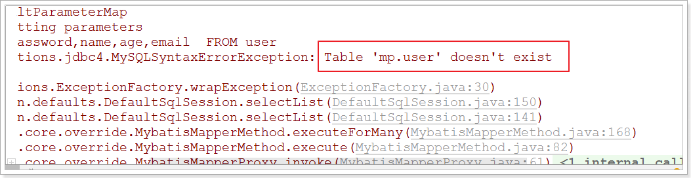
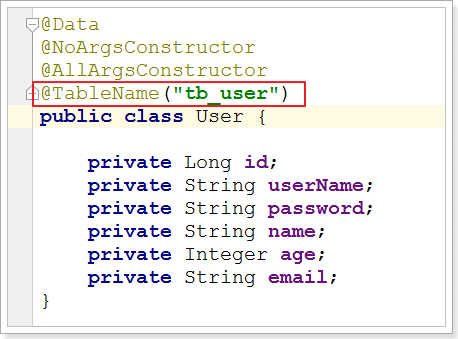
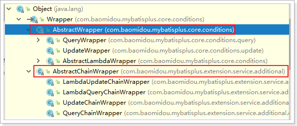

# mybatis基础

## 1、了解Mybatis-Plus

### 1.1、Mybatis-Plus介绍

MyBatis-Plus（简称 MP）是一个 MyBatis 的增强工具，在 MyBatis 的基础上只做增强不做改变，为简化开发、提高效率而生。

官网：<https://mybatis.plus/>  或 <https://mp.baomidou.com/>


> **愿景**
>
> 我们的愿景是成为 MyBatis 最好的搭档，就像 魂斗罗 中的 1P、2P，基友搭配，效率翻倍。
>
> 

### 1.2、代码以及文档

文档地址：<https://mybatis.plus/guide/>

源码地址：<https://github.com/baomidou/mybatis-plus>

### 1.3、特性

- **无侵入**：只做增强不做改变，引入它不会对现有工程产生影响，如丝般顺滑
- **损耗小**：启动即会自动注入基本 CURD，性能基本无损耗，直接面向对象操作
- **强大的 CRUD 操作**：内置通用 Mapper、通用 Service，仅仅通过少量配置即可实现单表大部分 CRUD 操作，更有强大的条件构造器，满足各类使用需求
- **支持 Lambda 形式调用**：通过 Lambda 表达式，方便的编写各类查询条件，无需再担心字段写错
- **支持多种数据库**：支持 MySQL、MariaDB、Oracle、DB2、H2、HSQL、SQLite、Postgre、SQLServer2005、SQLServer 等多种数据库
- **支持主键自动生成**：支持多达 4 种主键策略（内含分布式唯一 ID 生成器 - Sequence），可自由配置，完美解决主键问题
- **支持 XML 热加载**：Mapper 对应的 XML 支持热加载，对于简单的 CRUD 操作，甚至可以无 XML 启动
- **支持 ActiveRecord 模式**：支持 ActiveRecord 形式调用，实体类只需继承 Model 类即可进行强大的 CRUD 操作
- **支持自定义全局通用操作**：支持全局通用方法注入（ Write once, use anywhere ）
- **支持关键词自动转义**：支持数据库关键词（order、key......）自动转义，还可自定义关键词
- **内置代码生成器**：采用代码或者 Maven 插件可快速生成 Mapper 、 Model 、 Service 、 Controller 层代码，支持模板引擎，更有超多自定义配置等您来使用
- **内置分页插件**：基于 MyBatis 物理分页，开发者无需关心具体操作，配置好插件之后，写分页等同于普通 List 查询
- **内置性能分析插件**：可输出 Sql 语句以及其执行时间，建议开发测试时启用该功能，能快速揪出慢查询
- **内置全局拦截插件**：提供全表 delete 、 update 操作智能分析阻断，也可自定义拦截规则，预防误操作
- **内置 Sql 注入剥离器**：支持 Sql 注入剥离，有效预防 Sql 注入攻击

### 1.4、架构


### 1.5、作者

Mybatis-Plus是由baomidou（苞米豆）组织开发并且开源的，目前该组织大概有30人左右。

码云地址：<https://gitee.com/organizations/baomidou>

## 2、快速开始

对于Mybatis整合MP有常常有三种用法，分别是Mybatis+MP、Spring+Mybatis+MP、Spring Boot+Mybatis+MP。

### 2.1、创建数据库以及表

 


~~~sql
-- 创建测试表
CREATE TABLE `tb_user` (
  `id` bigint(20) NOT NULL AUTO_INCREMENT COMMENT '主键ID',
  `user_name` varchar(20) NOT NULL COMMENT '用户名',
  `password` varchar(20) NOT NULL COMMENT '密码',
  `name` varchar(30) DEFAULT NULL COMMENT '姓名',
  `age` int(11) DEFAULT NULL COMMENT '年龄',
  `email` varchar(50) DEFAULT NULL COMMENT '邮箱',
  PRIMARY KEY (`id`)
) ENGINE=InnoDB AUTO_INCREMENT=1 DEFAULT CHARSET=utf8;

-- 插入测试数据
INSERT INTO `tb_user` (`id`, `user_name`, `password`, `name`, `age`, `email`) VALUES ('1', 'qinglong', '123456', '青龙', '18', 'test1@1000phone.com');
INSERT INTO `tb_user` (`id`, `user_name`, `password`, `name`, `age`, `email`) VALUES ('2', 'baihu', '123456', '白虎', '20', 'test2@1000phone.com');
INSERT INTO `tb_user` (`id`, `user_name`, `password`, `name`, `age`, `email`) VALUES ('3', 'zhuque', '123456', '朱雀', '28', 'test3@1000phone.com');
INSERT INTO `tb_user` (`id`, `user_name`, `password`, `name`, `age`, `email`) VALUES ('4', 'xuanwu', '123456', '玄武', '21', 'test4@1000phone.com');
INSERT INTO `tb_user` (`id`, `user_name`, `password`, `name`, `age`, `email`) VALUES ('5', 'taoti', '123456', '饕鬄', '24', 'test5@1000phone.com');
~~~


### 2.2、创建工程

新建Model, Maven项目, 不要选择Maven骨架.


项目Pom.xml中导入依赖：

~~~xml
<?xml version="1.0" encoding="UTF-8"?>
<project xmlns="http://maven.apache.org/POM/4.0.0"
         xmlns:xsi="http://www.w3.org/2001/XMLSchema-instance"
         xsi:schemaLocation="http://maven.apache.org/POM/4.0.0 http://maven.apache.org/xsd/maven-4.0.0.xsd">
    <modelVersion>4.0.0</modelVersion>

    <groupId>com.qianfeng</groupId>
    <artifactId>qianfeng_mybatis_plus</artifactId>
    <version>1.0-SNAPSHOT</version>
    <packaging>pom</packaging>

    <properties>
        <!-- 项目源码及编译输出的编码 -->
        <project.build.sourceEncoding>UTF-8</project.build.sourceEncoding>
        <project.reporting.outputEncoding>UTF-8</project.reporting.outputEncoding>
        <!-- 项目编译JDK版本 -->
        <maven.compiler.source>1.8</maven.compiler.source>
        <maven.compiler.target>1.8</maven.compiler.target>
    </properties>


    <dependencies>
        <!-- mybatis-plus插件依赖 -->
        <dependency>
            <groupId>com.baomidou</groupId>
            <artifactId>mybatis-plus</artifactId>
            <version>3.1.1</version>
        </dependency>
        
        <!-- MySql -->
        <dependency>
            <groupId>mysql</groupId>
            <artifactId>mysql-connector-java</artifactId>
            <version>5.1.47</version>
        </dependency>
        <!-- 连接池 -->
        <dependency>
            <groupId>com.alibaba</groupId>
            <artifactId>druid</artifactId>
            <version>1.0.11</version>
        </dependency>
        <!--简化bean代码的工具包-->
        <dependency>
            <groupId>org.projectlombok</groupId>
            <artifactId>lombok</artifactId>
            <optional>true</optional>
            <version>1.18.4</version>
        </dependency>
        <dependency>
            <groupId>junit</groupId>
            <artifactId>junit</artifactId>
            <version>4.12</version>
        </dependency>
        <dependency>
            <groupId>org.slf4j</groupId>
            <artifactId>slf4j-log4j12</artifactId>
            <version>1.6.4</version>
        </dependency>
    </dependencies>

    <build>
        <plugins>
            <plugin>
                <groupId>org.apache.maven.plugins</groupId>
                <artifactId>maven-compiler-plugin</artifactId>
                <configuration>
                    <source>1.8</source>
                    <target>1.8</target>
                </configuration>
            </plugin>
        </plugins>
    </build>

</project>
~~~

### 2.3、Mybatis + MP

下面演示，通过纯Mybatis与Mybatis-Plus整合。


#### 2.3.1、创建子Module

~~~xml
<?xml version="1.0" encoding="UTF-8"?>
<project xmlns="http://maven.apache.org/POM/4.0.0"
         xmlns:xsi="http://www.w3.org/2001/XMLSchema-instance"
         xsi:schemaLocation="http://maven.apache.org/POM/4.0.0 http://maven.apache.org/xsd/maven-4.0.0.xsd">
    <parent>
        <artifactId>qianfeng_mybatis_plus</artifactId>
        <groupId>com.qianfeng</groupId>
        <version>1.0-SNAPSHOT</version>
    </parent>
    <modelVersion>4.0.0</modelVersion>

    <artifactId>qianfeng_simple</artifactId>


</project>
~~~

- 在qianfeng_simple模块的resources目录下新建log4j.properties：


```properties
log4j.rootLogger=DEBUG,A1

log4j.appender.A1=org.apache.log4j.ConsoleAppender
log4j.appender.A1.layout=org.apache.log4j.PatternLayout
log4j.appender.A1.layout.ConversionPattern=[%t] [%c]-[%p] %m%n
```

#### 2.3.2、Mybatis实现查询User

**第一步，在qianfeng_simple模块的resources目录下, 新建mybatis-config.xml文件：**

~~~xml
<?xml version="1.0" encoding="UTF-8" ?>
<!DOCTYPE configuration
        PUBLIC "-//mybatis.org//DTD Config 3.0//EN"
        "http://mybatis.org/dtd/mybatis-3-config.dtd">
<configuration>
    <environments default="development">
        <environment id="development">
            <transactionManager type="JDBC"/>
            <dataSource type="POOLED">
                <property name="driver" value="com.mysql.jdbc.Driver"/>
                <property name="url" value="jdbc:mysql://127.0.0.1:3306/qianfeng_mp?useUnicode=true&amp;characterEncoding=utf8&amp;autoReconnect=true&amp;allowMultiQueries=true&amp;useSSL=false"/>
                <property name="username" value="root"/>
                <property name="password" value="123456"/>
            </dataSource>
        </environment>
    </environments>
    <mappers>
        <mapper resource="UserMapper.xml"/>
    </mappers>
</configuration>
~~~

**第二步，编写User实体对象：（这里使用lombok进行了进化bean操作）**

~~~java
package com.qianfeng.pojo;

import lombok.AllArgsConstructor;
import lombok.Data;
import lombok.NoArgsConstructor;

/**
 * 用户实体类
 * @author zhaojian
 */
@Data
@NoArgsConstructor
@AllArgsConstructor
public class User {
    private Long id;
    private String userName;
    private String password;
    private String name;
    private Integer age;
    private String email;
    
}
~~~

**第三步，编写UserMapper接口：**

~~~java
package com.qianfeng.mapper;

import com.qianfeng.pojo.User;
import java.util.List;

/**
 * 用户Mapper接口
 * @author zhaojian
 */
public interface UserMapper {

    /**
     * 查询所有用户
     */
    List<User> findAll();
}
~~~

**第四步，在qianfeng_simple模块的resources目录下, 新建UserMapper.xml文件：**

~~~xml
<?xml version="1.0" encoding="UTF-8" ?>
<!DOCTYPE mapper
        PUBLIC "-//mybatis.org//DTD Mapper 3.0//EN"
        "http://mybatis.org/dtd/mybatis-3-mapper.dtd">
<mapper namespace="com.qianfeng.mapper.UserMapper">

    <select id="findAll" resultType="com.qianfeng.pojo.User">
      select * from tb_user
    </select>

</mapper>
~~~

**第五步，编写TestMybatis测试用例：**

~~~java
package com.qianfeng.test;

import com.qianfeng.mapper.UserMapper;
import com.qianfeng.pojo.User;
import org.apache.ibatis.io.Resources;
import org.apache.ibatis.session.SqlSession;
import org.apache.ibatis.session.SqlSessionFactory;
import org.apache.ibatis.session.SqlSessionFactoryBuilder;
import org.junit.Test;

import java.io.InputStream;
import java.util.List;

/**
 * 测试类
 * @author zhaojian
 */
public class TestMybatis {

    @Test
    public void testUserList() throws Exception {
        String resource = "mybatis-config.xml";
        InputStream inputStream = Resources.getResourceAsStream(resource);
        SqlSessionFactory sqlSessionFactory = new SqlSessionFactoryBuilder().build(inputStream);
        SqlSession sqlSession = sqlSessionFactory.openSession();

        UserMapper userMapper = sqlSession.getMapper(UserMapper.class);
        List<User> list = userMapper.findAll();
        for (User user : list) {
            System.out.println(user);
        }
    }
}
~~~

测试结果：

~~~shell
[main] [com.qianfeng.mapper.UserMapper.findAll]-[DEBUG] ==>  Preparing: select * from tb_user 
[main] [com.qianfeng.mapper.UserMapper.findAll]-[DEBUG] ==> Parameters: 
[main] [com.qianfeng.mapper.UserMapper.findAll]-[DEBUG] <==      Total: 5
User(id=1, userName=null, password=123456, name=青龙, age=18, email=test1@1000phone.com)
User(id=2, userName=null, password=123456, name=白虎, age=20, email=test2@1000phone.com)
User(id=3, userName=null, password=123456, name=朱雀, age=28, email=test3@1000phone.com)
User(id=4, userName=null, password=123456, name=玄武, age=21, email=test4@1000phone.com)
User(id=5, userName=null, password=123456, name=饕鬄, age=24, email=test5@1000phone.com)
~~~

#### 2.3.3、Mybatis+MP实现查询User

**第一步，将UserMapper继承BaseMapper，将拥有了BaseMapper中的所有方法：**

~~~java
package com.qianfeng.mapper;

import com.baomidou.mybatisplus.core.mapper.BaseMapper;
import com.qianfeng.pojo.User;

import java.util.List;

/**
 * 用户Mapper接口
 * @author zhaojian
 */
public interface UserMapper extends BaseMapper<User> {

    /**
     * 查询所有用户
     */
    List<User> findAll();
}
~~~

**第二步，使用MP中的MybatisSqlSessionFactoryBuilder进行构建：**

~~~java
package com.qianfeng.test;

import com.baomidou.mybatisplus.core.MybatisSqlSessionFactoryBuilder;
import com.qianfeng.mapper.UserMapper;
import com.qianfeng.pojo.User;
import org.apache.ibatis.io.Resources;
import org.apache.ibatis.session.SqlSession;
import org.apache.ibatis.session.SqlSessionFactory;
import org.junit.Test;

import java.io.InputStream;
import java.util.List;

/**
 * 测试Mybatis + MP
 * @author zhaojian
 */
public class TestMybatisPlus {

    @Test
    public void testUserList() throws Exception {
        String resource = "mybatis-config.xml";
        InputStream resourceAsStream = Resources.getResourceAsStream(resource);
        //这里使用的是MP中的MybatisSqlSessionFactoryBuilder
        SqlSessionFactory sqlSessionFactory = new MybatisSqlSessionFactoryBuilder().build(resourceAsStream);
        SqlSession sqlSession = sqlSessionFactory.openSession();

        UserMapper userMapper = sqlSession.getMapper(UserMapper.class);
        List<User> list = userMapper.findAll();
        for (User user : list) {
            System.out.println(user);
        }
    }
}
~~~

运行报错：



解决：在User对象中添加@TableName，指定数据库表名

 

测试：

~~~shell
[main] [com.qianfeng.mapper.UserMapper.findAll]-[DEBUG] ==>  Preparing: select * from tb_user 
[main] [com.qianfeng.mapper.UserMapper.findAll]-[DEBUG] ==> Parameters: 
[main] [com.qianfeng.mapper.UserMapper.findAll]-[DEBUG] <==      Total: 5
User(id=1, userName=qinglong, password=123456, name=青龙, age=18, email=test1@1000phone.com)
User(id=2, userName=baihu, password=123456, name=白虎, age=20, email=test2@1000phone.com)
User(id=3, userName=zhuque, password=123456, name=朱雀, age=28, email=test3@1000phone.com)
User(id=4, userName=xuanwu, password=123456, name=玄武, age=21, email=test4@1000phone.com)
User(id=5, userName=taoti, password=123456, name=饕鬄, age=24, email=test5@1000phone.com)
~~~

简单说明：

- 由于使用了MybatisSqlSessionFactoryBuilder进行了构建，继承的BaseMapper中的方法就载入到了SqlSession中，所以就可以直接使用相关的方法；
-  如图：


### 2.4、Spring + Mybatis + MP

引入了Spring框架，数据源、构建等工作就交给了Spring管理。

#### 2.4.1、创建子Module

- 在qianfeng_mybatis_plus模块上, 点击鼠标右键, 新建Model 为qianfeng_mybatis_pulus_spring

~~~xml
<?xml version="1.0" encoding="UTF-8"?>
<project xmlns="http://maven.apache.org/POM/4.0.0"
         xmlns:xsi="http://www.w3.org/2001/XMLSchema-instance"
         xsi:schemaLocation="http://maven.apache.org/POM/4.0.0 http://maven.apache.org/xsd/maven-4.0.0.xsd">
    <parent>
        <artifactId>qianfeng_mybatis_plus</artifactId>
        <groupId>com.qianfeng</groupId>
        <version>1.0-SNAPSHOT</version>
    </parent>
    <modelVersion>4.0.0</modelVersion>

    <artifactId>qianfeng_mybatis_plus_spring</artifactId>

    <properties>
        <spring.version>5.1.6.RELEASE</spring.version>
    </properties>

    <dependencies>
        <dependency>
            <groupId>org.springframework</groupId>
            <artifactId>spring-webmvc</artifactId>
            <version>${spring.version}</version>
        </dependency>
        <dependency>
            <groupId>org.springframework</groupId>
            <artifactId>spring-jdbc</artifactId>
            <version>${spring.version}</version>
        </dependency>
        <dependency>
            <groupId>org.springframework</groupId>
            <artifactId>spring-test</artifactId>
            <version>${spring.version}</version>
        </dependency>
    </dependencies>

</project>
~~~

#### 2.4.2、实现查询User

第一步，在qianfeng_mybatis_pulus_spring模块的resources目录下, 新建jdbc.properties

~~~properties
jdbc.driver=com.mysql.jdbc.Driver
jdbc.url=jdbc:mysql://127.0.0.1:3306/qianfeng_mp?useUnicode=true&characterEncoding=utf8&autoReconnect=true&allowMultiQueries=true&useSSL=false
jdbc.username=root
jdbc.password=123456
~~~

第二步，在qianfeng_mybatis_pulus_spring模块的resources目录下, 新建applicationContext.xml

~~~xml
<?xml version="1.0" encoding="UTF-8"?>
<beans xmlns="http://www.springframework.org/schema/beans"
       xmlns:xsi="http://www.w3.org/2001/XMLSchema-instance"
       xmlns:context="http://www.springframework.org/schema/context"
       xsi:schemaLocation="http://www.springframework.org/schema/beans
		http://www.springframework.org/schema/beans/spring-beans.xsd
        http://www.springframework.org/schema/context
        http://www.springframework.org/schema/context/spring-context.xsd">

    <context:property-placeholder location="classpath:*.properties"/>

    <!-- 定义数据源 -->
    <bean id="dataSource" class="com.alibaba.druid.pool.DruidDataSource"
          destroy-method="close">
        <property name="url" value="${jdbc.url}"/>
        <property name="username" value="${jdbc.username}"/>
        <property name="password" value="${jdbc.password}"/>
        <property name="driverClassName" value="${jdbc.driver}"/>
        <property name="maxActive" value="10"/>
        <property name="minIdle" value="5"/>
    </bean>

    <!--这里使用MP提供的sqlSessionFactory，完成了Spring与MP的整合-->
    <bean id="sqlSessionFactory" class="com.baomidou.mybatisplus.extension.spring.MybatisSqlSessionFactoryBean">
        <property name="dataSource" ref="dataSource"/>
    </bean>

    <!--扫描mapper接口，使用的依然是Mybatis原生的扫描器-->
    <bean class="org.mybatis.spring.mapper.MapperScannerConfigurer">
        <property name="basePackage" value="com.qianfeng.mapper"/>
    </bean>

</beans>
~~~

第三步，编写User对象以及UserMapper接口：

~~~java
package com.qianfeng.pojo;

import com.baomidou.mybatisplus.annotation.TableName;
import lombok.AllArgsConstructor;
import lombok.Data;
import lombok.NoArgsConstructor;

/**
 * 用户实体类
 * @author zhaojian
 */
@Data
@NoArgsConstructor
@AllArgsConstructor
@TableName("tb_user")
public class User {
    private Long id;
    private String userName;
    private String password;
    private String name;
    private Integer age;
    private String email;

}
~~~

```java
package com.qianfeng.mapper;

import com.baomidou.mybatisplus.core.mapper.BaseMapper;
import com.qianfeng.pojo.User;

/**
 * 用户Mapper接口
 * @author zhaojian
 */
public interface UserMapper extends BaseMapper<User> {
    
}
```

第四步，编写测试用例：

~~~java
package com.qianfeng.test;

import com.qianfeng.mapper.UserMapper;
import com.qianfeng.pojo.User;
import org.junit.Test;
import org.junit.runner.RunWith;
import org.springframework.beans.factory.annotation.Autowired;
import org.springframework.test.context.ContextConfiguration;
import org.springframework.test.context.junit4.SpringJUnit4ClassRunner;

import java.util.List;

/**
 * @author zhaojian
 */
@RunWith(SpringJUnit4ClassRunner.class)
@ContextConfiguration(locations = "classpath:applicationContext.xml")
public class TestSpringMP {

    @Autowired
    private UserMapper userMapper;

    @Test
    public void testSelectList(){
        List<User> users = this.userMapper.selectList(null);
        for (User user : users) {
            System.out.println(user);
        }
    }
}
~~~

测试：

~~~shell
User(id=1, userName=qinglong, password=123456, name=青龙, age=18, email=test1@1000phone.com)
User(id=2, userName=baihu, password=123456, name=白虎, age=20, email=test2@1000phone.com)
User(id=3, userName=zhuque, password=123456, name=朱雀, age=28, email=test3@1000phone.com)
User(id=4, userName=xuanwu, password=123456, name=玄武, age=21, email=test4@1000phone.com)
User(id=5, userName=taoti, password=123456, name=饕鬄, age=24, email=test5@1000phone.com)
~~~

### 2.5、SpringBoot + Mybatis + MP

使用SpringBoot将进一步的简化MP的整合

**注意 : 由于使用SpringBoot需要继承parent，所以需要重新创建工程，并不是创建子Module。**


#### 2.5.1、创建工程

新建Model, Maven工程, 不选择骨架, 名字叫做 qianfeng_mp_springboot


#### 2.5.2、导入依赖

~~~xml
<?xml version="1.0" encoding="UTF-8"?>
<project xmlns="http://maven.apache.org/POM/4.0.0"
         xmlns:xsi="http://www.w3.org/2001/XMLSchema-instance"
         xsi:schemaLocation="http://maven.apache.org/POM/4.0.0 http://maven.apache.org/xsd/maven-4.0.0.xsd">
    <modelVersion>4.0.0</modelVersion>

    <groupId>com.qianfeng</groupId>
    <artifactId>qianfeng_mp_springboot</artifactId>
    <version>1.0-SNAPSHOT</version>

    <parent>
        <groupId>org.springframework.boot</groupId>
        <artifactId>spring-boot-starter-parent</artifactId>
        <version>2.1.4.RELEASE</version>
    </parent>

    <properties>
        <!-- 项目源码及编译输出的编码 -->
        <project.build.sourceEncoding>UTF-8</project.build.sourceEncoding>
        <project.reporting.outputEncoding>UTF-8</project.reporting.outputEncoding>
        <!-- 项目编译JDK版本 -->
        <maven.compiler.source>1.8</maven.compiler.source>
        <maven.compiler.target>1.8</maven.compiler.target>
    </properties>

    <dependencies>
        <dependency>
            <groupId>org.springframework.boot</groupId>
            <artifactId>spring-boot-starter</artifactId>
            <exclusions>
                <exclusion>
                    <groupId>org.springframework.boot</groupId>
                    <artifactId>spring-boot-starter-logging</artifactId>
                </exclusion>
            </exclusions>
        </dependency>
        <dependency>
            <groupId>org.springframework.boot</groupId>
            <artifactId>spring-boot-starter-test</artifactId>
            <scope>test</scope>
        </dependency>

        <!--简化代码的工具包-->
        <dependency>
            <groupId>org.projectlombok</groupId>
            <artifactId>lombok</artifactId>
            <optional>true</optional>
        </dependency>
        
        <!--mybatis-plus的springboot支持-->
        <dependency>
            <groupId>com.baomidou</groupId>
            <artifactId>mybatis-plus-boot-starter</artifactId>
            <version>3.1.1</version>
        </dependency>
        
        <!--mysql驱动-->
        <dependency>
            <groupId>mysql</groupId>
            <artifactId>mysql-connector-java</artifactId>
            <version>5.1.47</version>
        </dependency>
        <dependency>
            <groupId>org.slf4j</groupId>
            <artifactId>slf4j-log4j12</artifactId>
        </dependency>

    </dependencies>

    <build>
        <plugins>
            <plugin>
                <groupId>org.springframework.boot</groupId>
                <artifactId>spring-boot-maven-plugin</artifactId>
            </plugin>
        </plugins>
    </build>

</project>
~~~

- qianfeng_mp_springboot模块的resources目录下, 新建log4j.properties：


```properties
log4j.rootLogger=DEBUG,A1

log4j.appender.A1=org.apache.log4j.ConsoleAppender
log4j.appender.A1.layout=org.apache.log4j.PatternLayout
log4j.appender.A1.layout.ConversionPattern=[%t] [%c]-[%p] %m%n
```

#### 2.5.3、编写application.properties

```properties
spring.application.name = qianfeng-mp-springboot

spring.datasource.driver-class-name=com.mysql.jdbc.Driver
spring.datasource.url=jdbc:mysql://127.0.0.1:3306/qianfeng_mp?useUnicode=true&characterEncoding=utf8&autoReconnect=true&allowMultiQueries=true&useSSL=false
spring.datasource.username=root
spring.datasource.password=123456
```

#### 2.5.4、编写pojo

```java
package com.qianfeng.pojo;

import com.baomidou.mybatisplus.annotation.TableName;
import lombok.AllArgsConstructor;
import lombok.Data;
import lombok.NoArgsConstructor;

/**
 * 用户实体类
 * @author zhaojian
 */
@Data
@NoArgsConstructor
@AllArgsConstructor
@TableName("tb_user")
public class User {
    private Long id;
    private String userName;
    private String password;
    private String name;
    private Integer age;
    private String email;

}
```

#### 2.5.5、编写mapper

~~~java
package com.qianfeng.mapper;

import com.baomidou.mybatisplus.core.mapper.BaseMapper;
import com.qianfeng.pojo.User;

/**
 * @author zhaojian
 */
public interface UserMapper extends BaseMapper<User> {
    
}
~~~

#### 2.5.6、编写启动类

```java
package com.qianfeng;

import org.mybatis.spring.annotation.MapperScan;
import org.springframework.boot.SpringApplication;
import org.springframework.boot.autoconfigure.SpringBootApplication;

/**
 * 启动类
 * @author zhaojian
 */
@SpringBootApplication
//设置mapper接口的扫描包
@MapperScan("com.qianfeng.mapper")
public class MpApplication {

    public static void main(String[] args) {
        SpringApplication.run(MpApplication.class, args);
    }
}
```

#### 2.5.7、编写测试用例

**注意 : 此项目为springboot项目,  测试类必须放在src/test/java目录下,  千万不要放在src/main/java目录下,  否则注解@SpringBootTest找不到包.**

```java
package com.qianfeng.test;

import com.qianfeng.mapper.UserMapper;
import com.qianfeng.pojo.User;
import org.junit.Test;
import org.junit.runner.RunWith;
import org.springframework.beans.factory.annotation.Autowired;
import org.springframework.boot.test.context.SpringBootTest;
import org.springframework.test.context.junit4.SpringRunner;

import java.util.List;

/**
 * @author zhaojian
 */
@RunWith(SpringRunner.class)
@SpringBootTest
public class UserMapperTest {

    @Autowired
    private UserMapper userMapper;

    @Test
    public void testSelect() {
        List<User> userList = userMapper.selectList(null);
        for (User user : userList) {
            System.out.println(user);
        }
    }
}
```

## 3、通用CRUD

通过前面的学习，我们了解到通过继承BaseMapper就可以获取到各种各样的单表操作，接下来我们将详细讲解这些操作。

 

### 3.1、插入操作

#### 3.1.1、测试用例

```java
package com.qianfeng.test;

import com.qianfeng.mapper.UserMapper;
import com.qianfeng.pojo.User;
import org.junit.Test;
import org.junit.runner.RunWith;
import org.springframework.beans.factory.annotation.Autowired;
import org.springframework.boot.test.context.SpringBootTest;
import org.springframework.test.context.junit4.SpringRunner;

import java.util.List;

/**
 * 普通增删改查测试
 * @author zhaojian
 */
@RunWith(SpringRunner.class)
@SpringBootTest
public class UserMapperTest {

    @Autowired
    private UserMapper userMapper;

    @Test
    public void testInsert() {
        User user = new User();
        user.setAge(29);
        user.setName("梼杌");
        user.setEmail("taowu@1000phone.com");
        user.setUserName("taowu");
        user.setPassword("123456");
        int count = userMapper.insert(user);
        System.out.println("=======操作了几条数据:====" + count);
        System.out.println("===id是:====" + user.getId());
    }
}

```

#### 3.1.2、执行测试结果


#### 3.1.3、ID生成策略

可以看到，数据已经写入到了数据库，但是，id的值不正确，我们期望的是数据库自增长，实际是MP生成了id的值写入到了数据库。

如何设置id的生成策略呢？

MP支持的id策略：

~~~java
package com.baomidou.mybatisplus.annotation;

import lombok.Getter;

/**
 * 生成ID类型枚举类
 *
 * @author hubin
 * @since 2015-11-10
 */
@Getter
public enum IdType {
    /**
     * 数据库ID自增
     */
    AUTO(0),
    /**
     * 该类型为未设置主键类型
     */
    NONE(1),
    /**
     * 用户输入ID
     * <p>该类型可以通过自己注册自动填充插件进行填充</p>
     */
    INPUT(2),

    /* 以下3种类型、只有当插入对象ID 为空，才自动填充。 */
    /**
     * 全局唯一ID (idWorker)
     */
    ID_WORKER(3),
    /**
     * 全局唯一ID (UUID)
     */
    UUID(4),
    /**
     * 字符串全局唯一ID (idWorker 的字符串表示)
     */
    ID_WORKER_STR(5);

    private final int key;

    IdType(int key) {
        this.key = key;
    }
}

~~~

修改User对象：

~~~java
package com.qianfeng.pojo;

import com.baomidou.mybatisplus.annotation.IdType;
import com.baomidou.mybatisplus.annotation.TableId;
import com.baomidou.mybatisplus.annotation.TableName;
import lombok.AllArgsConstructor;
import lombok.Data;
import lombok.NoArgsConstructor;

/**
 * 用户实体类
 * @author zhaojian
 */
@Data
@NoArgsConstructor
@AllArgsConstructor
@TableName("tb_user")
public class User {

    //指定id类型为使用分布式ID生成器生成
    @TableId(type = IdType.ID_WORKER)
    private Long id;

    private String userName;
    private String password;
    private String name;
    private Integer age;
    private String email;
}
~~~

数据插入成功：

 

#### 3.1.4、@TableField

在MP中通过@TableField注解可以指定字段的一些属性，常常解决的问题有2个：

1、对象中的属性名和字段名不一致的问题（非驼峰）

2、对象中的属性字段在表中不存在的问题 

使用：

```java
package com.qianfeng.pojo;

import com.baomidou.mybatisplus.annotation.IdType;
import com.baomidou.mybatisplus.annotation.TableField;
import com.baomidou.mybatisplus.annotation.TableId;
import com.baomidou.mybatisplus.annotation.TableName;
import lombok.AllArgsConstructor;
import lombok.Data;
import lombok.NoArgsConstructor;

/**
 * 用户实体类
 * @author zhaojian
 */
@Data
@NoArgsConstructor
@AllArgsConstructor
@TableName("tb_user")
public class User {

    //指定id类型为使用分布式ID生成器生成
    @TableId(type = IdType.ID_WORKER)
    private Long id;

    private String userName;

    //密码字段不应该被查询出来
    @TableField(select = false)
    private String password;

    private String name;
    private Integer age;

    //表中字段名和实体类属性名不一致
    @TableField(value = "email")
    private String mail;

    //表中不存在这个字段
    @TableField(exist = false)
    private String address;

}
```

 效果：


### 3.2、更新操作

在MP中，更新操作有2种，一种是根据id更新，另一种是根据条件更新。

#### 3.2.1、根据id更新

测试：

~~~java
@RunWith(SpringRunner.class)
@SpringBootTest
public class UserMapperTest {

    @Autowired
    private UserMapper userMapper;

    @Test
    public void testUpdateById() {
        User user = new User();
        user.setId(1352412605444091905L); //主键
        user.setAge(21); //更新的字段

        //根据id更新，更新不为null的字段
        userMapper.updateById(user);
    }

}
~~~

结果：


#### 3.2.2、根据条件更新

源码中的方法：

~~~java
    /**
     * 根据 whereEntity 条件，更新记录
     *
     * @param entity        实体对象 (set 条件值,可以为 null)
     * @param updateWrapper 实体对象封装操作类（可以为 null,里面的 entity 用于生成 where 语句）
     */
    int update(@Param(Constants.ENTITY) T entity, @Param(Constants.WRAPPER) Wrapper<T> updateWrapper);

~~~

测试用例：

```java
package com.qianfeng.test;

import com.baomidou.mybatisplus.core.conditions.query.QueryWrapper;
import com.qianfeng.mapper.UserMapper;
import com.qianfeng.pojo.User;
import org.junit.Test;
import org.junit.runner.RunWith;
import org.springframework.beans.factory.annotation.Autowired;
import org.springframework.boot.test.context.SpringBootTest;
import org.springframework.test.context.junit4.SpringRunner;

import java.util.List;

/**
 * 普通增删改查测试
 * @author zhaojian
 */
@RunWith(SpringRunner.class)
@SpringBootTest
public class UserMapperTest {

    @Autowired
    private UserMapper userMapper;

    @Test
    public void testUpdate() {
        User user = new User();
        user.setAge(22); //更新的字段

        //更新的条件
        QueryWrapper<User> wrapper = new QueryWrapper<>();
        wrapper.eq("id", 1352412605444091905L);

        //执行更新操作
        int result = userMapper.update(user, wrapper);
        System.out.println("result = " + result);
    }
    
}
```

关于wrapper更多的用法后面会详细讲解。

### 3.3、删除操作

#### 3.3.1、deleteById

源码中的方法：

```java
/**
 * 根据 ID 删除
 *
 * @param id 主键ID
 */
int deleteById(Serializable id);
```

测试用例：

~~~java
package com.qianfeng.test;

import com.baomidou.mybatisplus.core.conditions.query.QueryWrapper;
import com.qianfeng.mapper.UserMapper;
import com.qianfeng.pojo.User;
import org.junit.Test;
import org.junit.runner.RunWith;
import org.springframework.beans.factory.annotation.Autowired;
import org.springframework.boot.test.context.SpringBootTest;
import org.springframework.test.context.junit4.SpringRunner;

import java.util.List;

/**
 * 普通增删改查测试
 * @author zhaojian
 */
@RunWith(SpringRunner.class)
@SpringBootTest
public class UserMapperTest {

    @Autowired
    private UserMapper userMapper;

    @Test
    public void testDeleteById() {
        //执行删除操作
        int result = userMapper.deleteById(1352412605444091905L);
        System.out.println("result = " + result);
    }
}
~~~

结果：


数据被删除。

#### 3.3.2、deleteByMap

源码中的方法：

~~~java
    /**
     * 根据 columnMap 条件，删除记录
     *
     * @param columnMap 表字段 map 对象
     */
    int deleteByMap(@Param(Constants.COLUMN_MAP) Map<String, Object> columnMap);
~~~

测试用例：

~~~java
@Test
public void testDeleteByMap() {
    Map<String, Object> columnMap = new HashMap<>();
    columnMap.put("age",29);
    columnMap.put("name","梼杌");

    //将columnMap中的元素设置为删除的条件，多个之间为and关系
    int result = userMapper.deleteByMap(columnMap);
    System.out.println("result = " + result);
}
~~~

#### 3.3.3、delete

源码中的方法：

```java
/**
 * 根据 entity 条件，删除记录
 *
 * @param wrapper 实体对象封装操作类（可以为 null）
 */
int delete(@Param(Constants.WRAPPER) Wrapper<T> wrapper);
```

测试用例：

```java
@Test
public void testDelete() {
    User user = new User();
    user.setAge(24);
    user.setName("饕鬄");

    //将实体对象进行包装，包装为操作条件
    QueryWrapper<User> wrapper = new QueryWrapper<>(user);

    int result = userMapper.delete(wrapper);
    System.out.println("result = " + result);
}
```

#### 3.3.4、deleteBatchIds

源码中的方法：

~~~java
    /**
     * 删除（根据ID 批量删除）
     *
     * @param idList 主键ID列表(不能为 null 以及 empty)
     */
    int deleteBatchIds(@Param(Constants.COLLECTION) Collection<? extends Serializable> idList);
~~~

测试用例：

```java
@Test
public void testDeleteByMap() {
    //根据id集合批量删除
    int result = userMapper.deleteBatchIds(Arrays.asList(1L,10L,20L));
    System.out.println("result = " + result);
}
```

### 3.4、查询操作

MP提供了多种查询操作，包括根据id查询、批量查询、查询单条数据、查询列表、分页查询等操作。

#### 3.4.1、selectById

源码中的方法：

~~~java
    /**
     * 根据 ID 查询
     *
     * @param id 主键ID
     */
    T selectById(Serializable id);
~~~

测试用例：

~~~java
package com.qianfeng.test;

import com.baomidou.mybatisplus.core.conditions.query.QueryWrapper;
import com.qianfeng.mapper.UserMapper;
import com.qianfeng.pojo.User;
import org.junit.Test;
import org.junit.runner.RunWith;
import org.springframework.beans.factory.annotation.Autowired;
import org.springframework.boot.test.context.SpringBootTest;
import org.springframework.test.context.junit4.SpringRunner;

import java.util.HashMap;
import java.util.List;
import java.util.Map;

/**
 * 普通增删改查测试
 * @author zhaojian
 */
@RunWith(SpringRunner.class)
@SpringBootTest
public class UserMapperTest {

    @Autowired
    private UserMapper userMapper;

    @Test
    public void testSelectById() {
        //根据id查询数据
        User user = userMapper.selectById(4L);
        System.out.println("result = " + user);
    }

}
~~~

#### 3.4.2、selectBatchIds

源码中的方法：

```java
/**
 * 查询（根据ID 批量查询）
 *
 * @param idList 主键ID列表(不能为 null 以及 empty)
 */
List<T> selectBatchIds(@Param(Constants.COLLECTION) Collection<? extends Serializable> idList);
```

测试用例：

```java
package com.qianfeng.test;

import com.baomidou.mybatisplus.core.conditions.query.QueryWrapper;
import com.qianfeng.mapper.UserMapper;
import com.qianfeng.pojo.User;
import org.junit.Test;
import org.junit.runner.RunWith;
import org.springframework.beans.factory.annotation.Autowired;
import org.springframework.boot.test.context.SpringBootTest;
import org.springframework.test.context.junit4.SpringRunner;

import java.util.Arrays;
import java.util.HashMap;
import java.util.List;
import java.util.Map;

/**
 * 普通增删改查测试
 * @author zhaojian
 */
@RunWith(SpringRunner.class)
@SpringBootTest
public class UserMapperTest {

    @Autowired
    private UserMapper userMapper;

    @Test
    public void testSelectBatchIds() {
        //根据id集合批量查询
        List<User> users = userMapper.selectBatchIds(Arrays.asList(2L, 3L, 4L));
        for (User user : users) {
            System.out.println(user);
        }
    }

}
```

#### 3.4.3、selectOne

源码中的方法：

```java
/**
 * 根据 entity 条件，查询一条记录
 *
 * @param queryWrapper 实体对象封装操作类（可以为 null）
 */
T selectOne(@Param(Constants.WRAPPER) Wrapper<T> queryWrapper);
```

测试用例：

```java
package com.qianfeng.test;

import com.baomidou.mybatisplus.core.conditions.query.QueryWrapper;
import com.qianfeng.mapper.UserMapper;
import com.qianfeng.pojo.User;
import org.junit.Test;
import org.junit.runner.RunWith;
import org.springframework.beans.factory.annotation.Autowired;
import org.springframework.boot.test.context.SpringBootTest;
import org.springframework.test.context.junit4.SpringRunner;

import java.util.Arrays;
import java.util.HashMap;
import java.util.List;
import java.util.Map;

/**
 * 普通增删改查测试
 * @author zhaojian
 */
@RunWith(SpringRunner.class)
@SpringBootTest
public class UserMapperTest {

    @Autowired
    private UserMapper userMapper;

    @Test
    public void testSelectOne() {
        QueryWrapper<User> wrapper = new QueryWrapper<User>();
        wrapper.eq("name", "玄武");

        //根据条件查询一条数据，如果结果超过一条会报错
        User user = userMapper.selectOne(wrapper);
        System.out.println(user);
    }

}
```

#### 3.4.4、selectCount

源码中的方法：

```java
/**
 * 根据 Wrapper 条件，查询总记录数
 *
 * @param queryWrapper 实体对象封装操作类（可以为 null）
 */
Integer selectCount(@Param(Constants.WRAPPER) Wrapper<T> queryWrapper);
```

测试用例：

```java
package com.qianfeng.test;

import com.baomidou.mybatisplus.core.conditions.query.QueryWrapper;
import com.qianfeng.mapper.UserMapper;
import com.qianfeng.pojo.User;
import org.junit.Test;
import org.junit.runner.RunWith;
import org.springframework.beans.factory.annotation.Autowired;
import org.springframework.boot.test.context.SpringBootTest;
import org.springframework.test.context.junit4.SpringRunner;

import java.util.Arrays;
import java.util.HashMap;
import java.util.List;
import java.util.Map;

/**
 * 普通增删改查测试
 * @author zhaojian
 */
@RunWith(SpringRunner.class)
@SpringBootTest
public class UserMapperTest {

    @Autowired
    private UserMapper userMapper;

    @Test
    public void testSelectCount() {
        QueryWrapper<User> wrapper = new QueryWrapper<User>();
        wrapper.gt("age", 20); //年龄大于20岁

        //根据条件查询数据条数
        Integer count = userMapper.selectCount(wrapper);
        System.out.println("count = " + count);
    }

}
```

#### 3.4.5、selectList

源码中的方法：

```java
/**
 * 根据 entity 条件，查询全部记录
 *
 * @param queryWrapper 实体对象封装操作类（可以为 null）
 */
List<T> selectList(@Param(Constants.WRAPPER) Wrapper<T> queryWrapper);
```

测试用例：

~~~java
package com.qianfeng.test;

import com.baomidou.mybatisplus.core.conditions.query.QueryWrapper;
import com.qianfeng.mapper.UserMapper;
import com.qianfeng.pojo.User;
import org.junit.Test;
import org.junit.runner.RunWith;
import org.springframework.beans.factory.annotation.Autowired;
import org.springframework.boot.test.context.SpringBootTest;
import org.springframework.test.context.junit4.SpringRunner;

import java.util.Arrays;
import java.util.HashMap;
import java.util.List;
import java.util.Map;

/**
 * 普通增删改查测试
 * @author zhaojian
 */
@RunWith(SpringRunner.class)
@SpringBootTest
public class UserMapperTest {

    @Autowired
    private UserMapper userMapper;

    @Test
    public void testSelectList() {
        QueryWrapper<User> wrapper = new QueryWrapper<User>();
        wrapper.gt("age", 20); //年龄大于20岁

        //根据条件查询数据
        List<User> users = userMapper.selectList(wrapper);
        for (User user : users) {
            System.out.println("user = " + user);
        }
    }

}
~~~

#### 3.4.6、selectPage

源码中的方法：

```java
/**
 * 根据 entity 条件，查询全部记录（并翻页）
 *
 * @param page         分页查询条件（可以为 RowBounds.DEFAULT）
 * @param queryWrapper 实体对象封装操作类（可以为 null）
 */
IPage<T> selectPage(IPage<T> page, @Param(Constants.WRAPPER) Wrapper<T> queryWrapper);
```

配置分页插件：

```java
package com.qianfeng.config;

import com.baomidou.mybatisplus.extension.plugins.PaginationInterceptor;
import org.mybatis.spring.annotation.MapperScan;
import org.springframework.context.annotation.Bean;
import org.springframework.context.annotation.Configuration;

/**
 * MybatisPlus分页插件配置类
 * @author zhaojian
 */
@Configuration
//设置mapper接口的扫描包
@MapperScan("com.qianfeng.mapper")
public class MybatisPlusConfig {

    /**
     * 分页插件
     */
    @Bean
    public PaginationInterceptor paginationInterceptor() {
        return new PaginationInterceptor();
    }
}
```

测试用例：

```java
package com.qianfeng.test;

import com.baomidou.mybatisplus.core.conditions.query.QueryWrapper;
import com.baomidou.mybatisplus.core.metadata.IPage;
import com.baomidou.mybatisplus.extension.plugins.pagination.Page;
import com.qianfeng.mapper.UserMapper;
import com.qianfeng.pojo.User;
import org.junit.Test;
import org.junit.runner.RunWith;
import org.springframework.beans.factory.annotation.Autowired;
import org.springframework.boot.test.context.SpringBootTest;
import org.springframework.test.context.junit4.SpringRunner;

import java.util.Arrays;
import java.util.HashMap;
import java.util.List;
import java.util.Map;

/**
 * 普通增删改查测试
 * @author zhaojian
 */
@RunWith(SpringRunner.class)
@SpringBootTest
public class UserMapperTest {

    @Autowired
    private UserMapper userMapper;

    @Test
    public void testSelectPage() {
        QueryWrapper<User> wrapper = new QueryWrapper<User>();
        wrapper.gt("age", 20); //年龄大于20岁

        Page<User> page = new Page<>(1,1);

        //根据条件查询数据
        IPage<User> iPage = userMapper.selectPage(page, wrapper);
        System.out.println("数据总条数：" + iPage.getTotal());
        System.out.println("总页数：" + iPage.getPages());

        List<User> users = iPage.getRecords();
        for (User user : users) {
            System.out.println("user = " + user);
        }
    }

}
```

##  4、配置

在MP中有大量的配置，其中有一部分是Mybatis原生的配置，另一部分是MP的配置，详情：<https://mybatis.plus/config/>

下面我们对常用的配置做讲解。

### 4.1、基本配置

#### 4.1.1、configLocation

MyBatis 配置文件位置，如果您有单独的 MyBatis 配置，请将其路径配置到 configLocation 中。 MyBatis Configuration 的具体内容请参考MyBatis 官方文档

Spring Boot：

```properties
mybatis-plus.config-location = classpath:mybatis-config.xml
```

Spring MVC：

```xml
<bean id="sqlSessionFactory" class="com.baomidou.mybatisplus.extension.spring.MybatisSqlSessionFactoryBean">
    <property name="configLocation" value="classpath:mybatis-config.xml"/>
</bean>
```

#### 4.1.2、mapperLocations

MyBatis Mapper 所对应的 XML 文件位置，如果您在 Mapper 中有自定义方法（XML 中有自定义实现），需要进行该配置，告诉 Mapper 所对应的 XML 文件位置。

Spring Boot：

```properties
mybatis-plus.mapper-locations = classpath*:mybatis/*.xml
```

Spring MVC：

```xml
<bean id="sqlSessionFactory" class="com.baomidou.mybatisplus.extension.spring.MybatisSqlSessionFactoryBean">
    <property name="mapperLocations" value="classpath*:mybatis/*.xml"/>
</bean>
```

**Maven 多模块项目的扫描路径需以 `classpath*:` 开头 （即加载多个 jar 包下的 XML 文件）**

测试：

- 项目resources目录下的 application.properties 配置文件:

```properties
spring.application.name = qianfeng-mp-springboot

spring.datasource.driver-class-name=com.mysql.jdbc.Driver
mybatis-plus.mapper-locations = classpath*:mybatis/*.xml
spring.datasource.url=jdbc:mysql://127.0.0.1:3306/qianfeng_mp?useUnicode=true&characterEncoding=utf8&autoReconnect=true&allowMultiQueries=true&useSSL=false
spring.datasource.username=root
spring.datasource.password=123456
```

- 项目resources目录下新建mybatis目录, 在mybatis目录下新建UserMapper.xml：


```xml
<?xml version="1.0" encoding="UTF-8" ?>
<!DOCTYPE mapper
        PUBLIC "-//mybatis.org//DTD Mapper 3.0//EN"
        "http://mybatis.org/dtd/mybatis-3-mapper.dtd">
<mapper namespace="com.qianfeng.mapper.UserMapper">

    <select id="findById" resultType="com.qianfeng.pojo.User">
      	select * from tb_user where id = #{id}
    </select>

</mapper>
```

```java
package com.qianfeng.mapper;

import com.baomidou.mybatisplus.core.mapper.BaseMapper;
import com.qianfeng.pojo.User;

/**
 * @author zhaojian
 */
public interface UserMapper extends BaseMapper<User> {

    public User findById(Long id);
}
```

- 测试用例：


```java
package com.qianfeng.test;

import com.baomidou.mybatisplus.core.conditions.query.QueryWrapper;
import com.baomidou.mybatisplus.core.metadata.IPage;
import com.baomidou.mybatisplus.extension.plugins.pagination.Page;
import com.qianfeng.mapper.UserMapper;
import com.qianfeng.pojo.User;
import org.junit.Test;
import org.junit.runner.RunWith;
import org.springframework.beans.factory.annotation.Autowired;
import org.springframework.boot.test.context.SpringBootTest;
import org.springframework.test.context.junit4.SpringRunner;

import java.util.Arrays;
import java.util.HashMap;
import java.util.List;
import java.util.Map;

/**
 * 普通增删改查测试
 * @author zhaojian
 */
@RunWith(SpringRunner.class)
@SpringBootTest
public class UserMapperTest {

    @Autowired
    private UserMapper userMapper;

    @Test
    public void testFindById() {
        User user = userMapper.findById(2L);
        System.out.println(user);
    }
}
```

#### 4.1.3、typeAliasesPackage

MyBaits 别名包扫描路径，通过该属性可以给包中的类注册别名，注册后在 Mapper 对应的 XML 文件中可以直接使用类名，而不用使用全限定的类名（即 XML 中调用的时候不用包含包名）。

Spring Boot：

```properties
mybatis-plus.type-aliases-package = com.qianfeng.pojo
```

Spring MVC：

```xml
<bean id="sqlSessionFactory" class="com.baomidou.mybatisplus.extension.spring.MybatisSqlSessionFactoryBean">
    <property name="typeAliasesPackage" value="com.baomidou.mybatisplus.samples.quickstart.entity"/>
</bean>
```

### 4.2、进阶配置

本部分（Configuration）的配置大都为 MyBatis 原生支持的配置，这意味着您可以通过 MyBatis XML 配置文件的形式进行配置。

#### 4.2.1、mapUnderscoreToCamelCase

- 类型：`boolean`
- 默认值：`true`

是否开启自动驼峰命名规则（camel case）映射，即从经典数据库列名 A_COLUMN（下划线命名） 到经典 Java 属性名 aColumn（驼峰命名） 的类似映射。

> 注意：
>
> 此属性在 MyBatis 中原默认值为 false，在 MyBatis-Plus 中，此属性也将用于生成最终的 SQL 的 select body
>
> 如果您的数据库命名符合规则无需使用 `@TableField` 注解指定数据库字段名

示例（SpringBoot）：

~~~properties
#关闭自动驼峰映射，该参数不能和mybatis-plus.config-location同时存在
mybatis-plus.configuration.map-underscore-to-camel-case=false
~~~

#### 4.2.2、cacheEnabled

- 类型：`boolean`
- 默认值：`true`

全局地开启或关闭配置文件中的所有映射器已经配置的任何缓存，默认为 true。

示例：

~~~properties
mybatis-plus.configuration.cache-enabled=false
~~~

### 4.3、DB 策略配置

#### 4.3.1、idType

- 类型：`com.baomidou.mybatisplus.annotation.IdType`
- 默认值：`ID_WORKER`

全局默认主键类型，设置后，即可省略实体对象中的@TableId(type = IdType.AUTO)配置。

示例：

SpringBoot：

~~~properties
mybatis-plus.global-config.db-config.id-type=auto
~~~

SpringMVC：

~~~xml
<!--这里使用MP提供的sqlSessionFactory，完成了Spring与MP的整合-->
    <bean id="sqlSessionFactory" class="com.baomidou.mybatisplus.extension.spring.MybatisSqlSessionFactoryBean">
        <property name="dataSource" ref="dataSource"/>
        <property name="globalConfig">
            <bean class="com.baomidou.mybatisplus.core.config.GlobalConfig">
                <property name="dbConfig">
                    <bean class="com.baomidou.mybatisplus.core.config.GlobalConfig$DbConfig">
                        <property name="idType" value="AUTO"/>
                    </bean>
                </property>
            </bean>
        </property>
    </bean>
~~~

#### 4.3.2、tablePrefix

- 类型：`String`
- 默认值：`null`

表名前缀，全局配置后可省略@TableName()配置。

SpringBoot：

~~~properties
mybatis-plus.global-config.db-config.table-prefix=tb_
~~~

SpringMVC：

~~~xml
 <bean id="sqlSessionFactory" class="com.baomidou.mybatisplus.extension.spring.MybatisSqlSessionFactoryBean">
        <property name="dataSource" ref="dataSource"/>
        <property name="globalConfig">
            <bean class="com.baomidou.mybatisplus.core.config.GlobalConfig">
                <property name="dbConfig">
                    <bean class="com.baomidou.mybatisplus.core.config.GlobalConfig$DbConfig">
                        <property name="idType" value="AUTO"/>
                        <property name="tablePrefix" value="tb_"/>
                    </bean>
                </property>
            </bean>
        </property>
    </bean>
~~~

## 5、条件构造器

在MP中，Wrapper接口的实现类关系如下：

 

可以看到，AbstractWrapper和AbstractChainWrapper是重点实现，接下来我们重点学习AbstractWrapper以及其子类。

> 说明：
>
> QueryWrapper(LambdaQueryWrapper) 和 UpdateWrapper(LambdaUpdateWrapper) 的父类
> 用于生成 sql 的 where 条件, entity 属性也用于生成 sql 的 where 条件
> 注意: entity 生成的 where 条件与 使用各个 api 生成的 where 条件**没有任何关联行为**

官网文档地址：<https://mybatis.plus/guide/wrapper.html>

### 5.1、allEq

#### 5.1.1、说明

```java
allEq(Map<R, V> params)
allEq(Map<R, V> params, boolean null2IsNull)
allEq(boolean condition, Map<R, V> params, boolean null2IsNull)
```

- 全部[eq](https://mybatis.plus/guide/wrapper.html#eq)(或个别[isNull](https://mybatis.plus/guide/wrapper.html#isnull))

> 个别参数说明:
> `params` : `key`为数据库字段名,`value`为字段值
> `null2IsNull` : 为`true`则在`map`的`value`为`null`时调用 [isNull](https://mybatis.plus/guide/wrapper.html#isnull) 方法, 为`false`时则忽略`value`为`null`的
>
> - 例1: `allEq({id:1,name:"老王",age:null})`--->`id = 1 and name = '老王' and age is null`
> - 例2: `allEq({id:1,name:"老王",age:null}, false)`--->`id = 1 and name = '老王'`

 

```java
allEq(BiPredicate<R, V> filter, Map<R, V> params)
allEq(BiPredicate<R, V> filter, Map<R, V> params, boolean null2IsNull)
allEq(boolean condition, BiPredicate<R, V> filter, Map<R, V> params, boolean null2IsNull) 
```

> 个别参数说明:
> `filter` : 过滤函数,是否允许字段传入比对条件中
> `params` 与 `null2IsNull` : 同上
> - 例1: `allEq((k,v) -> k.indexOf("a") > 0, {id:1,name:"老王",age:null})`--->`name = '老王' and age is null`
> - 例2: `allEq((k,v) -> k.indexOf("a") > 0, {id:1,name:"老王",age:null}, false)`--->`name = '老王'`


#### 5.1.2、测试用例

```java
package com.qianfeng.test;

import com.baomidou.mybatisplus.core.conditions.query.QueryWrapper;
import com.baomidou.mybatisplus.core.metadata.IPage;
import com.baomidou.mybatisplus.extension.plugins.pagination.Page;
import com.qianfeng.mapper.UserMapper;
import com.qianfeng.pojo.User;
import org.junit.Test;
import org.junit.runner.RunWith;
import org.springframework.beans.factory.annotation.Autowired;
import org.springframework.boot.test.context.SpringBootTest;
import org.springframework.test.context.junit4.SpringRunner;

import java.util.Arrays;
import java.util.HashMap;
import java.util.List;
import java.util.Map;

/**
 * 普通增删改查测试
 * @author zhaojian
 */
@RunWith(SpringRunner.class)
@SpringBootTest
public class UserMapperTest {

    @Autowired
    private UserMapper userMapper;

    @Test
    public void testWrapper() {
        QueryWrapper<User> wrapper = new QueryWrapper<>();

        //设置条件
        Map<String,Object> params = new HashMap<>();
        params.put("name", "饕鬄");
        params.put("age", "39");
        params.put("password", null);

//        wrapper.allEq(params);//SELECT * FROM tb_user WHERE password IS NULL AND name = ? AND age = ?
//        wrapper.allEq(params,false); //SELECT * FROM tb_user WHERE name = ? AND age = ?

        List<User> users = userMapper.selectList(wrapper);
        for (User user : users) {
            System.out.println(user);
        }
    }
    
}
```

### 5.2、基本比较操作

- eq
  - 等于 =
- ne
  - 不等于 <>
- gt
  - 大于 >
- ge
  - 大于等于 >=
- lt
  - 小于 <
- le
  - 小于等于 <=
- between
  - BETWEEN 值1 AND 值2
- notBetween
  - NOT BETWEEN 值1 AND 值2
- in
  - 字段 IN (value.get(0), value.get(1), ...)
- notIn
  - 字段 NOT IN (v0, v1, ...)

测试用例：

~~~java
package com.qianfeng.test;

import com.baomidou.mybatisplus.core.conditions.query.QueryWrapper;
import com.baomidou.mybatisplus.core.metadata.IPage;
import com.baomidou.mybatisplus.extension.plugins.pagination.Page;
import com.qianfeng.mapper.UserMapper;
import com.qianfeng.pojo.User;
import org.junit.Test;
import org.junit.runner.RunWith;
import org.springframework.beans.factory.annotation.Autowired;
import org.springframework.boot.test.context.SpringBootTest;
import org.springframework.test.context.junit4.SpringRunner;

import java.util.Arrays;
import java.util.HashMap;
import java.util.List;
import java.util.Map;

/**
 * 普通增删改查测试
 * @author zhaojian
 */
@RunWith(SpringRunner.class)
@SpringBootTest
public class UserMapperTest {

    @Autowired
    private UserMapper userMapper;

    @Test
    public void testWrapper() {
        QueryWrapper<User> wrapper = new QueryWrapper<>();
        wrapper.eq("password", "123456").ge("age", 20).in("name", "朱雀", "玄武", "饕鬄");
        
        List<User> users = userMapper.selectList(wrapper);
        for (User user : users) {
            System.out.println(user);
        }
    }

}
~~~


### 5.3、模糊查询

- like
  - LIKE '%值%'
  - 例: `like("name", "王")`--->`name like '%王%'`
- notLike
  - NOT LIKE '%值%'
  - 例: `notLike("name", "王")`--->`name not like '%王%'`
- likeLeft
  - LIKE '%值'
  - 例: `likeLeft("name", "王")`--->`name like '%王'`
- likeRight
  - LIKE '值%'
  - 例: `likeRight("name", "王")`--->`name like '王%'`

测试用例：

~~~java
package com.qianfeng.test;

import com.baomidou.mybatisplus.core.conditions.query.QueryWrapper;
import com.baomidou.mybatisplus.core.metadata.IPage;
import com.baomidou.mybatisplus.extension.plugins.pagination.Page;
import com.qianfeng.mapper.UserMapper;
import com.qianfeng.pojo.User;
import org.junit.Test;
import org.junit.runner.RunWith;
import org.springframework.beans.factory.annotation.Autowired;
import org.springframework.boot.test.context.SpringBootTest;
import org.springframework.test.context.junit4.SpringRunner;

import java.util.Arrays;
import java.util.HashMap;
import java.util.List;
import java.util.Map;

/**
 * 普通增删改查测试
 * @author zhaojian
 */
@RunWith(SpringRunner.class)
@SpringBootTest
public class UserMapperTest {

    @Autowired
    private UserMapper userMapper;

    @Test
    public void testWrapperLike() {
        QueryWrapper<User> wrapper = new QueryWrapper<>();

        /**
         * SELECT id,user_name,name,age,email AS mail FROM tb_user WHERE user_name LIKE ? 
         * Parameters: %q%(String)
         */
        wrapper.like("user_name", "q");

        List<User> users = userMapper.selectList(wrapper);
        for (User user : users) {
            System.out.println(user);
        }
    }

}
~~~


### 5.4、排序

- orderBy
  - 排序：ORDER BY 字段, ...
  - 例: `orderBy(true, true, "id", "name")`--->`order by id ASC,name ASC`
- orderByAsc
  - 排序：ORDER BY 字段, ... ASC
  - 例: `orderByAsc("id", "name")`--->`order by id ASC,name ASC`
- orderByDesc
  - 排序：ORDER BY 字段, ... DESC
  - 例: `orderByDesc("id", "name")`--->`order by id DESC,name DESC`


测试用例：

~~~java
package com.qianfeng.test;

import com.baomidou.mybatisplus.core.conditions.query.QueryWrapper;
import com.baomidou.mybatisplus.core.metadata.IPage;
import com.baomidou.mybatisplus.extension.plugins.pagination.Page;
import com.qianfeng.mapper.UserMapper;
import com.qianfeng.pojo.User;
import org.junit.Test;
import org.junit.runner.RunWith;
import org.springframework.beans.factory.annotation.Autowired;
import org.springframework.boot.test.context.SpringBootTest;
import org.springframework.test.context.junit4.SpringRunner;

import java.util.Arrays;
import java.util.HashMap;
import java.util.List;
import java.util.Map;

/**
 * 普通增删改查测试
 * @author zhaojian
 */
@RunWith(SpringRunner.class)
@SpringBootTest
public class UserMapperTest {

    @Autowired
    private UserMapper userMapper;

    @Test
    public void testWrapperOrderBy() {
        QueryWrapper<User> wrapper = new QueryWrapper<>();

        //SELECT id,user_name,name,age,email AS mail FROM tb_user ORDER BY age DESC 
        wrapper.orderByDesc("age");

        List<User> users = userMapper.selectList(wrapper);
        for (User user : users) {
            System.out.println(user);
        }

}
~~~


### 5.5、逻辑查询

- or
  - 拼接 OR
  - 主动调用`or`表示紧接着下一个**方法**不是用`and`连接!(不调用`or`则默认为使用`and`连接)
- and
  - AND 嵌套
  - 例: `and(i -> i.eq("name", "李白").ne("status", "活着"))`--->`and (name = '李白' and status <> '活着')`

测试用例：

```java
package com.qianfeng.test;

import com.baomidou.mybatisplus.core.conditions.query.QueryWrapper;
import com.baomidou.mybatisplus.core.metadata.IPage;
import com.baomidou.mybatisplus.extension.plugins.pagination.Page;
import com.qianfeng.mapper.UserMapper;
import com.qianfeng.pojo.User;
import org.junit.Test;
import org.junit.runner.RunWith;
import org.springframework.beans.factory.annotation.Autowired;
import org.springframework.boot.test.context.SpringBootTest;
import org.springframework.test.context.junit4.SpringRunner;

import java.util.Arrays;
import java.util.HashMap;
import java.util.List;
import java.util.Map;

/**
 * 普通增删改查测试
 * @author zhaojian
 */
@RunWith(SpringRunner.class)
@SpringBootTest
public class UserMapperTest {

    @Autowired
    private UserMapper userMapper;

    @Test
    public void testWrapperOr() {
        QueryWrapper<User> wrapper = new QueryWrapper<>();

        //SELECT id,user_name,name,age,email AS mail FROM tb_user WHERE name = ? OR age = ? 
        wrapper.eq("name","青龙").or().eq("age", 40);

        List<User> users = userMapper.selectList(wrapper);
        for (User user : users) {
            System.out.println(user);
        }
    }

}
```


### 5.6、select

在MP查询中，默认查询所有的字段，如果有需要也可以通过select方法进行指定字段。

```java
package com.qianfeng.test;

import com.baomidou.mybatisplus.core.conditions.query.QueryWrapper;
import com.baomidou.mybatisplus.core.metadata.IPage;
import com.baomidou.mybatisplus.extension.plugins.pagination.Page;
import com.qianfeng.mapper.UserMapper;
import com.qianfeng.pojo.User;
import org.junit.Test;
import org.junit.runner.RunWith;
import org.springframework.beans.factory.annotation.Autowired;
import org.springframework.boot.test.context.SpringBootTest;
import org.springframework.test.context.junit4.SpringRunner;

import java.util.Arrays;
import java.util.HashMap;
import java.util.List;
import java.util.Map;

/**
 * 普通增删改查测试
 * @author zhaojian
 */
@RunWith(SpringRunner.class)
@SpringBootTest
public class UserMapperTest {

    @Autowired
    private UserMapper userMapper;

    @Test
    public void testWrapperField() {
        QueryWrapper<User> wrapper = new QueryWrapper<>();

        //SELECT id,name,age FROM tb_user WHERE name = ? OR age = ? 
        wrapper.eq("name", "青龙")
                .or()
                .eq("age", 40)
                .select("id", "name", "age");

        List<User> users = this.userMapper.selectList(wrapper);
        for (User user : users) {
            System.out.println(user);
        }
    }

}
```

# MybatisPlus进阶

## 1、ActiveRecord

ActiveRecord（简称AR）一直广受动态语言（ PHP 、 Ruby 等）的喜爱，而 Java 作为准静态语言，对于 ActiveRecord 往往只能感叹其优雅，所以我们也在 AR 道路上进行了一定的探索，希望大家能够喜欢。

> **什么是ActiveRecord？**
>
> ActiveRecord也属于ORM（对象关系映射）层，由Rails最早提出，遵循标准的ORM模型：表映射到记录，记录映射到对象，字段映射到对象属性。配合遵循的命名和配置惯例，能够很大程度的快速实现模型的操作，而且简洁易懂。
>
> ActiveRecord的主要思想是：
>
> - 每一个数据库表对应创建一个类，类的每一个对象实例对应于数据库中表的一行记录；通常表的每个字段在类中都有相应的Field；
> - ActiveRecord同时负责把自己持久化，在ActiveRecord中封装了对数据库的访问，即CURD;；
> - ActiveRecord是一种领域模型(Domain Model)，封装了部分业务逻辑；


### 1.1、开启AR之旅

在MP中，开启AR非常简单，只需要将实体对象继承Model<T>即可。

```java
package com.qianfeng.pojo;

import com.baomidou.mybatisplus.annotation.TableField;
import com.baomidou.mybatisplus.annotation.TableName;
import com.baomidou.mybatisplus.extension.activerecord.Model;
import lombok.AllArgsConstructor;
import lombok.Data;
import lombok.NoArgsConstructor;

/**
 * 用户实体类
 * @author zhaojian
 */
@Data
@NoArgsConstructor
@AllArgsConstructor
@TableName("tb_user")
public class User extends Model<User> {

    //指定id类型为使用分布式ID生成器生成
    @TableId(type = IdType.ID_WORKER)
    private Long id;

    private String userName;

    //密码字段不应该被查询出来
    @TableField(select = false)
    private String password;

    private String name;
    private Integer age;

    //表中字段名和实体类属性名不一致
    @TableField(value = "email")
    private String mail;

    //表中不存在这个字段
    @TableField(exist = false)
    private String address;
}
```

### 1.2、根据主键查询

```java
package com.qianfeng.test.ar;

import com.qianfeng.pojo.User;
import org.junit.Test;
import org.junit.runner.RunWith;
import org.springframework.boot.test.context.SpringBootTest;
import org.springframework.test.context.junit4.SpringRunner;

/**
 * AR模式测试
 * @author zhaojian
 */
@RunWith(SpringRunner.class)
@SpringBootTest
public class UserMapperTest {

    @Test
    public void testAR() {
        User user = new User();
        user.setId(2L);
        User userResult = user.selectById();

        System.out.println(userResult);
    }
}
```


### 1.3、新增数据

~~~java
package com.qianfeng.test.ar;

import com.qianfeng.pojo.User;
import org.junit.Test;
import org.junit.runner.RunWith;
import org.springframework.boot.test.context.SpringBootTest;
import org.springframework.test.context.junit4.SpringRunner;

/**
 * AR模式测试
 * @author zhaojian
 */
@RunWith(SpringRunner.class)
@SpringBootTest
public class UserMapperTest {

    @Test
    public void testARInsert() {
        User user = new User();
        user.setName("混沌");
        user.setAge(30);
        user.setPassword("123456");
        user.setUserName("hundun");
        user.setMail("hundun@1000phone.com");

        boolean insert = user.insert();

        System.out.println(insert);
    }

}
~~~


### 1.4、更新操作

```java
package com.qianfeng.test.ar;

import com.qianfeng.pojo.User;
import org.junit.Test;
import org.junit.runner.RunWith;
import org.springframework.boot.test.context.SpringBootTest;
import org.springframework.test.context.junit4.SpringRunner;

/**
 * AR模式测试
 * @author zhaojian
 */
@RunWith(SpringRunner.class)
@SpringBootTest
public class UserMapperTest {

    @Test
    public void testARUpdate() {
        User user = new User();
        user.setId(4L);
        user.setAge(32);

        boolean update = user.updateById();
        System.out.println(update);
    }

}
```


### 1.5、删除操作

```java
package com.qianfeng.test.ar;

import com.qianfeng.pojo.User;
import org.junit.Test;
import org.junit.runner.RunWith;
import org.springframework.boot.test.context.SpringBootTest;
import org.springframework.test.context.junit4.SpringRunner;

/**
 * AR模式测试
 * @author zhaojian
 */
@RunWith(SpringRunner.class)
@SpringBootTest
public class UserMapperTest {

    @Test
    public void testARDelete() {
        User user = new User();
        user.setId(1352412605444091909L);

        boolean delete = user.deleteById();
        System.out.println(delete);
    }

}
```


### 1.6、根据条件查询

~~~java
package com.qianfeng.test.ar;

import com.baomidou.mybatisplus.core.conditions.query.QueryWrapper;
import com.qianfeng.pojo.User;
import org.junit.Test;
import org.junit.runner.RunWith;
import org.springframework.boot.test.context.SpringBootTest;
import org.springframework.test.context.junit4.SpringRunner;

import java.util.List;

/**
 * AR模式测试
 * @author zhaojian
 */
@RunWith(SpringRunner.class)
@SpringBootTest
public class UserMapperTest {

    @Test
    public void testARSelectList() {
        User user = new User();
        QueryWrapper<User> userQueryWrapper = new QueryWrapper<>();
        userQueryWrapper.ge("age","20");

        List<User> users = user.selectList(userQueryWrapper);
        for (User user1 : users) {
            System.out.println(user1);
        }
    }

}
~~~


## 2、插件

### 2.1、mybatis的插件机制

MyBatis 允许你在已映射语句执行过程中的某一点进行拦截调用。默认情况下，MyBatis 允许使用插件来拦截的方法调用包括：

1. Executor (update, query, flushStatements, commit, rollback, getTransaction, close, isClosed)
2. ParameterHandler (getParameterObject, setParameters)
3. ResultSetHandler (handleResultSets, handleOutputParameters)
4. StatementHandler (prepare, parameterize, batch, update, query)

我们看到了可以拦截Executor接口的部分方法，比如update，query，commit，rollback等方法，还有其他接口的一些方法等。

总体概括为：

1. 拦截执行器的方法
2. 拦截参数的处理
3. 拦截结果集的处理
4. 拦截Sql语法构建的处理


- 拦截器示例：

```java
package com.qianfeng.interceptor;

import org.apache.ibatis.executor.Executor;
import org.apache.ibatis.mapping.MappedStatement;
import org.apache.ibatis.plugin.*;

import java.util.Properties;

/**
 * 自己定义拦截器
 * @author zhaojian
 */
@Intercepts({@Signature(
        type= Executor.class,
        method = "update",
        args = {MappedStatement.class,Object.class})})
public class MyInterceptor implements Interceptor {


    @Override
    public Object intercept(Invocation invocation) throws Throwable {
        //拦截方法，具体业务逻辑编写的位置
        return invocation.proceed();
    }

    @Override
    public Object plugin(Object target) {
        //创建target对象的代理对象,目的是将当前拦截器加入到该对象中
        return Plugin.wrap(target, this);
    }

    @Override
    public void setProperties(Properties properties) {
        //属性设置
    }
}
```

- 启动类加入下面代码, 注入到Spring容器：


~~~java
/**
 * 自定义拦截器
 */
@Bean
public MyInterceptor myInterceptor(){
    return new MyInterceptor();
}
~~~

或者通过xml配置，mybatis-config.xml：

~~~xml
<?xml version="1.0" encoding="UTF-8" ?>
<!DOCTYPE configuration
        PUBLIC "-//mybatis.org//DTD Config 3.0//EN"
        "http://mybatis.org/dtd/mybatis-3-config.dtd">
<configuration>
    <plugins>
        <plugin interceptor="com.qianfeng.interceptor.MyInterceptor"></plugin>
    </plugins>
</configuration>
~~~


### 2.2、执行分析插件

在MP中提供了对SQL执行的分析的插件，可用作阻断全表更新、删除的操作

**注意：该插件仅适用于开发环境，不适用于生产环境。**

SpringBoot项目启动类加入下面代码：

```java
@Bean
public SqlExplainInterceptor sqlExplainInterceptor(){
    SqlExplainInterceptor sqlExplainInterceptor = new SqlExplainInterceptor();

    List<ISqlParser> sqlParserList = new ArrayList<>();
    // 攻击 SQL 阻断解析器、加入解析链
    sqlParserList.add(new BlockAttackSqlParser());
    sqlExplainInterceptor.setSqlParserList(sqlParserList);

    return sqlExplainInterceptor;
}
```

测试：

```java
@Test
public void testUpdate(){
    User user = new User();
    user.setAge(20);

    int result = this.userMapper.update(user, null);
    System.out.println("result = " + result);
}
```

结果：

~~~shell
Caused by: com.baomidou.mybatisplus.core.exceptions.MybatisPlusException: Prohibition of table update operation
	at com.baomidou.mybatisplus.core.toolkit.ExceptionUtils.mpe(ExceptionUtils.java:49)
	at com.baomidou.mybatisplus.core.toolkit.Assert.isTrue(Assert.java:38)
	at com.baomidou.mybatisplus.core.toolkit.Assert.notNull(Assert.java:72)
	at com.baomidou.mybatisplus.extension.parsers.BlockAttackSqlParser.processUpdate(BlockAttackSqlParser.java:45)
	at com.baomidou.mybatisplus.core.parser.AbstractJsqlParser.processParser(AbstractJsqlParser.java:92)
	at com.baomidou.mybatisplus.core.parser.AbstractJsqlParser.parser(AbstractJsqlParser.java:67)
	at com.baomidou.mybatisplus.extension.handlers.AbstractSqlParserHandler.sqlParser(AbstractSqlParserHandler.java:76)
	at com.baomidou.mybatisplus.extension.plugins.SqlExplainInterceptor.intercept(SqlExplainInterceptor.java:63)
	at org.apache.ibatis.plugin.Plugin.invoke(Plugin.java:61)
	at com.sun.proxy.$Proxy70.update(Unknown Source)
	at org.apache.ibatis.session.defaults.DefaultSqlSession.update(DefaultSqlSession.java:197)
	... 41 more
~~~

可以看到，**当执行全表更新时，会抛出异常，这样有效防止了一些误操作。**


### 2.3、性能分析插件

性能分析拦截器，用于输出每条 SQL 语句及其执行时间，可以设置最大执行时间，超过时间会抛出异常。

**该插件只用于开发环境，不建议生产环境使用。**

配置：

```xml
<?xml version="1.0" encoding="UTF-8" ?>
<!DOCTYPE configuration
        PUBLIC "-//mybatis.org//DTD Config 3.0//EN"
        "http://mybatis.org/dtd/mybatis-3-config.dtd">
<configuration>
    <plugins>
        <!-- SQL 执行性能分析，开发环境使用，线上不推荐。 maxTime 指的是 sql 最大执行时长 -->
        <plugin interceptor="com.baomidou.mybatisplus.extension.plugins.PerformanceInterceptor">
            <property name="maxTime" value="100" />
            <!--SQL是否格式化 默认false-->
            <property name="format" value="true" />
        </plugin>
    </plugins>
</configuration>
```

执行结果：

~~~shell
Time：11 ms - ID：cn.itcast.mp.mapper.UserMapper.selectById
Execute SQL：
    SELECT
        id,
        user_name,
        password,
        name,
        age,
        email 
    FROM
        tb_user 
    WHERE
        id=7 
~~~

可以看到，执行时间为11ms。如果将maxTime设置为1，那么，该操作会抛出异常。

~~~sql
Caused by: com.baomidou.mybatisplus.core.exceptions.MybatisPlusException:  The SQL execution time is too large, please optimize ! 
	at com.baomidou.mybatisplus.core.toolkit.ExceptionUtils.mpe(ExceptionUtils.java:49)
	at com.baomidou.mybatisplus.core.toolkit.Assert.isTrue(Assert.java:38)
	................
~~~


### 2.4、乐观锁插件

#### 2.4.1、主要适用场景

意图：

当要更新一条记录的时候，希望这条记录没有被别人更新

乐观锁实现方式：

- 取出记录时，获取当前version
- 更新时，带上这个version
- 执行更新时， set version = newVersion where version = oldVersion
- 如果version不对，就更新失败


#### 2.4.2、插件配置

spring xml:

```xml
<bean class="com.baomidou.mybatisplus.extension.plugins.OptimisticLockerInterceptor"/>
```

spring boot启动类加入下面代码, 乐观锁配置 :

```java
/**
 * 乐观锁插件
 */
@Bean
public OptimisticLockerInterceptor optimisticLockerInterceptor() {
    return new OptimisticLockerInterceptor();
}
```


#### 2.4.3、注解实体字段

需要为实体字段添加@Version注解。

- 第一步，为表添加version字段，并且设置初始值为1：

~~~SQL
ALTER TABLE `tb_user`
ADD COLUMN `version`  int(10) NULL AFTER `email`;

UPDATE `tb_user` SET `version`='1';
~~~


- 第二步，为User实体对象添加version字段，并且添加@Version注解：

```java
@Version
private Integer version;
```


#### 2.4.4、测试

测试用例：

```java
@Test
public void testUpdate(){
    User user = new User();
    user.setAge(30);
    user.setId(2L);
    user.setVersion(1); //获取到version为1

    int result = userMapper.updateById(user);
    System.out.println("result = " + result);
}
```

执行日志：

~~~shell
Preparing: UPDATE tb_user SET age=?, version=? WHERE id=? AND version=? 
Parameters: 30(Integer), 2(Integer), 2(Long), 1(Integer)
Updates: 1
~~~

可以看到，更新的条件中有version条件，并且更新的version为2。

如果再次执行，更新则不成功。这样就避免了多人同时更新时导致数据的不一致。

#### 2.4.5、特别说明

- **支持的数据类型只有:int,Integer,long,Long,Date,Timestamp,LocalDateTime**
- 整数类型下 `newVersion = oldVersion + 1`
- `newVersion` 会回写到 `entity` 中
- 仅支持 `updateById(id)` 与 `update(entity, wrapper)` 方法
- **在 update(entity, wrapper) 方法下, wrapper 不能复用!!!**


## 3、Sql 注入器

我们已经知道，在MP中，通过AbstractSqlInjector将BaseMapper中的方法注入到了Mybatis容器，这样这些方法才可以正常执行。

那么，如果我们需要扩充BaseMapper中的方法，又该如何实现呢？

下面我们以扩展findAll方法为例进行学习。


### 3.1、编写MyBaseMapper

```java
package com.qianfeng.mapper.base;

import com.baomidou.mybatisplus.core.mapper.BaseMapper;

import java.util.List;

/**
 * 公共组件: 自定义公共Mapper, 所有业务Mapper都要继承这个接口
 * @author zhaojian
 */
public interface MyBaseMapper<T> extends BaseMapper<T> {

    /**
     * 查询表中所有数据方法
     */
    public List<T> findAll();
}
```

其他的Mapper都可以继承该Mapper，这样实现了统一的扩展。

如：

```java
package com.qianfeng.mapper;

import com.qianfeng.mapper.base.MyBaseMapper;
import com.qianfeng.pojo.User;

/**
 * 用户Mapper
 * @author zhaojian
 */
public interface UserMapper extends MyBaseMapper<User> {

    public User findById(Long id);
}
```


### 3.2、编写MySqlInjector

如果直接继承AbstractSqlInjector的话，原有的BaseMapper中的方法将失效，所以我们选择继承DefaultSqlInjector进行扩展。

```java
package com.qianfeng.mapper.base;

import com.baomidou.mybatisplus.core.injector.AbstractMethod;
import com.baomidou.mybatisplus.core.injector.DefaultSqlInjector;

import java.util.List;

/**
 * 公共组件: 自定义Sql注入器
 * 作用: 保证了原有BaseMapper中的所有方法可以使用, 
 *      并且加入了新的自定义公共方法可以使用
 * @author zhaojian
 */
public class MySqlInjector extends DefaultSqlInjector {

    @Override
    public List<AbstractMethod> getMethodList() {
        List<AbstractMethod> methodList = super.getMethodList();

        methodList.add(new FindAll());

        // 再扩充自定义的方法
        methodList.add(new FindAll());

        return methodList;
    }
}
```


### 3.3、编写FindAll

```java
package com.qianfeng.mapper.base;

import com.baomidou.mybatisplus.core.injector.AbstractMethod;
import com.baomidou.mybatisplus.core.metadata.TableInfo;
import org.apache.ibatis.mapping.MappedStatement;
import org.apache.ibatis.mapping.SqlSource;

/**
 * 公共组件: 自定义FindAll类, 查询表中所有数据
 * @author zhaojian
 */
public class FindAll extends AbstractMethod {

    @Override
    public MappedStatement injectMappedStatement(Class<?> mapperClass, Class<?> modelClass, TableInfo tableInfo) {
        String sqlMethod = "findAll";
        String sql = "select * from " + tableInfo.getTableName();
        SqlSource sqlSource = languageDriver.createSqlSource(configuration, sql, modelClass);
        return this.addSelectMappedStatement(mapperClass, sqlMethod, sqlSource, modelClass, tableInfo);
    }
}
```


### 3.4、注册到Spring容器

```java
/**
 * 公共组件: 自定义SQL注入器
 */
@Bean
public MySqlInjector mySqlInjector(){
    return new MySqlInjector();
}
```


### 3.5、测试

```java
@Test
public void testFindAll(){
    List<User> users = userMapper.findAll();
    for (User user : users) {
        System.out.println(user);
    }
}
```

输出的SQL：

~~~shell
[main] [com.qianfeng.mapper.UserMapper.findAll]-[DEBUG] ==>  Preparing: select * from tb_user 
[main] [com.qianfeng.mapper.UserMapper.findAll]-[DEBUG] ==> Parameters: 
[main] [com.qianfeng.mapper.UserMapper.findAll]-[DEBUG] <==      Total: 7
~~~

至此，我们实现了全局扩展SQL注入器。


## 4、自动填充功能

有些时候我们可能会有这样的需求，插入或者更新数据时，希望有些字段可以自动填充数据，比如密码、version等。在MP中提供了这样的功能，可以实现自动填充。


### 4.1、添加@TableField注解

```java
//插入数据时进行填充, 并且查询时不被查询出来
@TableField(select = false, fill = FieldFill.INSERT)
private String password;
```

为password添加自动填充功能，在新增数据时有效。

FieldFill提供了多种模式选择：

```java
public enum FieldFill {
    /**
     * 默认不处理
     */
    DEFAULT,
    /**
     * 插入时填充字段
     */
    INSERT,
    /**
     * 更新时填充字段
     */
    UPDATE,
    /**
     * 插入和更新时填充字段
     */
    INSERT_UPDATE
}
```


### 4.2、编写MyMetaObjectHandler

```java
package com.qianfeng.handler;

import com.baomidou.mybatisplus.core.handlers.MetaObjectHandler;
import org.apache.ibatis.reflection.MetaObject;
import org.springframework.stereotype.Component;

/**
 * 自定义: 字段自动填充处理器
 * @author zhaojian
 */
@Component
public class MyMetaObjectHandler implements MetaObjectHandler {

    /**
     * insert语句, 如果字段为空自动填充处理方法
     * @param metaObject
     */
    @Override
    public void insertFill(MetaObject metaObject) {
        Object password = getFieldValByName("password", metaObject);
        if(null == password){
            //字段为空，可以进行填充
            setFieldValByName("password", "123456", metaObject);
        }
    }

    @Override
    public void updateFill(MetaObject metaObject) {

    }
}
```


### 4.3、测试

```java
@Test
public void testInsertAuto(){
    User user = new User();
    user.setName("关羽");
    user.setUserName("guanyu");
    user.setAge(30);
    user.setMail("guanyu@1000phone.com");
    user.setVersion(1);

    int result = this.userMapper.insert(user);
    System.out.println("result = " + result);
}
```


## 5、 逻辑删除

开发系统时，有时候在实现功能时，删除操作需要实现逻辑删除，所谓逻辑删除就是将数据标记为删除，而并非真正的物理删除（非DELETE操作），查询时需要携带状态条件，确保被标记的数据不被查询到。这样做的目的就是避免数据被真正的删除。

MP就提供了这样的功能，方便我们使用，接下来我们一起学习下。


### 5.1、修改表结构

为tb_user表增加deleted字段，用于表示数据是否被删除，1代表删除，0代表未删除。

~~~sql
ALTER TABLE `tb_user`
ADD COLUMN `deleted`  int(1) NULL DEFAULT 0 COMMENT '1代表删除，0代表未删除' AFTER `version`;
~~~

同时，也修改User实体，增加deleted属性并且添加@TableLogic注解：

```java
@TableLogic
private Integer deleted;
```


### 5.2、配置

application.properties：

~~~properties
# 逻辑已删除值(默认为 1)
mybatis-plus.global-config.db-config.logic-delete-value=1
# 逻辑未删除值(默认为 0)
mybatis-plus.global-config.db-config.logic-not-delete-value=0
~~~


### 5.3、测试

```java
@Test
public void testDeleteById(){
    this.userMapper.deleteById(2L);
}
```

执行的SQL：

~~~shell
[main] [com.qianfeng.mapper.UserMapper.deleteById]-[DEBUG] ==>  Preparing: UPDATE tb_user SET deleted=1 WHERE id=? AND deleted=0 
[main] [com.qianfeng.mapper.UserMapper.deleteById]-[DEBUG] ==> Parameters: 2(Long)
[main] [com.qianfeng.mapper.UserMapper.deleteById]-[DEBUG] <==    Updates: 1
~~~

测试查询：

```java
@Test
public void testSelectById(){
    User user = this.userMapper.selectById(2L);
    System.out.println(user);
}
```

执行的SQL：

~~~shell
[main] [com.qianfeng.mapper.UserMapper.selectById]-[DEBUG] ==>  Preparing: SELECT id,version,user_name,name,age,email AS mail,deleted FROM tb_user WHERE id=? AND deleted=0 
[main] [com.qianfeng.mapper.UserMapper.selectById]-[DEBUG] ==> Parameters: 2(Long)
[main] [com.qianfeng.mapper.UserMapper.selectById]-[DEBUG] <==      Total: 0
~~~

可见，已经实现了逻辑删除。


## 6、代码生成器

AutoGenerator 是 MyBatis-Plus 的代码生成器，通过 AutoGenerator 可以快速生成 Entity、Mapper、Mapper XML、Service、Controller 等各个模块的代码，极大的提升了开发效率。

效果：


### 6.1、创建工程

pom.xml：

~~~xml
<?xml version="1.0" encoding="UTF-8"?>
<project xmlns="http://maven.apache.org/POM/4.0.0"
         xmlns:xsi="http://www.w3.org/2001/XMLSchema-instance"
         xsi:schemaLocation="http://maven.apache.org/POM/4.0.0 http://maven.apache.org/xsd/maven-4.0.0.xsd">
    <modelVersion>4.0.0</modelVersion>

    <groupId>com.qianfeng</groupId>
    <artifactId>qianfeng_mybatis_plus_generator</artifactId>
    <version>1.0-SNAPSHOT</version>


    <parent>
        <groupId>org.springframework.boot</groupId>
        <artifactId>spring-boot-starter-parent</artifactId>
        <version>2.1.4.RELEASE</version>
    </parent>

    <properties>
        <!-- 项目源码及编译输出的编码 -->
        <project.build.sourceEncoding>UTF-8</project.build.sourceEncoding>
        <project.reporting.outputEncoding>UTF-8</project.reporting.outputEncoding>
        <!-- 项目编译JDK版本 -->
        <maven.compiler.source>1.8</maven.compiler.source>
        <maven.compiler.target>1.8</maven.compiler.target>
    </properties>


    <dependencies>
        <dependency>
            <groupId>org.springframework.boot</groupId>
            <artifactId>spring-boot-starter-test</artifactId>
            <scope>test</scope>
        </dependency>

        <!--mybatis-plus的springboot支持-->
        <dependency>
            <groupId>com.baomidou</groupId>
            <artifactId>mybatis-plus-boot-starter</artifactId>
            <version>3.1.1</version>
        </dependency>
        <dependency>
            <groupId>com.baomidou</groupId>
            <artifactId>mybatis-plus-generator</artifactId>
            <version>3.1.1</version>
        </dependency>
        <dependency>
            <groupId>org.springframework.boot</groupId>
            <artifactId>spring-boot-starter-freemarker</artifactId>
        </dependency>
        <!--mysql驱动-->
        <dependency>
            <groupId>mysql</groupId>
            <artifactId>mysql-connector-java</artifactId>
            <version>5.1.47</version>
        </dependency>
        <dependency>
            <groupId>org.slf4j</groupId>
            <artifactId>slf4j-log4j12</artifactId>
        </dependency>

    </dependencies>

    <build>
        <plugins>
            <plugin>
                <groupId>org.springframework.boot</groupId>
                <artifactId>spring-boot-maven-plugin</artifactId>
            </plugin>
        </plugins>
    </build>

</project>
~~~


### 6.2、代码

```java
package com.qianfeng;

import com.baomidou.mybatisplus.core.exceptions.MybatisPlusException;
import com.baomidou.mybatisplus.core.toolkit.StringPool;
import com.baomidou.mybatisplus.core.toolkit.StringUtils;
import com.baomidou.mybatisplus.generator.AutoGenerator;
import com.baomidou.mybatisplus.generator.InjectionConfig;
import com.baomidou.mybatisplus.generator.config.*;
import com.baomidou.mybatisplus.generator.config.po.TableInfo;
import com.baomidou.mybatisplus.generator.config.rules.NamingStrategy;
import com.baomidou.mybatisplus.generator.engine.FreemarkerTemplateEngine;

import java.util.ArrayList;
import java.util.List;
import java.util.Scanner;

/**
 * mysql 代码生成器演示例子
 * @author zhaojian
 */
public class MysqlGenerator {

    /**
     * 生成方法
     */
    public static void main(String[] args) {
        //1. 代码生成器
        AutoGenerator mpg = new AutoGenerator();

        //2. 全局配置
        GlobalConfig gc = new GlobalConfig();
        String projectPath = System.getProperty("user.dir");
        gc.setOutputDir(projectPath + "/src/main/java");
        //3. 类上注释, 代码作者, 可以写自己名字
        gc.setAuthor("zhaojian");
        gc.setOpen(false);
        mpg.setGlobalConfig(gc);

        /**
         * 4. 数据源配置
         */
        DataSourceConfig dsc = new DataSourceConfig();
        dsc.setUrl("jdbc:mysql://127.0.0.1:3306/qianfeng_mp?useUnicode=true&useSSL=false&characterEncoding=utf8");
        // dsc.setSchemaName("public");
        dsc.setDriverName("com.mysql.jdbc.Driver");
        dsc.setUsername("root");
        dsc.setPassword("123456");
        mpg.setDataSource(dsc);

        //5. 包配置
        PackageConfig pc = new PackageConfig();
        //6. 模块名字, 一定要按照, 用户模块, 订单模块等分模块
        pc.setModuleName("user");
        //7. 模块父级包名, 一般为组织名
        pc.setParent("com.qianfeng");
        mpg.setPackageInfo(pc);

        //8. 自定义配置
        InjectionConfig cfg = new InjectionConfig() {
            @Override
            public void initMap() {
                // to do nothing
            }
        };
        List<FileOutConfig> focList = new ArrayList<>();
        focList.add(new FileOutConfig("/templates/mapper.xml.ftl") {
            @Override
            public String outputFile(TableInfo tableInfo) {
                // 自定义输入文件名称
                return projectPath + "/src/main/resources/mapper/" + pc.getModuleName()
                        + "/" + tableInfo.getEntityName() + "Mapper" + StringPool.DOT_XML;
            }
        });

        cfg.setFileOutConfigList(focList);
        mpg.setCfg(cfg);

        //9. 配置模板
        mpg.setTemplate(new TemplateConfig().setXml(null));

        /**
         * 10. 策略配置
         */
        StrategyConfig strategy = new StrategyConfig();
        strategy.setNaming(NamingStrategy.underline_to_camel);
        strategy.setColumnNaming(NamingStrategy.underline_to_camel);

        //strategy.setSuperEntityClass("com.baomidou.mybatisplus.samples.generator.common.BaseEntity");

        //11. 是否使用Lombok
        strategy.setEntityLombokModel(true);
        //12. controller是否为Rest形式
        strategy.setRestControllerStyle(true);

        //strategy.setSuperControllerClass("com.baomidou.mybatisplus.samples.generator.common.BaseController");

        /**
         * 13. 如果 setInclude() 不加参数, 会自定查找所有表
         *     如需要制定单个表, 需填写参数如: strategyConfig.setInclude("user_info);
         */
        strategy.setInclude();

        //strategy.setSuperEntityColumns("id");
        strategy.setControllerMappingHyphenStyle(true);

        strategy.setTablePrefix(pc.getModuleName() + "_");
        mpg.setStrategy(strategy);
        mpg.setTemplateEngine(new FreemarkerTemplateEngine());

        System.out.println("===================== MyBatis Plus Generator ==================");

        mpg.execute();
    }
}
```


### 6.3. 代码生成器使用注意事项

- **执行生成器如果有问题, 需要将生成后的内容删掉, 然后再执行生成代码, 从新生成.**
- **上面生成器项目创建的时候只能是project, 不能是model, 否则生成的文件有问题.**


## 7、MybatisX 快速开发插件

MybatisX 是一款基于 IDEA 的快速开发插件，为效率而生。

安装方法：打开 IDEA，进入 File -> Settings -> Plugins -> Browse Repositories，输入 `mybatisx` 搜索并安装。

功能：

- Java 与 XML 跳转
- Mapper 方法自动生成 XML 


