# 1.springboot简介

## 回顾什么是Spring

Spring是一个开源框架，2003 年兴起的一个轻量级的Java 开发框架，作者：Rod Johnson  。

**Spring是为了解决企业级应用开发的复杂性而创建的，简化开发。**

## Spring是如何简化Java开发的

为了降低Java开发的复杂性，Spring采用了以下4种关键策略：

1. 基于POJO的轻量级和最小侵入性编程，所有东西都是bean；

2. 通过IOC，依赖注入（DI）和面向接口实现松耦合；

3. 基于切面（AOP）和惯例进行声明式编程；

4. 通过切面和模版减少样式代码，RedisTemplate，xxxTemplate；

5. 可以创建独立的[Spring](https://baike.baidu.com/item/Spring/85061)应用程序，并且基于其Maven或Gradle插件，可以创建可执行的JARs和WARs；

6. 内嵌Tomcat或Jetty等Servlet容器；

7. 提供自动配置的“starter”项目对象模型（POMS）以简化[Maven](https://baike.baidu.com/item/Maven/6094909)配置；

8. 尽可能自动配置Spring容器；

9. 提供准备好的特性，如指标、健康检查和外部化配置；

10. 绝对没有代码生成，不需要XML配置。

## 什么是SpringBoot

学过javaweb的同学就知道，开发一个web应用，从最初开始接触Servlet结合Tomcat, 跑出一个Hello Wolrld程序，是要经历特别多的步骤；后来就用了框架Struts，再后来是SpringMVC，到了现在的SpringBoot，过一两年又会有其他web框架出现；你们有经历过框架不断的演进，然后自己开发项目所有的技术也在不断的变化、改造吗？建议都可以去经历一遍；

言归正传，什么是SpringBoot呢，就是一个javaweb的开发框架，和SpringMVC类似，对比其他javaweb框架的好处，官方说是简化开发，约定大于配置，  you can "just run"，能迅速的开发web应用，几行代码开发一个http接口。

所有的技术框架的发展似乎都遵循了一条主线规律：从一个复杂应用场景衍生一种规范框架，人们只需要进行各种配置而不需要自己去实现它，这时候强大的配置功能成了优点；发展到一定程度之后，人们根据实际生产应用情况，选取其中实用功能和设计精华，重构出一些轻量级的框架；之后为了提高开发效率，嫌弃原先的各类配置过于麻烦，于是开始提倡“约定大于配置”，进而衍生出一些一站式的解决方案。

是的这就是Java企业级应用->J2EE->spring->springboot的过程。

随着 Spring 不断的发展，涉及的领域越来越多，项目整合开发需要配合各种各样的文件，慢慢变得不那么易用简单，违背了最初的理念，甚至人称配置地狱。Spring Boot 正是在这样的一个背景下被抽象出来的开发框架，目的为了让大家更容易的使用 Spring 、更容易的集成各种常用的中间件、开源软件；

Spring Boot 基于 Spring 开发，Spirng Boot 本身并不提供 Spring 框架的核心特性以及扩展功能，只是用于快速、敏捷地开发新一代基于 Spring 框架的应用程序。也就是说，它并不是用来替代 Spring 的解决方案，而是和 Spring 框架紧密结合用于提升 Spring 开发者体验的工具。Spring Boot 以**约定大于配置的核心思想**，默认帮我们进行了很多设置，多数 Spring Boot 应用只需要很少的 Spring 配置。同时它集成了大量常用的第三方库配置（例如 Redis、MongoDB、Jpa、RabbitMQ、Quartz 等等），Spring Boot 应用中这些第三方库几乎可以零配置的开箱即用。

简单来说就是SpringBoot其实不是什么新的框架，它默认配置了很多框架的使用方式，就像maven整合了所有的jar包，spring boot整合了所有的框架 。

Spring Boot 出生名门，从一开始就站在一个比较高的起点，又经过这几年的发展，生态足够完善，Spring Boot 已经当之无愧成为 Java 领域最热门的技术。

**Spring Boot的主要优点：**

- 为所有Spring开发者更快的入门
- **开箱即用**，提供各种默认配置来简化项目配置
- 内嵌式容器简化Web项目
- 没有冗余代码生成和XML配置的要求

真的很爽，我们快速去体验开发个接口的感觉吧

## SpringBoot核心功能

 **1**） **自动配置**

Spring Boot的自动配置是一个运行时（更准确地说，是应用程序启动时）的过程，考虑了众多因素，才决定Spring配置应该用哪个，不该用哪个。该过程是SpringBoot自动完成的。

**2**） **起步依赖**

起步依赖本质上是一个Maven项目对象模型（Project Object Model，POM），定义了对其他库的传递依赖，这些东西加在一起即支持某项功能。

简单的说，起步依赖就是将具备某种功能的坐标打包到一起，并提供一些默认的功能。

**3**） **辅助功能**

提供了一些大型项目中常见的非功能性特性，如嵌入式服务器、安全、指标，健康检测、外部配置等。

**注意：Spring Boot 并不是对 Spring 功能上的增强，而是提供了一种快速使用 Spring 的方式。**

## 准备工作

我们将学习如何快速的创建一个Spring Boot应用，并且实现一个简单的Http请求处理。通过这个例子对Spring Boot有一个初步的了解，并体验其结构简单、开发快速的特性。

我的环境准备：

- java version "1.8.0_181"
- Maven-3.6.1
- SpringBoot 2.x 最新版

开发工具：

- IDEA


## 创建基础项目说明

Spring官方提供了非常方便的工具让我们快速构建应用

Spring Initializr：https://start.spring.io/

**项目创建方式一：**使用Spring Initializr 的 Web页面创建项目

1、打开  https://start.spring.io/

2、填写项目信息

3、点击”Generate Project“按钮生成项目；下载此项目

4、解压项目包，并用IDEA以Maven项目导入，一路下一步即可，直到项目导入完毕。

5、如果是第一次使用，可能速度会比较慢，包比较多、需要耐心等待一切就绪。

**项目创建方式二：**使用 IDEA 直接创建项目

1、创建一个新项目

2、选择spring initalizr ， 可以看到默认就是去官网的快速构建工具那里实现

3、填写项目信息

4、选择初始化的组件（初学勾选 Web 即可）

5、填写项目路径

6、等待项目构建成功

**项目结构分析：**

通过上面步骤完成了基础项目的创建。就会自动生成以下文件。

1、程序的主启动类

2、一个 application.properties 配置文件

3、一个 测试类

4、一个 pom.xml

## pom.xml 分析

打开pom.xml，看看Spring Boot项目的依赖：

```
<!-- 父依赖 -->
<parent>
    <groupId>org.springframework.boot</groupId>
    <artifactId>spring-boot-starter-parent</artifactId>
    <version>2.2.5.RELEASE</version>
    <relativePath/>
</parent>

<dependencies>
    <!-- web场景启动器 -->
    <dependency>
        <groupId>org.springframework.boot</groupId>
        <artifactId>spring-boot-starter-web</artifactId>
    </dependency>
    <!-- springboot单元测试 -->
    <dependency>
        <groupId>org.springframework.boot</groupId>
        <artifactId>spring-boot-starter-test</artifactId>
        <scope>test</scope>
        <!-- 剔除依赖 -->
        <exclusions>
            <exclusion>
                <groupId>org.junit.vintage</groupId>
                <artifactId>junit-vintage-engine</artifactId>
            </exclusion>
        </exclusions>
    </dependency>
</dependencies>

<build>
    <plugins>
        <!-- 打包插件 -->
        <plugin>
            <groupId>org.springframework.boot</groupId>
            <artifactId>spring-boot-maven-plugin</artifactId>
        </plugin>
    </plugins>
</build>
```

## 编写一个http接口

1、在主程序的同级目录下，新建一个controller包，一定要在同级目录下，否则识别不到

2、在包中新建一个HelloController类

```
@RestController
public class HelloController {

    @RequestMapping("/hello")
    public String hello() {
        return "Hello World";
    }
    
}
```

3、编写完毕后，从主程序启动项目，浏览器发起请求，看页面返回；控制台输出了 Tomcat 访问的端口号！


简单几步，就完成了一个web接口的开发，SpringBoot就是这么简单。所以我们常用它来建立我们的微服务项目！

## 将项目打成jar包，点击 maven的 package

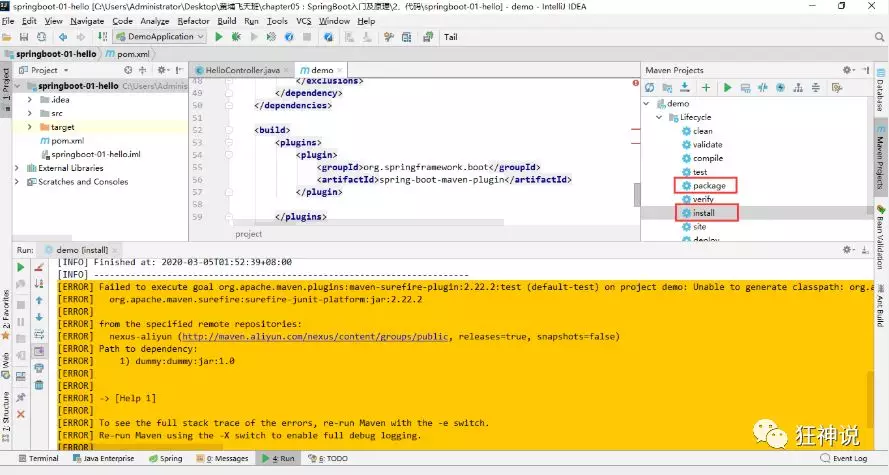

如果遇到以上错误，可以配置打包时 跳过项目运行测试用例

```
<!--
    在工作中,很多情况下我们打包是不想执行测试用例的
    可能是测试用例不完事,或是测试用例会影响数据库数据
    跳过测试用例执
    -->
<plugin>
    <groupId>org.apache.maven.plugins</groupId>
    <artifactId>maven-surefire-plugin</artifactId>
    <configuration>
        <!--跳过项目运行测试用例-->
        <skipTests>true</skipTests>
    </configuration>
</plugin>
```

如果打包成功，则会在target目录下生成一个 jar 包

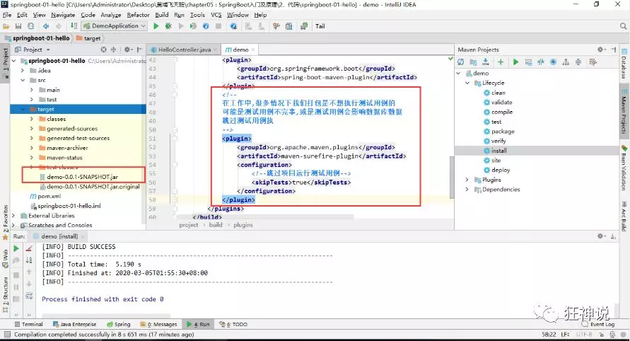

打成了jar包后，就可以在任何地方运行了！OK

**彩蛋**

如何更改启动时显示的字符拼成的字母，SpringBoot呢？也就是 banner 图案；

只需一步：到项目下的 resources 目录下新建一个banner.txt 即可。

图案可以到：https://www.bootschool.net/ascii 这个网站生成，然后拷贝到文件中即可！

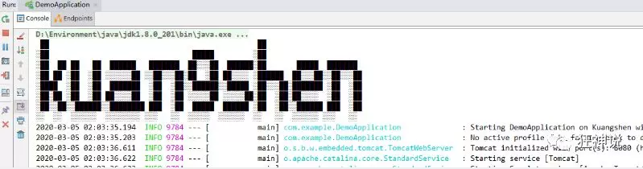

# 2.运行原理

我们之前写的HelloSpringBoot，到底是怎么运行的呢，Maven项目，我们一般从pom.xml文件探究起；

> **pom.xml**

## 父依赖

其中它主要是依赖一个父项目，主要是管理项目的资源过滤及插件！

```
<parent>
    <groupId>org.springframework.boot</groupId>
    <artifactId>spring-boot-starter-parent</artifactId>
    <version>2.2.5.RELEASE</version>
    <relativePath/> <!-- lookup parent from repository -->
</parent>
```

点进去，发现还有一个父依赖

```
<parent>
    <groupId>org.springframework.boot</groupId>
    <artifactId>spring-boot-dependencies</artifactId>
    <version>2.2.5.RELEASE</version>
    <relativePath>../../spring-boot-dependencies</relativePath>
</parent>
```

这里才是真正管理SpringBoot应用里面所有依赖版本的地方，SpringBoot的版本控制中心；

**以后我们导入依赖默认是不需要写版本；但是如果导入的包没有在依赖中管理着就需要手动配置版本了；**

## 启动器 spring-boot-starter

```
<dependency>
    <groupId>org.springframework.boot</groupId>
    <artifactId>spring-boot-starter-web</artifactId>
</dependency>
```

**springboot-boot-starter-xxx**：就是spring-boot的场景启动器

**spring-boot-starter-web**：帮我们导入了web模块正常运行所依赖的组件；

SpringBoot将所有的功能场景都抽取出来，做成一个个的starter （启动器），只需要在项目中引入这些starter即可，所有相关的依赖都会导入进来 ， 我们要用什么功能就导入什么样的场景启动器即可 ；我们未来也可以自己自定义 starter；

> **主启动类**

分析完了 pom.xml 来看看这个启动类

## 默认的主启动类

```
//@SpringBootApplication 来标注一个主程序类
//说明这是一个Spring Boot应用
@SpringBootApplication
public class SpringbootApplication {

   public static void main(String[] args) {
     //以为是启动了一个方法，没想到启动了一个服务
      SpringApplication.run(SpringbootApplication.class, args);
   }

}
```

但是**一个简单的启动类并不简单！**我们来分析一下这些注解都干了什么

## @SpringBootApplication

作用：标注在某个类上说明这个类是SpringBoot的主配置类 ， SpringBoot就应该运行这个类的main方法来启动SpringBoot应用；

进入这个注解：可以看到上面还有很多其他注解！

```
@SpringBootConfiguration
@EnableAutoConfiguration
@ComponentScan(
    excludeFilters = {@Filter(
    type = FilterType.CUSTOM,
    classes = {TypeExcludeFilter.class}
), @Filter(
    type = FilterType.CUSTOM,
    classes = {AutoConfigurationExcludeFilter.class}
)}
)
public @interface SpringBootApplication {
    // ......
}
```

## @CoponentScan

这个注解在Spring中很重要 ,它对应XML配置中的元素。

作用：自动扫描并加载符合条件的组件或者bean ， 将这个bean定义加载到IOC容器中

## @SpringBootConfiguration

作用：SpringBoot的配置类 ，标注在某个类上 ， 表示这是一个SpringBoot的配置类；

我们继续进去这个注解查看

```
// 点进去得到下面的 @Component
@Configuration
public @interface SpringBootConfiguration {}

@Component
public @interface Configuration {}
```

这里的 @Configuration，说明这是一个配置类 ，配置类就是对应Spring的xml 配置文件；

里面的 @Component 这就说明，启动类本身也是Spring中的一个组件而已，负责启动应用！

我们回到 SpringBootApplication 注解中继续看。

## @EnableAutoConfiguration

**@EnableAutoConfiguration ：开启自动配置功能**

以前我们需要自己配置的东西，而现在SpringBoot可以自动帮我们配置 ；@EnableAutoConfiguration告诉SpringBoot开启自动配置功能，这样自动配置才能生效；

点进注解接续查看：

**@AutoConfigurationPackage ：自动配置包**

```
@Import({Registrar.class})
public @interface AutoConfigurationPackage {
}
```

**@import** ：Spring底层注解@import ， 给容器中导入一个组件

Registrar.class 作用：将主启动类的所在包及包下面所有子包里面的所有组件扫描到Spring容器 ；

这个分析完了，退到上一步，继续看

**@Import({AutoConfigurationImportSelector.class}) ：给容器导入组件 ；**

AutoConfigurationImportSelector ：自动配置导入选择器，那么它会导入哪些组件的选择器呢？我们点击去这个类看源码：

1、这个类中有一个这样的方法

```
// 获得候选的配置
protected List<String> getCandidateConfigurations(AnnotationMetadata metadata, AnnotationAttributes attributes) {
    //这里的getSpringFactoriesLoaderFactoryClass（）方法
    //返回的就是我们最开始看的启动自动导入配置文件的注解类；EnableAutoConfiguration
    List<String> configurations = SpringFactoriesLoader.loadFactoryNames(this.getSpringFactoriesLoaderFactoryClass(), this.getBeanClassLoader());
    Assert.notEmpty(configurations, "No auto configuration classes found in META-INF/spring.factories. If you are using a custom packaging, make sure that file is correct.");
    return configurations;
}
```

2、这个方法又调用了  SpringFactoriesLoader 类的静态方法！我们进入SpringFactoriesLoader类loadFactoryNames() 方法

```
public static List<String> loadFactoryNames(Class<?> factoryClass, @Nullable ClassLoader classLoader) {
    String factoryClassName = factoryClass.getName();
    //这里它又调用了 loadSpringFactories 方法
    return (List)loadSpringFactories(classLoader).getOrDefault(factoryClassName, Collections.emptyList());
}
```

3、我们继续点击查看 loadSpringFactories 方法：

```
private static Map<String, List<String>> loadSpringFactories(@Nullable ClassLoader classLoader) {
    //获得classLoader ， 我们返回可以看到这里得到的就是EnableAutoConfiguration标注的类本身
    MultiValueMap<String, String> result = (MultiValueMap)cache.get(classLoader);
    if (result != null) {
        return result;
    } else {
        try {
            //去获取一个资源 "META-INF/spring.factories"
            Enumeration<URL> urls = classLoader != null ? classLoader.getResources("META-INF/spring.factories") : ClassLoader.getSystemResources("META-INF/spring.factories");
            LinkedMultiValueMap result = new LinkedMultiValueMap();

            //将读取到的资源遍历，封装成为一个Properties
            while(urls.hasMoreElements()) {
                URL url = (URL)urls.nextElement();
                UrlResource resource = new UrlResource(url);
                Properties properties = PropertiesLoaderUtils.loadProperties(resource);
                Iterator var6 = properties.entrySet().iterator();

                while(var6.hasNext()) {
                    Entry<?, ?> entry = (Entry)var6.next();
                    String factoryClassName = ((String)entry.getKey()).trim();
                    String[] var9 = StringUtils.commaDelimitedListToStringArray((String)entry.getValue());
                    int var10 = var9.length;

                    for(int var11 = 0; var11 < var10; ++var11) {
                        String factoryName = var9[var11];
                        result.add(factoryClassName, factoryName.trim());
                    }
                }
            }

            cache.put(classLoader, result);
            return result;
        } catch (IOException var13) {
            throw new IllegalArgumentException("Unable to load factories from location [META-INF/spring.factories]", var13);
        }
    }
}
```

4、发现一个多次出现的文件：spring.factories，全局搜索它

## spring.factories

我们根据源头打开spring.factories ， 看到了很多自动配置的文件；这就是自动配置根源所在！

**WebMvcAutoConfiguration**

我们在上面的自动配置类随便找一个打开看看，比如 ：WebMvcAutoConfiguration

可以看到这些一个个的都是JavaConfig配置类，而且都注入了一些Bean，可以找一些自己认识的类，看着熟悉一下！

所以，自动配置真正实现是从classpath中搜寻所有的META-INF/spring.factories配置文件 ，并将其中对应的 org.springframework.boot.autoconfigure. 包下的配置项，通过反射实例化为对应标注了 @Configuration的JavaConfig形式的IOC容器配置类 ， 然后将这些都汇总成为一个实例并加载到IOC容器中。

**结论：**

1. SpringBoot在启动的时候从类路径下的META-INF/spring.factories中获取EnableAutoConfiguration指定的值
2. 将这些值作为自动配置类导入容器 ， 自动配置类就生效 ， 帮我们进行自动配置工作；
3. 整个J2EE的整体解决方案和自动配置都在springboot-autoconfigure的jar包中；
4. 它会给容器中导入非常多的自动配置类 （xxxAutoConfiguration）, 就是给容器中导入这个场景需要的所有组件 ， 并配置好这些组件 ；
5. 有了自动配置类 ， 免去了我们手动编写配置注入功能组件等的工作；

**现在大家应该大概的了解了下，SpringBoot的运行原理，后面我们还会深化一次！**

> **SpringApplication**

## 不简单的方法

我最初以为就是运行了一个main方法，没想到却开启了一个服务；

```
@SpringBootApplication
public class SpringbootApplication {
    public static void main(String[] args) {
        SpringApplication.run(SpringbootApplication.class, args);
    }
}
```

**SpringApplication.run分析**

分析该方法主要分两部分，一部分是SpringApplication的实例化，二是run方法的执行；

## SpringApplication

**这个类主要做了以下四件事情：**

1、推断应用的类型是普通的项目还是Web项目

2、查找并加载所有可用初始化器 ， 设置到initializers属性中

3、找出所有的应用程序监听器，设置到listeners属性中

4、推断并设置main方法的定义类，找到运行的主类

查看构造器：

```
public SpringApplication(ResourceLoader resourceLoader, Class... primarySources) {
    // ......
    this.webApplicationType = WebApplicationType.deduceFromClasspath();
    this.setInitializers(this.getSpringFactoriesInstances();
    this.setListeners(this.getSpringFactoriesInstances(ApplicationListener.class));
    this.mainApplicationClass = this.deduceMainApplicationClass();
}
```

## run方法流程分析

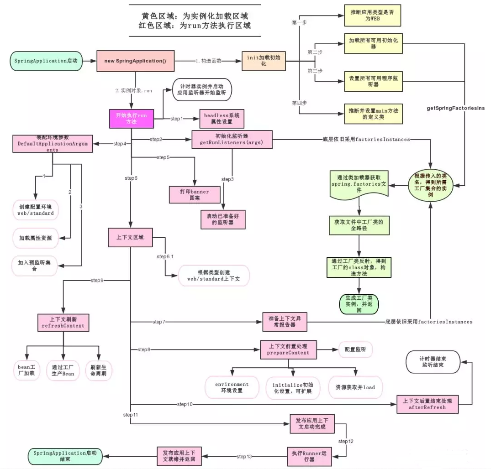

跟着源码和这幅图就可以一探究竟了！

 run方法

```java
public ConfigurableApplicationContext run(String... args) {
    //准备阶段
    StopWatch stopWatch = new StopWatch();
    stopWatch.start();//计数，springboot启动花费的时间
    DefaultBootstrapContext bootstrapContext = this.createBootstrapContext();
    ConfigurableApplicationContext context = null;//声明容器为空
    this.configureHeadlessProperty();
    SpringApplicationRunListeners listeners = this.getRunListeners(args);//获取监听
    listeners.starting(bootstrapContext, this.mainApplicationClass);//开启监听
//开始
    try {
        ApplicationArguments applicationArguments = new DefaultApplicationArguments(args);//设置默认参数
        ConfigurableEnvironment environment = this.prepareEnvironment(listeners, bootstrapContext, applicationArguments);//环境
        this.configureIgnoreBeanInfo(environment);//开始加载配置文件
        Banner printedBanner = this.printBanner(environment);//打印banner符号
        context = this.createApplicationContext();//创建应用的容器
        context.setApplicationStartup(this.applicationStartup);
        this.prepareContext(bootstrapContext, context, environment, listeners, applicationArguments, printedBanner);//准备容器
        
        //最主要的内容，里面是spring中的原码
        this.refreshContext(context);//刷新容器
        
        this.afterRefresh(context, applicationArguments);
        stopWatch.stop();//会打印出springboot启动所花费的时间
        if (this.logStartupInfo) {
            (new StartupInfoLogger(this.mainApplicationClass)).logStarted(this.getApplicationLog(), stopWatch);
        }

        listeners.started(context);//开始启动当前的容器
        this.callRunners(context, applicationArguments);
    } catch (Throwable var10) {
        this.handleRunFailure(context, var10, listeners);
        throw new IllegalStateException(var10);
    }

    try {
        listeners.running(context);//开始启动
        return context;
    } catch (Throwable var9) {
        this.handleRunFailure(context, var9, (SpringApplicationRunListeners)null);
        throw new IllegalStateException(var9);
    }
}
```

## 总结—spring自动装配原理

1. 启动类的注解

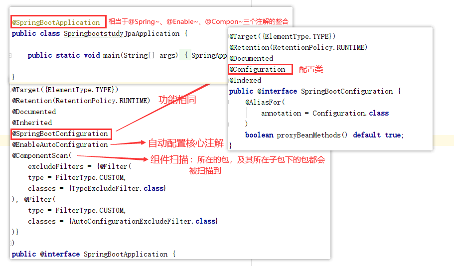

2. 自动配置核心注解——@EnableAutoConfiguration

   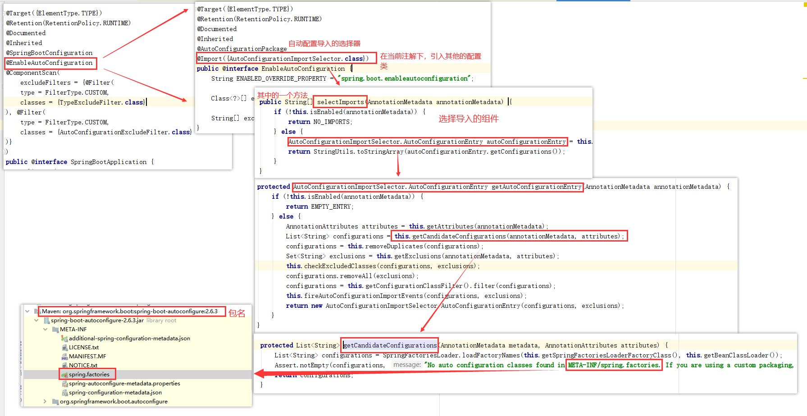

点开spring.factories文件后：

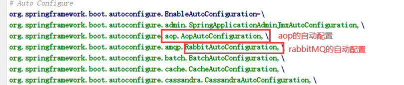

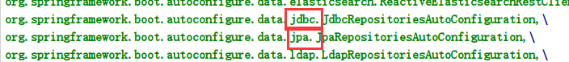

举例：

web

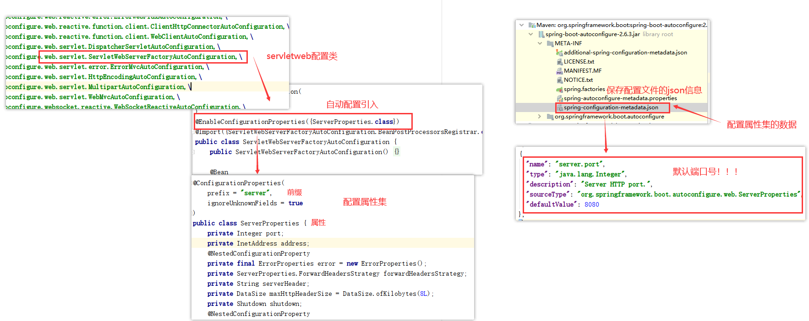

1、SpringBoot启动会加载大量的自动配置类

2、我们看我们需要的功能有没有在SpringBoot默认写好的自动配置类当中；

3、我们再来看这个自动配置类中到底配置了哪些组件；（只要我们要用的组件存在在其中，我们就不需要再手动配置了）

4、给容器中自动配置类添加组件的时候，会从properties类中获取某些属性。我们只需要在配置文件中指定这些属性的值即可；

**xxxxAutoConfigurartion：自动配置类；**给容器中添加组件

**xxxxProperties:封装配置文件中相关属性；**

## 自定义starter

我们分析完毕了源码以及自动装配的过程，我们可以尝试自定义一个启动器来玩玩！

### 说明

启动器模块是一个 空 jar 文件，仅提供辅助性依赖管理，这些依赖可能用于自动装配或者其他类库；

**命名归约：**

官方命名：

- 前缀：spring-boot-starter-xxx
- 比如：spring-boot-starter-web....

自定义命名：

- xxx-spring-boot-starter
- 比如：mybatis-spring-boot-starter

### 编写启动器

1、在IDEA中新建一个空项目 spring-boot-starter-diy

2、新建一个普通Maven模块：kuang-spring-boot-starter

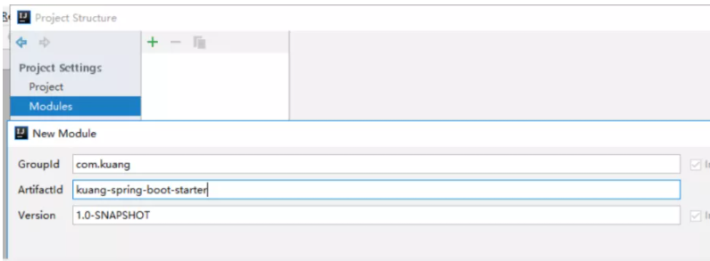

3、新建一个Springboot模块：kuang-spring-boot-starter-autoconfigure

4、点击apply即可，基本结构

5、在我们的 starter 中 导入  autoconfigure 的依赖！

```
<!-- 启动器 -->
<dependencies>
    <!--  引入自动配置模块 -->
    <dependency>
        <groupId>com.kuang</groupId>
        <artifactId>kuang-spring-boot-starter-autoconfigure</artifactId>
        <version>0.0.1-SNAPSHOT</version>
    </dependency>
</dependencies>
```

6、将 autoconfigure 项目下多余的文件都删掉，Pom中只留下一个 starter，这是所有的启动器基本配置！

7、我们编写一个自己的服务

```
package com.kuang;

public class HelloService {

    HelloProperties helloProperties;

    public HelloProperties getHelloProperties() {
        return helloProperties;
    }

    public void setHelloProperties(HelloProperties helloProperties) {
        this.helloProperties = helloProperties;
    }

    public String sayHello(String name){
        return helloProperties.getPrefix() + name + helloProperties.getSuffix();
    }

}
```

8、编写HelloProperties 配置类

```
package com.kuang;

import org.springframework.boot.context.properties.ConfigurationProperties;

// 前缀 kuang.hello
@ConfigurationProperties(prefix = "kuang.hello")
public class HelloProperties {

    private String prefix;
    private String suffix;

    public String getPrefix() {
        return prefix;
    }

    public void setPrefix(String prefix) {
        this.prefix = prefix;
    }

    public String getSuffix() {
        return suffix;
    }

    public void setSuffix(String suffix) {
        this.suffix = suffix;
    }
}
```

9、编写我们的自动配置类并注入bean，测试！

```
package com.kuang;

import org.springframework.beans.factory.annotation.Autowired;
import org.springframework.boot.autoconfigure.condition.ConditionalOnWebApplication;
import org.springframework.boot.context.properties.EnableConfigurationProperties;
import org.springframework.context.annotation.Bean;
import org.springframework.context.annotation.Configuration;

@Configuration
@ConditionalOnWebApplication //web应用生效
@EnableConfigurationProperties(HelloProperties.class)
public class HelloServiceAutoConfiguration {

    @Autowired
    HelloProperties helloProperties;

    @Bean
    public HelloService helloService(){
        HelloService service = new HelloService();
        service.setHelloProperties(helloProperties);
        return service;
    }

}
```

10、在resources编写一个自己的 META-INF\spring.factories

```
# Auto Configure
org.springframework.boot.autoconfigure.EnableAutoConfiguration=\
com.kuang.HelloServiceAutoConfiguration
```

11、编写完成后，可以安装到maven仓库中！

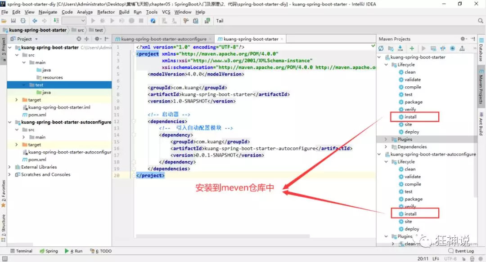

### 测试自定义启动器

1、新建一个SpringBoot 项目

2、导入我们自己写的启动

```
<dependency>
    <groupId>com.kuang</groupId>
    <artifactId>kuang-spring-boot-starter</artifactId>
    <version>1.0-SNAPSHOT</version>
</dependency>
```

3、编写一个 HelloController  进行测试我们自己的写的接口！

```
package com.kuang.controller;

@RestController
public class HelloController {

    @Autowired
    HelloService helloService;

    @RequestMapping("/hello")
    public String hello(){
        return helloService.sayHello("zxc");
    }

}
```

4、编写配置文件 application.properties

```
kuang.hello.prefix="ppp"
kuang.hello.suffix="sss"
```

5、启动项目进行测试，结果成功 !

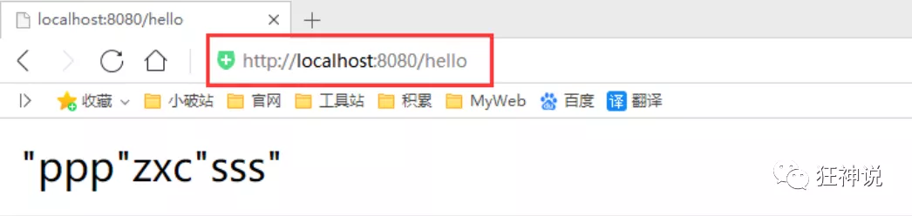

## 了解：@Conditional

了解完自动装配的原理后，我们来关注一个细节问题，**自动配置类必须在一定的条件下才能生效；**

**@Conditional派生注解（Spring注解版原生的@Conditional作用）**

作用：必须是@Conditional指定的条件成立，才给容器中添加组件，配置配里面的所有内容才生效；

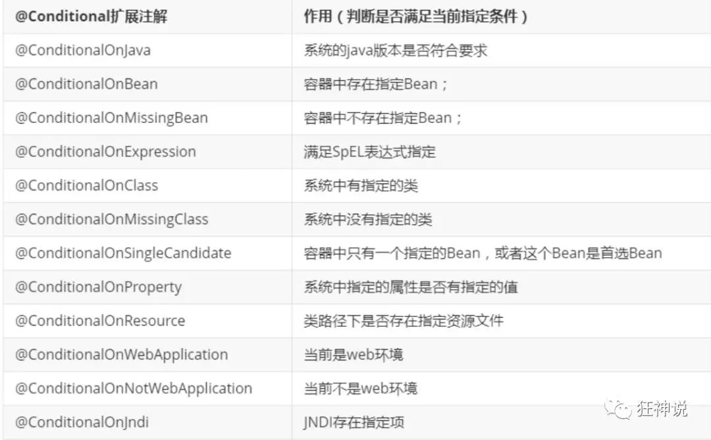

**那么多的自动配置类，必须在一定的条件下才能生效；也就是说，我们加载了这么多的配置类，但不是所有的都生效了。**

我们怎么知道哪些自动配置类生效？

**我们可以通过启用 debug=true属性；来让控制台打印自动配置报告，这样我们就可以很方便的知道哪些自动配置类生效；**

```
#开启springboot的调试类
debug=true
```

**Positive matches:（自动配置类启用的：正匹配）**

**Negative matches:（没有启动，没有匹配成功的自动配置类：负匹配）**

**Unconditional classes: （没有条件的类）**

【演示：查看输出的日志】

掌握吸收理解原理，即可以不变应万变！

# 3.yaml配置注入

## 配置文件

SpringBoot使用一个全局的配置文件 ， 配置文件名称是固定的

- application.properties

- - 语法结构 ：key=value

- application.yml

- - 语法结构 ：key：空格 value

**配置文件的作用 ：**修改SpringBoot自动配置的默认值，因为SpringBoot在底层都给我们自动配置好了；

比如我们可以在配置文件中修改Tomcat 默认启动的端口号！测试一下！

```
server.port=8081
```

## yaml概述

YAML是 "YAML Ain't a Markup Language" （YAML不是一种标记语言）的递归缩写。在开发的这种语言时，YAML 的意思其实是："Yet Another Markup Language"（仍是一种标记语言）

**这种语言以数据****作****为中心，而不是以标记语言为重点！**

以前的配置文件，大多数都是使用xml来配置；比如一个简单的端口配置，我们来对比下yaml和xml

传统xml配置：

```
<server>
    <port>8081<port>
</server>
```

yaml配置

```
server：
  prot: 8080
```

## yaml基础语法

说明：语法要求严格！

1、空格不能省略

2、以缩进来控制层级关系，只要是左边对齐的一列数据都是同一个层级的。

3、属性和值的大小写都是十分敏感的。

**字面量：普通的值  [ 数字，布尔值，字符串  ]**

字面量直接写在后面就可以 ， 字符串默认不用加上双引号或者单引号；

```
k: v
```

注意：

- “ ” 双引号，不会转义字符串里面的特殊字符 ， 特殊字符会作为本身想表示的意思；

  比如 ：name: "kuang \n shen"  输出 ：kuang  换行  shen

- '' 单引号，会转义特殊字符 ， 特殊字符最终会变成和普通字符一样输出

  比如 ：name: ‘kuang \n shen’  输出 ：kuang  \n  shen


**对象、Map（键值对）**

```
#对象、Map格式
k: 
    v1:
    v2:
```

在下一行来写对象的属性和值得关系，注意缩进；比如：

```
student:
    name: qinjiang
    age: 3
```

行内写法

```
student: {name: qinjiang,age: 3}
```

**数组（ List、set ）**

用 - 值表示数组中的一个元素,比如：

```
pets:
 - cat
 - dog
 - pig
```

行内写法

```
pets: [cat,dog,pig]
```

**修改SpringBoot的默认端口号**

配置文件中添加，端口号的参数，就可以切换端口。

```
server:
  port: 8082
```

注入配置文件

yaml文件更强大的地方在于，他可以给我们的实体类直接注入匹配值！

## yaml注入配置文件

1、在springboot项目中的resources目录下新建一个文件 application.yml

2、编写一个实体类 Dog；

```
package com.kuang.springboot.pojo;

@Component  //注册bean到容器中
public class Dog {
    private String name;
    private Integer age;
    
    //有参无参构造、get、set方法、toString()方法  
}
```

3、思考，我们原来是如何给bean注入属性值的！@Value，给狗狗类测试一下：

```
@Component //注册bean
public class Dog {
    @Value("阿黄")
    private String name;
    @Value("18")
    private Integer age;
}
```

4、在SpringBoot的测试类下注入狗狗输出一下；

```
@SpringBootTest
class DemoApplicationTests {

    @Autowired //将狗狗自动注入进来
    Dog dog;

    @Test
    public void contextLoads() {
        System.out.println(dog); //打印看下狗狗对象
    }

}
```

结果成功输出，@Value注入成功，这是我们原来的办法对吧。

5、我们在编写一个复杂一点的实体类：Person 类

```
@Component //注册bean到容器中
public class Person {
    private String name;
    private Integer age;
    private Boolean happy;
    private Date birth;
    private Map<String,Object> maps;
    private List<Object> lists;
    private Dog dog;
    
    //有参无参构造、get、set方法、toString()方法  
}
```

6、我们来使用yaml配置的方式进行注入，大家写的时候注意区别和优势，我们编写一个yaml配置！

```
person:
  name: qinjiang
  age: 3
  happy: false
  birth: 2000/01/01
  maps: {k1: v1,k2: v2}
  lists:
   - code
   - girl
   - music
  dog:
    name: 旺财
    age: 1
```

7、我们刚才已经把person这个对象的所有值都写好了，我们现在来注入到我们的类中！

```
/*
@ConfigurationProperties作用：
将配置文件中配置的每一个属性的值，映射到这个组件中；
告诉SpringBoot将本类中的所有属性和配置文件中相关的配置进行绑定
参数 prefix = “person” : 将配置文件中的person下面的所有属性一一对应
*/
@Component //注册bean
@ConfigurationProperties(prefix = "person")
public class Person {
    private String name;
    private Integer age;
    private Boolean happy;
    private Date birth;
    private Map<String,Object> maps;
    private List<Object> lists;
    private Dog dog;
}
```

8、IDEA 提示，springboot配置注解处理器没有找到，让我们看文档，我们可以查看文档，找到一个依赖！

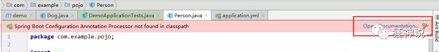

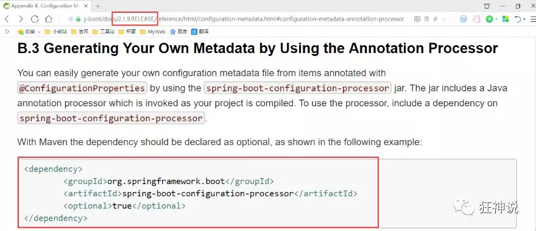

```
<!-- 导入配置文件处理器，配置文件进行绑定就会有提示，需要重启 -->
<dependency>
  <groupId>org.springframework.boot</groupId>
  <artifactId>spring-boot-configuration-processor</artifactId>
  <optional>true</optional>
</dependency>
```

9、确认以上配置都OK之后，我们去测试类中测试一下：

```
@SpringBootTest
class DemoApplicationTests {

    @Autowired
    Person person; //将person自动注入进来

    @Test
    public void contextLoads() {
        System.out.println(person); //打印person信息
    }

}
```

结果：所有值全部注入成功！

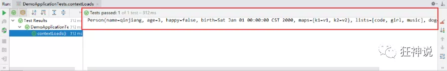

**yaml配置注入到实体类完全OK！**

课堂测试：

1、将配置文件的key 值 和 属性的值设置为不一样，则结果输出为null，注入失败

2、在配置一个person2，然后将 @ConfigurationProperties(prefix = "person2") 指向我们的person2；

## 加载指定的配置文件

**@PropertySource ：**加载指定的配置文件；

**@configurationProperties**：默认从全局配置文件中获取值；

1、我们去在resources目录下新建一个**person.properties**文件

```
name=kuangshen
```

2、然后在我们的代码中指定加载person.properties文件

```
@PropertySource(value = "classpath:person.properties")
@Component //注册bean
public class Person {

    @Value("${name}")
    private String name;

    ......  
}
```

3、再次输出测试一下：指定配置文件绑定成功！

## 配置文件占位符

配置文件还可以编写占位符生成随机数

```
person:
    name: qinjiang${random.uuid} # 随机uuid
    age: ${random.int}  # 随机int
    happy: false
    birth: 2000/01/01
    maps: {k1: v1,k2: v2}
    lists:
      - code
      - girl
      - music
    dog:
      name: ${person.hello:other}_旺财
      age: 1
```

## 回顾properties配置

我们上面采用的yaml方法都是最简单的方式，开发中最常用的；也是springboot所推荐的！那我们来唠唠其他的实现方式，道理都是相同的；写还是那样写；配置文件除了yml还有我们之前常用的properties ， 我们没有讲，我们来唠唠！

【注意】properties配置文件在写中文的时候，会有乱码 ， 我们需要去IDEA中设置编码格式为UTF-8；

settings-->FileEncodings 中配置；

**测试步骤：**

1、新建一个实体类User

```
@Component //注册bean
public class User {
    private String name;
    private int age;
    private String sex;
}
```

2、编辑配置文件 user.properties

```
user1.name=kuangshen
user1.age=18
user1.sex=男
```

3、我们在User类上使用@Value来进行注入！

```
@Component //注册bean
@PropertySource(value = "classpath:user.properties")
public class User {
    //直接使用@value
    @Value("${user.name}") //从配置文件中取值
    private String name;
    @Value("#{9*2}")  // #{SPEL} Spring表达式
    private int age;
    @Value("男")  // 字面量
    private String sex;
}
```

4、Springboot测试

```
@SpringBootTest
class DemoApplicationTests {

    @Autowired
    User user;

    @Test
    public void contextLoads() {
        System.out.println(user);
    }

}
```

结果正常输出：

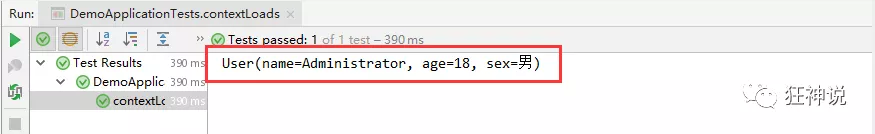

## 对比

@Value这个使用起来并不友好！我们需要为每个属性单独注解赋值，比较麻烦；我们来看个功能对比图

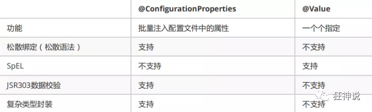

1、@ConfigurationProperties只需要写一次即可 ， @Value则需要每个字段都添加

2、松散绑定：这个什么意思呢? 比如我的yml中写的last-name，这个和lastName是一样的， - 后面跟着的字母默认是大写的。这就是松散绑定。可以测试一下

3、JSR303数据校验 ， 这个就是我们可以在字段是增加一层过滤器验证 ， 可以保证数据的合法性

4、复杂类型封装，yml中可以封装对象 ， 使用value就不支持

**结论：**

配置yml和配置properties都可以获取到值 ， 强烈推荐 yml；

如果我们在某个业务中，只需要获取配置文件中的某个值，可以使用一下 @value；

如果说，我们专门编写了一个JavaBean来和配置文件进行一一映射，就直接@configurationProperties，不要犹豫！

## SpringBoot多环境配置

1.  **profile是用来完成不同环境下，配置动态切换功能的**。
2.  **profile配置方式**
3.  多profile文件方式：提供多个配置文件，每个代表一种环境。
      - application-dev.properties/yml 开发环境
    - application-test.properties/yml 测试环境
    - application-pro.properties/yml 生产环境
4.  yml多文档方式：
      - 在yml中使用  --- 分隔不同配置
5.  **profile激活方式**

- 配置文件： 再配置文件中配置：spring.profiles.active=dev
- 虚拟机参数：在VM options 指定：-Dspring.profiles.active=dev
- 命令行参数：java –jar xxx.jar  --spring.profiles.active=dev

### 项目内部配置文件加载顺序

加载顺序为上文的排列顺序，高优先级配置的属性会生效

- file:./config/：当前项目下的/config目录下
- file:./           ：当前项目的根目录
- classpath:/config/：classpath的/config目录
- classpath:/  ：classpath的根目录

springboot 启动会扫描以下位置的application.properties或者application.yml文件作为Spring boot的默认配置文件：

```
优先级1：项目路径下的config文件夹配置文件
优先级2：项目路径下配置文件
优先级3：资源路径下的config文件夹配置文件
优先级4：资源路径下配置文件
```

优先级由高到底，高优先级的配置会覆盖低优先级的配置；

**SpringBoot会从这四个位置全部加载主配置文件；互补配置；**

我们在最低级的配置文件中设置一个项目访问路径的配置来测试互补问题；

```
#配置项目的访问路径
server.servlet.context-path=地址/网址
```

### 项目外部配置加载顺序

 外部配置文件的使用是为了对能不文件的配合

1.命令行

```cmd
java -jar app.jar --name="Spring“ --server.port=9000
```

2.指定配置文件位置

```cmd
 java -jar myproject.jar --spring.config.location=e://application.properties
```

3.外部不带profile的properties文件

```java
classpath:/config/application.properties
classpath:/application.properties
```


 https://docs.spring.io/spring-boot/docs/current/reference/html/spring-boot-features.html#boot-features-external-config

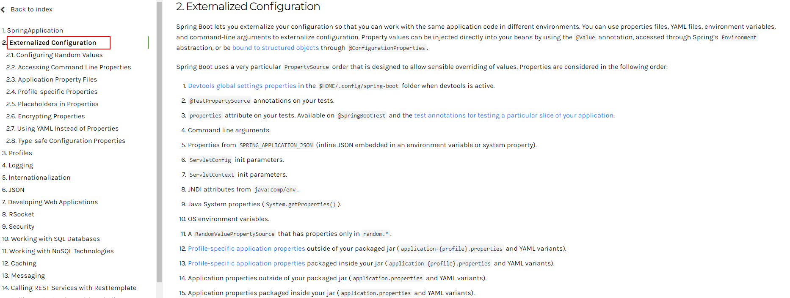

## properties多配置文件

我们在主配置文件编写的时候，文件名可以是 application-{profile}.properties/yml , 用来指定多个环境版本；

**例如：**

application-test.properties 代表测试环境配置

application-dev.properties 代表开发环境配置

但是Springboot并不会直接启动这些配置文件，它**默认使用application.properties主配置文件**；

我们需要通过一个配置来选择需要激活的环境：

```
#比如在配置文件中指定使用dev环境，我们可以通过设置不同的端口号进行测试；
#我们启动SpringBoot，就可以看到已经切换到dev下的配置了；
spring.profiles.active=dev
```

## yaml的多文档块

和properties配置文件中一样，但是使用yml去实现不需要创建多个配置文件，更加方便了 !

```
server:
  port: 8081
#选择要激活那个环境块
spring:
  profiles:
    active: prod

---
server:
  port: 8083
spring:
  profiles: dev #配置环境的名称


---

server:
  port: 8084
spring:
  profiles: prod  #配置环境的名称
```

**注意：如果yml和properties同时都配置了端口，并且没有激活其他环境 ， 默认会使用properties配置文件的！**

# Spring整合

## SpringBoot起步依赖原理分析

- 在spring-boot-starter-parent中定义了各种技术的版本信息，组合了一套最优搭配的技术版本。
- 在各种starter中，定义了完成该功能需要的坐标合集，其中大部分版本信息来自于父工程。
- 我们的工程继承parent，引入starter后，通过依赖传递，就可以简单方便获得需要的jar包，并且不会存在版本冲突等问题。

按住Ctrl点击pom.xml中的spring-boot-starter-parent，跳转到了spring-boot-starter-parent的pom.xml，xml配置如下（只摘抄了部分重点配置）按住Ctrl点击pom.xml中的spring-boot-starter-dependencies，跳转到了spring-boot-starter-dependencies的pom.xml，xml配置如下（只摘抄了部分重点配置）

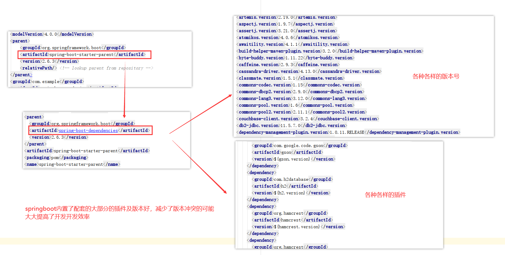

### spring-boot-starter-web

按住Ctrl 点：spring-boot-starter-web，跳到spring-boot-starter-web的pom.xml，xml配置如下（摘抄一部分）：

```xml
<dependency>
    <groupId>org.springframework.boot</groupId>
    <artifactId>spring-boot-starter</artifactId>
    <version>2.3.1.RELEASE</version>
    <scope>compile</scope>
  </dependency>
  <dependency>
    <groupId>org.springframework.boot</groupId>
    <artifactId>spring-boot-starter-json</artifactId>
    <version>2.3.1.RELEASE</version>
    <scope>compile</scope>
  </dependency>
  <dependency>
    <groupId>org.springframework.boot</groupId>
    <artifactId>spring-boot-starter-tomcat</artifactId>
    <version>2.3.1.RELEASE</version>
    <scope>compile</scope>
  </dependency>
  <dependency>
    <groupId>org.springframework</groupId>
    <artifactId>spring-web</artifactId>
    <scope>compile</scope>
  </dependency>
  <dependency>
    <groupId>org.springframework</groupId>
    <artifactId>spring-webmvc</artifactId>
    <scope>compile</scope>
  </dependency>
</dependencies>
```

spring-boot-starter-web就是将web开发要使用的spring-web、spring-webmvc等坐标进行了引入，这样我们的工程只要引入spring-boot-starter-web起步依赖的坐标就可以进行web开发了，同样体现了依赖传递的作用。

## SpringBoot整合Mybatis

### 添加Mybatis的起步依赖 

```
<!--mybatis起步依赖-->
<dependency>
    <groupId>org.mybatis.spring.boot</groupId>
    <artifactId>mybatis-spring-boot-starter</artifactId>
    <version>1.1.1</version>
</dependency>
```

### 添加数据库驱动坐标 

```
<!-- MySQL连接驱动 -->
<dependency>
    <groupId>mysql</groupId>
    <artifactId>mysql-connector-java</artifactId>
</dependency>
```

### 添加数据库连接信息

在application.properties中添加数据量的连接信息

```
#DB Configuration:
spring.datasource.driverClassName=com.mysql.jdbc.Driver
spring.datasource.url=jdbc:mysql://127.0.0.1:3306/test？useUnicode=true&characterEncoding=utf8
spring.datasource.username=root
spring.datasource.password=59852369
```

### 创建user表

在test数据库中创建user表

```
-- ----------------------------
-- Table structure for `user`
-- ----------------------------
DROP TABLE IF EXISTS `user`;
CREATE TABLE `user` (
`id` int(11) NOT NULL AUTO_INCREMENT,
`username` varchar(50) DEFAULT NULL,
`password` varchar(50) DEFAULT NULL,
`name` varchar(50) DEFAULT NULL,
PRIMARY KEY (`id`)
) ENGINE=InnoDB AUTO_INCREMENT=10 DEFAULT CHARSET=utf8;
-- ----------------------------
-- Records of user
-- ----------------------------
INSERT INTO `user` VALUES ('1', 'zhangsan', '123', '张三');
INSERT INTO `user` VALUES ('2', 'lisi', '123', '李四');
```

### 创建实体Bean

```
public class User {
    // 主键
    private Long id;
    // 用户名
    private String username;
    // 密码
    private String password;
    // 姓名
    private String name;
    //此处省略getter和setter方法 .. ..
}
```

###  编写Mapper

```
@Mapper
public interface UserMapper {
	public List<User> queryUserList();
}
```

注意：@Mapper标记该类是一个mybatis的mapper接口，可以被spring boot自动扫描到spring上下文中

### 配置Mapper映射文件

在src\main\resources\mapper路径下加入UserMapper.xml配置文件"

```xml
<?xml version="1.0" encoding="utf-8" ?>
<!DOCTYPE mapper PUBLIC "-//mybatis.org//DTD Mapper 3.0//EN"
"http://mybatis.org/dtd/mybatis-3-mapper.dtd" >
<mapper namespace="com.qf.dao.UserMapper">
    <select id="queryUserList" resultType="user">
    	select * from user
    </select>
</mapper>
```

### 在application.properties中添加mybatis的信息

```
#spring集成Mybatis环境
#pojo别名扫描包
mybatis.type-aliases-package=com.qf.domain
#加载Mybatis映射文件
mybatis.mapper-locations=classpath:mapper/*Mapper.xml
```

### 编写测试Controller

```java
@Controller
public class MapperController {
    
    @Autowired
    private UserMapper userMapper;
   
   @RequestMapping("/queryUser")
    @ResponseBody
    public List<User> queryUser(){
    List<User> users = userMapper.queryUserList();
    return users;
    }
}
```

### 测试

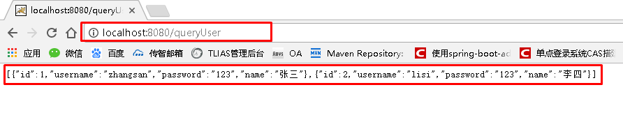

### 事务管理

单个数据源的情况只需要在service层中加入注解@Transactional 就可以实现事务的管理

### 多数据源

在实际的开发中，有可能我们在一个项目中需要去查询两个不同的数据库，那么就需要我们来配置多数据源，如何在springboot中配置多数据源

#### 导入依赖

```
   <dependency>
            <groupId>org.mybatis.spring.boot</groupId>
            <artifactId>mybatis-spring-boot-starter</artifactId>
            <version>1.1.1</version>
        </dependency>

        <dependency>
            <groupId>mysql</groupId>
            <artifactId>mysql-connector-java</artifactId>
        </dependency>
```

####  配置文件

```properties
#DB1 Configuration:
spring.datasource.account.driverClassName=com.mysql.jdbc.Driver
spring.datasource.account.jdbc-url=jdbc:mysql://127.0.0.1:3306/account&useUnicode=true&characterEncoding=utf-8?useSSL=false
spring.datasource.account.username=root
spring.datasource.account.password=59852369

#DB2 Configuration:
spring.datasource.test.driverClassName=com.mysql.jdbc.Driver
spring.datasource.test.jdbc-url=jdbc:mysql://127.0.0.1:3306/test&useUnicode=true&characterEncoding=utf-8?useSSL=false
spring.datasource.test.username=root
spring.datasource.test.password=59852369
```

可以看到，我们在配置文件中配置两个数据库，库名是不同的

#### 修改启动类

```java
@SpringBootApplication(exclude = {DataSourceAutoConfiguration.class})
public class SpringMybatisApplication {
    public static void main(String[] args) {
        SpringApplication.run(SpringMybatisApplication.class);
    }
}
```

其中重点是 **exclude = {DataSourceAutoConfiguration.class}** 表示我们启动的时候排除自动读取数据源 需要添加两个数据库

#### 配置DataSource

```java
@Configuration
public class DataSourceConfig {
    @Bean(name = "ds1")
    @Primary
    @ConfigurationProperties(prefix = "spring.datasource.account") // application.properteis中对应属性的前缀
    public DataSource dataSource1() {
        return DataSourceBuilder.create().build();
    }

    @Bean(name = "ds2")
    @ConfigurationProperties(prefix = "spring.datasource.test") // application.properteis中对应属性的前缀
    public DataSource dataSource2() {
        return DataSourceBuilder.create().build();
    }

}
```

在datasource中配置两个数据库的信息，并且交给springboot来管理

#### 第一个连接配置

```java
@Configuration
@MapperScan(basePackages = {"com.qf.dao.ds1"}, sqlSessionFactoryRef = "sqlSessionFactory1")//配置当前数据源生效的包，根据包分别访问不同的数据源
public class MybatisDbAConfig {
    @Autowired
    @Qualifier("ds1")
    private DataSource ds1;

    @Bean
    @Primary
    public SqlSessionFactory sqlSessionFactory1() throws Exception {
        SqlSessionFactoryBean factoryBean = new SqlSessionFactoryBean();
        factoryBean.setDataSource(ds1); // 使用ds1数据源, 连接account库
        factoryBean.setMapperLocations(new PathMatchingResourcePatternResolver().getResources("classpath:mapper/ds1/*.xml"));
        return factoryBean.getObject();

    }
	
    @Bean
    @Primary
    public SqlSessionTemplate sqlSessionTemplate1() throws Exception {
        SqlSessionTemplate template = new SqlSessionTemplate(sqlSessionFactory1()); // 使用上面配置的Factory
        return template;
    }
	/**
	*配置事务
	*/
    @Bean(name = "Ds1TranscationManager")
    @Primary
    public DataSourceTransactionManager master1TransactionManager(@Qualifier("ds1") DataSource dataSource) {
        return new DataSourceTransactionManager(dataSource);
    }
}
```

#### 第二个连接配置

```java
@Configuration
@MapperScan(basePackages = {"com.qf.dao.ds2"}, sqlSessionFactoryRef = "sqlSessionFactory2")
public class MybatisDbBConfig {
    @Autowired
    @Qualifier("ds2")
    private DataSource ds2;

    @Bean
    public SqlSessionFactory sqlSessionFactory2() throws Exception {
        SqlSessionFactoryBean factoryBean = new SqlSessionFactoryBean();
        factoryBean.setDataSource(ds2);// 使用ds2数据源, 连接test库
        factoryBean.setMapperLocations(new PathMatchingResourcePatternResolver().getResources("classpath:mapper/ds2/*.xml"));
        return factoryBean.getObject();

    }

    @Bean
    public SqlSessionTemplate sqlSessionTemplate2() throws Exception {
        SqlSessionTemplate template = new SqlSessionTemplate(sqlSessionFactory2());
        return template;
    }

    @Bean(name = "Ds2TranscationManager")
    public DataSourceTransactionManager master1TransactionManager(@Qualifier("ds2") DataSource dataSource) {
        return new DataSourceTransactionManager(dataSource);
    }
}
```

#### 整体的项目结构

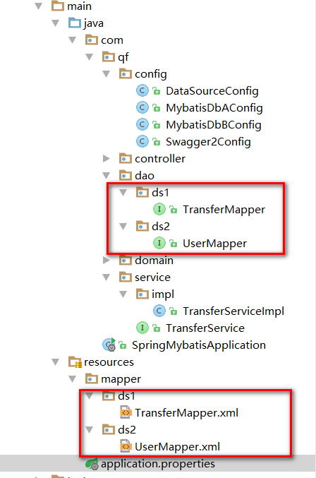

根据不同的包，去连接不同的数据库执行

#### 多数据源下的事务管理

使用多数据源后发现，我们的注解@Transcation注解已经失效了，所以我们需要去改变下

```java
@Transactional(value = "Ds1TranscationManager", rollbackFor = { Exception.class })
```

在需要事务管理的类上加上该注解，标明我们需要使用那个事务来进行管理，**value = "Ds1TranscationManager"** 在我们的第一个连接中已经配置了事务管理，我们只需要告诉spring我们要来使用他就可以进行事务的管理了

## SpringBoot整合Junit

### 添加Juni的起步依赖 

```pom
<!--测试的起步依赖-->
<dependency>
    <groupId>org.springframework.boot</groupId>
    <artifactId>spring-boot-starter-test</artifactId>
    <scope>test</scope>
</dependency>
```

### 编写测试类

```
package com.qf.test;

import com.qf.MySpringBootApplication;
import com.qf.domain.User;
import com.qf.mapper.UserMapper;
import org.junit.Test;
import org.junit.runner.RunWith;
import org.springframework.beans.factory.annotation.Autowired;
import org.springframework.boot.test.context.SpringBootTest;
import org.springframework.test.context.junit4.SpringRunner;
import java.util.List;

@RunWith(SpringRunner.class)
@SpringBootTest(classes = MySpringBootApplication.class)
public class MapperTest {

    @Autowired
    private UserMapper userMapper;
    
    @Test
    public void test() {
    List<User> users = userMapper.queryUserList();
    	System.out.println(users);
	}
}
```

其中，

SpringRunner继承自SpringJUnit4ClassRunner，使用哪一个Spring提供的测试测试引擎都可以

```
public final class SpringRunner extends SpringJUnit4ClassRunner
```

@SpringBootTest的属性指定的是引导类的字节码对象

### 控制台打印信息

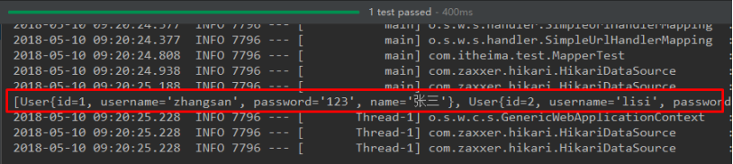

## SpringBoot整合Spring Data JPA

### JPA注解介绍：

1. **@Entity** ：修饰实体类，指明该类将映射到指定的数据表，例如：Customer 类默认的数据表名为 customer

2. **@Table** ：当实体类与映射的数据库表名不同名时需要使用 @Table 注解，该注解与 @Entity 注解并列使用，使用其 **name 属性**指明数据库的表名

3. **@Id** ：标识该属性为**主键**，**一般标注在该属性的 getter 方法上**

4. **@GeneratedValue** ：标注**主键的生成策略**，通过其 **strategy 属性**。通常与 @Id 注解一起使用。默认情况下 JPA 会自动选择一个最适合底层数据库的主键生成策略，MySQL 默认为 AUTO，常用策略有：

   –IDENTITY：采用数据库 ID自增长的方式来自增主键字段，Oracle 不支持这种方式；

   –**AUTO**： **JPA自动选择合适的策略，是默认选项；**

   –SEQUENCE：通过序列产生主键，通过 @SequenceGenerator 注解指定序列名，MySql 不支持这种方式

   –TABLE：通过表产生主键，框架借由表模拟序列产生主键，使用该策略可以使应用更易于数据库移植

5. **@Basic** ：用于**没有任何标注的 getXxx() 方法**，默认即为 @Basic,所以若一个 getter 方法无任何注解，可以使用 @Basic 注解，也可以不使用

6. **@Column** ：当**实体的属性与其映射的数据表的列不同名时使用**，一般用于 getter 方法上。其 **name 属性用来指明此属性在数据表中对应的列名**；**unique 属性**指明**是否为唯一约束**；**nullable 属性**用来**指明是否可以为空，false 为不能为空**；**length 属性**指明**此列的长度**。

7. **@Transient** ：**标注此注解后在创建数据表的时候将会忽略该属性**  Customer 类并没有 info 这个属性，所以数据库中也不应该有 info 这个字段

8. **@Temporal** ：向数据库**映射日期（Date）属性时用来调整映射的精度**。Date 类型的数据有 DATE, TIME, 和 TIMESTAMP 三种精度(即单纯的日期,时间,或者两者兼备).

   Birth 属性应该使用 DATE 类型(生日只具体到日即可，如：2015-10-22)，而 CreateTime 应该使用 TIMESTAMP 类型(创建时间应该具体到秒，如：2017-10-11 22:39:13)

### 添加Spring Data JPA的起步依赖

```
<!-- springBoot JPA的起步依赖 -->
<dependency>
    <groupId>org.springframework.boot</groupId>
    <artifactId>spring-boot-starter-data-jpa</artifactId>
</dependency>
```

### 添加数据库驱动依赖

```
<!-- MySQL连接驱动 -->
<dependency>
    <groupId>mysql</groupId>
    <artifactId>mysql-connector-java</artifactId>
</dependency>
```

### 在application.properties中配置数据库和jpa的相关属性

```
#DB Configuration:
spring.datasource.driverClassName=com.mysql.jdbc.Driver
spring.datasource.url=jdbc:mysql://127.0.0.1:3306/test?
useUnicode=true&characterEncoding=utf8
spring.datasource.username=root
spring.datasource.password=root
#JPA Configuration:
spring.jpa.database=MySQL
spring.jpa.show-sql=true
spring.jpa.generate-ddl=true
spring.jpa.hibernate.ddl-auto=update
spring.jpa.hibernate.naming_strategy=org.hibernate.cfg.ImprovedNamingStrategy
```

### 创建实体配置实体

```
@Entity
public class User {
    // 主键
    @Id
    @GeneratedValue(strategy = GenerationType.IDENTITY)
    private Long id;
    // 用户名
    private String username;
    // 密码
    private String password;
    // 姓名
    private String name;
    //此处省略setter和getter方法... ...
}
```

### 编写UserRepository

```
public interface UserRepository extends JpaRepository<User,Long>{
	public List<User> findAll();
}
```

### 编写测试类

```
@RunWith(SpringRunner.class)
@SpringBootTest(classes=MySpringBootApplication.class)
public class JpaTest {

    @Autowired
    private UserRepository userRepository;
    
    @Test
    public void test(){
    List<User> users = userRepository.findAll();
    	System.out.println(users);
    }
}
```

### 控制台打印信息

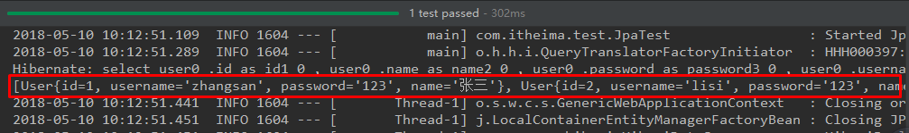

注意：如果是jdk9，执行报错如下：

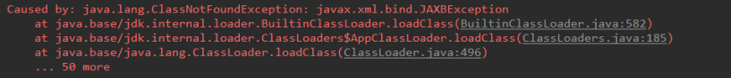

原因：jdk缺少相应的jar

解决方案：手动导入对应的maven坐标，如下：

```
<!--jdk9需要导入如下坐标-->
<dependency>
    <groupId>javax.xml.bind</groupId>
    <artifactId>jaxb-api</artifactId>
    <version>2.3.0</version>
</dependency>
```

## SpringBoot整合Redis

### 添加redis的起步依赖

```
<dependency>
    <groupId>org.springframework.boot</groupId>
    <artifactId>spring-boot-starter-web</artifactId>
</dependency>

<dependency>
    <groupId>org.springframework.boot</groupId>
    <artifactId>spring-boot-starter-test</artifactId>
    <scope>test</scope>
</dependency>

<!-- 配置使用redis启动器 -->
<dependency>
    <groupId>org.springframework.boot</groupId>
    <artifactId>spring-boot-starter-data-redis</artifactId>
</dependency>
```

### 配置redis的连接信息

```
#Redis
spring.redis.host=127.0.0.1
spring.redis.port=6379
```

### 配置RedisConnectionFactory

```java
/**
 * Created by 54110 on 2019-08-01.
 */
@Configuration
@ConditionalOnClass(RedisOperations.class)
@EnableConfigurationProperties(RedisProperties.class)
public class RedisConfig {

    @Bean
    @ConditionalOnMissingBean(name = "redisTemplate")
    public RedisTemplate<Object, Object> redisTemplate(
            RedisConnectionFactory redisConnectionFactory) {
        RedisTemplate<Object, Object> template = new RedisTemplate<>();
        //使用fastjson序列化
        Jackson2JsonRedisSerializer fastJsonRedisSerializer = new Jackson2JsonRedisSerializer (Object.class);
        // value值的序列化采用fastJsonRedisSerializer
        template.setValueSerializer(fastJsonRedisSerializer);
        template.setHashValueSerializer(fastJsonRedisSerializer);
        // key的序列化采用StringRedisSerializer
        template.setKeySerializer(new StringRedisSerializer());
        template.setHashKeySerializer(new StringRedisSerializer());
        template.setConnectionFactory(redisConnectionFactory);
        return template;
    }

    @Bean
    @ConditionalOnMissingBean(StringRedisTemplate.class)
    public StringRedisTemplate stringRedisTemplate(
            RedisConnectionFactory redisConnectionFactory) {
        StringRedisTemplate template = new StringRedisTemplate();
        template.setConnectionFactory(redisConnectionFactory);
        return template;
    }

```

### 配置RedisUtils

```java
package com.qf;

import org.springframework.beans.factory.annotation.Autowired;
import org.springframework.data.redis.core.RedisTemplate;
import org.springframework.data.redis.core.ZSetOperations;
import org.springframework.stereotype.Component;
import org.springframework.util.CollectionUtils;

import java.util.List;
import java.util.Map;
import java.util.Set;
import java.util.concurrent.TimeUnit;

/**
 * Created by 54110 on 2019-08-01.
 */
@Component
public class RedisUtils {
    @Autowired
    private RedisTemplate redisTemplate;

    public void setRedisTemplate(RedisTemplate<String, Object> redisTemplate) {
        this.redisTemplate = redisTemplate;
    }
    //=============================common============================
    /**
     * 指定缓存失效时间
     * @param key 键
     * @param time 时间(秒)
     * @return
     */
    public boolean expire(String key,long time){
        try {
            if(time>0){
                redisTemplate.expire(key, time, TimeUnit.SECONDS);
            }
            return true;
        } catch (Exception e) {
            e.printStackTrace();
            return false;
        }
    }

    /**
     * 根据key 获取过期时间
     * @param key 键 不能为null
     * @return 时间(秒) 返回0代表为永久有效
     */
    public long getExpire(String key){
        return redisTemplate.getExpire(key,TimeUnit.SECONDS);
    }

    /**
     * 判断key是否存在
     * @param key 键
     * @return true 存在 false不存在
     */
    public boolean hasKey(String key){
        try {
            return redisTemplate.hasKey(key);
        } catch (Exception e) {
            e.printStackTrace();
            return false;
        }
    }

    /**
     * 删除缓存
     * @param key 可以传一个值 或多个
     */
    @SuppressWarnings("unchecked")
    public void del(String ... key){
        if(key!=null&&key.length>0){
            if(key.length==1){
                redisTemplate.delete(key[0]);
            }else{
                redisTemplate.delete(CollectionUtils.arrayToList(key));
            }
        }
    }

    //============================String=============================
    /**
     * 普通缓存获取
     * @param key 键
     * @return 值
     */
    public Object get(String key){
        return key==null?null:redisTemplate.opsForValue().get(key);
    }

    /**
     * 普通缓存放入
     * @param key 键
     * @param value 值
     * @return true成功 false失败
     */
    public boolean set(String key,Object value) {
        try {
            redisTemplate.opsForValue().set(key, value);
            return true;
        } catch (Exception e) {
            e.printStackTrace();
            return false;
        }

    }

    /**
     * 普通缓存放入并设置时间
     * @param key 键
     * @param value 值
     * @param time 时间(秒) time要大于0 如果time小于等于0 将设置无限期
     * @return true成功 false 失败
     */
    public boolean set(String key,Object value,long time){
        try {
            if(time>0){
                redisTemplate.opsForValue().set(key, value, time, TimeUnit.SECONDS);
            }else{
                set(key, value);
            }
            return true;
        } catch (Exception e) {
            e.printStackTrace();
            return false;
        }
    }

    /**
     * 递增
     * @param key 键
     * @param by 要增加几(大于0)
     * @return
     */
    public long incr(String key, long delta){
        if(delta<0){
            throw new RuntimeException("递增因子必须大于0");
        }
        return redisTemplate.opsForValue().increment(key, delta);
    }

    /**
     * 递减
     * @param key 键
     * @param by 要减少几(小于0)
     * @return
     */
    public long decr(String key, long delta){
        if(delta<0){
            throw new RuntimeException("递减因子必须大于0");
        }
        return redisTemplate.opsForValue().increment(key, -delta);
    }

    //================================Map=================================
    /**
     * HashGet
     * @param key 键 不能为null
     * @param item 项 不能为null
     * @return 值
     */
    public Object hget(String key,String item){
        return redisTemplate.opsForHash().get(key, item);
    }

    /**
     * 获取hashKey对应的所有键值
     * @param key 键
     * @return 对应的多个键值
     */
    public Map<Object,Object> hmget(String key){
        return redisTemplate.opsForHash().entries(key);
    }

    /**
     * HashSet
     * @param key 键
     * @param map 对应多个键值
     * @return true 成功 false 失败
     */
    public boolean hmset(String key, Map<String,Object> map){
        try {
            redisTemplate.opsForHash().putAll(key, map);
            return true;
        } catch (Exception e) {
            e.printStackTrace();
            return false;
        }
    }

    /**
     * HashSet 并设置时间
     * @param key 键
     * @param map 对应多个键值
     * @param time 时间(秒)
     * @return true成功 false失败
     */
    public boolean hmset(String key, Map<String,Object> map, long time){
        try {
            redisTemplate.opsForHash().putAll(key, map);
            if(time>0){
                expire(key, time);
            }
            return true;
        } catch (Exception e) {
            e.printStackTrace();
            return false;
        }
    }

    /**
     * 向一张hash表中放入数据,如果不存在将创建
     * @param key 键
     * @param item 项
     * @param value 值
     * @return true 成功 false失败
     */
    public boolean hset(String key,String item,Object value) {
        try {
            redisTemplate.opsForHash().put(key, item, value);
            return true;
        } catch (Exception e) {
            e.printStackTrace();
            return false;
        }
    }

    /**
     * 向一张hash表中放入数据,如果不存在将创建
     * @param key 键
     * @param item 项
     * @param value 值
     * @param time 时间(秒)  注意:如果已存在的hash表有时间,这里将会替换原有的时间
     * @return true 成功 false失败
     */
    public boolean hset(String key,String item,Object value,long time) {
        try {
            redisTemplate.opsForHash().put(key, item, value);
            if(time>0){
                expire(key, time);
            }
            return true;
        } catch (Exception e) {
            e.printStackTrace();
            return false;
        }
    }

    /**
     * 删除hash表中的值
     * @param key 键 不能为null
     * @param item 项 可以使多个 不能为null
     */
    public void hdel(String key, Object... item){
        redisTemplate.opsForHash().delete(key,item);
    }

    /**
     * 判断hash表中是否有该项的值
     * @param key 键 不能为null
     * @param item 项 不能为null
     * @return true 存在 false不存在
     */
    public boolean hHasKey(String key, String item){
        return redisTemplate.opsForHash().hasKey(key, item);
    }

    /**
     * hash递增 如果不存在,就会创建一个 并把新增后的值返回
     * @param key 键
     * @param item 项
     * @param by 要增加几(大于0)
     * @return
     */
    public double hincr(String key, String item,double by){
        return redisTemplate.opsForHash().increment(key, item, by);
    }

    /**
     * hash递减
     * @param key 键
     * @param item 项
     * @param by 要减少记(小于0)
     * @return
     */
    public double hdecr(String key, String item,double by){
        return redisTemplate.opsForHash().increment(key, item,-by);
    }

    //============================set=============================
    /**
     * 根据key获取Set中的所有值
     * @param key 键
     * @return
     */
    public Set<Object> sGet(String key){
        try {
            return redisTemplate.opsForSet().members(key);
        } catch (Exception e) {
            e.printStackTrace();
            return null;
        }
    }

    /**
     * 根据value从一个set中查询,是否存在
     * @param key 键
     * @param value 值
     * @return true 存在 false不存在
     */
    public boolean sHasKey(String key,Object value){
        try {
            return redisTemplate.opsForSet().isMember(key, value);
        } catch (Exception e) {
            e.printStackTrace();
            return false;
        }
    }

    /**
     * 将数据放入set缓存
     * @param key 键
     * @param values 值 可以是多个
     * @return 成功个数
     */
    public long sSet(String key, Object...values) {
        try {
            return redisTemplate.opsForSet().add(key, values);
        } catch (Exception e) {
            e.printStackTrace();
            return 0;
        }
    }

    /**
     * 将set数据放入缓存
     * @param key 键
     * @param time 时间(秒)
     * @param values 值 可以是多个
     * @return 成功个数
     */
    public long sSetAndTime(String key,long time,Object...values) {
        try {
            Long count = redisTemplate.opsForSet().add(key, values);
            if(time>0) expire(key, time);
            return count;
        } catch (Exception e) {
            e.printStackTrace();
            return 0;
        }
    }

    /**
     * 获取set缓存的长度
     * @param key 键
     * @return
     */
    public long sGetSetSize(String key){
        try {
            return redisTemplate.opsForSet().size(key);
        } catch (Exception e) {
            e.printStackTrace();
            return 0;
        }
    }

    /**
     * 移除值为value的
     * @param key 键
     * @param values 值 可以是多个
     * @return 移除的个数
     */
    public long setRemove(String key, Object ...values) {
        try {
            Long count = redisTemplate.opsForSet().remove(key, values);
            return count;
        } catch (Exception e) {
            e.printStackTrace();
            return 0;
        }
    }
    //===============================list=================================

    /**
     * 获取list缓存的内容
     * @param key 键
     * @param start 开始
     * @param end 结束  0 到 -1代表所有值
     * @return
     */
    public List<Object> lGet(String key, long start, long end){
        try {
            return redisTemplate.opsForList().range(key, start, end);
        } catch (Exception e) {
            e.printStackTrace();
            return null;
        }
    }

    /**
     * 获取list缓存的长度
     * @param key 键
     * @return
     */
    public long lGetListSize(String key){
        try {
            return redisTemplate.opsForList().size(key);
        } catch (Exception e) {
            e.printStackTrace();
            return 0;
        }
    }

    /**
     * 通过索引 获取list中的值
     * @param key 键
     * @param index 索引  index>=0时， 0 表头，1 第二个元素，依次类推；index<0时，-1，表尾，-2倒数第二个元素，依次类推
     * @return
     */
    public Object lGetIndex(String key,long index){
        try {
            return redisTemplate.opsForList().index(key, index);
        } catch (Exception e) {
            e.printStackTrace();
            return null;
        }
    }

    /**
     * 将list放入缓存
     * @param key 键
     * @param value 值
     * @param time 时间(秒)
     * @return
     */
    public boolean lSet(String key, Object value) {
        try {
            redisTemplate.opsForList().rightPush(key, value);
            return true;
        } catch (Exception e) {
            e.printStackTrace();
            return false;
        }
    }

    /**
     * 将list放入缓存
     * @param key 键
     * @param value 值
     * @param time 时间(秒)
     * @return
     */
    public boolean lSet(String key, Object value, long time) {
        try {
            redisTemplate.opsForList().rightPush(key, value);
            if (time > 0) expire(key, time);
            return true;
        } catch (Exception e) {
            e.printStackTrace();
            return false;
        }
    }

    /**
     * 将list放入缓存
     * @param key 键
     * @param value 值
     * @param time 时间(秒)
     * @return
     */
    public boolean lSet(String key, List<Object> value) {
        try {
            redisTemplate.opsForList().rightPushAll(key, value);
            return true;
        } catch (Exception e) {
            e.printStackTrace();
            return false;
        }
    }

    /**
     * 将list放入缓存
     * @param key 键
     * @param value 值
     * @param time 时间(秒)
     * @return
     */
    public boolean lSet(String key, List<Object> value, long time) {
        try {
            redisTemplate.opsForList().rightPushAll(key, value);
            if (time > 0) expire(key, time);
            return true;
        } catch (Exception e) {
            e.printStackTrace();
            return false;
        }
    }

    /**
     * 根据索引修改list中的某条数据
     * @param key 键
     * @param index 索引
     * @param value 值
     * @return
     */
    public boolean lUpdateIndex(String key, long index,Object value) {
        try {
            redisTemplate.opsForList().set(key, index, value);
            return true;
        } catch (Exception e) {
            e.printStackTrace();
            return false;
        }
    }

    /**
     * 移除N个值为value
     * @param key 键
     * @param count 移除多少个
     * @param value 值
     * @return 移除的个数
     */
    public long lRemove(String key,long count,Object value) {
        try {
            Long remove = redisTemplate.opsForList().remove(key, count, value);
            return remove;
        } catch (Exception e) {
            e.printStackTrace();
            return 0;
        }
    }
    //=========================Zset 有序不重复集合====================================

    /**
     * 添加一个元素, zset与set最大的区别就是每个元素都有一个score，因此有个排序的辅助功能;  zadd
     *
     * @param key
     * @param value
     * @param score
     */
    public boolean ZSet(String key, String value, double score) {

        try {
            redisTemplate.opsForZSet().add(key, value, score);
            return true;
        } catch (Exception e) {
            e.printStackTrace();
            return false;
        }

    }
    /**
     * 删除元素 zrem
     *
     * @param key
     * @param value
     */
    public boolean ZRemove(String key, String value) {
        try {
            redisTemplate.opsForZSet().remove(key, value);
            return true;
        }catch (Exception e){
            e.printStackTrace();
            return false;
        }
    }

    /**
     * score的增加or减少 zincrby
     *
     * @param key
     * @param value
     * @param score
     */
    public Double ZIncrScore(String key, String value, double score) {
        return redisTemplate.opsForZSet().incrementScore(key, value, score);
    }
    /**
     * 查询value对应的score   zscore
     *
     * @param key
     * @param value
     * @return
     */
    public Double ZScore(String key, String value) {
        return  redisTemplate.opsForZSet().score(key, value);
    }

    /**
     * 判断value在zset中的排名  zrank
     *
     * @param key
     * @param value
     * @return
     */
    public Long ZRank(String key, String value) {
        return redisTemplate.opsForZSet().rank(key, value);
    }

    /**
     * 查询集合中指定顺序的值， 0 -1 表示获取全部的集合内容  zrange
     *
     * 返回有序的集合，score小的在前面
     *
     * @param key
     * @param start
     * @param end
     * @return
     */
    public Set<String> ZRange(String key, int start, int end) {
        return redisTemplate.opsForZSet().range(key, start, end);
    }

    /**
     * 查询集合中指定顺序的值和score，0, -1 表示获取全部的集合内容
     *
     * @param key
     * @param start
     * @param end
     * @return
     */
    public Set<ZSetOperations.TypedTuple<String>> ZRangeWithScore(String key, int start, int end) {
        return redisTemplate.opsForZSet().rangeWithScores(key, start, end);
    }

    /**
     * 查询集合中指定顺序的值  zrevrange
     *
     * 返回有序的集合中，score大的在前面
     *
     * @param key
     * @param start
     * @param end
     * @return
     */
    public Set<String> ZRevRange(String key, int start, int end) {
        return redisTemplate.opsForZSet().reverseRange(key, start, end);
    }

    /**
     * 根据score的值，来获取满足条件的集合  zrangebyscore
     *
     * @param key
     * @param min
     * @param max
     * @return
     */
    public Set<String> ZSortRange(String key, int min, int max) {
        return redisTemplate.opsForZSet().rangeByScore(key, min, max);
    }

}


```

### 注入RedisTemplate测试redis操作

```java
package com.qf;

import org.junit.Test;
import org.junit.runner.RunWith;
import org.springframework.beans.factory.annotation.Autowired;
import org.springframework.boot.test.context.SpringBootTest;
import org.springframework.data.redis.core.RedisTemplate;
import org.springframework.test.context.junit4.SpringRunner;

import java.util.ArrayList;
import java.util.List;
import java.util.Map;
import java.util.Set;

/**
 * Created by 54110 on 2019-08-01.
 */
@RunWith(SpringRunner.class)
@SpringBootTest
public class redistTest {
    @Autowired
    private RedisTemplate<String, String> redisTemplate;
    @Autowired
    private RedisUtils redisUtils;

    @Test
    public void testString (){
        redisTemplate.opsForValue().set("username","zhangsan");
        String username = redisTemplate.opsForValue().get("username");
        System.out.println(username);

    }

    //hash 测试
    @Test
    public void testHash(){

        boolean hset = redisUtils.hset("user", "name", "张三");
        if (hset){
            Object user = redisUtils.hasKey("user");
            Map<Object, Object> user1 = redisUtils.hmget("user");
            System.out.println(user1);
        }
    }
    //测试List
    @Test
    public void testList(){
        List list = new ArrayList<>();
        list.add("aaaa");
        list.add("bbbb");
        list.add("cccc");
        list.add("dddd");
        list.add("eeee");
        boolean list1 = redisUtils.lSet("list", list);

        if (list1){
            List<Object> list2 = redisUtils.lGet("list", 0, -1);
            for (Object string:
                    list2) {
                System.out.println(string);
            }
        }
    }
    //测试Set
    @Test
    public void testSet(){
        long set = redisUtils.sSet("set", 123, 123, 123, 123, 456);

        boolean set2 = redisUtils.hasKey("set");
        if (set2){
            Set<Object> set1 = redisUtils.sGet("set");
            for (Object val:
                 set1) {
                System.out.println(val);
            }

        }
    }
    //测试ZSet
    @Test
    public void testZset(){

            redisUtils.ZSet("person","cccc",12);
            redisUtils.ZSet("person","dddd",13);
            redisUtils.ZSet("person","aaaa",10);
            redisUtils.ZSet("person","bbbb",11);


        //scope从小到大排列
        Set<String> person = redisUtils.ZRange("person", 0, -1);

        for (Object val:
                person) {
            System.out.println(val);
        }
        //scope从大到小排列
        Set<String> person1 = redisUtils.ZRevRange("person", 0, -1);
        for (Object val:
                person1) {
            System.out.println(val);
        }
    }
}


```

## SpringBoot整合quartz 定时任务

### 启动类启用定时

```java
@SpringBootApplication
@EnableScheduling //启动类启用定时
public class MySpringBootApplication {
    public static void main(String[] args) {
        SpringApplication.run(MySpringBootApplication.class);
    }
}
```

### 创建定时任务实现类

#### 定时任务1

```
package com.qf.Scheduler;

import org.springframework.scheduling.annotation.Scheduled;
import org.springframework.stereotype.Component;

/**
 * Created by 54110 on 2019-06-04.
 */
@Component
public class SchedulerTask {

    private int count=0;

    @Scheduled(cron="*/6 * * * * ?")
    private void process() {
        System.out.println("this is scheduler task runing  " + (count++));
    }
}
```

#### 定时任务2

```
@Component
public class Scheduler2Task {    
    private static final SimpleDateFormat dateFormat = new SimpleDateFormat("HH:mm:ss");    

    @Scheduled(fixedRate = 6000)    
    public void reportCurrentTime() {
        System.out.println("现在时间：" + dateFormat.format(new Date()));
    }

}
```

#### 结果如下

```
this is scheduler task runing  2
现在时间：13:11:01
this is scheduler task runing  3
现在时间：13:11:07
this is scheduler task runing  4
现在时间：13:11:13
this is scheduler task runing  5
现在时间：13:11:19
this is scheduler task runing  6
现在时间：13:11:25

```

### 参数说明

```
@Scheduled 参数可以接受两种定时的设置，一种是我们常用的cron="*/6 * * * * ?",一种是 fixedRate = 6000，两种都表示每隔六秒打印一下内容。
```

​	fixedRate 说明

- `@Scheduled(fixedRate = 6000)` ：上一次开始执行时间点之后6秒再执行
- `@Scheduled(fixedDelay = 6000)` ：上一次执行完毕时间点之后6秒再执行
- `@Scheduled(initialDelay=1000, fixedRate=6000)` ：第一次延迟1秒后执行，之后按fixedRate的规则每6秒执行一次

## SpringBoot 整合mail邮件

### 添加mail的起步依赖

```
<dependency>
    <groupId>org.springframework.boot</groupId>
    <artifactId>spring-boot-starter-mail</artifactId>
</dependency>
<dependency>
    <groupId>org.springframework.boot</groupId>
    <artifactId>spring-boot-starter-freemarker</artifactId>
</dependency>
```

### 获取QQ邮箱授权码

QQ邮箱->设置->账户->POP3/SMTP服务:开启服务后会获得QQ的授权码.

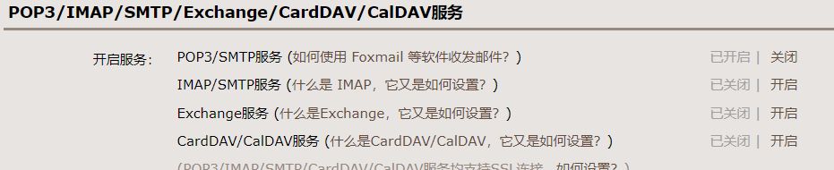

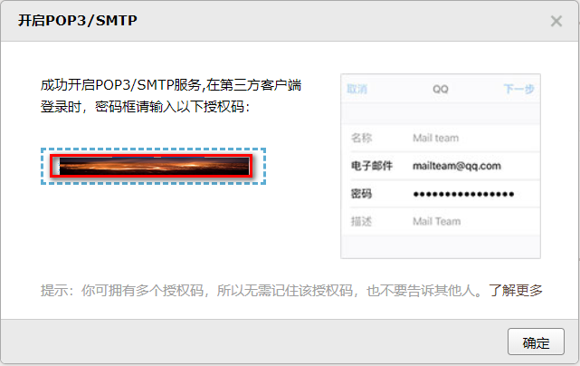

### Mail配置文件

#### qq邮箱的配置

```
# JavaMailSender 邮件发送的配置
spring.mail.host=smtp.qq.com
spring.mail.username=用户qq邮箱
#QQ邮箱的授权码
spring.mail.password=qq邮箱授权码
spring.mail.properties.mail.smtp.auth=true
spring.mail.properties.mail.smtp.starttls.enable=true
spring.mail.properties.mail.smtp.starttls.required=true
spring.mail.default-encoding=UTF-8
```

#### 163邮箱配置

```
spring.mail.host=smtp.163.com
spring.mail.username=用户163邮箱
spring.mail.password=邮箱密码
spring.mail.properties.mail.smtp.auth=true
spring.mail.properties.mail.smtp.starttls.enable=true
spring.mail.properties.mail.smtp.starttls.required=true
spring.mail.default-encoding=UTF-8
```

### 实现过程

#### 配置文件

```
spring:
  #邮箱配置
  mail:
    host: smtp.qq.com
    username: 邮箱
    #QQ邮箱的授权码
    password: 自己申请
    default-encoding: UTF-8
    properties:
      mail:
        smtp:
          auth: true
          starttls:
            enable: true
            required: true
#设置一个邮件发送人
lance:
  mail:
    sender: 目标邮箱
```

#### 实体bean

```
/**
 * @author mhb(mhb)
 * @function  发送邮件-封装接受者信息
 */
@Data
public class MailBean implements Serializable {
    private String recipient;   //邮件接收人
    private String subject; //邮件主题
    private String content; //邮件内容

}
```

#### 发送简单格式的邮件

```
@RunWith(SpringRunner.class)
@SpringBootTest(classes =QuartzSpringBootApplication.class )

	
	public class client {
	
	
    @Value("${spring.mail.username}")
    private String MAIL_SENDER;
    @Autowired
    private JavaMailSender javaMailSender;
    private static final Logger LOG = LoggerFactory.getLogger(Logger.class);
	
	//发送简单的邮件
	@Test
	public void contextLoads() {

		MailBean mailBean = new MailBean();
		mailBean.setContent("测试1111");
		mailBean.setRecipient("miao_18035739505@163.com");
		mailBean.setSubject("测试邮件");

		try {
			SimpleMailMessage simpleMailMessage = new SimpleMailMessage();
			//邮件发送人
			simpleMailMessage.setFrom(MAIL_SENDER);
			//邮件接收人
			simpleMailMessage.setTo(mailBean.getRecipient());
			//邮件主题
			simpleMailMessage.setSubject(mailBean.getSubject());
			//邮件内容
			simpleMailMessage.setText(mailBean.getContent());
			javaMailSender.send(simpleMailMessage);
		} catch (Exception e) {
			LOG.error("邮件发送失败", e.getMessage());
		}

	}
}
```

#### 发送html格式的邮件

```java
//发送html格式的邮件
	@Test
	public void sendHTMLMail() {
		MailBean mailBean = new MailBean();
		mailBean.setContent("测试html格式的邮件");
		mailBean.setRecipient("miao_18035739505@163.com");
		mailBean.setSubject("测试html格式的邮件");
		MimeMessage mimeMailMessage = null;
		try {
			mimeMailMessage = javaMailSender.createMimeMessage();
			MimeMessageHelper mimeMessageHelper = new MimeMessageHelper(mimeMailMessage, true);
			mimeMessageHelper.setFrom(MAIL_SENDER);
			mimeMessageHelper.setTo(mailBean.getRecipient());
			mimeMessageHelper.setSubject(mailBean.getSubject());
			StringBuilder sb = new StringBuilder();
			sb.append("<h1>SpirngBoot测试邮件HTML</h1>")
					.append("\"<p style='color:#F00'>你是真的太棒了！</p>")
					.append("<p style='text-align:right'>右对齐</p>");
			mimeMessageHelper.setText(sb.toString(), true);
			javaMailSender.send(mimeMailMessage);
		} catch (Exception e) {
			LOG.error("邮件发送失败", e.getMessage());
		}
	}
```

#### 发送带附件格式的邮件

```java
   //发送带附件格式的邮件
	@Test
	public void sendAttachmentMail() {
		MailBean mailBean = new MailBean();
		mailBean.setContent("测试附件格式的邮件");
		mailBean.setRecipient("miao_18035739505@163.com");
		mailBean.setSubject("测试附件格式的邮件");
		MimeMessage mimeMailMessage = null;
		try {
			mimeMailMessage = javaMailSender.createMimeMessage();
			MimeMessageHelper mimeMessageHelper = new MimeMessageHelper(mimeMailMessage, true);
			mimeMessageHelper.setFrom(MAIL_SENDER);
			mimeMessageHelper.setTo(mailBean.getRecipient());
			mimeMessageHelper.setSubject(mailBean.getSubject());
			mimeMessageHelper.setText(mailBean.getContent());
			//文件路径
			FileSystemResource file = new FileSystemResource(new File("src/main/resources/static/image/mail.jpg"));
			mimeMessageHelper.addAttachment("mail.jpg", file);

			javaMailSender.send(mimeMailMessage);
		} catch (Exception e) {
			LOG.error("邮件发送失败", e.getMessage());
		}
	}
```

#### 发送基于thymeleaf为模板的邮件

1）pom中导入thymeleaf的包

```
<dependency>
    <groupId>org.springframework.boot</groupId>
    <artifactId>spring-boot-starter-thymeleaf</artifactId>
</dependency>
```

2）在resorces/templates下创建emailTemplate.html

```
<!DOCTYPE html>
<html lang="zh" xmlns:th="http://www.thymeleaf.org">
<head>
    <meta charset="UTF-8"/>
    <title>Title</title>
</head>
<body>
您好,这是验证邮件,请点击下面的链接完成验证,<br/>
<a href="#" th:href="@{http://www.qinfeng.com/{id}(id=${id}) }">激活账号</a>
</body>
</html>
```

3）解析模板并发送

```
 @Test
    public void sendTemplateMail() {
        //创建邮件正文
        Context context = new Context();
        context.setVariable("id", "006");
        String emailContent = templateEngine.process("emailTemplate", context);

        MimeMessage mimeMailMessage = null;
        try {
            mimeMailMessage = javaMailSender.createMimeMessage();
            MimeMessageHelper mimeMessageHelper = new MimeMessageHelper(mimeMailMessage, true);
            mimeMessageHelper.setFrom(MAIL_SENDER);
            mimeMessageHelper.setTo("miao_18035739505@163.com");
            mimeMessageHelper.setSubject("测试thymyleaf");
           /* StringBuilder sb = new StringBuilder();
            sb.append(emailContent);*/

            mimeMessageHelper.setText(emailContent,true);
            javaMailSender.send(mimeMailMessage);
        } catch (Exception e) {
            LOG.error("邮件发送失败", e.getMessage());
        }
    }

```

## SpringBoot 整合 thymeleaf静态化模板

### 添加Thymeleaf依赖

```
<dependency>
    <groupId>org.springframework.boot</groupId>
    <artifactId>spring-boot-starter-thymeleaf</artifactId>
</dependency>
```

Spring Boot默认存放模板页面的路径在`src/main/resources/templates`或者`src/main/view/templates`，这个无论是使用什么模板语言都一样，当然默认路径是可以自定义的，不过一般不推荐这样做。另外Thymeleaf默认的页面文件后缀是`.html`。

### 数据显示

在MVC的开发过程中，我们经常需要通过`Controller`将数据传递到页面中，让页面进行动态展示

#### 显示普通的文本

创建一个Controller对象，在其中进行参数的传递

```
@Controller
@RequestMapping("/thymeleaf")
public class ThymeleafController {

        @RequestMapping(value = "show", method = RequestMethod.GET)
        public String show(Model model){
            model.addAttribute("uid","123456789");
            model.addAttribute("name","Jerry");
            return "show";
        }

}
```

在SpringBoot默认的页面路径下创建show.html文件，内容如下

```
<!DOCTYPE HTML>
<html xmlns:th="http://www.thymeleaf.org">
<head>
    <title>SpringBoot模版渲染</title>
    <meta http-equiv="Content-Type" content="text/html;charset=UTF-8"/>
</head>
<body>
    <p th:text="'用户ID：' + ${uid}"/>
    <p th:text="'用户名称：' + ${name}"/>
</body>
</html>
```

果我们要显示的信息是存在资源文件中的，同样可以在页面中显示，例如资源文件中定义了内容`welcome.msg=你好你好光临！`。可以在页面中将其显示

```
<h2 th:text="#{welcome.msg}"/>
```

另外，在`th:utext`中还能做一些基础的数学运算

```
<p th:text="'数学计算：1+2=' + (1 + 2)"/>
```

#### 显示带有样式的普通文本

如果我们想要传递到的页面的信息，它本身是带有CSS样式的，这个时候如何在页面中将携带的样式信息也显示出来？此时我们的控制器方法这样写。

```
@RequestMapping(value = "showStyle", method = RequestMethod.GET)
public String showStyle(Model model){
    model.addAttribute("uid","123456789");
    model.addAttribute("name","<span style='color:red'>Jerry</span>");
    return "show_style";
}
```

此时页面中需要借助`th:utext`属性进行显示

```
<p th:utext="'用户名称：' + ${name}"/>
```

通过浏览器查看页面源码可以看出`th:utext`和`th:text`的区别是：`th:text`会对`<`和`>`进行转义，而`th:utext`不会转义。

#### 显示对象

我们常常需要将一个bean信息展示在前端页面当中。

1.用于前端展示的VO类

```
public class User implements Serializable {
    private Long uid ;
    private String name ;
    private Integer age ;
    private Date birthday ;
    private Double salary ;
    //省略get/set方法
}
```

2.控制器方法

```
 @RequestMapping(value = "/member_show", method = RequestMethod.GET)
        public String memberShow(Model model) {
            User vo = new User();
            vo.setUid(12345678L);
            vo.setName("尼古拉丁.赵四");
            vo.setAge(59);
            vo.setSalary(1000.00);
            vo.setBirthday(new Date());
            model.addAttribute("member", vo);
            return "member_show";
     }
```

3.页面展示

```
<div>
    <p th:text="'用户编号：' + ${member.uid}"/>
    <p th:text="'用户姓名：' + ${member.name}"/>
    <p th:text="'用户年龄：' + ${member.age}"/>
    <p th:text="'用户工资：' + ${member.salary}"/>
    <p th:text="'出生日期：' + ${member.birthday}"/>
    <p th:text="'出生日期：' + ${#dates.format(member.birthday,'yyyy-MM-dd')}"/>
</div>

<hr/>
<div th:object="${member}">
    <p th:text="'用户编号：' + *{uid}"/>
    <p th:text="'用户姓名：' + *{name}"/>
    <p th:text="'用户年龄：' + *{age}"/>
    <p th:text="'用户工资：' + *{salary}"/>
    <p th:text="'出生日期：' + *{birthday}"/>
    <p th:text="'出生日期：' + *{#dates.format(birthday,'yyyy-MM-dd')}"/>
</div>
```

上面给出了两种展现方式，一种是通过${属性}，另外一种是通过*{属性}。**关于“${属性}”和“{属性}”的区别？**$访问完整信息，而*访问指定对象中的属性内容， 如果访问的只是普通的内容两者没有区别；

#### 数据逻辑处理

所有的页面模版都存在各种基础逻辑处理，例如：判断、循环处理操作。在 Thymeleaf 之中对于逻辑可以使用如下的一些运算符来完成，例如：and、or、关系比较（>、<、>=、<=、==、!=、lt、gt、le、ge、eq、ne）。

通过控制器传递一些属性内容到页面之中：

```
<span th:if="${member.age lt 18}">
未成年人！
</span>
<span th:if="${member.name eq '啊三'}">
欢迎小三来访问！
</span>
```

不满足条件的判断

```
<span th:unless="${member.age gt 18}">
你还不满18岁，不能够看电影！
</span>
```

通过swith进行分支判断

```
<span th:switch="${member.uid}">
<p th:case="100">uid为101的员工来了</p>
<p th:case="99">uid为102的员工来了</p>
<p th:case="*">没有匹配成功的数据！</p>
</span>
```

### 数据遍历

在实际开发过程中常常需要对数据进行遍历展示，一般会将数据封装成list或map传递到页面进行遍历操作。

1.定义控制器类，向页面传递List数据和Map数据

```
    @RequestMapping(value = "/user/map", method = RequestMethod.GET)
    public String map(Model model) {
        Map<String,User> allMembers = new HashMap<String,User>();
        for (int x = 0; x < 10; x++) {
            User vo = new User();
            vo.setUid(101L + x);
            vo.setName("赵四 - " + x);
            vo.setAge(9);
            vo.setSalary(99999.99);
            vo.setBirthday(new Date());
            allMembers.put("mldn-" + x, vo);
        }
        model.addAttribute("allUsers", allMembers);
        return "user_map";
    }

    @RequestMapping(value = "/user/list", method = RequestMethod.GET)
    public String list(Model model) {
        List<User> allMembers = new ArrayList<User>();
        for (int x = 0; x < 10; x++) {
            User vo = new User();
            vo.setUid(101L + x);
            vo.setName("赵四 - " + x);
            vo.setAge(9);
            vo.setSalary(99999.99);
            vo.setBirthday(new Date());
            allMembers.add(vo) ;
        }
        model.addAttribute("allUsers", allMembers);
        return "user_list";
    }

```

```
<body>
<table>
    <tr><td>No.</td><td>KEY</td><td>UID</td><td>姓名</td><td>年龄</td><td>偶数</td><td>奇数</td></tr>
    <tr th:each="memberEntry,memberStat:${allUsers}">
        <td th:text="${memberStat.index + 1}"/>
        <td th:text="${memberEntry.uid}"/>
        <td th:text="${memberEntry.name}"/>
        <td th:text="${memberEntry.age}"/>
        <td th:text="${memberStat.even}"/>
        <td th:text="${memberStat.odd}"/>
    </tr>
</table>
</body>
```

```
<body>
    <table>
        <tr><td>No.</td><td>KEY</td><td>UID</td><td>姓名</td><td>年龄</td><td>偶数</td><td>奇数</td></tr>
        <tr th:each="memberEntry,memberStat:${allUsers}">
            <td th:text="${memberStat.index + 1}"/>
            <td th:text="${memberEntry.key}"/>
            <td th:text="${memberEntry.value.uid}"/>
            <td th:text="${memberEntry.value.name}"/>
            <td th:text="${memberEntry.value.age}"/>
            <td th:text="${memberStat.even}"/>
            <td th:text="${memberStat.odd}"/>
        </tr>
    </table>
</body>
```

1. map类型数据遍历

```
    <body>
        <table>
            <tr><td>No.</td><td>KEY</td><td>UID</td><td>姓名</td><td>年龄</td><td>偶数</td><td>奇数</td></tr>
            <tr th:each="memberEntry,memberStat:${allUsers}">
                <td th:text="${memberStat.index + 1}"/>
                <td th:text="${memberEntry.key}"/>
                <td th:text="${memberEntry.value.uid}"/>
                <td th:text="${memberEntry.value.name}"/>
                <td th:text="${memberEntry.value.age}"/>
                <td th:text="${memberStat.even}"/>
                <td th:text="${memberStat.odd}"/>
            </tr>
        </table>
    </body>
```

2.list类型数据遍历

```
<body>
    <table>
        <tr><td>No.</td><td>UID</td><td>姓名</td><td>年龄</td><td>偶数</td><td>奇数</td></tr>
        <tr th:each="user,memberStat:${allUsers}">
            <td th:text="${memberStat.index + 1}"/>
            <td th:text="${user.uid}"/>
            <td th:text="${user.name}"/>
            <td th:text="${user.age}"/>
            <td th:text="${memberStat.even}"/>
            <td th:text="${memberStat.odd}"/>
        </tr>
    </table>
</body>
```

### 页面引入

我们常常需要在一个页面当中引入另一个页面，例如，公用的导航栏以及页脚页面。thymeleaf中提供了两种方式进行页面引入。

- th:replace
- th:include

1. 新建需要被引入的页面文件，路径为"src/main/view/templates/commons/footer.html"

   ```
   <meta http-equiv="Content-Type" content="text/html;charset=UTF-8"/>
   <footer th:fragment="companyInfo">
       <p>设为首页 ©2018 SpringBoot 使用<span th:text="${projectName}"/>前必读
           意见反馈 京ICP证030173号 </p>
   </footer>
   ```


 可以看到页面当中还存在一个变量projectName，这个变量的值可以在引入页面中通过`th:with="projectName=百度"`传过来。

1. 引入页面中只需要添加如下代码即可

```
<div th:include="@{/commons/footer} :: companyInfo" th:with="projectName=百度"/>
```

