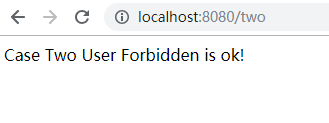

# Shiro基础

## 一、简介

### 1.1什么是Shiro

Apache Shiro（日语“堡垒（Castle）”的意思）是一个强大易用的Java安全框架，
提供了认证、授权、加密和会话管理功能，可为任何应用提供安全保障 - 从命令行应用、移动应用到大型网络及企业应用。

Apache Shiro 是一个强大而灵活的开源安全框架，它干净利落地处理身份认证，授权，企业会话管理和加密。
Apache Shiro 的首要目标是易于使用和理解。安全有时候是很复杂的，甚至是痛苦的，但它没有必要这样。框架应该尽可能掩盖复杂的地方，露出一个干净而直观的 API，来简化开发人员在使他们的应用程序安全上的努力。以下是你可以用 Apache Shiro 所做的事情：

+  验证用户来核实他们的身份
+  对用户执行访问控制，如：
  +  判断用户是否被分配了一个确定的安全角色
  +  判断用户是否被允许做某事
+  在任何环境下使用 Session API，即使没有 Web 或 EJB 容器。
+  在身份验证，访问控制期间或在会话的生命周期，对事件作出反应。
+  聚集一个或多个用户安全数据的数据源，并作为一个单一的复合用户“视图”。
+  启用单点登录（SSO）功能。
+  为没有关联到登录的用户启用"Remember Me"服务

以及更多——全部集成到紧密结合的易于使用的 API 中。

Shiro 视图在所有应用程序环境下实现这些目标——从最简单的命令行应用程序到最大的企业应用，不强制依赖其他第三方框架，容器，或应用服务器。当然，该项目的目标是尽可能地融入到这些环境，但它能够在任何环境下立即可用。

### 1.2 Shiro整体架构图：


1. Subject：主体，可以看到主体可以是任何与应用交互的“用户”。
2. SecurityManager：相当于 SpringMVC 中的 DispatcherServlet 或者 Struts2 中的FilterDispatcher。它是 Shiro 的核心，所有具体的交互都通过 SecurityManager 进行控制。它管理着所有 Subject、且负责进行认证和授权、及会话、缓存的管理。
3. Authenticator：认证器，负责主体认证的，这是一个扩展点，如果用户觉得 Shiro 默认的不好，我们可以自定义实现。其需要认证策略（Authentication Strategy），即什么情况下算用户认证通过了。
4. Authrizer：授权器，或者访问控制器。它用来决定主体是否有权限进行相应的操作，即控制着用户能访问应用中的哪些功能。
5. Realm：可以有1个或多个 Realm，可以认为是安全实体数据源，即用于获取安全实体的。它可以是 JDBC 实现，也可以是 LDAP 实现，或者内存实现等。
6. SessionManager：如果写过 Servlet 就应该知道 Session 的概念，Session 需要有人去管理它的生命周期，这个组件就是 SessionManager。而 Shiro 并不仅仅可以用在 Web 环境，也可以用在如普通的 JavaSE 环境。
7. SessionDAO：DAO 大家都用过，数据访问对象，用于会话的 CRUD。我们可以自定义 SessionDAO 的实现，控制 session 存储的位置。如通过 JDBC 写到数据库或通过 jedis 写入 redis 中。另外 SessionDAO 中可以使用 Cache 进行缓存，以提高性能。
8. CacheManager：缓存管理器。它来管理如用户、角色、权限等的缓存的。因为这些数据基本上很少去改变，放到缓存中后可以提高访问的性能。
9. Cryptography：密码模块，Shiro 提高了一些常见的加密组件用于如密码加密/解密的

## 二、开发环境准备：

pom.xml

```
 <parent>
        <groupId>org.springframework.boot</groupId>
        <artifactId>spring-boot-starter-parent</artifactId>
        <version>2.0.3.RELEASE</version>
        <relativePath/> <!-- lookup parent from repository -->
    </parent>
    <dependencies>
        <dependency>
            <groupId>org.springframework.boot</groupId>
            <artifactId>spring-boot-starter-test</artifactId>
        </dependency>
        <dependency>
            <groupId>org.springframework.boot</groupId>
            <artifactId>spring-boot-starter-web</artifactId>
        </dependency>
        <dependency>
            <groupId>org.apache.shiro</groupId>
            <artifactId>shiro-spring</artifactId>
            <version>1.4.0</version>
        </dependency>


    </dependencies>
```

## 三、最简单的shiro应用案例

在应用程序中启用 Shiro 最先要明白的事情是几乎在 Shiro 中的每个东西都与一个名为 SecurityManager 的主要的/核心的组件有关。对于那些熟悉 Java安全的人来说，这是 Shiro 的 SecurityManager 概念——它不等同于java.lang.SecurityManager。现在了解 Shiro 的 SecurityManager 是应用程序的Shiro

环境的核心及每个应用程序中必须存在一个 SecurityManager 是很有益处的。因此，在我们的教程应用程序中第一件要做的事情就是配置 SecurityManager 实例。

虽然我们能够直接实例化一个 SecurityManager 类，但 Shiro 的 SecurityManager 实现有足够的配置选项及内置组件使得在 Java 源代码做这件事情变得较为痛苦——如果使用一个灵活的基于文本的配置格式来配置 SecurityManager，那么这将是一件很容易的事情。 
为此， Shiro 通过基于文本的 INI 配置文件提供了一个默认的"共性（common denominator） "解决方案。近来人们已经相当厌倦了使用笨重的 XML 文件，且 INI 文件易于阅读，使用简单，依赖性低。 INI 文件能够有效地被用来配置简单的对象图，如 SecurityManager。 

Shiro 的 SecurityManager 实现及所有支持组件都是兼容 JavaBean 的。这允许 Shiro能够与几乎任何配置格式如 XML（Spring， JBoss， Guice 等等）， YAML， JSON， GroovyBuilder markup，以及更多配置被一起配置。 INI 文件只是 Shiro 的“共性”格式，他它允许任何环境下的配置，除非其他选项不可用。 


因此，我们将为这个简单的应用程序使用 INI 文件来配置 Shiro SecurityManager。首先，在 pom.xml 所在的同一目录下创建 src/main/resources 目录。然后在新目录下创建包含以下内容的 shiro.ini 文件：

### 3.1数据初始化

shiro-first.ini

```
[users]
zhangsan=123
lisi=456
```

### 3.2 测试代码：

```
//		根据ini初始化文件创建SecurityManager工厂
		 IniSecurityManagerFactory factory = new IniSecurityManagerFactory(
				"classpath:shiro-first.ini");
//		使用工厂创建securityManager实例
		SecurityManager securityManager = factory.getInstance();
//		使用工具类设置securityManager运行环境
		SecurityUtils.setSecurityManager(securityManager);
//		获取Subject实例
		Subject subject = SecurityUtils.getSubject();
//		封装一个用户信息的令牌（用户名，密码），相当于在controller获得用户的登陆信息并封装
		String username ="zhangsanx";
		AuthenticationToken token = new UsernamePasswordToken(username, "1234");
		try {
//			用户登录
			subject.login(token);
		}catch(UnknownAccountException ue){
			System.out.println("账号："+username+"不存在");
		}catch(IncorrectCredentialsException ice){
			System.out.println("不正确的用户凭证！");
		}catch (AuthenticationException e) {
			e.printStackTrace();
		}
		if(subject.isAuthenticated()){
			System.out.println("zhangsan认证通过！");
		}else{
		  System.out.println("zhangsan认证未通过！");
		}
```

认证执行流程
1、 创建token令牌，token中有用户提交的认证信息即账号和密码
2、 执行subject.login(token)，最终由securityManager通过Authenticator进行认证
3、 Authenticator的实现ModularRealmAuthenticator调用realm从ini配置文件取用户真实的账号和密码，这里使用的是IniRealm（shiro自带）
4、 IniRealm先根据token中的账号去ini中找该账号，如果找不到则给ModularRealmAuthenticator返回null，如果找到则匹配密码，匹配密码成功则认证通过。

- 常见的异常

1. UnknownAccountException
   账号不存在异常如下：
   org.apache.shiro.authc.UnknownAccountException: No account found for user。。。。
2. IncorrectCredentialsException
   当输入密码错误会抛此异常，如下：
   org.apache.shiro.authc.IncorrectCredentialsException: Submitted credentials for token [org.apache.shiro.authc.UsernamePasswordToken - zhangsan, rememberMe=false] did not match the expected credentials.
3. 更多如下：
   DisabledAccountException（帐号被禁用）
   LockedAccountException（帐号被锁定）
   ExcessiveAttemptsException（登录失败次数过多）
   ExpiredCredentialsException（凭证过期）等

## 四、拥有角色权限的shiro应用案例

### 4.1数据初始化 shiro-permission.ini

```
[users]
#用户zhang的密码是123，此用户具有role1和role2两个角色
zhangsan=123,role1,role2
lisi=456,role3
[roles]
#角色role1对资源user拥有create、update权限
role1=user:create,user:update
#角色role2对资源user拥有create、delete权限
role2=user:create,user:delete
#角色role3对资源user拥有create权限
role3=user:create
```

### 4.2测试代码：

```
	 IniSecurityManagerFactory factory = new IniSecurityManagerFactory("classpath:shiro-permission.ini");
		SecurityManager securityManager = factory.getInstance();
		SecurityUtils.setSecurityManager(securityManager);
		Subject subject = SecurityUtils.getSubject();
		String username="zhangsan";
		String password="123";
		AuthenticationToken token = new UsernamePasswordToken(username, password);
		try {
//			用户登陆认证
			subject.login(token);
		} catch (AuthenticationException e) {
			// TODO Auto-generated catch block
			e.printStackTrace();
		}
		boolean bl =subject.hasRole("role1");
		System.out.println(username+"含有role1角色吗？："+bl);
		boolean[] hasRoles = subject.hasRoles(Arrays.asList("role1","role2"));
		System.out.println(username+"含有role1,role2角色吗？："+Arrays.toString(hasRoles));
		boolean permitted1 = subject.isPermitted("user:create");
		System.out.println(username+"是否含有user：create权限："+permitted1);
		boolean permitted2 = subject.isPermittedAll("user:create","user:query");
		System.out.println(username+"是否含有user：create和user:update权限："+permitted2);
```

## 五、自定义安全策略的shiro应用案例：

### 5.1数据初始化shiro-realm.ini

```
[main]
#自定义realm
myRealm=com.qf.shiro.MyRealm
#在securityManager中设置自定义的realm
securityManager.realms=$myRealm
```

### 5.2自定义安全策略：

Myrealm.java

```
public class MyRealm extends AuthorizingRealm{
    public String getName(){
        return this.getClass().getName();
    }
    //负责授权的方法
    @Override
    protected AuthorizationInfo doGetAuthorizationInfo(PrincipalCollection principals) {
        // TODO Auto-generated method stub
        String  username = (String) principals.getPrimaryPrincipal();
        System.out.println(username);
//		根据用户名查询数据库获取该用户权限信息
        List<String> permissions = new ArrayList<String>();
//		构造String的权限集合
        permissions.add("user:create");
        permissions.add("user:update");
//		创建AuthorizationInfo对象，它含有我们查出来的权限信息
        SimpleAuthorizationInfo authorizationInfo = new SimpleAuthorizationInfo();
//		 将构造的权限集合赋予AuthorizationInfo对象
        authorizationInfo.addStringPermissions(permissions);
        authorizationInfo.addRole("role1");
        return authorizationInfo;
    }
    //负责用户认证的方法
    @Override
    protected AuthenticationInfo doGetAuthenticationInfo(AuthenticationToken token) throws AuthenticationException {
        String  username = (String) token.getPrincipal();
        String pwd= "1234";
//		将送来用户账号及根据账号查出的密码（凭证）封装成一个AuthenticationInfo对象，返回
        SimpleAuthenticationInfo authenticationInfo = new SimpleAuthenticationInfo(username, pwd, getName());
        return authenticationInfo;
    }

}


```

### 5.3 测试代码：

```
		 IniSecurityManagerFactory factory = new IniSecurityManagerFactory("classpath:shiro-realm.ini");
		
		SecurityManager securityManager = factory.getInstance();
		SecurityUtils.setSecurityManager(securityManager);
		Subject subject = SecurityUtils.getSubject();
		String username="zhangsan";
		String pwd = "1234";
//		根据登陆提交的用户名密码 封装一个用户凭证信息的对象
		AuthenticationToken token = new UsernamePasswordToken(username, pwd);
		try {
			subject.login(token);
		} catch (AuthenticationException e) {
			
			e.printStackTrace();
		}
		if(subject.isAuthenticated()){
			System.out.println(username+"账户认证通过");
		}else{
			System.out.println(username+"账户认证未通过");
		}
```

### 5.4 测试代码2

```
 IniSecurityManagerFactory factory = new IniSecurityManagerFactory("classpath:shiro-realm.ini");
		SecurityManager securityManager = factory.getInstance();
		SecurityUtils.setSecurityManager(securityManager);
		Subject subject = SecurityUtils.getSubject();
		String username="zhangsan";
		String password="123";
		AuthenticationToken token = new UsernamePasswordToken(username, password);
		try {
//			用户登陆认证
			subject.login(token);
		} catch (AuthenticationException e) {
			
			e.printStackTrace();
		}
		if(subject.isPermitted("user:create1")){
			System.out.println(username+"含有user：create1权限!");
		}else{
			System.out.println(username+"不含有user：create1权限!");
		}
		if(subject.hasRole("role1")){
			System.out.println(username+"含有role1角色的权限!");
		}
```

## 六、自定义安全策略并凭证MD5加密的shiro应用案例

### 6.1数据初始化shiro-realm-md5.ini

```
[main]
#定义凭证匹配器
credentialsMatcher=org.apache.shiro.authc.credential.HashedCredentialsMatcher
#设置散列算法
credentialsMatcher.hashAlgorithmName=md5
#设置散列次数
credentialsMatcher.hashIterations=1

#将凭证匹配器设置到realm
myRealm=com.jeffrey.shiro.MyRealmMd5
myRealm.credentialsMatcher=$credentialsMatcher
securityManager.realms=$myRealm
```

### 6.2自定义安全策略（使用了MD5）

MyRealmMd5.java

```
package com.jeffrey.shiro;

import org.apache.shiro.authc.AuthenticationException;
import org.apache.shiro.authc.AuthenticationInfo;
import org.apache.shiro.authc.AuthenticationToken;
import org.apache.shiro.authc.SimpleAuthenticationInfo;
import org.apache.shiro.authz.AuthorizationInfo;
import org.apache.shiro.realm.AuthorizingRealm;
import org.apache.shiro.subject.PrincipalCollection;
import org.apache.shiro.util.ByteSource;

public class MyRealmMd5 extends AuthorizingRealm{
	public String getName(){
		return this.getClass().getName();
	}
//负责授权的方法
	@Override
	protected AuthorizationInfo doGetAuthorizationInfo(PrincipalCollection arg0) {
		// TODO Auto-generated method stub
		return null;
	}
//负责用户认证的方法
	@Override
	protected AuthenticationInfo doGetAuthenticationInfo(AuthenticationToken token) throws AuthenticationException {
		String  username = (String) token.getPrincipal();

		String salt="zhangsan";
//		获取加盐后的密码
		  String hashedpwd= "4e7bdb88640b376ac6646b8f1ecfb558";
//		将送来用户账号及根据账号查出的密码（凭证）封装成一个AuthenticationInfo对象，返回
		  SimpleAuthenticationInfo authenticationInfo = new SimpleAuthenticationInfo(username, hashedpwd, ByteSource.Util.bytes(salt), getName());
		return authenticationInfo;
	}

}

```

### 6.3测试代码：

```
 IniSecurityManagerFactory factory= new IniSecurityManagerFactory("classpath:shiro-realm-md5.ini");
		SecurityManager securityManager = factory.getInstance();
		SecurityUtils.setSecurityManager(securityManager);
		Subject subject = SecurityUtils.getSubject();
		String username="zhangsan";
		AuthenticationToken token = new UsernamePasswordToken(username, "123");
		try {
			subject.login(token);
		} catch (AuthenticationException e) {
			// TODO Auto-generated catch block
			e.printStackTrace();
		}
		if(subject.isAuthenticated()){
			System.out.println(username+"认证通过！");
		}
```

MD5加密测试类

```
package com.jeffrey;

import org.apache.shiro.crypto.hash.SimpleHash;
import org.apache.shiro.util.ByteSource;

/**
 * Created by jeffrey on 2019/4/8.
 */
public class MD5Salt {

  public static void  main(String[] args){
      String hashAlgorithName = "MD5";//加密算法
      String password = "12345";//登陆时的密码
      int hashIterations =1024;//加密次数
      ByteSource credentialsSalt = ByteSource.Util.bytes("admin2");//使用登录名做为salt
      SimpleHash simpleHash = new SimpleHash(hashAlgorithName, password, credentialsSalt, hashIterations);
      System.out.println("ok "+simpleHash);
    }

}
```

# Springboot 整合shiro实现权限控制

## 一、开发环境:

1、mysql - 5.7
2、navicat(mysql客户端管理工具)
3、idea 2017.2
4、jdk8
5、tomcat 8.5
6、springboot2.1.3
7、mybatis 3
8、shiro1.4
9、maven3.3.9

## 二、数据库设计


## 三、创建springboot项目

### 3.1  添加组件

   添加 web、lombok、thymeleaf、jdbc、mysql、mybatis等模块；

### 3.2 pom.xml

```

	 <parent>
        <groupId>org.springframework.boot</groupId>
        <artifactId>spring-boot-starter-parent</artifactId>
        <version>2.0.1.RELEASE</version>
    </parent>
	<dependencies>
        <dependency>
            <groupId>org.springframework.boot</groupId>
            <artifactId>spring-boot-starter-web</artifactId>
        </dependency>
        <dependency>
            <groupId>org.springframework.boot</groupId>
            <artifactId>spring-boot-starter-data-jpa</artifactId>
        </dependency>

        <dependency>
            <groupId>mysql</groupId>
            <artifactId>mysql-connector-java</artifactId>
        </dependency>

        <dependency>
            <groupId>org.springframework.boot</groupId>
            <artifactId>spring-boot-starter-thymeleaf</artifactId>
        </dependency>
        <dependency>
            <groupId>org.apache.shiro</groupId>
            <artifactId>shiro-spring</artifactId>
            <version>1.4.0</version>
        </dependency>
        <dependency>
            <groupId>org.mybatis.spring.boot</groupId>
            <artifactId>mybatis-spring-boot-starter</artifactId>
            <version>1.1.1</version>
        </dependency>
        <dependency>
            <groupId>org.projectlombok</groupId>
            <artifactId>lombok</artifactId>
            <version>1.16.18</version>
        </dependency>

        <!-- 七牛-->
      <dependency>
            <groupId>com.qiniu</groupId>
            <artifactId>qiniu-java-sdk</artifactId>
            <version>[7.2.0, 7.2.99]</version>
        </dependency>

        <dependency>
            <groupId>com.google.code.gson</groupId>
            <artifactId>gson</artifactId>
            <version>2.8.5</version>
            <scope>compile</scope>
        </dependency>
    </dependencies>

```

### 3.3 创建项目包结构


### 3.4 配置初始化文件application.yml

```
#配置服务端口号
server:
  port: 8080
#配置数据源
spring:
  datasource:
    type: com.alibaba.druid.pool.DruidDataSource
    driver-class-name: com.mysql.jdbc.Driver
    url: jdbc:mysql://localhost:3306/my_shiro?useUnicode=true&characterEncoding=utf-8
    username: root
    password: 59852369
#配置mybatis
mybatis:
  mapper-locations: classpath:mapper/*.xml
  type-aliases-package: com.qf.domain
```
## 四、程序设计开发

### 4.1 实体类开发

​	SysUser.java

```java
package com.qf.domain;

import lombok.Data;

import java.io.Serializable;
import java.util.Date;
/**
 * Created by 54110 on 2019-07-05.
 */
@Data
public class SysUser implements Serializable {
    private  int userId;//用户id
    private String loginName;//登录名
    private String password;//
    private Integer state;
    private Date createTime;
    private String realname;

}

```

SysPermission.java

```java
package com.qf.domain;

import lombok.Data;

import java.io.Serializable;

/**
 * Created by 54110 on 2019-07-05.
 */
@Data
public class SysPermission implements Serializable {
    private int permId;
    private String permName;//权限名称
    private String permUrl;//权限操作地址（路径）
    private String menuName;//菜单名
    private String menuLevel;//菜单级别（11：一级；12：二级。。。）
    private String menuCode;//菜单编码（每级两位数字）
    private int ifValid;
    private String parentCode;
}
```

### 4.2 数据访问层接口开发

  SysUserMapper.java

```java
package com.qf.mapper;

import com.qf.domain.SysUser;
import org.apache.ibatis.annotations.Mapper;

/**
 * Created by 54110 on 2019-07-05.
 */
@Mapper
public interface SysUserMapper {
    public SysUser findUserByUsername(String username);
}

```

SysPermissionMapper

```
package com.qf.mapper;

import com.qf.domain.SysPermission;
import org.apache.ibatis.annotations.Mapper;

import java.util.List;

/**
 * Created by 54110 on 2019-07-05.
 */
@Mapper
public interface SysPermissionMapper {
    //	根据用户登录名查询其所拥有的权限
    public List<SysPermission> findPermissionsByLoginName(String loginName);
}

```

### 4.3 Mybatis映射开发

SysUsersMapper.xml

```
<?xml version="1.0" encoding="UTF-8" ?>
<!DOCTYPE mapper
        PUBLIC "-//mybatis.org//DTD Mapper 3.0//EN"
        "http://mybatis.org/dtd/mybatis-3-mapper.dtd">
<mapper namespace="com.qf.mapper.SysUserMapper">
    <resultMap type="com.qf.domain.SysUser" id="userMap">
        <id column="USERID" property="userid" />
        <result column="LOGIN_NAME" property="loginName" />
        <result column="PASSWORD" property="password" />
        <result column="STATE" property="state" />
        <result column="CREATE_TIME" property="createTime" />
        <result column="REALNAME" property="realname" />
    </resultMap>

    <sql id="tbusers_columns">
        PASSWORD,LOGIN_NAME,CREATE_TIME,REALNAME,STATE
    </sql>
    <!--根据用户名查询对象  -->
    <select id="findUserByUsername" parameterType="string" resultMap="userMap">
        SELECT
        <include refid="tbusers_columns"></include>
        FROM
        TB_SYS_USER US
        WHERE
        US.LOGIN_NAME = #{name}
    </select>
</mapper>
```

SysPermissionMapper.xml

```
<?xml version="1.0" encoding="UTF-8" ?>
<!DOCTYPE mapper
        PUBLIC "-//mybatis.org//DTD Mapper 3.0//EN"
        "http://mybatis.org/dtd/mybatis-3-mapper.dtd">
<mapper namespace="com.qf.mapper.SysPermissionMapper">
    <resultMap type="com.qf.domain.SysPermission" id="permMap">
        <id column="PERMISSION_ID" property="permId" />
        <result column="PER_NAME" property="permName" />
        <result column="MENU_URL" property="permUrl" />
        <result column="MENU_NAME" property="menuName" />
        <result column="MENU_TYPE" property="menuLevel" />
        <result column="MENU_CODE" property="menuCode" />
        <result column="PARENT_CODE" property="parentCode" />
        <result column="IF_ViLID" property="ifValid" />

    </resultMap>

    <select id="findPermissionsByLoginName" parameterType="string" resultMap="permMap">

        SELECT
        p.*
        FROM
        TB_SYS_USER us ,
        TB_USER_ROLE ur,
        TB_SYS_ROLE  r,
        TB_ROLE_PERMISSION rp,
        TB_SYS_PERMISSION p
        WHERE
        us.USERID = ur.USER_ID AND ur.ROLE_ID = r.ROLE_ID
        AND  r.ROLE_ID = rp.ROLE_ID AND rp.PERMISSION_ID = p.PERMISSION_ID
        AND trim(us.LOGIN_NAME) = #{loginName}
        ORDER BY  p.MENU_CODE

    </select>
</mapper>

```

### 4.4 业务层开发

SysUsersServiceImpl.java

```
package com.qf.service.impl;

import com.qf.domain.SysUser;
import com.qf.mapper.SysUserMapper;
import org.springframework.beans.factory.annotation.Autowired;
import org.springframework.stereotype.Service;

/**
 * Created by 54110 on 2019-07-05.
 */
@Service
public class SysUsersServiceImpl {

        @Autowired
        private SysUserMapper userMapper;
        
        public SysUser queryUserByLoginName(String loginName) {

            SysUser tbUsers = userMapper.findUserByUsername(loginName);
            return tbUsers;
        }

}

```

SysPermissionServiceImpl.java

```
package com.qf.service.impl;

import com.qf.domain.SysPermission;
import com.qf.mapper.SysPermissionMapper;
import com.qf.service.SysPermissionService;
import org.springframework.beans.factory.annotation.Autowired;
import org.springframework.stereotype.Service;

import java.util.List;

/**
 * Created by 54110 on 2019-07-05.
 */
@Service
public class SysPermissionServiceImpl implements SysPermissionService {

    @Autowired
    private SysPermissionMapper permMapper;
    @Override
    public List<SysPermission> queryPermissionsByLoginName(String loginName) {
        List<SysPermission> list = permMapper.findPermissionsByLoginName(loginName);
        return list;
    }

}

```

### 4.5 控制层接口开发

UserController.java

```
package com.qf.controller;

import com.qf.service.SysUserService;
import org.apache.shiro.SecurityUtils;
import org.apache.shiro.authc.AuthenticationException;
import org.apache.shiro.authc.UsernamePasswordToken;
import org.apache.shiro.subject.Subject;
import org.springframework.beans.factory.annotation.Autowired;
import org.springframework.stereotype.Controller;
import org.springframework.web.bind.annotation.RequestMapping;
import org.springframework.web.bind.annotation.RequestMethod;
import org.springframework.web.bind.annotation.RequestParam;

import java.util.Map;

/**
 * Created by 54110 on 2019-07-05.
 */
@Controller
public class UserController {

    @Autowired
    private SysUserService userService;
    
    //  登录页(view)展示
    @RequestMapping("/login")
    public String  showlogin(){
        return "login";
    }

    /**
     * 登录处理
     * @param map   用户登录表单数据
     * @return    逻辑视图
     */
    @RequestMapping(value="dealLogin" ,method= RequestMethod.POST)
    public String dealLogin(@RequestParam Map<String,Object> map){
        System.out.println(  map.values().toString());

        try {
            Subject subject = SecurityUtils.getSubject();//从安全管理器中获取主体对象
            UsernamePasswordToken token = new UsernamePasswordToken();//构建令牌对象
            token.setUsername(map.get("name").toString());//赋身份信息
            token.setPassword(map.get("password").toString().toCharArray());//赋凭证信息
            subject.login(token);//使用主体的login方法判定用户的权限
            if(subject.isAuthenticated()){
                //        已登陆
                //        用户信息及权限信息的存储（session|| redis）
                return "main";
            }
        } catch (AuthenticationException e) {
            e.printStackTrace();
            System.out.println("登录失败");
        }
        return "login";
    }
    //    登录且拥有user：
    @RequestMapping("/one")
    public String showCaseOne(){
        return "one";
    }
    @RequestMapping("/two")
    public String showCaseTwo(){
        return "two";
    }
    //  权限不足时，响应的页面
    @RequestMapping("/unauth")
    public String showPermission(){
        return "unauth";
    }
    //    用户注销操作
    @RequestMapping("/logout")
    public String logout(){
        Subject subject = SecurityUtils.getSubject();
        subject.logout();//登出
        return "redirect:login";
    }
}

```

### 4.6 关于shiro的开发

#### a、自定义安全策略

MyShiroRealm.java

```
package com.qf.shiro;

import com.qf.domain.SysPermission;
import com.qf.domain.SysUser;
import com.qf.service.SysPermissionService;
import com.qf.service.SysUserService;
import org.apache.shiro.SecurityUtils;
import org.apache.shiro.authc.AuthenticationException;
import org.apache.shiro.authc.AuthenticationInfo;
import org.apache.shiro.authc.AuthenticationToken;
import org.apache.shiro.authc.SimpleAuthenticationInfo;
import org.apache.shiro.authz.AuthorizationInfo;
import org.apache.shiro.authz.SimpleAuthorizationInfo;
import org.apache.shiro.realm.AuthorizingRealm;
import org.apache.shiro.subject.PrincipalCollection;
import org.apache.shiro.subject.Subject;
import org.springframework.beans.factory.annotation.Autowired;

import java.util.Collection;
import java.util.HashSet;
import java.util.List;

/**
 * Created by 54110 on 2019-07-05.
 */
public class MyShiroRealm extends AuthorizingRealm {
    @Autowired
    private SysUserService sysUserServiceImpl;
    @Autowired
    private SysPermissionService sysPermissionServiceImpl;
    private String username;

    //    系统授权
    @Override
    protected AuthorizationInfo doGetAuthorizationInfo(PrincipalCollection principalCollection) {
        Subject subject = SecurityUtils.getSubject();//获取主体对象
        String  username =(String ) subject.getPrincipal();//获取用户身份信息
        List<SysPermission> permissions = sysPermissionService.queryPermissionsByLoginName(username);//根据用户名获取用户的权限信息
//       权限去重
        Collection<String > perms = new HashSet<>();
        for (SysPermission perm: permissions ) {
            perms.add(perm.getPermName());
        }
        SimpleAuthorizationInfo simpleAuthorizationInfo = new SimpleAuthorizationInfo();
        simpleAuthorizationInfo.addStringPermissions(perms);//授权
        return simpleAuthorizationInfo;
    }
    //用户认证
    @Override
    protected AuthenticationInfo doGetAuthenticationInfo(AuthenticationToken token) throws AuthenticationException {
        String username  = (String) token.getPrincipal();//获取用户信息

        //根据用户信息查询数据库获取后端的用户身份，转交给securityManager判定
        SysUser user1 = sysUserService.queryUserByLoginName(username);//从数据库直接取
        System.out.println(user1);
        if(user1!=null) {
            SimpleAuthenticationInfo simpleAuthenticationInfo = new SimpleAuthenticationInfo(user1.getLoginName(), user1.getPassword(), getName());
            return simpleAuthenticationInfo;
        }
        return null;
    }
}
```

#### b、自定义Shiro配置管理

ShiroConfig.java

```
package com.qf.config;

import com.qf.shiro.MyShiroRealm;
import org.apache.shiro.spring.web.ShiroFilterFactoryBean;
import org.apache.shiro.web.mgt.DefaultWebSecurityManager;
import org.springframework.beans.factory.annotation.Qualifier;
import org.springframework.context.annotation.Bean;
import org.springframework.context.annotation.Configuration;

import java.util.HashMap;
import java.util.Map;

/**
 * Created by 54110 on 2019-07-05.
 */
@Configuration
public class ShiroConfig {

    @Bean
    public ShiroFilterFactoryBean  shiroFilterFactoryBean(@Qualifier("defaultWebSecurityManager") DefaultWebSecurityManager defaultWebSecurityManager){
        ShiroFilterFactoryBean shiroFilterFactoryBean = new ShiroFilterFactoryBean();
        shiroFilterFactoryBean.setSecurityManager(defaultWebSecurityManager);
        Map<String ,String> map  = new HashMap<>();
        map.put("/main","authc");  //必须登录才可访问
        map.put("/one","perms[user_edit]");//只有特定权限（“user_edit”）的用户登录后才可访问
        map.put("/two","perms[user_forbidden]");//只有特定权限（“user_forbidden”）的用户登录后才可访问
        shiroFilterFactoryBean.setLoginUrl("/login");//设置登录页（匿名）
        shiroFilterFactoryBean.setUnauthorizedUrl("/unauth");//权限不足的错误提示页
        shiroFilterFactoryBean.setFilterChainDefinitionMap(map);//装配拦截策略
        return shiroFilterFactoryBean;
    }
    
    //    配置安全管理器（注入Realm对象）
    @Bean(name="defaultWebSecurityManager")
    public DefaultWebSecurityManager defaultWebSecurityManager(@Qualifier("myShiroRealm") MyShiroRealm myShiroRealm){
        DefaultWebSecurityManager defaultWebSecurityManager = new DefaultWebSecurityManager();
        defaultWebSecurityManager.setRealm(myShiroRealm);
        return defaultWebSecurityManager;
    }

    @Bean(name="myShiroRealm")  //使用该注解是的Realm对象由spring容器管理
    public MyShiroRealm  myShiroRealm(){
        MyShiroRealm shiroRealm = new MyShiroRealm();
        return shiroRealm;
    }
}
```

## 五、功能测试

​             地址栏输入http://localhost:8080/login 


​		使用用户：admin密码：admin登录，登录成功后显示页面如下：


​	因为admin2用户拥有case one功能的操作权限，所以当鼠标单击case one链接时，显示如下成功访问页面


因为admin2没有case two访问权限，当用户单击case two时，会显示无权限访问的页面：


当单击logout链接时，系统重回登录页。此时使用用户test2密码test2再次登录。因test2用户无case one权限，有case two权限，所以当test2用户单击case two时会显示如下页面：



## 六、启动shiro注解模式

### 6.1、在ShiroConfig.java中注释掉原先使用路径过滤的权限拦截语句：

```
//只有特定权限（“user_edit”）的用户登录后才可访问
//  map.put("/one","perms[user_edit]");
//只有特定权限（“user_forbidden”）的用户登录后才可访问
//  map.put("/two","perms[user_forbidden]");

```

### 6.2、修改ShiroConfig.java类代码添加如下内容：

```
   /**
     * 开启Shiro注解(如@RequiresRoles,@RequiresPermissions),
     * 需借助SpringAOP扫描使用Shiro注解的类,并在必要时进行安全逻辑验证
     * 配置以下两个bean(DefaultAdvisorAutoProxyCreator和AuthorizationAttributeSourceAdvisor)
     */
    @Bean
    public DefaultAdvisorAutoProxyCreator advisorAutoProxyCreator(){
        DefaultAdvisorAutoProxyCreator advisorAutoProxyCreator = new DefaultAdvisorAutoProxyCreator();
        advisorAutoProxyCreator.setProxyTargetClass(true);
        return advisorAutoProxyCreator;
    }
    /**
     * 开启aop注解支持
     */
    @Bean
    public AuthorizationAttributeSourceAdvisor authorizationAttributeSourceAdvisor(DefaultWebSecurityManager defaultWebSecurityManager) {
        AuthorizationAttributeSourceAdvisor authorizationAttributeSourceAdvisor = new AuthorizationAttributeSourceAdvisor();
        authorizationAttributeSourceAdvisor.setSecurityManager(defaultWebSecurityManager);
        return authorizationAttributeSourceAdvisor;
    }
```

### 6.3、修改UserController.java控制器接口代码：

```
//    登录且拥有user：
    @RequiresPermissions(value={"user_edit"})
    @RequestMapping("/one")
    public String showCaseOne(){
        return "one";
    }
    @RequiresPermissions(value={"user_forbidden"})
    @RequestMapping("/two")
    public String showCaseTwo(){
        return "two";
    }
```

### 6.4、测试

此事有权限访问的也页面正常，但未授权的页面，无法进入提示页，显示如下：


​	后台亦抛出org.apache.shiro.authz.AuthorizationException异常：


### 6.5、此时使用aop拦截抛出的异常

```
package com.jeffrey.exception;

import org.apache.shiro.authz.UnauthorizedException;
import org.springframework.web.bind.annotation.ControllerAdvice;
import org.springframework.web.bind.annotation.ExceptionHandler;

import javax.servlet.http.HttpServletRequest;

/**
 * Created by jeffrey on 2019/4/8.
 */
@ControllerAdvice
public class ExceptionController {

    @ExceptionHandler(value = UnauthorizedException.class)//处理访问方法时权限不足问题
    public String defaultErrorHandler(HttpServletRequest req, Exception e)  {
        return "unauth";
    }
}

```

## 七、shiro密码的MD5加密处理

### 7.1.密码的加密

　　在数据表中存的密码不应该是12345，而应该是12345加密之后的字符串，而且还要求这个加密算法是不可逆的，即由加密后的字符串不能反推回来原来的密码，如果能反推回来那这个加密是没有意义的。

　　著名的加密算法，比如 MD5，SHA1

### 7.2.MD5加密

　　1). 如何把一个字符串加密为MD5

　　2). 使用MD5加密算法后，前台用户输入的字符串如何使用MD5加密，需要做的是将当前的Realm 的credentialsMatcher属性，替换为Md5CredentialsMatcher 由于Md5CredentialsMatcher已经过期了，推荐使用HashedCredentialsMatcher 并设置加密算法即可。

### 7.3.使用MD5加密

　　1). 修改ShiroConfig.java文件添加如下内容；

```
  /**
     * 密码校验规则HashedCredentialsMatcher
     * 这个类是为了对密码进行编码的 ,
     * 防止密码在数据库里明码保存 , 当然在登陆认证的时候 ,
     * 这个类也负责对form里输入的密码进行编码
     * 处理认证匹配处理器：如果自定义需要实现继承HashedCredentialsMatcher
     */
    @Bean("hashedCredentialsMatcher")
    public HashedCredentialsMatcher hashedCredentialsMatcher() {
        HashedCredentialsMatcher credentialsMatcher = new HashedCredentialsMatcher();
        //指定加密方式为MD5
        credentialsMatcher.setHashAlgorithmName("MD5");
        //加密次数
        credentialsMatcher.setHashIterations(1024);
        credentialsMatcher.setStoredCredentialsHexEncoded(true);
        return credentialsMatcher;
    }
    @Bean("myShiroRealm")
    public MyShiroRealm myShiroRealm(@Qualifier("hashedCredentialsMatcher") HashedCredentialsMatcher matcher) {
        MyShiroRealm authRealm = new MyShiroRealm();
        authRealm.setAuthorizationCachingEnabled(false);
        authRealm.setCredentialsMatcher(matcher);
        return authRealm;
    }

```

​	2).修改MyRealm.java的认证逻辑如下：

```
//用户认证
    @Override
    protected AuthenticationInfo doGetAuthenticationInfo(AuthenticationToken token) throws AuthenticationException {
        String username  = (String) token.getPrincipal();//获取用户信息

        SysUser user1 = sysUserService.queryUserByLoginName(username);//从数据库直接取
        System.out.println(user1);
        if(user1!=null) {
            //当前realm对象的name
            String realmName = getName();
            //盐值
            ByteSource credentialsSalt = ByteSource.Util.bytes(username);
            //封装用户信息，构建AuthenticationInfo对象并返回
            AuthenticationInfo authcInfo = new SimpleAuthenticationInfo(username, user1.getPassword(), credentialsSalt, realmName);
            return authcInfo;

        }
        return null;
    }
```

​	3). 通过 new SimpleHash(hashAlgorithmName, credentials, salt, hashIterations); 我们可以得到"12345"经过MD5 加密1024后的字符串；

```
package com.jeffrey;

import org.apache.shiro.crypto.hash.SimpleHash;
import org.apache.shiro.util.ByteSource;

/**
 * Created by jeffrey on 2019/4/8.
 */
public class MD5Salt {

  public static void  main(String[] args){
      String hashAlgorithName = "MD5";//加密算法
      String password = "12345";//登陆时的密码
      int hashIterations =1024;//加密次数
      ByteSource credentialsSalt = ByteSource.Util.bytes("admin2");//使用登录名做为salt
      SimpleHash simpleHash = new SimpleHash(hashAlgorithName, password, credentialsSalt, hashIterations);
      System.out.println("ok "+simpleHash);
    }

}
```

​	使用密文替换数据库中的明文密码；

### 7.4 测试  略。。。。

### 7.5 后记

- 1. 为什么使用 MD5 盐值加密:

  - 　　希望即使两个原始密码相同，加密得到的两个字符串也不同。

- 2. 如何做到:

  - 　　1). 在 doGetAuthenticationInfo 方法返回值创建 SimpleAuthenticationInfo 对象的时候, 需要使用SimpleAuthenticationInfo(principal, credentials, credentialsSalt, realmName) 构造器
  - 　　2). 使用 ByteSource.Util.bytes() 来计算盐值.
  - 　　3). 盐值需要唯一: 一般使用随机字符串或 user id
      - 　　4). 使用 new SimpleHash(hashAlgorithmName, credentials, salt, hashIterations); 来计算盐值加密后的密码的值.

# Shiro与springboot整合

## 1.定义MyRealm

### 	1.MyRealm 实现 AuthorizingRealm ，同时将MyRealm交给SpringIOC 加入@Component

#### 		1.doGetAuthorizationInfo --->权限控制

```
 @Override
    protected AuthorizationInfo doGetAuthorizationInfo(PrincipalCollection principalCollection) {

        String username =(String)principalCollection.getPrimaryPrincipal();
        //5表联查出该用户的权限
        List<TbPermissions> tbPermissionses = 	permissonMapper.findpermissionByUserName(username);
        //进行权限得去重操作
        Set set = new HashSet<>();
        //循环权限List 放置到set中
        for (TbPermissions per:tbPermissionses
             ) {
            set.add(per.getPermissionName());
        }

        SimpleAuthorizationInfo simpleAuthorizationInfo = new SimpleAuthorizationInfo();
        //将去重过去得该用户权限放置在AuthorizationInfo 中
        simpleAuthorizationInfo.addStringPermissions(set);
        return simpleAuthorizationInfo;
    }
```

#### 		2.doGetAuthenticationInfo --->用户认证控制

```
	//用户认证
    @Override
    protected AuthenticationInfo doGetAuthenticationInfo(AuthenticationToken authenticationToken) throws AuthenticationException {
        String username = (String)authenticationToken.getPrincipal();
        //通过登录名去数据库查询密码
        TbUser byUserName = userMapper.findByUserName(username);
        SimpleAuthenticationInfo simpleAuthenticationInfo=null;
        if (byUserName!=null){
            simpleAuthenticationInfo = new SimpleAuthenticationInfo(username, byUserName.getPassword(), getName());
            return simpleAuthenticationInfo;
        }else {
            return simpleAuthenticationInfo;
        }

```

## 2.定义ShiroConfig

### 1.将WebDefaultSecurityManager  进行声明

```
 //配置安全管理对象（注入Realm对象）
    @Bean(name="defaultWebSecurityManager")
    //@Qualifier("myRealm")MyRealm myRealm 从springIoc获取myRealm 对象
    public DefaultWebSecurityManager defaultWebSecurityManager(@Qualifier("myRealm")MyRealm myRealm){
        DefaultWebSecurityManager defaultWebSecurityManager = new DefaultWebSecurityManager();
        //securityManager.realms=$myRealm 跟下方得语句一致
         defaultWebSecurityManager.setRealm(myRealm);

        return defaultWebSecurityManager;
    }
```

### 2. 声明ShiroFilterFactoryBean

```
 	@Bean
 	//从ioc中注入@Qualifier("defaultWebSecurityManager")DefaultWebSecurityManager defaultWebSecurityManager 
    public ShiroFilterFactoryBean shiroFiterFactoryBean(@Qualifier("defaultWebSecurityManager")DefaultWebSecurityManager defaultWebSecurityManager){

        ShiroFilterFactoryBean shiroFilterFactoryBean = new ShiroFilterFactoryBean();
        shiroFilterFactoryBean.setSecurityManager(defaultWebSecurityManager);
        //配置权限
        Map<String,String> map = new HashMap<>();
        //map中放置得 key 请求得路径。 value 用户所拥有得权限。perms[权限]
//        map.put("/user/findAll","perms[user:select]");
//        map.put("/user/update","perms[user:update]");
//        map.put("/user/insert","perms[user:insert]");
//        map.put("/user/delete","perms[user:delete]");
//        //必须登录时才可访问
//        map.put("/user/main","authc");
        //没权限时执行得操作
        shiroFilterFactoryBean.setUnauthorizedUrl("/user/unauth");
        //装配拦截策略
        shiroFilterFactoryBean.setFilterChainDefinitionMap(map);
        return shiroFilterFactoryBean;
    }
```

### 3.如果使用注解控制权限的模式 我们需要在config中加入两个对象的声明

```
*
     * 开启shiro注解模式（@RequiresRoles,@RequiresPermissions）
     * 需接主SpringAop  进行Shiro注解得四奥妙
     *
     *
     * @return
     */
    @Bean //交给spring得ioc
    public DefaultAdvisorAutoProxyCreator defaultAdvisorAutoProxyCreator(){
        DefaultAdvisorAutoProxyCreator defaultAdvisorAutoProxyCreator = new DefaultAdvisorAutoProxyCreator();
       //开启代理类对象
        defaultAdvisorAutoProxyCreator.setProxyTargetClass(true);
        return defaultAdvisorAutoProxyCreator;
    }

    /**
     * 开启Aop得支持
     * @param defaultWebSecurityManager
     * @return
     */
    @Bean
    public AuthorizationAttributeSourceAdvisor uuthorizationAttributeSourceAdvisor(@Qualifier("defaultWebSecurityManager")DefaultWebSecurityManager defaultWebSecurityManager){
        AuthorizationAttributeSourceAdvisor authorizationAttributeSourceAdvisor = new AuthorizationAttributeSourceAdvisor();
        authorizationAttributeSourceAdvisor.setSecurityManager(defaultWebSecurityManager);
        return authorizationAttributeSourceAdvisor;
    }
```

## 3.如何使用

### 1.controller层 使用SecurityUtils.getSubject() 获取到当前登录的主体

#### 1.登录时的后端代码

```
 @RequestMapping("/login")
    public ModelAndView login(TbUser tbUser){
        //用户登录操作。
        //获取到主体。从SecurityUtils中获取主体
        Subject subject = SecurityUtils.getSubject();
        //声明AuthorticationToken
        UsernamePasswordToken token = new UsernamePasswordToken(tbUser.getUserName(), tbUser.getPassword());

        //使用主体来进行登录
            subject.login(token);

        //判断用户是否登录
        ModelAndView modelAndView = new ModelAndView();
        if (subject.isAuthenticated()){
            modelAndView.setViewName("success");
            return modelAndView;
        }else{
            modelAndView.setViewName("login");
            return modelAndView;
        }
    }


```

### 2.登出时

```
    @RequestMapping("/logout")
    public String logOut(){
    //使用securityUtils获取到主体
        Subject subject = SecurityUtils.getSubject();
        //登出操作
        subject.logout();
        return "login";
    }
```

### 3.权限验证时--->不使用注解时

 正常书写controller的接口即可，权限校验在ShiroConfig中的 ShiroFilterFactoryBean 中的map 里进行声明

### 4.权限校验----->使用纯注解时

在controller接口上需加入注解  

```
 @RequiresPermissions(value = {"user:select"})  //所拥有权限 @RequiresPermissions(value = {"权限名称"})
```

#### 注意使用纯注解模式时，我们在ShiroFilterFactoryBean的map失效。不能跳转我们的无权限页面。需使用@ControllerAdvice 控制器增强，@ExcepitonHandle 全局异常捕获，进行无权限的业务逻辑操作。

```
@ControllerAdvice //控制器增强
public class ExceptionController {

    //ExceptionHandler 捕捉什么类型的异常 UnauthorizedException 没权限异常
    @ExceptionHandler(value = UnauthorizedException.class)
    public String unauth(){
		//无权限时的业务逻辑跳转
        return "unauth";
    }
    //IncorrectCredentialsException 密码错误异常
    @ExceptionHandler(value = IncorrectCredentialsException.class)
    public String passwordError(){
       //密码错误时的 业务逻辑
       return "passwordError";
    }

}
```

### 4.MD5加密

在shiroConfig中进行配置

```
    /**
     * MD5加密
     * @return
     */
    @Bean
    public HashedCredentialsMatcher hashedCredentialsMatcher(){
        HashedCredentialsMatcher hashedCredentialsMatcher = new HashedCredentialsMatcher();
        //指定加密方式为MD5
        hashedCredentialsMatcher.setHashAlgorithmName("MD5");
        //加密次数
        hashedCredentialsMatcher.setHashIterations(1024);
        hashedCredentialsMatcher.setStoredCredentialsHexEncoded(true);
        return hashedCredentialsMatcher;
    }
```

同时修改shiroConfig中的MyReaml生成方式

```
@Bean
    public MyRealm myRealm(@Qualifier("hashedCredentialsMatcher") HashedCredentialsMatcher hashedCredentialsMatcher){
        MyRealm myRealm = new MyRealm();
        //关闭shiro中密码验证方式
        myRealm.setAuthenticationCachingEnabled(false);
        //设置自定义的密码加密方式
        myRealm.setCredentialsMatcher(hashedCredentialsMatcher);
        return myRealm;
    }
```

修改MyRealm

```
  @Override
    protected AuthenticationInfo doGetAuthenticationInfo(AuthenticationToken authenticationToken) throws AuthenticationException {
        String principal = (String) authenticationToken.getPrincipal();
        //去数据库查询
        TbUser tbUser = userMapper.findByUserName(principal);

        SimpleAuthenticationInfo simpleAuthenticationInf =null;
       //这里加入了 MD5的salt
       String salt="qianfeng2009";
        if (tbUser!=null){
           return  new SimpleAuthenticationInfo(principal,tbUser.getPassword(), ByteSource.Util.bytes(salt),getName());
        }

        return null;
    }
```

#### 注意：使用MD5加密后，需对数据库的密码进行修改，修改为加密的密文

```
    public static void main(String[] args) {
        String type="MD5";
        String password = "admin";
        int interations=1023;

        ByteSource qianfeng2009 = ByteSource.Util.bytes("qianfeng2009");

        SimpleHash simpleHash = new SimpleHash(type, password, qianfeng2009, interations);
        System.out.println(simpleHash);
    }
```

