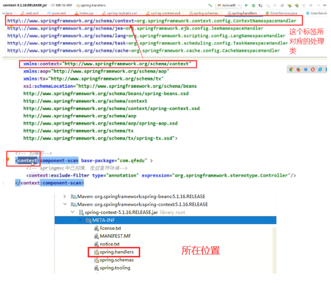

typora-root-url: SpringMVC.assets
typora-copy-images-to: SpringMVC.assets

# 1.SpringMVC

### 1.1 什么是MVC

- MVC是模型(Model)、视图(View)、控制器(Controller)的简写，是一种软件设计规范。
- 是将业务逻辑、数据、显示分离的方法来组织代码。
- MVC主要作用是**降低了视图与业务逻辑间的双向偶合**。
- MVC不是一种设计模式，**MVC是一种架构模式**。当然不同的MVC存在差异。

**Model（模型）：**数据模型，提供要展示的数据，因此包含数据和行为，可以认为是领域模型或JavaBean组件（包含数据和行为），不过现在一般都分离开来：Value Object（数据Dao） 和 服务层（行为Service）。也就是模型提供了模型数据查询和模型数据的状态更新等功能，包括数据和业务。

**View（视图）：**负责进行模型的展示，一般就是我们见到的用户界面，客户想看到的东西。

**Controller（控制器）：**接收用户请求，委托给模型进行处理（状态改变），处理完毕后把返回的模型数据返回给视图，由视图负责展示。也就是说控制器做了个调度员的工作。

**最典型的MVC就是JSP + servlet + javabean的模式。**


### 1.2 Model1时代

- 在web早期的开发中，通常采用的都是Model1。
- Model1中，主要分为两层，视图层和模型层。


Model1优点：架构简单，比较适合小型项目开发；

Model1缺点：JSP职责不单一，职责过重，不便于维护；

### 1.3 Model2时代

Model2把一个项目分成三部分，包括**视图、控制、模型。**


1. 用户发请求
2. Servlet接收请求数据，并调用对应的业务逻辑方法
3. 业务处理完毕，返回更新后的数据给servlet
4. servlet转向到JSP，由JSP来渲染页面
5. 响应给前端更新后的页面

**职责分析：**

**Controller：控制器**

1. 取得表单数据
2. 调用业务逻辑
3. 转向指定的页面

**Model：模型**

1. 业务逻辑
2. 保存数据的状态

**View：视图**

1. 显示页面

Model2这样不仅提高的代码的复用率与项目的扩展性，且大大降低了项目的维护成本。Model 1模式的实现比较简单，适用于快速开发小规模项目，Model1中JSP页面身兼View和Controller两种角色，将控制逻辑和表现逻辑混杂在一起，从而导致代码的重用性非常低，增加了应用的扩展性和维护的难度。Model2消除了Model1的缺点。

### 1.4 回顾Servlet

1. 新建一个Maven工程当做父工程！pom依赖！

   ```xml
   <dependencies>
       
      <dependency>
          <groupId>junit</groupId>
          <artifactId>junit</artifactId>
          <version>4.12</version>
      </dependency>
      <dependency>
          <groupId>org.springframework</groupId>
          <artifactId>spring-webmvc</artifactId>
          <version>5.1.9.RELEASE</version>
      </dependency>
       
      <dependency>
          <groupId>javax.servlet</groupId>
          <artifactId>servlet-api</artifactId>
          <version>2.5</version>
      </dependency>
      <dependency>
          <groupId>javax.servlet.jsp</groupId>
          <artifactId>jsp-api</artifactId>
          <version>2.2</version>
      </dependency>
      <dependency>
          <groupId>javax.servlet</groupId>
          <artifactId>jstl</artifactId>
          <version>1.2</version>
      </dependency>
   </dependencies>
   ```

2. 建立一个Moudle：springmvc-01-servlet ， 添加Web app的支持！

3. 导入servlet 和 jsp 的 jar 依赖

   ```xml
   <dependency>
      <groupId>javax.servlet</groupId>
      <artifactId>servlet-api</artifactId>
      <version>2.5</version>
   </dependency>
   <dependency>
      <groupId>javax.servlet.jsp</groupId>
      <artifactId>jsp-api</artifactId>
      <version>2.2</version>
   </dependency>
   ```

4. 编写一个Servlet类，用来处理用户的请求

   ```java
   public class HelloSerlvet extends HttpServlet {
   
       @Override
       protected void doGet(HttpServletRequest req, HttpServletResponse resp) throws ServletException, IOException {
           //1.获取前段参数
           String method = req.getParameter("method");
           if (method.equals("add")){
               req.getSession().setAttribute("msg","执行了add方法");
           }
           if (method.equals("delete")){
               req.getSession().setAttribute("msg","执行了delete方法");
           }
           //2.调用业务逻辑
   
           //3.请求转发，重定向
           req.getRequestDispatcher("/WEB-INF/jsp/hello.jsp").forward(req,resp);
       }
   
       @Override
       protected void doPost(HttpServletRequest req, HttpServletResponse resp) throws ServletException, IOException {
           doGet(req, resp);
       }
   }
   
   ```

5. 编写Hello.jsp，在WEB-INF目录下新建一个jsp的文件夹，新建hello.jsp

   ```jsp
   <%@ page contentType="text/html;charset=UTF-8" language="java" %>
   <html>
   <head>
       <title>$Title$</title>
   </head>
   <body>
   
   ${msg}
   
   </body>
   </html>
   ```

6. 在web.xml中注册Servlet

   ```xml
   <?xml version="1.0" encoding="UTF-8"?>
   <web-app xmlns="http://xmlns.jcp.org/xml/ns/javaee"
            xmlns:xsi="http://www.w3.org/2001/XMLSchema-instance"
            xsi:schemaLocation="http://xmlns.jcp.org/xml/ns/javaee http://xmlns.jcp.org/xml/ns/javaee/web-app_4_0.xsd"
            version="4.0">
       
       <servlet>
           <servlet-name>HelloServlet</servlet-name>
           <servlet-class>com.SpringMVC.Controller.HelloSerlvet</servlet-class>
       </servlet>
       <servlet-mapping>
           <servlet-name>HelloServlet</servlet-name>
           <url-pattern>/hello</url-pattern>
       </servlet-mapping>
   
       <!--
       &lt;!&ndash;session超时时间&ndash;&gt;
       <session-config>
           <session-timeout>15</session-timeout>
       </session-config>
   
       &lt;!&ndash;欢迎页面&ndash;&gt;
       <welcome-file-list>
           <welcome-file>index.jsp</welcome-file>
       </welcome-file-list>
       -->
   
   </web-app>
   ```

7. 配置Tomcat，并启动测试

8. - http://localhost:8080/hello?method=add
   - http://localhost:8080/hello?method=delete

**MVC框架要做哪些事情**

1. 将url映射到java类或java类的方法 .
2. 封装用户提交的数据 .
3. 处理请求--调用相关的业务处理--封装响应数据 .
4. 将响应的数据进行渲染 . jsp / html 等表示层数据 .

**说明：**

​	常见的服务器端MVC框架有：Struts、Spring MVC、ASP.NET MVC、Zend Framework、JSF；常见前端MVC框架：vue、angularjs、react、backbone；由MVC演化出了另外一些模式如：MVP、MVVM 等等....

# 2什么是SpringMVC

## 2.1 概述


Spring MVC是Spring Framework的一部分，是基于Java实现MVC的轻量级Web框架。

查看官方文档：https://docs.spring.io/spring/docs/5.2.0.RELEASE/spring-framework-reference/web.html#spring-web

**我们为什么要学习SpringMVC呢?**

 Spring MVC的特点：

1. 轻量级，简单易学
2. 高效 , 基于请求响应的MVC框架
3. 与Spring兼容性好，无缝结合
4. 约定优于配置
5. 功能强大：RESTful、数据验证、格式化、本地化、主题等
6. 简洁灵活

Spring的web框架围绕**DispatcherServlet** [ 调度Servlet ] 设计。

DispatcherServlet的作用是将请求分发到不同的处理器。从Spring 2.5开始，使用Java 5或者以上版本的用户可以采用基于注解形式进行开发，十分简洁；

正因为SpringMVC好 , 简单 , 便捷 , 易学 , 天生和Spring无缝集成(使用SpringIoC和Aop) , 使用约定优于配置 . 能够进行简单的junit测试 . 支持Restful风格 .异常处理 , 本地化 , 国际化 , 数据验证 , 类型转换 , 拦截器 等等......所以我们要学习 .

**最重要的一点还是用的人多 , 使用的公司多 .** 

## 2.2 中心控制器

​	Spring的web框架围绕DispatcherServlet设计。DispatcherServlet的作用是将请求分发到不同的处理器。从Spring 2.5开始，使用Java 5或者以上版本的用户可以采用基于注解的controller声明方式。

​	Spring MVC框架像许多其他MVC框架一样, **以请求为驱动** , **围绕一个中心Servlet分派请求及提供其他功能**，**DispatcherServlet是一个实际的Servlet (它继承自HttpServlet 基类)**。


1. DispatchServlet是一个HttpServlet
2. 

SpringMVC的原理如下图所示：

​	当发起请求时被前置的控制器拦截到请求，根据请求参数生成代理请求，找到请求对应的实际控制器，控制器处理请求，创建数据模型，访问数据库，将模型响应给中心控制器，控制器使用模型与视图渲染视图结果，将结果返回给中心控制器，再将结果返回给请求者。


## 2.3 SpringMVC执行原理


图为SpringMVC的一个较完整的流程图，实线表示SpringMVC框架提供的技术，不需要开发者实现，虚线表示需要开发者实现。

**获得处理器**


**获得适配器**


**获得modelandview（返回controller）**


**处理结果（在这个方法中才会用到视图解析器）**


**调用render方法**（view还没有被处理）


**进入render方法**（view已经被处理）


**简要分析执行流程**

1. 用户发送请求到DispatcherServlet，DispatcherServlet表示前置控制器，是整个SpringMVC的控制中心。前端控制器收到请求后自己不进行处理，而是委托给其他的解析器进行处理，作为统一访问点，进行全局的流程控制。用户发出请求，DispatcherServlet接收请求并拦截请求。

   - 我们假设请求的url为 : http://localhost:8080/SpringMVC/hello
   - **如上url拆分成三部分：**
     - http://localhost:8080 服务器域名
     - SpringMVC 部署在服务器上的web站点
     - hello 表示控制器

   通过分析，如上url表示为：请求位于服务器localhost:8080上的SpringMVC站点的hello控制器。

   doDispatcher()方法中进行。

2. HandlerMapping为处理器映射。DispatcherServlet调用HandlerMapping，HandlerMapping根据请求url查找Handler。HandlerMapping将会把请求映射为HandlerExecutionChain对象（包含一个Handler处理器（页面控制器）对象、多个HandlerInterceptor拦截器）对象，通过这种策略模式，很容易添加新的映射策略；

3. HandlerExecution表示具体的Handler，其主要作用是根据url查找控制器，如上url被查找控制器为：hello。

4. HandlerExecution将解析后的信息传递给DispatcherServlet，如解析控制器映射等。

5. HandlerAdapter表示处理器适配器，HandlerAdapter将会把处理器包装为适配器，从而支持多种类型的处理器，即适配器设计模式的应用，从而很容易支持很多类型的处理器；其按照特定的规则去执行Handler。

6. Handler让具体的Controller执行。处理器功能处理方法的调用，HandlerAdapter将会根据适配的结果调用真正的处理器的功能处理方法，完成功能处理；并返回一个ModelAndView对象（包含模型数据、逻辑视图名）；

7. Controller将具体的执行信息返回给HandlerAdapter，如ModelAndView。

8. HandlerAdapter将视图逻辑名或模型传递给DispatcherServlet。

9. DispatcherServlet调用视图解析器(ViewResolver)来解析HandlerAdapter传递的逻辑视图名。

10. 视图解析器将解析的逻辑视图名传给DispatcherServlet。

    1. ViewResolver还会将把逻辑视图名解析为具体的View，通过这种策略模式，很容易更换其他视图技术；

11. DispatcherServlet根据视图解析器解析的视图结果，调用具体的视图。View进行渲染，View会根据传进来的Model模型数据进行渲染，此处的Model实际是一个Map数据结构，因此很容易支持其他视图技术；（在view的render方法中完成，）

12. 返回控制权给DispatcherServlet，由DispatcherServlet返回响应给用户，到此一个流程结束。最终视图呈现给用户。

在这里先听一遍原理，不理解没有关系，我们马上来写一个对应的代码实现大家就明白了，如果不明白，那就写10遍，没有笨人，只有懒人！

# 3.第一个SpringMVC程序

## 3.1 SpringMVC配置版

1、新建一个Moudle ， SpringMVC-02-MVCTest ， 添加web的支持！

2、确定导入了SpringMVC 的依赖！

3、配置web.xml  ， 注册DispatcherServlet

```xml
<?xml version="1.0" encoding="UTF-8"?>
<web-app xmlns="http://xmlns.jcp.org/xml/ns/javaee"
         xmlns:xsi="http://www.w3.org/2001/XMLSchema-instance"
         xsi:schemaLocation="http://xmlns.jcp.org/xml/ns/javaee http://xmlns.jcp.org/xml/ns/javaee/web-app_4_0.xsd"
         version="4.0">

    <!--1.配置DispatcherServlet，这个是SpringMVC的核心：请求分发器，前端控制器-->
    <servlet>
        <servlet-name>springmvc</servlet-name>
        <servlet-class>org.springframework.web.servlet.DispatcherServlet</servlet-class>
        <!--DispatcherServlet需要关联一个springmvc的配置文件:【servlet-name】-servlet.xml-->
        <init-param>
            <param-name>contextConfigLocation</param-name>
            <param-value>classpath:springmvc-servlet.xml</param-value>
        </init-param>
        <!--启动级别-1-->
        <load-on-startup>1</load-on-startup>
    </servlet>

    <!--/ 匹配所有的请求；（不包括.jsp）-->
    <!--/* 匹配所有的请求；（包括.jsp）-->
    <servlet-mapping>
        <servlet-name>springmvc</servlet-name>
        <url-pattern>/</url-pattern>
    </servlet-mapping>

</web-app>
```

4、编写SpringMVC 的 配置文件！名称：springmvc-servlet.xml  : [servletname]-servlet.xml

说明，这里的名称要求是按照官方来的

```xml
<?xml version="1.0" encoding="UTF-8"?>
<beans xmlns="http://www.springframework.org/schema/beans"
       xmlns:xsi="http://www.w3.org/2001/XMLSchema-instance"
       xsi:schemaLocation="http://www.springframework.org/schema/beans
       http://www.springframework.org/schema/beans/spring-beans.xsd">

</beans>
```

5、添加 处理映射器

```xml
<bean class="org.springframework.web.servlet.handler.BeanNameUrlHandlerMapping"/>
```

6、添加 处理器适配器

```xml
<bean class="org.springframework.web.servlet.mvc.SimpleControllerHandlerAdapter"/>
```

7、添加 视图解析器

```xml
<!--视图解析器（模板引擎 Thymeleaf Freemarker……）:DispatcherServlet给他的ModelAndView-->
<bean class="org.springframework.web.servlet.view.InternalResourceViewResolver"
      id="InternalResourceViewResolver">
    <!--前缀-->
    <property name="prefix" value="/WEB-INF/jsp/"/>
    <!--后缀-->
    <property name="suffix" value=".jsp"/>
</bean>
```

8、编写我们要操作业务Controller ，要么实现Controller接口，要么增加注解；需要返回一个ModelAndView，装数据，封视图；

```java
public class HelloController implements Controller {
    public ModelAndView handleRequest(HttpServletRequest request, HttpServletResponse response) throws Exception {
        //ModelAndView 模型和视图
        ModelAndView mv = new ModelAndView();

        String result = "HelloSpringMVC";

        //封装对象，放在ModelAndView中。Model
        mv.addObject("msg", result);

        //封装要跳转的视图，放在ModelAndView中
        mv.setViewName("hello");

        //: /WEB-INF/jsp/hello.jsp
        return mv;
    }
}
```

9、将自己的类交给SpringIOC容器，注册bean（比较low用于解释原理）

```xml
<!--Handler-->
<bean id="/hello" class="com.SpringMVC.Controller.HelloController"/>
```

10、写要跳转的jsp页面，显示ModelandView存放的数据，以及我们的正常页面；

```jsp
<%@ page contentType="text/html;charset=UTF-8" language="java" %>
<html>
<head>
    <title>Title</title>
</head>
<body>

${msg}

</body>
</html>
```

11、配置Tomcat 启动测试！


**可能遇到的问题：访问出现404，排查步骤：**

1. 查看控制台输出，看一下是不是缺少了什么jar包。
2. 如果jar包存在，显示无法输出，就在IDEA的项目发布中，添加lib依赖！
3. 重启Tomcat 即可解决！

Spring-serlvet.xml

```xml
<?xml version="1.0" encoding="UTF-8"?>
<beans xmlns="http://www.springframework.org/schema/beans"
       xmlns:xsi="http://www.w3.org/2001/XMLSchema-instance"
       xsi:schemaLocation="http://www.springframework.org/schema/beans
       http://www.springframework.org/schema/beans/spring-beans.xsd">

    <!--添加处理映射器-->
    <bean class="org.springframework.web.servlet.handler.BeanNameUrlHandlerMapping"/>

    <!--添加处理器适配器-->
    <bean class="org.springframework.web.servlet.mvc.SimpleControllerHandlerAdapter"/>

    <!--视图解析器:DispatcherServlet给他的ModelAndView-->
    <bean class="org.springframework.web.servlet.view.InternalResourceViewResolver"
          id="InternalResourceViewResolver">
        <!--前缀-->
        <property name="prefix" value="/WEB-INF/jsp/"/>
        <!--后缀-->
        <property name="suffix" value=".jsp"/>
    </bean>

    <!--Handler-->
    <bean id="/hello" class="com.SpringMVC.Controller.HelloController"/>

</beans>
```

## 3.2 SpringMVC执行原理


图为SpringMVC的一个较完整的流程图，实线为SpringMVC框架提供的技术，不需要开发者实现。虚线为需要开发者实现的部分。

### 简要分析执行流程

1. **用户发送请求到DispatcherServlet，DispatcherServlet表示前置控制器，是整个SpringMVC的控制中心。前端控制器收到请求后自己不进行处理，而是委托给其他的解析器进行处理，作为统一访问点，进行全局的流程控制。用户发出请求，DispatcherServlet接收请求并拦截请求。**

   - **我们假设请求的url为 : http://localhost:8080/SpringMVC/hello**
   - **如上url拆分成三部分：**
     - **http://localhost:8080 服务器域名**
     - **SpringMVC 部署在服务器上的web站点**
     - **hello 表示控制器**

   **通过分析，如上url表示为：请求位于服务器localhost:8080上的SpringMVC站点的hello控制器。**

   **doDispatcher()方法中进行**

2. **HandlerMapping为处理器映射。DispatcherServlet调用HandlerMapping，HandlerMapping根据请求url查找Handler。HandlerMapping将会把请求映射为HandlerExecutionChain对象（包含一个Handler处理器（页面控制器）对象、多个HandlerInterceptor拦截器）对象，通过这种策略模式，很容易添加新的映射策略；**

3. **HandlerExecution表示具体的Handler，其主要作用是根据url查找控制器，如上url被查找控制器为：hello。**

4. **HandlerExecution将解析后的信息传递给DispatcherServlet，如解析控制器映射等。**

5. **HandlerAdapter表示处理器适配器，HandlerAdapter将会把处理器包装为适配器，从而支持多种类型的处理器，即适配器设计模式的应用，从而很容易支持很多类型的处理器；其按照特定的规则去执行Handler。**

6. **Handler让具体的Controller执行。处理器功能处理方法的调用，HandlerAdapter将会根据适配的结果调用真正的处理器的功能处理方法，完成功能处理；并返回一个ModelAndView对象（包含模型数据、逻辑视图名）；**

7. **Controller将具体的执行信息返回给HandlerAdapter，如ModelAndView。**

8. **HandlerAdapter将视图逻辑名或模型传递给DispatcherServlet。**

9. **DispatcherServlet调用视图解析器(ViewResolver)来解析HandlerAdapter传递的逻辑视图名。**

10. **视图解析器将解析的逻辑视图名传给DispatcherServlet。**

    1. **ViewResolver还会将把逻辑视图名解析为具体的View，通过这种策略模式，很容易更换其他视图技术；**

11. **DispatcherServlet根据视图解析器解析的视图结果，调用具体的视图。View进行渲染，View会根据传进来的Model模型数据进行渲染，此处的Model实际是一个Map数据结构，因此很容易支持其他视图技术；**

12. **返回控制权给DispatcherServlet，由DispatcherServlet返回响应给用户，到此一个流程结束。最终视图呈现给用户。**

## 3.3 SpringMVC注解版

**1、新建一个Moudle，springmvc-03-hello-annotation 。添加web支持！**

2、由于Maven可能存在资源过滤的问题，我们将配置完善

```xml
    <build>
        <resources>
            <resource>
                <directory>src/main/java</directory>
                <includes>
                    <include>**/*.properties</include>
                    <include>**/*.xml</include>
                </includes>
                <filtering>false</filtering>
            </resource>
            <resource>
                <directory>src/main/resources</directory>
                <includes>
                    <include>**/*.properties</include>
                    <include>**/*.xml</include>
                </includes>
                <filtering>false</filtering>
            </resource>
        </resources>
    </build>
```

3、在pom.xml文件引入相关的依赖：主要有Spring框架核心库、Spring MVC、servlet , JSTL等。我们在父依赖中已经引入了！

**4、配置web.xml**

注意点：

```xml
<?xml version="1.0" encoding="UTF-8"?>
<web-app xmlns="http://xmlns.jcp.org/xml/ns/javaee" xmlns:xsi="http://www.w3.org/2001/XMLSchema-instance"
         xsi:schemaLocation="http://xmlns.jcp.org/xml/ns/javaee http://xmlns.jcp.org/xml/ns/javaee/web-app_4_0.xsd"
         version="4.0">
    
    <!--1.注册servlet-->
    <servlet>
        <servlet-name>SpringMVC</servlet-name>
        <servlet-class>org.springframework.web.servlet.DispatcherServlet
        </servlet-class>
        <!--通过初始化参数指定SpringMVC配置文件的位置，进行关联-->
        <init-param>
            <param-name>contextConfigLocation</param-name>
            <param-value>classpath:springmvc-servlet.xml</param-value>
        </init-param>
        <!-- 启动顺序，数字越小，启动越早 -->
        <load-on-startup>1</load-on-startup>
    </servlet>
    
    <!--所有请求都会被springmvc拦截 -->
    <servlet-mapping>
        <servlet-name>SpringMVC</servlet-name>
        <url-pattern>/</url-pattern>
    </servlet-mapping>
</web-app>
```

**/ 和 /\* 的区别：**

< url-pattern > / </ url-pattern > 不会匹配到.jsp， 只针对我们编写的请求；即：.jsp 不会进入spring的 DispatcherServlet类 。

< url-pattern > /* </ url-pattern > 会匹配 *.jsp，会出现返回 jsp视图时再次进入spring的DispatcherServlet类，导致找不到对应的controller所以报404错。

- 注意web.xml版本问题，要最新版！

- 注册DispatcherServlet

- 关联SpringMVC的配置文件

- 启动级别为1

- 映射路径为 / 【不要用/*，会404】

**5、添加Spring MVC配置文件**

在resource目录下添加springmvc-servlet.xml配置文件，配置的形式与Spring容器配置基本类似，为了支持基于注解的IOC，设置了自动扫描包的功能，具体配置信息如下：

```xml
<?xml version="1.0" encoding="UTF-8"?>
<beans xmlns="http://www.springframework.org/schema/beans"
       xmlns:xsi="http://www.w3.org/2001/XMLSchema-instance"
       xmlns:context="http://www.springframework.org/schema/context"
       xmlns:mvc="http://www.springframework.org/schema/mvc"
       xsi:schemaLocation="http://www.springframework.org/schema/beans
       http://www.springframework.org/schema/beans/spring-beans.xsd
       http://www.springframework.org/schema/context
       https://www.springframework.org/schema/context/spring-context.xsd
       http://www.springframework.org/schema/mvc
       https://www.springframework.org/schema/mvc/spring-mvc.xsd">

    <!-- 自动扫描包，让指定包下的注解生效,由IOC容器统一管理 -->
    <context:component-scan base-package="com.SpringMVC.controller"/>

    <!-- 让Spring MVC不处理静态资源 -->
    <mvc:default-servlet-handler/>
    <mvc:annotation-driven/>
   
    <!--
    支持mvc注解驱动
    在spring中一般采用@RequestMapping注解来完成映射关系
    要想使@RequestMapping注解生效
    必须向上下文中注册DefaultAnnotationHandlerMapping
    和一个AnnotationMethodHandlerAdapter实例
    这两个实例分别在类级别和方法级别处理。
    而annotation-driven配置帮助我们自动完成上述两个实例的注入。
    -->

    <!-- 视图解析器 -->
    <bean class="org.springframework.web.servlet.view.InternalResourceViewResolver"
          id="internalResourceViewResolver">
        <!-- 前缀 -->
        <property name="prefix" value="/WEB-INF/jsp/"/>
        <!-- 后缀 -->
        <property name="suffix" value=".jsp"/>
    </bean>
</beans>
```

在视图解析器中我们把所有的视图都存放在/WEB-INF/目录下，这样可以保证视图安全，因为这个目录下的文件，客户端不能直接访问。

- 让IOC的注解生效

- 静态资源过滤 ：HTML . JS . CSS . 图片 ， 视频 .....

- MVC的注解驱动

- 配置视图解析器


**6、创建Controller**

编写一个Java控制类：com.SpringMVC.controller.HelloController , 注意编码规范

```java
package com.SpringMVC.controller;

import org.springframework.stereotype.Controller;
import org.springframework.ui.Model;
import org.springframework.web.bind.annotation.RequestMapping;

@Controller
public class HelloController {
    //真实访问地址 : 项目名/HelloController/hello
    @RequestMapping("/hello")
    public String sayHello(Model model) {
        // 封装数据
        // 向模型中添加属性msg与值，可以在JSP页面中取出并渲染
        model.addAttribute("msg", "hello,SpringMVC");
        //web-inf/jsp/hello.jsp
        return "hello";//会被视图解析器处理
    }
}
```

- @Controller是为了让Spring IOC容器初始化时自动扫描到；

- @RequestMapping是为了映射请求路径，这里因为类与方法上都有映射所以访问时应该是/HelloController/hello；
- 方法中声明Model类型的参数是为了把Action中的数据带到视图中；
- 方法返回的结果是视图的名称hello，加上配置文件中的前后缀变成WEB-INF/jsp/**hello**.jsp。

7、**创建视图层**

在WEB-INF/ jsp目录中创建hello.jsp ， 视图可以直接取出并展示从Controller带回的信息；

可以通过EL表示取出Model中存放的值，或者对象；

```jsp
<%@ page contentType="text/html;charset=UTF-8" language="java" %>
<html>
<head>
    <title>Title</title>
</head>
<body>

${msg}

</body>
</html>
```

**8、配置Tomcat运行**

配置Tomcat ，  开启服务器 ， 访问 对应的请求路径！


**OK，运行成功！**

## 小结

实现步骤其实非常的简单：

1. 新建一个web项目
2. 导入相关jar包
3. 编写web.xml , 注册DispatcherServlet
4. 编写springmvc配置文件
5. 接下来就是去创建对应的控制类 , controller
6. 最后完善前端视图和controller之间的对应
7. 测试运行调试.

使用springMVC必须配置的三大件：

**处理器映射器、处理器适配器、视图解析器**

通常，我们只需要**手动配置视图解析器**，而**处理器映射器**和**处理器适配器**只需要开启**注解驱动**即可，而省去了大段的xml配置

再来回顾下原理吧~


# 4.RestFul和控制器

## 4.1 控制器Controller

- 控制器复杂提供访问应用程序的行为，通常通过接口定义或注解定义两种方法实现。

- 控制器负责解析用户的请求并将其转换为一个模型。

- 在Spring MVC中一个控制器类可以包含多个方法

- 在Spring MVC中，对于Controller的配置方式有很多种


## 4.2 实现Controller接口

Controller是一个接口，在org.springframework.web.servlet.mvc包下，接口中只有一个方法；

```java
//实现该接口的类获得控制器功能
public interface Controller {
   //处理请求且返回一个模型与视图对象
   ModelAndView handleRequest(HttpServletRequest var1, HttpServletResponse var2) throws Exception;
}
```

**测试**

1. 新建一个Moudle，springmvc-04-controller 。将刚才的03 拷贝一份, 我们进行操作！

2. - 删掉HelloController
   - mvc的配置文件只留下 视图解析器！

3. 编写一个Controller类，ControllerTest1

   ```java
   //定义控制器
   //注意点：不要导错包，实现Controller接口，重写方法；
   public class ControllerTest1 implements Controller {
   
      public ModelAndView handleRequest(HttpServletRequest httpServletRequest, HttpServletResponse httpServletResponse) throws Exception {
          //返回一个模型视图对象
          ModelAndView mv = new ModelAndView();
          mv.addObject("msg","Test1Controller");
          mv.setViewName("test");
          return mv;
     }
   }
   ```

4. 编写完毕后，去Spring配置文件中注册请求的bean；name对应请求路径，class对应处理请求的类

   ```xml
   <bean name="/t1" class="com.SpringMVC.controller.ControllerTest01"/>
   ```

   springmvc-servlet.xml

   ```xml
   <?xml version="1.0" encoding="UTF-8"?>
   <beans xmlns="http://www.springframework.org/schema/beans"
          xmlns:xsi="http://www.w3.org/2001/XMLSchema-instance"
          xsi:schemaLocation="http://www.springframework.org/schema/beans
          http://www.springframework.org/schema/beans/spring-beans.xsd">
   
       <!-- 视图解析器 -->
       <bean class="org.springframework.web.servlet.view.InternalResourceViewResolver"
             id="internalResourceViewResolver">
           <!-- 前缀 -->
           <property name="prefix" value="/WEB-INF/jsp/"/>
           <!-- 后缀 -->
           <property name="suffix" value=".jsp"/>
       </bean>
   
       <bean name="/t1" class="com.SpringMVC.controller.ControllerTest01"/>
   
   </beans>
   ```

5. 编写前端test.jsp，注意在WEB-INF/jsp目录下编写，对应我们的视图解析器

   ```jsp
   <%@ page contentType="text/html;charset=UTF-8" language="java" %>
   <html>
   <head>
       <title>Title</title>
   </head>
   <body>
   ${msg}
   </body>
   </html>
   ```

6. 配置Tomcat运行测试，我这里没有项目发布名配置的就是一个 / ，所以请求不用加项目名，OK！

   

**说明：**

- 实现接口Controller定义控制器是较老的办法

- 缺点是：一个控制器中只有一个方法，如果要多个方法则需要定义多个Controller；定义的方式比较麻烦；


## 4.3 使用注解@Controller

常用的注解

```java
@Component 业务特殊组件层,如handler类
@Controller 业务控制层
@Service 业务逻辑层
@Repository 业务资源层
```

- @Controller注解类型用于声明Spring类的实例是一个控制器（在讲IOC时还提到了另外3个注解）；

- Spring可以使用扫描机制来找到应用程序中所有基于注解的控制器类，为了保证Spring能找到你的控制器，需要在配置文件中声明组件扫描。

  ```xml
  <!-- 自动扫描指定的包，下面所有注解类交给IOC容器管理 -->
  <context:component-scan base-package="com.kuang.controller"/>
  ```

- 增加一个ControllerTest2类，使用注解实现；

  ```java
  @Controller
  public class ControllerTest02 {
  
      @RequestMapping("t2")
      public String test1(Model model) {
  
          model.addAttribute("msg", "ControllerTest02");
  
          return "test";
  
      }
  }
  ```

- 运行tomcat测试

  


**可以发现，我们的两个请求都可以指向一个视图，但是页面结果的结果是不一样的，从这里可以看出视图是被复用的，而控制器与视图之间是弱偶合关系。**

**注解方式是平时使用的最多的方式！**

## 4.4 RequestMapping

**@RequestMapping**

- @RequestMapping注解用于映射url到控制器类或一个特定的处理程序方法。可用于类或方法上。用于类上，表示类中的所有响应请求的方法都是以该地址作为父路径。

- 为了测试结论更加准确，我们可以加上一个项目名测试 myweb

- 只注解在方法上面

  ```java
  @Controller
  @RequestMapping("/c3")
  public class ControllerTest03 {
  
      @RequestMapping("/t1")
      public String test01(Model model ) {
          model.addAttribute("msg","ControllerTest03-1");
          return "test";
      }
  
  }
  ```

  访问路径：http://localhost:8080/c3/t1

- 同时注解类与方法

  ```java
  @Controller
  @RequestMapping("/admin")
  public class TestController {
     @RequestMapping("/h1")
     public String test(){
         return "test";
    }
  }
  ```

  访问路径：http://localhost:8080 / 项目名/ admin /h1  , 需要先指定类的路径再指定方法的路径；

## 4.5 RestFul 风格

**概念**

Restful就是一个资源定位及资源操作的风格。不是标准也不是协议，只是一种风格。基于这个风格设计的软件可以更简洁，更有层次，更易于实现缓存等机制。

**功能**

资源：互联网所有的事物都可以被抽象为资源

资源操作：使用POST、DELETE、PUT、GET，使用不同方法对资源进行操作。

分别对应 添加、 删除、修改、查询。

**传统方式操作资源**  ：通过不同的参数来实现不同的效果！方法单一，post 和 get

​	http://127.0.0.1/item/queryItem.action?id=1 查询,GET

​	http://127.0.0.1/item/saveItem.action 新增,POST

​	http://127.0.0.1/item/updateItem.action 更新,POST

​	http://127.0.0.1/item/deleteItem.action?id=1 删除,GET或POST

**使用RESTful操作资源** ：可以通过不同的请求方式来实现不同的效果！如下：请求地址一样，但是功能可以不同！

​	http://127.0.0.1/item/1 查询,GET

​	http://127.0.0.1/item 新增,POST

​	http://127.0.0.1/item 更新,PUT

​	http://127.0.0.1/item/1 删除,DELETE

**学习测试**

1. 在新建一个类 RestFulController

   ```java
   @Controllerpublic class RestFulController {}
   ```

2. 在Spring MVC中可以使用  @PathVariable 注解，让方法参数的值对应绑定到一个URI模板变量上。

   ```java
   @Controller
   public class RestFulController {
       @RequestMapping("/add/{a}/{b}")
       public String index(@PathVariable int a, @PathVariable int b, Model model) {
           int reslut = a + b;
           //SpringMVC会自动实例化一个Model对象用于向视图中传值       
           model.addAttribute("msg", reslut);
           //返回视图位置        
           return "test";
       }
   }
   ```

3. 我们来测试请求查看下

   

4. 思考：使用路径变量的好处？

5. - 使路径变得更加简洁；

   - 获得参数更加方便，框架会自动进行类型转换。

   - 通过路径变量的类型可以约束访问参数，如果类型不一样，则访问不到对应的请求方法，如这里访问是的路径是/commit/1/a，则路径与方法不匹配，而不会是参数转换失败。

     

6. 我们来修改下对应的参数类型，再次测试

   ```java
   @Controller
   public class RestFulController {
    @RequestMapping("/add/{a}/{b}")
       public String index(@PathVariable int a, @PathVariable String b, Model model) {
           String reslut = a + b;
           //SpringMVC会自动实例化一个Model对象用于向视图中传值 
           model.addAttribute("msg", reslut);
           // 返回视图位置       
           return "test";
       }
   }
   ```
   
   

**使用method属性指定请求类型**

用于约束请求的类型，可以收窄请求范围。指定请求谓词的类型如GET, POST, HEAD, OPTIONS, PUT, PATCH, DELETE, TRACE等

我们来测试一下：

- 增加一个方法

  ```java
  //映射访问路径,必须是POST请求
  @RequestMapping(value = "/hello",method = {RequestMethod.POST})
  public String index2(Model model){   
      model.addAttribute("msg", "hello!");   
      return "test";
  }
  ```

- 我们使用浏览器地址栏进行访问默认是Get请求，会报错405：

- 如果将POST修改为GET则正常了；

  ```java
  //映射访问路径,必须是Get请求
  @RequestMapping(value = "/hello",method = {RequestMethod.GET})
  public String index2(Model model){   
      model.addAttribute("msg", "hello!");   
      return "test";
  }
  ```
  

**小结：**

Spring MVC 的 @RequestMapping 注解能够处理 HTTP 请求的方法, 比如 GET, PUT, POST, DELETE 以及 PATCH。

**所有的地址栏请求默认都会是 HTTP GET 类型的。**

方法级别的注解变体有如下几个：组合注解

```java
@GetMapping
@PostMapping
@PutMapping
@DeleteMapping
@PatchMapping
```

@GetMapping 是一个组合注解，平时使用的会比较多！

它所扮演的是 @RequestMapping(method =RequestMethod.GET) 的一个快捷方式。

## 4.6Ajax+RestFul

User.java

```java
@Data
@AllArgsConstructor
@NoArgsConstructor
public class User {

    private int id;
    private String username;
    private String password;

}
```

UserController.java

```java
@RequestMapping("/user")
@RestController
//@ResponseBody + @Controller 当前类下的所有接口返回的都是 json串
public class UserController {    
    
    /**     
    * @RequestBody 将json串转为对象格式     
    * @ResponseBody 将返回的内容转为json格式     
    * @param user     
    * @return     
    */
    //@RequestMapping(value = "/login",method = RequestMethod.POST)
    @PostMapping("/login")    
    public String login(@RequestBody User user){
        System.out.println(user);        
        return "{code:1}";    
    }    
    
    //@RequestMapping(value = "/del",method = RequestMethod.DELETE)    
    @DeleteMapping("/del")    
    public String del(@RequestBody Map map){        
        Object id = map.get("id");       
        System.out.println(id);     
        return "{code:1}";   
    }    
    //   
    
    // @RequestMapping(value = "/update",method = RequestMethod.PUT)    
    @PutMapping("/update")    
    public String update(@RequestBody Map map){       
        Object id = map.get("id"); 
        Object name = map.get("name");   
        System.out.println(id);     
        System.out.println(name);      
        return "{code:1}";    
    }
}
```

index.jsp

```jsp
<%@ page contentType="text/html;charset=UTF-8" language="java" isELIgnored="false" %>
<html>
<head><title>Title</title></head>
<body>
<script src="${pageContext.request.contextPath}/js/jquery-3.5.1.js"></script>
<%--在wabapp下的js中加入jquery-3.5.1.js和jquery-3.5.1。min.js包--%>
<div>
    <form action="#" id="formInfo">
        用户名：<input type="text" id="userName">
        密码：<input type="text" id="password">
    </form>
    <button onclick="login()">提交</button>
</div>
</body>
<script>
    function login() {
        var username = $("#userName").val();
        var password = $("#password").val();
        $.ajax({
            url: "${pageContext.request.contextPath}/user/login",
            method: "post",
            data: JSON.stringify({userName: username, password: password}),
            contentType: "application/json",
            dataType: "json",
            success: function (res) {
                alert(res);
            }
        })
    }</script>
</html>
```

spring-mvc.xml

```xml
<?xml version="1.0" encoding="UTF-8"?>
<beans xmlns="http://www.springframework.org/schema/beans"   
       xmlns:mvc="http://www.springframework.org/schema/mvc"       
       xmlns:context="http://www.springframework.org/schema/context"       
       xmlns:xsi="http://www.w3.org/2001/XMLSchema-instance"       
       xsi:schemaLocation="http://www.springframework.org/schema/beans
       http://www.springframework.org/schema/beans/spring-beans.xsd
       http://www.springframework.org/schema/mvc
       http://www.springframework.org/schema/mvc/spring-mvc.xsd
       http://www.springframework.org/schema/context
       http://www.springframework.org/schema/context/spring-context.xsd">    
    
    <mvc:annotation-driven/>    
    
    <context:component-scan base-package="com.qf.controller"/>
    
    <mvc:view-resolvers>        
        <bean class="org.springframework.web.servlet.view.InternalResourceViewResolver"> 
            <property name="prefix" value="/WEB-INF/"></property>
            <property name="suffix" value=".jsp"></property>        
        </bean>    
    </mvc:view-resolvers>        
    <!-- 加载静态资源-->    
    <mvc:default-servlet-handler></mvc:default-servlet-handler>   
</beans>
```

web.xml

```xml 
<!-- 编码格式转换 --> 
<filter>
   <filter-name>encoding</filter-name>
   <filter-class>org.springframework.web.filter.CharacterEncodingFilter</filter-class>
   <init-param>
    <param-name>encoding</param-name>
    <param-value>utf-8</param-value>
   </init-param>
  </filter>
  <filter-mapping>
   <filter-name>encoding</filter-name>
   <url-pattern>/*</url-pattern>
  </filter-mapping>
```

## 4.7 扩展：小黄鸭调试法

场景一：*我们都有过向别人（甚至可能向完全不会编程的人）提问及解释编程问题的经历，但是很多时候就在我们解释的过程中自己却想到了问题的解决方案，然后对方却一脸茫然。*

场景二：你的同行跑来问你一个问题，但是当他自己把问题说完，或说到一半的时候就想出答案走了，留下一脸茫然的你。

其实上面两种场景现象就是所谓的小黄鸭调试法（Rubber Duck Debuging），又称橡皮鸭调试法，它是我们软件工程中最常使用调试方法之一。

此概念据说来自《程序员修炼之道》书中的一个故事，传说程序大师随身携带一只小黄鸭，在调试代码的时候会在桌上放上这只小黄鸭，然后详细地向鸭子解释每行代码，然后很快就将问题定位修复了。

# 5.数据处理及跳转

## 5.1结果跳转方式

### 5.1.1 ModelAndView

设置ModelAndView对象 , 根据view的名称 , 和视图解析器跳到指定的页面 .

页面 : {视图解析器前缀} + viewName +{视图解析器后缀}

```xml
    <!-- 视图解析器 -->
    <bean class="org.springframework.web.servlet.view.InternalResourceViewResolver"
          id="internalResourceViewResolver">
        <!-- 前缀 -->
        <property name="prefix" value="/WEB-INF/jsp/"/>
        <!-- 后缀 -->
        <property name="suffix" value=".jsp"/>
    </bean>
```

对应的controller类

```java
//只要实现了Controller接口的类，说明这就是一个控制器了
public class ControllerTest01 implements Controller {
    public ModelAndView handleRequest(HttpServletRequest httpServletRequest, HttpServletResponse httpServletResponse) throws Exception {
        ModelAndView mv = new ModelAndView();
        mv.addObject("msg","ControllerTest01");
        mv.setViewName("test");
        return mv;
    }
}
```

### 5.1.2 ServletAPI

通过设置ServletAPI , 不需要视图解析器 .

1、通过HttpServletResponse进行输出

2、通过HttpServletResponse实现重定向

3、通过HttpServletResponse实现转发

```java
@Controller
public class ResultGo {   
    
    //通过HttpServletResponse进行输出
    @RequestMapping("/result/t1")
    public void test1(HttpServletRequest req, HttpServletResponse resp) throws IOException {       
        resp.getWriter().println("Hello,Spring BY servlet API");  
    } 
    
    //通过HttpServletResponse实现重定向
    @RequestMapping("/result/t2")   
    public void test2(HttpServletRequest req, HttpServletResponse resp) throws IOException {      
        resp.sendRedirect("/index.jsp"); 
    } 
    
    //通过HttpServletResponse实现转发
    @RequestMapping("/result/t3")   
    public void test3(HttpServletRequest req, HttpServletResponse resp) throws Exception {    
        //转发      
        req.setAttribute("msg","/result/t3");      
        req.getRequestDispatcher("/WEB-INF/jsp/test.jsp").forward(req,rsp); 
    }
}
```

### 5.1.3 SpringMVC

①**通过SpringMVC来实现转发和重定向 - 无需视图解析器；**

测试前，需要将视图解析器注释掉

```java
@Controller
public class ResultSpringMVC {  
    
    @RequestMapping("/rsm/t1")  
    public String test1(){    
        //请求转发      
        return "/index.jsp";
    }  
    
    @RequestMapping("/rsm/t2")  
    public String test2(){      
        //请求转发二      
        return "forward:/index.jsp";  
    }   
    
    @RequestMapping("/rsm/t3")  
    public String test3(){     
        //重定向       
        return "redirect:/index.jsp"; 
    }
}
```

②**通过SpringMVC来实现转发和重定向 - 有视图解析器；**

重定向 , 不需要视图解析器 , 本质就是重新请求一个新地方嘛 , 所以注意路径问题.

可以重定向到另外一个请求实现 .

```java
@Controller
public class ResultSpringMVC2 { 
    
    @RequestMapping("/rsm2/t1")   
    public String test1(){    
        //转发    
        return "test"; 
    }  
    
    @RequestMapping("/rsm2/t2")  
    public String test2(){  
        //重定向     
        return "redirect:/index.jsp"; 
        //return "redirect:hello.do"; 
        //hello.do为另一个请求/  
    }
}
```

## 5.2 数据处理

### 5.2.1 处理提交数据

**1、提交的域名称和处理方法的参数名一致**

提交数据 : http://localhost:8080/user/t1?name=damao

处理方法 :

```java
@Controller
@RequestMapping("/user")
public class UserController { 
    //名提交的域名称和处理方法的参数名一致   
    @GetMapping("/t1")
    public String test01(String name, Model model) {  
        System.out.println(name);  
        return "test"; 
    }
}
```

后台输出 : damao

**2、提交的域名称和处理方法的参数名不一致**

提交数据 : http://localhost:8080/user/t2?username=damao

处理方法 :

```java
@Controller@RequestMapping("/user")
public class UserController {  
    @GetMapping("/t2")  
    public String test02(@RequestParam("username") String name) {  
        //1.接收前端参数     
        System.out.println("接收到前端的参数为" + name);    
        //2.跳转       
        return "test";   
    }
}
```

后台输出 : damao

**3、提交的是一个对象**

要求提交的表单域和对象的属性名一致  , 参数使用对象即可

1、实体类

```java
@Data
@AllArgsConstructor
@NoArgsConstructorpublic class User {
    private int id; 
    private String name; 
    private int age;
}
```

2、提交数据 : http://localhost:8080/user/t3?name=damao&id=1&age=15

3、处理方法 :

```java
//从前台接收到的内容为对象
/*
1.接收前端用户传递的参数，判断参数的没报工资，假设名字直接在方法上，可以直接使用
2.假设传递的是一个对象User，匹配User对象中的字段名，如果名字一致则OK，否则不匹配
 */

@GetMapping("/t3")
public String test03(User user) {
    //1.接收前端参数
    System.out.println("接收到前端的参数为" + user.toString());
    //2.跳转
    return "test";
}
```

后台输出 : 接收到前端的参数为User { id=1, name='damao', age=15 }

说明：如果使用对象的话，前端传递的参数名和对象名必须一致，否则就是null。


### 5.2.2 数据显示到前端

**第一种 : 通过ModelAndView**

我们前面一直都是如此 . 就不过多解释

```java
public class ControllerTest1 implements Controller {   
    public ModelAndView handleRequest(HttpServletRequest httpServletRequest, HttpServletResponse httpServletResponse) throws Exception {     
        //返回一个模型视图对象  
        ModelAndView mv = new ModelAndView();       
        mv.addObject("msg","ControllerTest1");      
        mv.setViewName("test");       
        return mv;  
    }                
}
```

**第二种 : 通过ModelMap**

ModelMap

```java
@Controller
@RequestMapping("/user")
public class UserController { 
    @GetMapping("/t2")   
    public String test02(@RequestParam("username") String name, ModelMap model) {     
        //1.接收前端参数    
        System.out.println("接收到前端的参数为" + name); 
        //2.将返回的结果传递给前端，Model     
        model.addAttribute("msg", name);      
        //3.跳转      
        return "test";  
    }
}
```

**第三种 : 通过Model**

Model

```java
@Controller
@RequestMapping("/user")
public class UserController { 	
    @GetMapping("/t3")   
    public String test03(@RequestParam("username") String name, Model model) {       
        //1.接收前端参数       
        System.out.println("接收到前端的参数为" + name);  
        //2.将返回的结果传递给前端，Model     
        model.addAttribute("msg", name);    
        //3.跳转    
        return "test";  
    }
}
```

#### 对比

就对于新手而言简单来说使用区别就是：

```
Model 
只有寥寥几个方法只适合用于储存数据，简化了新手对于Model对象的操作和理解；
ModelMap
继承了 LinkedMap ，除了实现了自身的一些方法，同样的继承 LinkedMap 的方法和特性；
ModelAndView
可以在储存数据的同时，可以进行设置返回的逻辑视图，进行控制展示层的跳转。
```

当然更多的以后开发考虑的更多的是性能和优化，就不能单单仅限于此的了解。

**请使用80%的时间打好扎实的基础，剩下18%的时间研究框架，2%的时间去学点英文，框架的官方文档永远是最好的教程。**

### 5.2.3乱码问题

测试步骤：

1、我们可以在首页编写一个提交的表单

```xml
<form action="/e/t" method="post">
    <input type="text" name="name"> 
    <input type="submit">
</form>
```

2、后台编写对应的处理类

```java
@Controller
public class Encoding {  
    @RequestMapping("/e/t") 
    public String test(Model model,String name){   
        
        model.addAttribute("msg",name); //获取表单提交的值     
        return "test";//跳转到test页面显示输入的值 
        
    }
}
```

3、输入中文测试，发现乱码


不得不说，乱码问题是在我们开发中十分常见的问题，也是让我们程序猿比较头大的问题！

以前乱码问题通过过滤器解决 , 而SpringMVC给我们提供了一个过滤器 , 可以在web.xml中配置 .

修改了xml文件需要重启服务器！

```xml
<filter>
    <filter-name>encoding</filter-name>
    <filter-class>org.springframework.web.filter.CharacterEncodingFilter</filter-class>
    <init-param>
        <param-name>encoding</param-name>
        <param-value>utf-8</param-value>
    </init-param>
</filter>
<filter-mapping>
    <filter-name>encoding</filter-name>
    <url-pattern>/*</url-pattern>
</filter-mapping>
```

但是我们发现 , 有些极端情况下，这个过滤器对get的支持不好 。

处理方法 :

1、修改tomcat配置文件 ：设置编码！

```xml
<Connector URIEncoding="utf-8" port="8080" protocol="HTTP/1.1"          connectionTimeout="20000" redirectPort="8443" />
```

2、自定义过滤器

```java
import javax.servlet.*;
import javax.servlet.http.HttpServletRequest;
import javax.servlet.http.HttpServletRequestWrapper;
import javax.servlet.http.HttpServletResponse;
import java.io.IOException;
import java.io.UnsupportedEncodingException;
import java.util.Map;

/**
 * 解决get和post请求 全部乱码的过滤器
 */
public class GenericEncodingFilter implements Filter{
    
    public void destroy() {
    }
    
    public void doFilter(ServletRequest request, ServletResponse response, FilterChain chain) throws IOException, ServletException {
        //处理response的字符编码
        HttpServletResponse myResponse = (HttpServletResponse) response;
        myResponse.setContentType("text/html;charset=UTF-8");

        // 转型为与协议相关对象
        HttpServletRequest httpServletRequest = (HttpServletRequest) request;
        // 对request包装增强
        HttpServletRequest myrequest = new MyRequest(httpServletRequest);
        chain.doFilter(myrequest, response);
    }
    
    public void init(FilterConfig filterConfig) throws ServletException {
    }
}

//自定义request对象，HttpServletRequest的包装类

class MyRequest extends HttpServletRequestWrapper {
    private HttpServletRequest request;

    //是否编码的标记
    private boolean hasEncode;

    //定义一个可以传入HttpServletRequest对象的构造函数，以便对其进行装饰
    public MyRequest(HttpServletRequest request) {
        super(request);// super必须写
        this.request = request;
    }

    // 对需要增强方法 进行覆盖
    @Override
    public Map getParameterMap() {
        // 先获得请求方式
        String method = request.getMethod();
        if (method.equalsIgnoreCase("post")) {// post请求
            try {
                // 处理post乱码
                request.setCharacterEncoding("utf-8");
                return request.getParameterMap();
            } catch (UnsupportedEncodingException e) {
                e.printStackTrace();
            }
        } else if (method.equalsIgnoreCase("get")) {// get请求
            Map<String, String[]> parameterMap = request.getParameterMap();
            if (!hasEncode) {// 确保get手动编码逻辑只运行一次
                for (String parameterName : parameterMap.keySet()) {
                    String[] values = parameterMap.get(parameterName);
                    if (values != null) {
                        for (int i = 0; i < values.length; i++) {
                            try {
                                // 处理get乱码
                                values[i] = new String(values[i].getBytes("ISO-8859-1"), "utf-8");
                            } catch (UnsupportedEncodingException e) {
                                e.printStackTrace();
                            }
                        }
                    }
                }
                hasEncode = true;
            }
            return parameterMap;
        }
        return super.getParameterMap();
    }

    //取一个值
    @Override
    public String getParameter(String name) {
        Map<String, String[]> parameterMap = getParameterMap();
        String[] values = parameterMap.get(name);
        if (values == null) {
            return null;
        }
        return values[0]; // 取回参数的第一个值
    }
    //取所有值

    @Override
    public String[] getParameterValues(String name) {
        Map<String, String[]> parameterMap = getParameterMap();
        String[] values = parameterMap.get(name);
        return values;
    }
}
```

这个也是我在网上找的一些大神写的，一般情况下，SpringMVC默认的乱码处理就已经能够很好的解决了！

**然后在web.xml中配置这个过滤器即可！**

乱码问题，需要平时多注意，在尽可能能设置编码的地方，都设置为统一编码 UTF-8！


## 5.3补充

### 5.3.1 Request

TbUser.java

```java
@Data
public class TbUser {

    private Integer id;
    private String userName;
    private Double price;
    
    @DateTimeFormat(pattern = "yyyy-MM-dd")
    private Date time;
}
```

UserList.java

```java
@Data
public class UserList {
    private List<TbUser> userList;
}
```

SpringRequestController.java

```java
@Controller
@RequestMapping("/data")
public class SpringRequestController {

    /**
     * @return 从路径获取请求参数,
     * 基本数据类型 保证前台路径的参数名称与方法参数名保持一致
     */
    @RequestMapping(value = "/firstRequest")
    public String firstRequest(Integer id, String userName, Double price, @DateTimeFormat(pattern = "yyyy-MM-dd") Date time) {
        System.out.println("id=" + id);
        System.out.println("userName=" + userName);
        System.out.println("time=" + time);
        System.out.println("price=" + price);
        return "success";
    }

    /**
     * 直接从request请求中获取到请求的参数
     *
     * @param request
     * @return
     */
    @RequestMapping("/secondRequest")
    public String secondRequest(HttpServletRequest request) {

        System.out.println("id=" + request.getParameter("id"));
        System.out.println("userName=" + request.getParameter("userName"));
        System.out.println("time=" + request.getParameter("time"));
        System.out.println("price=" + request.getParameter("price"));
        return "success";
    }

    /**
     * 如果前端请求的参数名与 后端接口上的参数名不一致时，使用@RequestParam注解 进行转换
     *
     * @param id
     * @param userName
     * @param price
     * @param time
     * @return
     */
    @RequestMapping("/thirdRequest")
    public String thirdRequest(@RequestParam("ids") Integer id,
                               @RequestParam("name") String userName,
                               @RequestParam("money") Double price,
                               @DateTimeFormat(pattern = "yyyy-MM-dd") Date time) {
        System.out.println("id=" + id);
        System.out.println("userName=" + userName);
        System.out.println("time=" + time);
        System.out.println("price=" + price);
        return "success";
    }

    /**
     * 通过对象来接受参数 注意：
     * 1.对象中的属性名要与前台传输的参数名保持一致
     * 2.对象一定要有get/set方法
     *
     * @param tbUser
     * @return
     */
    @RequestMapping("/fourRequest")
    public String fourRequest(TbUser tbUser) {
        System.out.println(tbUser);
        return "success";
    }

    /**
     * 接收数组类型 当前端传输多个相同参数名的内容时 后台可以直接使用数组来进行接受
     *
     * @param hobby
     * @return
     */
    @RequestMapping("/fiveRequest")
    public String fiveRequest(String[] hobby) {
        System.out.println(Arrays.toString(hobby));
        return "success";
    }

    /**
     * 接受list类型的参数 其实 就是对象的接受的变形
     *
     * @param userList
     * @return
     */
    @RequestMapping("/sixRequest")
    public String sixRequest(UserList userList) {
        System.out.println(userList);
        return "success";
    }

    /**
     * 路径传参 将参数直接跟在路径后 使用{自定义参数名}来接行收收，同时在接口的参数上需要使用注解
     *
     * @param id
     * @param userName
     * @param money
     * @return
     * @PathVariable("自定义参数名")接受具体参数。 注意：使用路径传参时，前台路径的参数的位置不能任意变换，否则肯定会出现 类型不一致的问题，报400的错误
     */
    @RequestMapping("/sevenRequest/{id}/{userName}/{money}")
    public String sevenRequest(@PathVariable("id") Integer id,
                               @PathVariable("userName") String userName,
                               @PathVariable("money") Double money) {
        System.out.println("id=" + id);
        System.out.println("userName=" + userName);
        System.out.println("money=" + money);
        return "success";
    }

    /**
     * 将json格式的请求内容，直接转换为对象，注意:
     * json方式请求时，需要使用post请求
     *
     * @param tbUser
     * @return
     */
    @RequestMapping("/eightRequest")
    public String eightRequest(@RequestBody TbUser tbUser) {
        System.out.println(tbUser);
        return "success";
    }
}

```

success.jsp

```jsp
<%@ page contentType="text/html;charset=UTF-8" language="java" %>
<html>
<head>
    <title>Title</title>
</head>
<body>
    <h1>ok</h1>
</body>
</html>

```

### 5.3.2 Response

```java
@Controller
@RequestMapping("/resp")
public class SpringResponseController {

    /**
     * 1.将参数放置到 request作用域中进行返回
     * @param request
     * @return
     */
    @RequestMapping("/firstResp")
    public String firstResp(HttpServletRequest request){
        request.setAttribute("name","zhangsan");
        return "first";
    }

    /**
     * 将httpServletRequet 替换为model  使用model.addAttribute 进行参数 的设置，其实就是等同于request
     * @param model
     * @return
     */
    @RequestMapping("/secondResp")
    public String secondResp(Model model){
        model.addAttribute("age",18);
        return "first";
    }

    /**
     * 使用 modelAndView 统一管理 数据以及页面
     * @return
     */
    @RequestMapping("/thirdResp")
    public ModelAndView thirdResp(){

        ModelAndView modelAndView = new ModelAndView();
        //1.设置的是前端页面的名称
        modelAndView.setViewName("first");
        //2.设置的携带到页面的参数
        modelAndView.addObject("address","南窑头国际城");
        return modelAndView;
    }

    /**
     * 放置在session作用域中
     */
    @RequestMapping("/fourResp")
    public String fourResp(HttpServletRequest request){
        HttpSession session = request.getSession();
        session.setAttribute("price",99.0);
        return "first";
    }

    @RequestMapping("/fiveResp")
    public String fiveResp(HttpSession httpSession){
        httpSession.setAttribute("money",10000000.0);
        return "first";
    }
}

```

first.jsp

```jsp
<%@ page contentType="text/html;charset=UTF-8" language="java" isELIgnored="false" %>
<html>
<head>
    <title>Title</title>
</head>
<body>
<!--
requestScope 从request作用域种获取到后台设置的值，通过key来进行获取
-->
<h1>${requestScope.name}</h1>
<h1>${requestScope.age}</h1>
<h1>${requestScope.address}</h1>
<h1>${sessionScope.price}</h1>
<h1>${sessionScope.money}</h1>
</body>
</html>
```

### 5.3.3 请求转发&重定向

Student.java

```java
@Data
public class Student {

    private Integer id;

    private String studentName;

    private Integer age;
}
```

StudentController.java

```java
import com.qf.pojo.Student;
import org.springframework.stereotype.Controller;
import org.springframework.ui.Model;
import org.springframework.web.bind.annotation.PathVariable;
import org.springframework.web.bind.annotation.RequestMapping;
import org.springframework.web.bind.annotation.RequestParam;
import org.springframework.web.servlet.ModelAndView;

import java.util.ArrayList;
import java.util.List;

@Controller
@RequestMapping("/student")
public class StudentController {

    private static  List list = new ArrayList<>();

    @RequestMapping("/findAll")
    public String findAll(Model model){
        System.out.println(list);
        model.addAttribute("studentList",list);
        return "studentlist";
    }

    @RequestMapping("/del/{id}")
    public String del(@PathVariable("id")Integer id){
        list.remove(id-1);
        //重定向
        return "redirect:/student/findAll";
    }

    @RequestMapping("/findById")
    public ModelAndView findById(@RequestParam("id")Integer id){
        ModelAndView modelAndView = new ModelAndView();
        Object o = list.get(id - 1);
        modelAndView.addObject("student",o);
        modelAndView.setViewName("student");
        return modelAndView;
    }

    @RequestMapping("/updateById")
    public String updateById(Student student){
        list.set(student.getId()-1,student);

        return "redirect:/student/findAll";
    }


    public StudentController(){

        for (int i=0;i<10;i++) {
            Student student = new Student();
            student.setId(i+1);
            student.setStudentName("zhang"+i);
            student.setAge(i);
            list.add(student);
        }

    }
}
```

Studentlist.jsp

```jsp
<%@ page contentType="text/html;charset=UTF-8" language="java" isELIgnored="false" %>
<%@ taglib prefix="c" uri="http://java.sun.com/jsp/jstl/core" %>
<html>
<head>
    <title>Title</title>
</head>
<body>

<table border="1">
    <tr>
        <th>id</th>
        <th>学生姓名</th>
        <th>学生年龄</th>
        <th>操作</th>
    </tr>
    <c:forEach items="${requestScope.studentList}" var="student">
        <tr>
            <td>${student.id}</td>
            <td>${student.studentName}</td>
            <td>${student.age}</td>
            <td>
                <a href="/student/del/${student.id}">删除</a>
                <a href="/student/findById?id=${student.id}">修改</a>
            </td>
        </tr>
    </c:forEach>
</table>
</body>
</html>
```

student.jsp

```jsp
<%@ page contentType="text/html;charset=UTF-8" language="java" isELIgnored="false" %>
<%@ taglib prefix="c" uri="http://java.sun.com/jsp/jstl/core" %>
<html>
<head>
    <title>Title</title>
</head>
<body>
<form action="/student/updateById">
    <input type="text" readonly name="id" value="${requestScope.student.id}">
    姓名：<input type="text" name="studentName" value="${requestScope.student.studentName}">
    年龄：<input type="text" name="age" value="${requestScope.student.age}">
    <input type="submit">
</form>
</body>
</html>
```

#### 请求转发

1. 客户端发送请求，Servlet做出业务逻辑处理。
2. Servlet调用forword()方法，服务器Servlet把目标资源返回给客户端浏览器。


向页面

地址栏不会变，公用一个Request

```java
@ResquestMapping("/getJsp")
public String getJsp(){
    return "user/aa";
}
```

```java
@ResquestMapping("/forward")
public String forward(){
    return "forward:/jsp/success.jsp";
}
```

eg.

注册成功，转发到登录页面

#### 重定向

1. 客户端发送请求，Servlet做出业务逻辑处理。
2. Servlet调用response.sendReadirect()方法，把要访问的目标资源作为response响应头信息发给客户端浏览器。
3. 客户端浏览器重新访问服务器资源xxx.jsp，服务器再次对客户端浏览器做出响应。
   

向controller

```java
@ResquestMapping("/redirect")
public String redirect(){
    return "redirect:/comm/selectAll";
}
```

eg.

登陆成功，重定向转到首页

#### 区别

**请求的是controller用的是重定向；请求的是页面，用的是请求转发。**

1. request.getRequestDispatcher()是容器中控制权的转向，在客户端浏览器地址栏中不会显示出转向后的地址；服务器内部转发，整个过程处于同一个请求当中。
2. response.sendRedirect()则是完全的跳转，浏览器将会得到跳转的地址，并重新发送请求链接。这样，从浏览器的地址栏中可以看到跳转后的链接地址。不在同一个请求。重定向，实际上客户端会向服务器端发送两个请求。
3. 所以转发中数据的存取可以用request作用域：request.setAttribute()，request.getAttribute()，重定向是取不到request中的数据的。只能用session。
4. forward()更加高效，在可以满足需要时，尽量使用RequestDispatcher.forward()方法。
5. RequestDispatcher是通过调用HttpServletRequest对象的getRequestDispatcher()方法得到的，是属于请求对象的方法。sendRedirect()是HttpServletResponse对象的方法，即响应对象的方法，既然调用了响应对象的方法，那就表明整个请求过程已经结束了，服务器开始向客户端返回执行的结果。
6. 重定向可以跨域访问，而转发是在web服务器内部进行的，不能跨域访问。

# 6.Json交互处理

form表单根据那name自动对应，字符串无法直接识别，所以要根据固定的格式传到后端，就是json。

## 6.1什么是JSON

- JSON(JavaScript Object Notation, JS 对象标记) 是一种轻量级的数据交换格式，目前使用特别广泛。
- 采用完全独立于编程语言的**文本格式**来存储和表示数据。
- 简洁和清晰的层次结构使得 JSON 成为理想的数据交换语言。
- 易于人阅读和编写，同时也易于机器解析和生成，并有效地提升网络传输效率。

在 JavaScript 语言中，一切都是对象。因此，任何JavaScript 支持的类型都可以通过 JSON 来表示，例如字符串、数字、对象、数组等。看看他的要求和语法格式：

- 对象表示为键值对，数据由逗号分隔
- 花括号保存对象
- 方括号保存数组

**JSON 键值对**

是用来保存 JavaScript 对象的一种方式，和 JavaScript 对象的写法也大同小异，键/值对组合中的键名写在前面并用双引号 "" 包裹，使用冒号 : 分隔，然后紧接着值：

```javascript
{"name": "QinJiang"}{"age": "3"}{"sex": "男"}
```

很多人搞不清楚 JSON 和 JavaScript 对象的关系，甚至连谁是谁都不清楚。其实，可以这么理解：

JSON 是 JavaScript 对象的字符串表示法，它使用文本表示一个 JS 对象的信息，本质是一个字符串。

```javascript
var obj = {a: 'Hello', b: 'World'}; 
//这是一个对象，注意键名也是可以使用引号包裹的
var json = '{"a": "Hello", "b": "World"}'; 
//这是一个 JSON 字符串，本质是一个字符串
```

**JSON 和 JavaScript 对象互转**

要实现从JSON字符串转换为JavaScript 对象，使用 **JSON.parse()** 方法：

```javascript
var obj = JSON.parse('{"a": "Hello", "b": "World"}');
//结果是 {a: 'Hello', b: 'World'}
```

要实现从JavaScript 对象转换为JSON字符串，使用 **JSON.stringify()** 方法：

```javascript
var json = JSON.stringify({a: 'Hello', b: 'World'});
//结果是 '{"a": "Hello", "b": "World"}'
```

**代码测试**

1、新建一个module ，springmvc-05-json ， 添加web的支持

2、在web目录下新建一个 json-1.html ， 编写测试内容

```html
<!DOCTYPE html>
<html lang="en">
<head>
    <meta charset="UTF-8">
    <title>JSON</title></head>
<body>
<script type="text/javascript">

    //编写一个js的对象
    var user = {
        name: "大毛",
        age: 3,
        sex: "男"
    };

    //将js对象转换成json字符串
    var str = JSON.stringify(user);
    console.log(str);

    //将json字符串转换为js对象
    var user2 = JSON.parse(str);
    console.log(user2.age, user2.name, user2.sex);

</script>
</body>
</html>
```

3、在IDEA中使用浏览器打开，查看控制台输出！

## 6.2Controller返回JSON数据

Jackson应该是目前比较好的json解析工具了

当然工具不止这一个，比如还有阿里巴巴的 fastjson 等等。

我们这里使用Jackson，使用它需要导入它的jar包；

```xml
<!-- https://mvnrepository.com/artifact/com.fasterxml.jackson.core/jackson-core -->
<dependency>   
    <groupId>com.fasterxml.jackson.core</groupId>   
    <artifactId>jackson-databind</artifactId>   
    <version>2.13.0</version>
</dependency>
```

配置SpringMVC需要的配置

web.xml

```xml
<?xml version="1.0" encoding="UTF-8"?>
<web-app xmlns="http://xmlns.jcp.org/xml/ns/javaee"
         xmlns:xsi="http://www.w3.org/2001/XMLSchema-instance"
         xsi:schemaLocation="http://xmlns.jcp.org/xml/ns/javaee http://xmlns.jcp.org/xml/ns/javaee/web-app_4_0.xsd"
         version="4.0">

    <!--1.注册servlet-->
    <servlet>
        <servlet-name>SpringMVC</servlet-name>
        <servlet-class>org.springframework.web.servlet.DispatcherServlet</servlet-class>
        <!--通过初始化参数指定SpringMVC配置文件的位置，进行关联-->
        <init-param>
            <param-name>contextConfigLocation</param-name>
            <param-value>classpath:springmvc-servlet.xml</param-value>
        </init-param>
        <!-- 启动顺序，数字越小，启动越早 -->
        <load-on-startup>1</load-on-startup>
    </servlet>

    <!--所有请求都会被springmvc拦截 -->
    <servlet-mapping>
        <servlet-name>SpringMVC</servlet-name>
        <url-pattern>/</url-pattern>
    </servlet-mapping>

    <filter>
        <filter-name>encoding</filter-name>
        <filter-class>org.springframework.web.filter.CharacterEncodingFilter</filter-class>
        <init-param>
            <param-name>encoding</param-name>
            <param-value>utf-8</param-value>
        </init-param>
    </filter>
    <filter-mapping>
        <filter-name>encoding</filter-name>
        <url-pattern>/</url-pattern>
    </filter-mapping>

</web-app>
```

springmvc-servlet.xml

```xml
<?xml version="1.0" encoding="UTF-8"?>
<beans xmlns="http://www.springframework.org/schema/beans"
       xmlns:xsi="http://www.w3.org/2001/XMLSchema-instance"
       xmlns:context="http://www.springframework.org/schema/context"
       xmlns:mvc="http://www.springframework.org/schema/mvc"
       xsi:schemaLocation="http://www.springframework.org/schema/beans
       http://www.springframework.org/schema/beans/spring-beans.xsd
       http://www.springframework.org/schema/context
       https://www.springframework.org/schema/context/spring-context.xsd
       http://www.springframework.org/schema/mvc
       https://www.springframework.org/schema/mvc/spring-mvc.xsd">

    <!-- 自动扫描指定的包，下面所有注解类交给IOC容器管理 -->
    <context:component-scan base-package="com.SpringMVC.controller"/>

    <!-- 视图解析器 -->
    <bean class="org.springframework.web.servlet.view.InternalResourceViewResolver"
          id="internalResourceViewResolver">
        <!-- 前缀 -->
        <property name="prefix" value="/WEB-INF/jsp/"/>
        <!-- 后缀 -->
        <property name="suffix" value=".jsp"/>
    </bean>

</beans>
```

我们随便编写一个User的实体类，然后我们去编写我们的测试Controller；

```java
@Data
@AllArgsConstructor
@NoArgsConstructor
public class User {

    private String name;
    private int age;
    private String sex;

}
```

这里我们需要两个新东西，一个是@ResponseBody，一个是ObjectMapper对象，我们看下具体的用法

编写一个Controller；

```java
@Controllerpublic class UserController {   
    @RequestMapping("/j1")   
    @ResponseBody//他就不会走视图解析器    
    public String json1() throws JsonProcessingException {
        //jackson,ObjectMapper       
        ObjectMapper mapper = new ObjectMapper();     
        //创建一个对象      
        User user = new User("老大", 100, "男");    
        //将我们的对象解析成为json格式 
        String str = mapper.writeValueAsString(user);
        //由于@ResponseBody注解，这里会将str转成json格式返回；十分方便
        return str;    
    }
}
```

配置Tomcat ， 启动测试一下！

http://localhost:8080/j1

发现出现了乱码问题，我们需要设置一下他的编码格式为utf-8，以及它返回的类型；

通过@RequestMaping的produces属性来实现，修改下代码

```java
//produces:指定响应体返回类型和编码
@RequestMapping(value = "/j1",produces = "application/json;charset=utf-8")
```

再次测试， http://localhost:8080/j1 ， 乱码问题OK！


【注意：使用json记得处理乱码问题】

## 6.3代码优化

**乱码统一解决**

上一种方法比较麻烦，如果项目中有许多请求则每一个都要添加，可以通过Spring配置统一指定，这样就不用每次都去处理了！

我们可以在springmvc的配置文件上添加一段消息StringHttpMessageConverter转换配置！

```xml
    <!--解决jackson乱码问题-->
    <mvc:annotation-driven>
        <mvc:message-converters register-defaults="true">
            <bean class="org.springframework.http.converter.StringHttpMessageConverter">
                <constructor-arg value="UTF-8"/>
            </bean>
            <bean class="org.springframework.http.converter.json.MappingJackson2HttpMessageConverter">
                <property name="objectMapper">
                    <bean class="org.springframework.http.converter.json.Jackson2ObjectMapperFactoryBean">
                        <property name="failOnEmptyBeans" value="false"/>
                    </bean>
                </property>
            </bean>
        </mvc:message-converters>
    </mvc:annotation-driven>
```

**返回json字符串统一解决**

在类上直接使用 **@RestController** ，这样子，里面所有的方法都只会返回 json 字符串了，不用再每一个都添加@ResponseBody ！我们在前后端分离开发中，一般都使用 @RestController ，十分便捷！

```java
    @RequestMapping(value = "/j1",produces = "application/json;charset=utf-8")
    @ResponseBody//他就不会走视图解析器
    public String json1() throws JsonProcessingException {

        //创建一个jackson的对象映射器，用来解析数据。jackson,ObjectMapper
        ObjectMapper mapper = new ObjectMapper();

        //创建一个对象
        User user = new User("老大", 100, "男");

        //将我们的对象解析成为json格式
        String str = mapper.writeValueAsString(user);

        //由于@ResponseBody注解，这里会将str转成json格式返回；十分方便
        return str;
    }
```

启动tomcat测试，结果都正常输出！

## 6.4测试集合输出

增加一个新的方法

```java
    @RequestMapping(value = "/j2",produces = "application/json;charset=utf-8")
    @ResponseBody//他就不会走视图解析器
    public String json2() throws JsonProcessingException {

        //jackson,ObjectMapper
        ObjectMapper mapper = new ObjectMapper();

        List<User> list = new ArrayList<User>();
        User user1 = new User("老大",99,"男");
        User user2= new User("老二",98,"男");
        User user3 = new User("老三",97,"男");
        User user4 = new User("老四",96,"男");

        list.add(user1);
        list.add(user2);
        list.add(user3);
        list.add(user4);

        //将我们的对象解析成为json格式
        String string = mapper.writeValueAsString(list);

        //由于@ResponseBody注解，这里会将str转成json格式返回；十分方便
        return string;
    }
```

运行结果 : 十分完美，没有任何问题！


## 6.5输出时间对象

增加一个新的方法

```java
    @RequestMapping(value = "/j3",produces = "application/json;charset=utf-8")
    @ResponseBody//他就不会走视图解析器
    public String json3() throws JsonProcessingException {

        //jackson,ObjectMapper
        ObjectMapper mapper = new ObjectMapper();

        mapper.configure(SerializationFeature.WRITE_DATE_KEYS_AS_TIMESTAMPS,false);

        SimpleDateFormat sdf = new SimpleDateFormat("yyyy-MM-dd HH:mm:ss");

        mapper.setDateFormat(sdf);

        Date date = new Date();

        //将我们的对象解析成为json格式
        String string = mapper.writeValueAsString(date);

        //由于@ResponseBody注解，这里会将str转成json格式返回；十分方便
        return string;
    }
```

- 默认日期格式会变成一个数字，是1970年1月1日到当前日期的毫秒数！
- Jackson 默认是会把时间转成timestamps形式

**解决方案：取消timestamps形式 ， 自定义时间格式**

方案一：自定义时间格式

```java
@RequestMapping(value = "/j3",produces = "application/json;charset=utf-8")    
@ResponseBody//他就不会走视图解析器
public String json3() throws JsonProcessingException {
    
    //jackson,ObjectMapper
    ObjectMapper mapper = new ObjectMapper();
    
    Date date = new Date();
    
    SimpleDateFormat simpleDateFormat = new SimpleDateFormat("yyyy-MM-dd HH:mm:ss");
    String time = simpleDateFormat.format(date);
    
    //将我们的对象解析成为json格式
    String string = mapper.writeValueAsString(time);
    
    //由于@ResponseBody注解，这里会将str转成json格式返回；十分方便
    return string;
}
```

方案二：取消timestamps形式 ， 自定义时间格式

```java
    @RequestMapping(value = "/j3",produces = "application/json;charset=utf-8")
    @ResponseBody//他就不会走视图解析器
    public String json3() throws JsonProcessingException {

        //jackson,ObjectMapper
        ObjectMapper mapper = new ObjectMapper();
        mapper.configure(SerializationFeature.WRITE_DATE_KEYS_AS_TIMESTAMPS,false);

        SimpleDateFormat sdf = new SimpleDateFormat("yyyy-MM-dd HH:mm:ss");

        mapper.setDateFormat(sdf);

        Date date = new Date();

        //将我们的对象解析成为json格式
        String string = mapper.writeValueAsString(date);

        //由于@ResponseBody注解，这里会将str转成json格式返回；十分方便
        return string;
    }
```

运行结果 : 成功的输出了时间！


## 6.6抽取为工具类

**如果要经常使用的话，这样是比较麻烦的，我们可以将这些代码封装到一个工具类中；我们去编写下**

```java
public class JsonUtils {    
    public static String getJson(Object object, String dateFormat) {
        ObjectMapper mapper = new ObjectMapper();
        //不使用时间差的方式
        mapper.configure(SerializationFeature.WRITE_DATE_KEYS_AS_TIMESTAMPS, false);
        //自定义日期格式对象
        SimpleDateFormat sdf = new SimpleDateFormat(dateFormat);
        //指定日期格式
        mapper.setDateFormat(sdf);
        try {
            return mapper.writeValueAsString(object);
        } catch (JsonProcessingException e) {
            e.printStackTrace();
        }
        return null;
    }
}
```

我们使用工具类，代码就更加简洁了！

```java
@RequestMapping(value = "/j4",produces = "application/json;charset=utf-8")
@ResponseBody//他就不会走视图解析器    
public String json4() throws JsonProcessingException {
    
    Date date = new Date();
    return JsonUtils.getJson(date,"yyyy-MM-dd HH:mm:ss");
    
}
```

修改

```java
public class JsonUtils {

    public static String getJson(Object object) {
        return JsonUtils.getJson(object, "yyyy-MM-dd HH:mm:ss");
    }

    //重写方法
    public static String getJson(Object object, String dateFormat) {

        ObjectMapper mapper = new ObjectMapper();
        //不使用时间差的方式
        mapper.configure(SerializationFeature.WRITE_DATE_KEYS_AS_TIMESTAMPS, false);
        //自定义日期格式对象
        SimpleDateFormat sdf = new SimpleDateFormat(dateFormat);
        //指定日期格式
        mapper.setDateFormat(sdf);

        try {
            return mapper.writeValueAsString(object);
        } catch (JsonProcessingException e) {
            e.printStackTrace();
        }
        return null;
    }
}
```

```java
    @RequestMapping(value = "/j4",produces = "application/json;charset=utf-8")
    @ResponseBody//他就不会走视图解析器
    public String json4() throws JsonProcessingException {

        Date date = new Date();
        return JsonUtils.getJson(date);

    }
```

大功告成！完美！

## 6.7FastJson

fastjson.jar是阿里开发的一款专门用于Java开发的包，可以方便的实现json对象与JavaBean对象的转换，实现JavaBean对象与json字符串的转换，实现json对象与json字符串的转换。实现json的转换方法很多，最后的实现结果都是一样的。

fastjson 的 pom依赖！

```xml
<dependency>   
    <groupId>com.alibaba</groupId>
    <artifactId>fastjson</artifactId>
    <version>1.2.60</version>
</dependency>
```

fastjson 三个主要的类：

**JSONObject  代表 json 对象** 

- JSONObject实现了Map接口, 猜想 JSONObject底层操作是由Map实现的。
- JSONObject对应json对象，通过各种形式的get()方法可以获取json对象中的数据，也可利用诸如size()，isEmpty()等方法获取"键：值"对的个数和判断是否为空。其本质是通过实现Map接口并调用接口中的方法完成的。

**JSONArray  代表 json 对象数组**

- 内部是有List接口中的方法来完成操作的。

**JSON代表 JSONObject和 JSONArray的转化**

- JSON类源码分析与使用
- 仔细观察这些方法，主要是实现json对象，json对象数组，javabean对象，json字符串之间的相互转化。

**代码测试，我们新建一个FastJsonDemo 类**

```java
    @RequestMapping(value = "/j5",produces = "application/json;charset=utf-8")
    @ResponseBody//他就不会走视图解析器
    public String json5() throws JsonProcessingException {

        Date date = new Date();

        List<User> list = new ArrayList<User>();

        User user1 = new User("老大",99,"男");
        User user2= new User("老二",98,"男");
        User user3 = new User("老三",97,"男");
        User user4 = new User("老四",96,"男");

        list.add(user1);
        list.add(user2);
        list.add(user3);
        list.add(user4);

        String string = JSON.toJSONString(list);

        System.out.println("*******Java对象 转 JSON字符串*******");
        String str1 = JSON.toJSONString(list);
        System.out.println("JSON.toJSONString(list)==>"+str1);
        String str2 = JSON.toJSONString(user1);
        System.out.println("JSON.toJSONString(user1)==>"+str2);

        System.out.println("******* JSON字符串 转 Java对象*******");
        User jp_user1=JSON.parseObject(str2,User.class);
        System.out.println("JSON.parseObject(str2,User.class)==>"+jp_user1);

        System.out.println("******* Java对象 转 JSON对象 ******");
        JSONObject jsonObject1 = (JSONObject) JSON.toJSON(user2);
        System.out.println("(JSONObject) JSON.toJSON(user2)==>"+jsonObject1.getString("name"));

        System.out.println("******* JSON对象 转 Java对象 ******");
        User to_java_user = JSON.toJavaObject(jsonObject1, User.class);
        System.out.println("JSON.toJavaObject(jsonObject1, User.class)==>"+to_java_user);

        return string;
    }

}
```

这种工具类，我们只需要掌握使用就好了，在使用的时候在根据具体的业务去找对应的实现。和以前的commons-io那种工具包一样，拿来用就好了！


## 前后端分离的好处

1.后端只给前端数据，不再控制前端页面的跳转，页面的跳转由前端自己控制

2.让后端人员专注与后台的开发，不在关注前端的页面内容

3.有利于后期的服务的拓展

前后端不分离，后端业务逻辑可以控制前端的页面的跳转

# 7.Ajax研究

## 7.1简介

- **AJAX = Asynchronous JavaScript and XML（异步的 JavaScript 和 XML）。**
- AJAX 是一种在无需重新加载整个网页的情况下，能够更新部分网页的技术。
- **Ajax 不是一种新的编程语言，而是一种用于创建更好更快以及交互性更强的Web应用程序的技术。**
- 在 2005 年，Google 通过其 Google Suggest 使 AJAX 变得流行起来。Google Suggest能够自动帮你完成搜索单词。
- Google Suggest 使用 AJAX 创造出动态性极强的 web 界面：当您在谷歌的搜索框输入关键字时，JavaScript 会把这些字符发送到服务器，然后服务器会返回一个搜索建议的列表。
- 就和国内百度的搜索框一样!

- 传统的网页(即不用ajax技术的网页)，想要更新内容或者提交一个表单，都需要重新加载整个网页。
- 使用ajax技术的网页，通过在后台服务器进行少量的数据交换，就可以实现异步局部更新。
- 使用Ajax，用户可以创建接近本地桌面应用的直接、高可用、更丰富、更动态的Web用户界面。

## 7.2伪造Ajax

我们可以使用前端的一个标签来伪造一个ajax的样子。iframe标签

1、新建一个module ：springmvc-06-ajax ， 导入web支持！

2、编写一个 ajax-frame.html 使用 iframe 测试，感受下效果

```html
<!DOCTYPE html>
<html lang="en">
<head>
    <meta charset="UTF-8">
    <title>Title</title>
</head>
<body>

<script type="text/javascript">
    window.onload = function () {
        var myDate = new Date();
        document.getElementById('currentTime').innerText = myDate.getTime();
    };

    function LoadPage() {
        var targetUrl = document.getElementById('url').value;
        console.log(targetUrl);
        document.getElementById("iframePosition").src = targetUrl;
    }

</script>

<div>
    <p>请输入要加载的地址：<span id="currentTime"></span></p>
    <p>
        <input id="url" type="text" value="https://www.baidu.com/"/>
        <input type="button" value="提交" onclick="LoadPage()">
    </p>
</div>

<div>
    <h3>加载页面位置：</h3>
    <iframe id="iframePosition" style="width: 100%;height: 500px;"></iframe>
</div>
</body>
</html>
```

3、使用IDEA开浏览器测试一下！

**利用AJAX可以做：**

- 注册时，输入用户名自动检测用户是否已经存在。
- 登陆时，提示用户名密码错误
- 删除数据行时，将行ID发送到后台，后台在数据库中删除，数据库删除成功后，在页面DOM中将数据行也删除。
- ....等等

## 7.3jQuery.ajax

纯JS原生实现Ajax我们不去讲解这里，直接使用jquery提供的，方便学习和使用，避免重复造轮子，有兴趣的同学可以去了解下JS原生XMLHttpRequest ！

Ajax的核心是XMLHttpRequest对象(XHR)。XHR为向服务器发送请求和解析服务器响应提供了接口。能够以异步方式从服务器获取新数据。

jQuery 提供多个与 AJAX 有关的方法。

通过 jQuery AJAX 方法，您能够使用 HTTP Get 和 HTTP Post 从远程服务器上请求文本、HTML、XML 或 JSON – 同时您能够把这些外部数据直接载入网页的被选元素中。

jQuery 不是生产者，而是大自然搬运工。

jQuery Ajax本质就是 XMLHttpRequest，对他进行了封装，方便调用！

> jQuery.ajax(...)
> 部分参数：
> url：请求地址
> type：请求方式，GET、POST（1.9.0之后用method）
> headers：请求头
> data：要发送的数据
> contentType：即将发送信息至服务器的内容编码类型(默认: "application/x-www-form-urlencoded; charset=UTF-8")
> async：是否异步
> timeout：设置请求超时时间（毫秒）
> beforeSend：发送请求前执行的函数(全局)
> complete：完成之后执行的回调函数(全局)
> success：成功之后执行的回调函数(全局)
> error：失败之后执行的回调函数(全局)
> accepts：通过请求头发送给服务器，告诉服务器当前客户端可接受的数据类型
> dataType：将服务器端返回的数据转换成指定类型
> "xml": 将服务器端返回的内容转换成xml格式
> "text": 将服务器端返回的内容转换成普通文本格式
> "html": 将服务器端返回的内容转换成普通文本格式，在插入DOM中时，如果包含JavaScript标签，则会尝试去执行。
> "script": 尝试将返回值当作JavaScript去执行，然后再将服务器端返回的内容转换成普通文本格式
> "json": 将服务器端返回的内容转换成相应的JavaScript对象
> "jsonp": JSONP 格式使用 JSONP 形式调用函数时，如 "myurl?callback=?" jQuery 将自动替换 ? 为正确的函数名，以执行回调函数

**我们来个简单的测试，使用最原始的HttpServletResponse处理 , .最简单 , 最通用**

1、配置web.xml 和 springmvc的配置文件，复制上面案例的即可 【记得静态资源过滤和注解驱动配置上】

```xml
<?xml version="1.0" encoding="UTF-8"?>
<beans xmlns="http://www.springframework.org/schema/beans"
       xmlns:xsi="http://www.w3.org/2001/XMLSchema-instance"
       xmlns:context="http://www.springframework.org/schema/context"
       xmlns:mvc="http://www.springframework.org/schema/mvc"
       xsi:schemaLocation="http://www.springframework.org/schema/beans
       http://www.springframework.org/schema/beans/spring-beans.xsd
       http://www.springframework.org/schema/context
       https://www.springframework.org/schema/context/spring-context.xsd
       http://www.springframework.org/schema/mvc
       https://www.springframework.org/schema/mvc/spring-mvc.xsd">

    <!-- 自动扫描指定的包，下面所有注解类交给IOC容器管理 -->
    <context:component-scan base-package="com.SpringMVC.controller"/>
    <mvc:default-servlet-handler />
    <mvc:annotation-driven />

    <!-- 视图解析器 -->
    <bean class="org.springframework.web.servlet.view.InternalResourceViewResolver"
          id="internalResourceViewResolver">
        <!-- 前缀 -->
        <property name="prefix" value="/WEB-INF/jsp/" />
        <!-- 后缀 -->
        <property name="suffix" value=".jsp" />
    </bean>

</beans>
```

2、编写一个AjaxController

```java
@Controller
public class AjaxController {

    @RequestMapping("/t1")
    public String test() {
        return "hello";
    }

}
```

3、导入jquery ， 可以使用在线的CDN ， 也可以下载导入

```xml
<script src="https://code.jquery.com/jquery-3.1.1.min.js"/>
<script src="${pageContext.request.contextPath}/statics/js/jquery-3.1.1.min.js"/>
```

4、编写index.jsp测试

```jsp
<%@ page contentType="text/html;charset=UTF-8" language="java" %>
<html>
<head>
    <title>$Title$</title>
    <%--<script src="https://code.jquery.com/jquery-3.1.1.min.js"></script>--%>
    <script src="${pageContext.request.contextPath}/statics/js/jquery-3.1.1.min.js"></script>
    <script>       
        function a1() {
            $.post({
            	url: "${pageContext.request.contextPath}/a1",
            	data: {'name': $("#txtName").val()},
            	success: function (data, status) {
                	alert(data);
                	alert(status);
            	}
        	});
        }   
    </script>
</head>
<body>
<%--onblur：失去焦点触发事件--%>
用户名:<input type="text" id="txtName" onblur="a1()"/>
</body>
</html>
```

5、启动tomcat测试！打开浏览器的控制台，当我们鼠标离开输入框的时候，可以看到发出了一个ajax的请求！是后台返回给我们的结果！测试成功！

**Springmvc实现**

实体类user

```java
@Data
@AllArgsConstructor
@NoArgsConstructor
public class User {

   private String name;
   private int age;
   private String sex;

}
```

我们来获取一个集合对象，展示到前端页面

```java
@RequestMapping("/a2")
public List<User> ajax2(){
    List<User> list = new ArrayList<User>();
    list.add(new User("老大",3,"男"));
    list.add(new User("老二",3,"男"));
    list.add(new User("老三",3,"男"));
    return list; //由于@RestController注解，将list转成json格式返回
}
```

前端页面

```html
<%@ page contentType="text/html;charset=UTF-8" language="java" %>
<html>
<head>
   <title>Title</title>
</head>
<body>
<input type="button" id="btn" value="获取数据"/>
<table width="80%" align="center">
   <tr>
       <td>姓名</td>
       <td>年龄</td>
       <td>性别</td>
   </tr>
   <tbody id="content">
   </tbody>
</table>

<script src="${pageContext.request.contextPath}/statics/js/jquery-3.1.1.min.js"></script>
<script>

   $(function () {
       $("#btn").click(function () {
           $.post("${pageContext.request.contextPath}/a2",function (data) {
               console.log(data)
               var html="";
               for (var i = 0; i <data.length ; i++) {
                   html+= "<tr>" +
                       "<td>" + data[i].name + "</td>" +
                       "<td>" + data[i].age + "</td>" +
                       "<td>" + data[i].sex + "</td>" +
                       "</tr>"
              }
               $("#content").html(html);
          });
      })
  })
</script>
</body>
</html>
```

**成功实现了数据回显！可以体会一下Ajax的好处！**

## 7.4注册提示效果

我们再测试一个小Demo，思考一下我们平时注册时候，输入框后面的实时提示怎么做到的；如何优化

我们写一个Controller

```java
@RequestMapping("/a3")
public String ajax3(String name,String pwd){
    String msg = "";
    //模拟数据库中存在数据
    if (name!=null){
        if ("admin".equals(name)){
            msg = "OK";
        }else {
            msg = "用户名输入错误";
        }
    }
    if (pwd!=null){
        if ("123456".equals(pwd)){
            msg = "OK";
        }else {
            msg = "密码输入有误";
        }
    }
    return msg; //由于@RestController注解，将msg转成json格式返回
}
```

前端页面 login.jsp

```html
<%@ page contentType="text/html;charset=UTF-8" language="java" %>
<html>
<head>
   <title>ajax</title>
   <script src="${pageContext.request.contextPath}/statics/js/jquery-3.1.1.min.js"></script>
   <script>

       function a1(){
           $.post({
               url:"${pageContext.request.contextPath}/a3",
               data:{'name':$("#name").val()},
               success:function (data) {
                   if (data.toString()=='OK'){
                       $("#userInfo").css("color","green");
                  }else {
                       $("#userInfo").css("color","red");
                  }
                   $("#userInfo").html(data);
              }
          });
      }
       function a2(){
           $.post({
               url:"${pageContext.request.contextPath}/a3",
               data:{'pwd':$("#pwd").val()},
               success:function (data) {
                   if (data.toString()=='OK'){
                       $("#pwdInfo").css("color","green");
                  }else {
                       $("#pwdInfo").css("color","red");
                  }
                   $("#pwdInfo").html(data);
              }
          });
      }

   </script>
</head>
<body>
<p>
  用户名:<input type="text" id="name" onblur="a1()"/>
   <span id="userInfo"></span>
</p>
<p>
  密码:<input type="text" id="pwd" onblur="a2()"/>
   <span id="pwdInfo"></span>
</p>
</body>
</html>
```

【记得处理json乱码问题】

测试一下效果，动态请求响应，局部刷新，就是如此！


## 7.5获取baidu接口Demo

```html
<!DOCTYPE HTML>
<html>
<head>
   <meta http-equiv="Content-Type" content="text/html; charset=utf-8">
   <title>JSONP百度搜索</title>
   <style>
       #q{
           width: 500px;
           height: 30px;
           border:1px solid #ddd;
           line-height: 30px;
           display: block;
           margin: 0 auto;
           padding: 0 10px;
           font-size: 14px;
      }
       #ul{
           width: 520px;
           list-style: none;
           margin: 0 auto;
           padding: 0;
           border:1px solid #ddd;
           margin-top: -1px;
           display: none;
      }
       #ul li{
           line-height: 30px;
           padding: 0 10px;
      }
       #ul li:hover{
           background-color: #f60;
           color: #fff;
      }
   </style>
   <script>

       // 2.步骤二
       // 定义demo函数 (分析接口、数据)
       function demo(data){
           var Ul = document.getElementById('ul');
           var html = '';
           // 如果搜索数据存在 把内容添加进去
           if (data.s.length) {
               // 隐藏掉的ul显示出来
               Ul.style.display = 'block';
               // 搜索到的数据循环追加到li里
               for(var i = 0;i<data.s.length;i++){
                   html += '<li>'+data.s[i]+'</li>';
              }
               // 循环的li写入ul
               Ul.innerHTML = html;
          }
      }

       // 1.步骤一
       window.onload = function(){
           // 获取输入框和ul
           var Q = document.getElementById('q');
           var Ul = document.getElementById('ul');

           // 事件鼠标抬起时候
           Q.onkeyup = function(){
               // 如果输入框不等于空
               if (this.value != '') {
                   // ☆☆☆☆☆☆☆☆☆☆☆☆☆☆☆☆☆☆JSONP重点☆☆☆☆☆☆☆☆☆☆☆☆☆☆☆☆☆☆☆☆
                   // 创建标签
                   var script = document.createElement('script');
                   //给定要跨域的地址 赋值给src
                   //这里是要请求的跨域的地址 我写的是百度搜索的跨域地址
                   script.src = 'https://sp0.baidu.com/5a1Fazu8AA54nxGko9WTAnF6hhy/su?wd='+this.value+'&cb=demo';
                   // 将组合好的带src的script标签追加到body里
                   document.body.appendChild(script);
              }
          }
      }
   </script>
</head>

<body>
<input type="text" id="q" />
<ul id="ul">

</ul>
</body>
</html>
```

# 8.拦截器

## 8.1概述

### 概念

SpringMVC的处理器拦截器类似于Servlet开发中的过滤器Filter,用于对处理器进行预处理和后处理。开发者可以自己定义一些拦截器来实现特定的功能。

**过滤器与拦截器的区别：**拦截器是AOP思想的具体应用。

**过滤器**

- servlet规范中的一部分，任何java web工程都可以使用
- 在url-pattern中配置了/*之后，可以对所有要访问的资源进行拦截

**拦截器** 

- 拦截器是SpringMVC框架自己的，只有使用了SpringMVC框架的工程才能使用
- 拦截器只会拦截访问的控制器方法， 如果访问的是jsp/html/css/image/js是不会进行拦截的


### 拦截器的应用场景 

日志记录：请求信息的日志记录，以对系统进行监控、信息统计等。

权限检查：如登录校验、权限拦截；

性能监控：可以通过拦截器记录请求开始时间和结束时间，从而得到该请求的处理时间；
通用行为：cookie、Locale 、Theme 信息的存取；

资源管理：Session管理、资源清理。

### Filter和拦截器的对比

1.实现方式不一样：Filter doFilter方法 chain方法；interceptor中AOP切面：动态代理

2.Filter依赖于servlet容器；interceptor不依赖于servlet容器

3.Filter几乎对所有的请求都起作用；interceptor主要作用有controller层的方法（主要对请求的方法进行增强）

4.interceptor可以获取请求的上下文；Filter不能

5.interceptor里面的拦截器在整个请求的生命周期中，可以被反复调用；Filter是在容器初始化的时候加载（做的是判断，只走一次）

6.Filter操作的对象只有request、response；interceptor可以操作request、response、handle、modelAndView、Exception对象。

## 8.2自定义拦截器

那如何实现拦截器呢？

想要自定义拦截器，必须实现 HandlerInterceptor 接口。

1、新建一个Moudule ， springmvc-07-Interceptor  ， 添加web支持

2、配置web.xml 和 springmvc-servlet.xml 文件

3、编写一个拦截器

```java
public class MyInterceptor implements HandlerInterceptor {

    //在请求处理的方法之前执行
    //如果返回true执行下一个拦截器
    //如果返回false就不执行下一个拦截器
    public boolean preHandle(HttpServletRequest httpServletRequest, HttpServletResponse httpServletResponse, Object o) throws Exception {
        System.out.println("------------处理前------------");
        return true;
    }

    //在请求处理方法执行之后执行
    public void postHandle(HttpServletRequest httpServletRequest, HttpServletResponse httpServletResponse, Object o, ModelAndView modelAndView) throws Exception {
        System.out.println("------------处理后------------");
    }

    //在dispatcherServlet处理后执行,做清理工作.
    public void afterCompletion(HttpServletRequest httpServletRequest, HttpServletResponse httpServletResponse, Object o, Exception e) throws Exception {
        System.out.println("------------清理------------");
    }

}
```

4、在springmvc的配置文件中配置拦截器

```xml
    <!--拦截器配置-->
    <mvc:interceptors>
        <mvc:interceptor>
            <!--/** 包括路径及其子路径-->
            <!--/admin/* 拦截的是/admin/add等等这种 , /admin/add/user不会被拦截-->
            <!--/admin/** 拦截的是/admin/下的所有-->
            <mvc:mapping path="/**"/>
            <!--bean配置的就是拦截器-->
            <bean class="com.SpringMVC.config.MyInterceptor"/>
        </mvc:interceptor>
    </mvc:interceptors>
```

5、编写一个Controller，接收请求

```java
@Controller
public class InterceptorController {

    @RequestMapping("/t1")
    @ResponseBody
    public String testFunction() {
        System.out.println("控制器中的方法执行了");
        return "hello";
    }

}
```

6、前端 index.jsp

```xml
<a href="${pageContext.request.contextPath}/interceptor">拦截器测试</a>
```

7、启动tomcat 测试一下！


## 8.3验证用户是否登录 (认证用户)

**实现思路**

1、有一个登陆页面，需要写一个controller访问页面。

2、登陆页面有一提交表单的动作。需要在controller中处理。判断用户名密码是否正确。如果正确，向session中写入用户信息。*返回登陆成功。*

3、拦截用户请求，判断用户是否登陆。如果用户已经登陆。放行， 如果用户未登陆，跳转到登陆页面

**测试：**

1、编写一个登陆页面  login.jsp

```jsp
<%@ page contentType="text/html;charset=UTF-8" language="java" %>
<html>
<head>
    <title>Title</title>
</head>

<h1>登录页面</h1>
<hr>

<body>
<form action="${pageContext.request.contextPath}/user/login" method="post">
    用户名：<input type="text" name="username"> <br>
    密码：<input type="password" name="pwd"> <br>
    <input type="submit" value="提交">

</form>
</body>
</html>
```

2、编写一个Controller处理请求

```java
@Controller
@RequestMapping("/user")
public class loginController {

    @RequestMapping("/main")
    public String main() {
        return "main";
    }

    @RequestMapping("/gologin")
    public String login() {
        return "login";
    }

    @RequestMapping("/login")
    public String login(HttpSession session, String username, Model model) {
        //把用户信息存在session中
        session.setAttribute("userLoginInfo", username);
        model.addAttribute("username", username);
        return "main";
    }

    @RequestMapping("/logout")
    public String logout(HttpSession session) {
        //把用户信息存在session中
        session.removeAttribute("userLoginInfo");
        return "main";
    }

}
```

3、编写一个登陆成功的页面 main.jsp

```jsp
<%@ page contentType="text/html;charset=UTF-8" language="java" %>
<html>
<head>
    <title>Title</title>
</head>
<body>

<h1>首页</h1>

<span>${username}</span>

<p>
    <a href="${pageContext.request.contextPath}/user/logout">注销</a>
</p>

</body>
</html>
```

4、在 index 页面上测试跳转！启动Tomcat 测试，未登录也可以进入主页！

```jsp
<%@ page contentType="text/html;charset=UTF-8" language="java" %>
<html>
<head>
    <title>$Title$</title>
</head>
<body>

<a href="${pageContext.request.contextPath}/user/gologin">登录</a>

<a href="${pageContext.request.contextPath}/user/main">首页</a>

</body>
</html>
```

5、编写用户登录拦截器

```java
public class LoginInterceptor implements HandlerInterceptor {
    
    public boolean preHandle(HttpServletRequest request, HttpServletResponse response, Object handler) throws ServletException, IOException {
        HttpSession session = request.getSession();

        //放行：判断是否有session
        if (request.getRequestURI().contains("gologin")) {
            return true;
        }

        // 如果是登陆页面则放行
        if (request.getRequestURI().contains("login")) {
            return true;
        }

        // 如果用户已登陆也放行
        if (session.getAttribute("userLoginInfo") != null) {
            return true;
        }
        
        // 用户没有登陆跳转到登陆页面
        request.getRequestDispatcher("/WEB-INF/jsp/login.jsp").forward(request, response);
        return false;
    }

    public void postHandle(HttpServletRequest httpServletRequest, HttpServletResponse httpServletResponse, Object o, ModelAndView modelAndView) throws Exception {

    }

    public void afterCompletion(HttpServletRequest httpServletRequest, HttpServletResponse httpServletResponse, Object o, Exception e) throws Exception {

    }
}
```

6、在Springmvc的配置文件中注册拦截器

```xml
<!--关于拦截器的配置-->
<mvc:interceptor>
    <mvc:mapping path="/user/**"/>
    <bean class="com.SpringMVC.config.LoginInterceptor"/>
</mvc:interceptor>
```

```xml
<!--拦截器配置-->
<mvc:interceptors>
    <mvc:interceptor>
        <mvc:mapping path="/user/**"/>
        <bean class="com.SpringMVC.config.LoginInterceptor"/>
    </mvc:interceptor>
</mvc:interceptors>
```

7、再次重启Tomcat测试！

**OK，测试登录拦截功能无误.**

## 8.4 实例

##### 1. 创建拦截器类

- boolean preHandle(HttpServletRequest request, HttpServletResponse response, Object handler)；**执行适配器的handle方法执行之前，在外表看来是在controller方法执行之前。**

  

- void postHandle(HttpServletRequest request, HttpServletResponse response, Object handler, ModelAndView modelAndView)；是在适配器调用handle方法，外表看起来是执行完controller方法之后，如果有拦截器，会执行拦截器中的postHandle方法。**controller方法执行完成后: 视图解析器对页面渲染之前，用于增加数据**（增加无论每个页面都需要的公有数据）。

  

- void afterCompletion(HttpServletRequest request, HttpServletResponse response, Object handler, Exception ex); **在渲染后，相应（response）之前，执行该方法**

  

```java
import org.springframework.web.servlet.HandlerInterceptor;
import org.springframework.web.servlet.ModelAndView;

import javax.servlet.http.HttpServletRequest;
import javax.servlet.http.HttpServletResponse;

public class MyInterceptor1 implements HandlerInterceptor {

    //打断点发现，执行到这里，已经获取了Handler对象
    //并且已经获取了Adaptor适配器对象
    //controller方法执行之前
    @Override
    public boolean preHandle(HttpServletRequest request, HttpServletResponse response, Object handler) throws Exception {

        System.out.println("preHandle111");

        //true表示放行
        return true;
    }

    //是在适配器调用handle方法，外表看起来是执行完controller方法之后，如果有拦截器，会执行拦截器中的postHandle方法
    //controller方法执行完成后: 视图解析器对页面渲染之前
    //用于增加数据（共有数据）
    @Override
    public void postHandle(HttpServletRequest request,
                           HttpServletResponse response,
                           Object handler, ModelAndView modelAndView) throws Exception {

        //modelAndView.setViewName("error");

        System.out.println("postHandle111");

    }

    //在渲染后，相应（response）之前
    @Override
    public void afterCompletion(HttpServletRequest request, HttpServletResponse response, Object handler, Exception ex) throws Exception {
        //清理后台资源
        System.out.println("after111");

    }
}
```

```java
import org.springframework.web.servlet.HandlerInterceptor;
import org.springframework.web.servlet.ModelAndView;

import javax.servlet.http.HttpServletRequest;
import javax.servlet.http.HttpServletResponse;

public class MyInterceptor2 implements HandlerInterceptor {

    // controller方法执行之前
    @Override
    public boolean preHandle(HttpServletRequest request, HttpServletResponse response, Object handler) throws Exception {

        System.out.println("preHandle222");

        //true表示放行
        return true;
    }

    //方法执行完成后: 页面渲染之前
    @Override
    public void postHandle(HttpServletRequest request,
                           HttpServletResponse response,
                           Object handler, ModelAndView modelAndView) throws Exception {


        System.out.println("postHandle222");

    }


    @Override
    public void afterCompletion(HttpServletRequest request, HttpServletResponse response, Object handler, Exception ex) throws Exception {
        //清理后台资源
        System.out.println("after222");


    }
}
```

##### 2. SpringMVC 配置文件中配置拦截器

```xml
    <!-- 配置拦截器-->
    <mvc:interceptors>
        <mvc:interceptor>
        	<!-- /** 表示所有请求-->
        	<mvc:mapping path="/**"/>
        	<bean id="myInterceptor1" class="com.qfedu.inteceptor.MyInterceptor1"/>
    	</mvc:interceptor>
        <mvc:interceptor>
            <!-- /** 表示所有请求-->
            <mvc:mapping path="/**"/>
            <bean id="myInterceptor2" class="com.qfedu.inteceptor.MyInterceptor2"/>
        </mvc:interceptor>
    </mvc:interceptors>
    
```

##### 3 .测试一下

```java
//拦截器
@RequestMapping("/interceptorTest")
public  String  interceptorTest() {

    System.out.println("执行代码开始");
    System.out.println("执行代码结束");

    return  "success";
}

//拦截器
@RequestMapping("/interceptorTest2")
public  ModelAndView  interceptorTest2() {
    ModelAndView mv = new ModelAndView();
    mv.setViewName("success");

    return  mv;
}
```

# 9 文件上传和下载

## 9.1 准备工作

文件上传是项目开发中最常见的功能之一 ,springMVC 可以很好的支持文件上传，但是SpringMVC上下文中默认没有装配MultipartResolver，因此默认情况下其不能处理文件上传工作。如果想使用Spring的文件上传功能，则需要在上下文中配置MultipartResolver。

前端表单要求：为了能上传文件，必须将表单的method设置为POST，并将enctype设置为multipart/form-data。只有在这样的情况下，浏览器才会把用户选择的文件以二进制数据发送给服务器；

### **对表单中的 enctype 属性做个详细的说明：**

- application/x-www=form-urlencoded：默认方式，只处理表单域中的 value 属性值，采用这种编码方式的表单会将表单域中的值处理成 URL 编码方式。
- multipart/form-data：这种编码方式会以二进制流的方式来处理表单数据，这种编码方式会把文件域指定文件的内容也封装到请求参数中，不会对字符编码。
- text/plain：除了把空格转换为 "+" 号外，其他字符都不做编码处理，这种方式适用直接通过表单发送邮件。

```jsp
<form action="${pageContext.request.contextPath}/upload" enctype="multipart/form-data" method="post">
    <input type="file" name="file"/>
    <input type="submit" value="upload">
</form>
```

一旦设置了enctype为multipart/form-data，浏览器即会采用二进制流的方式来处理表单数据，而对于文件上传的处理则涉及在服务器端解析原始的HTTP响应。在2003年，Apache Software Foundation发布了开源的Commons FileUpload组件，其很快成为Servlet/JSP程序员上传文件的最佳选择。

- Servlet3.0规范已经提供方法来处理文件上传，但这种上传需要在Servlet中完成。
- 而Spring MVC则提供了更简单的封装。
- Spring MVC为文件上传提供了直接的支持，这种支持是用即插即用的MultipartResolver实现的。
- Spring MVC使用Apache Commons FileUpload技术实现了一个MultipartResolver实现类：
- CommonsMultipartResolver。因此，SpringMVC的文件上传还需要依赖Apache Commons FileUpload的组件。

### **步骤**

1.添加依赖

2.在xml文件中配置CommonsMultipartResolver 设置上传文件的大小

3.在controller层中的接口中使用MulipartFile来接收文件内容

## 9.2 文件上传

1、导入文件上传的jar包，commons-fileupload ， Maven会自动帮我们导入他的依赖包 commons-io包；

```xml
<!--文件上传--><dependency>
    <groupId>commons-fileupload</groupId>
    <artifactId>commons-fileupload</artifactId> 
    <version>1.3.3</version>
</dependency>
<dependency> 
    <groupId>org.apache.commons</groupId>  
    <artifactId>commons-io</artifactId>
    <version>1.3.2</version>
</dependency>
<!--servlet-api导入高版本的-->
<dependency> 
    <groupId>javax.servlet</groupId>
    <artifactId>javax.servlet-api</artifactId> 
    <version>4.0.1</version>
</dependency>
```

2、配置bean：multipartResolver

【**注意！！！这个bena的id必须为：multipartResolver ， 否则上传文件会报400的错误！在这里栽过坑,教训！**】

```xml
<!--文件上传配置-->
 	<bean id="multipartResolver" class="org.springframework.web.multipart.commons.CommonsMultipartResolver">
        <!-- 默认编码 -->
     	<!-- 请求的编码格式，必须和jSP的pageEncoding属性一致，以便正确读取表单的内容，默认为ISO-8859-1 -->
        <property name="defaultEncoding" value="utf-8" />
        <!-- 文件大小最大值 -->
        <property name="maxUploadSize" value="10485760000" />
        <!-- 内存中的最大值 -->
        <property name="maxInMemorySize" value="40960" />
        <!-- 启用是为了推迟文件解析，以便捕获文件大小异常 -->
        <property name="resolveLazily" value="true"/>
	</bean>
```

**可能出现的异常**


解决方法，添加id

```xml
<bean id="multipartResolver" class="org.springframework.web.multipart.commons.CommonsMultipartResolver">
```

CommonsMultipartFile 的 常用方法：

- **String getOriginalFilename()：获取上传文件的原名**
- **InputStream getInputStream()：获取文件流**
- **void transferTo(File dest)：将上传文件保存到一个目录文件中**

 我们去实际测试一下

3、编写前端页面

```jsp
<form action="${pageContext.request.contextPath}/upload" enctype="multipart/form-data" method="post">
    <input type="file" name="file"/>
    <input type="submit" value="upload">
</form>
```

4、**Controller**

```java
@RestController
public class FileController {    
    //@RequestParam("file") 将name=file控件得到的文件封装成CommonsMultipartFile 对象
    //批量上传CommonsMultipartFile则为数组即可
    @RequestMapping("/upload")
    public String fileUpload(@RequestParam("file") CommonsMultipartFile file, HttpServletRequest request) throws IOException {

        //获取文件名 : file.getOriginalFilename();
        String uploadFileName = file.getOriginalFilename();

        //如果文件名为空，直接回到首页！
        if ("".equals(uploadFileName)) {
            return "redirect:/index.jsp";
        }
        
        System.out.println("上传文件名 : " + uploadFileName);

        //上传路径保存设置
        String path = request.getServletContext().getRealPath("/upload");
        //如果路径不存在，创建一个
        File realPath = new File(path);
        if (!realPath.exists()) {
            realPath.mkdir();
        }
        
        System.out.println("上传文件保存地址：" + realPath);

        InputStream is = file.getInputStream(); //文件输入流
        OutputStream os = new FileOutputStream(new File(realPath, uploadFileName)); //文件输出流

        //读取写出
        int len = 0;
        byte[] buffer = new byte[1024];
        while ((len = is.read(buffer)) != -1) {
            os.write(buffer, 0, len);
            os.flush();
        }
        os.close();
        is.close();
        return "redirect:/index.jsp";
    }
    
}
```

5、测试上传文件，OK！

**采用file.Transto 来保存上传的文件**

1、编写Controller

```java
    //采用file.Transto 来保存上传的文件
    @RequestMapping("/upload2")
    public String fileUpload2(@RequestParam("file") CommonsMultipartFile file, HttpServletRequest request) throws IOException {

        //上传路径保存设置
        String path = request.getServletContext().getRealPath("/upload");
        File realPath = new File(path);
        if (!realPath.exists()) {
            realPath.mkdir();
        }
        //上传文件地址
        System.out.println("上传文件保存地址：" + realPath);

        //通过CommonsMultipartFile的方法直接写文件（注意这个时候）
        file.transferTo(new File(realPath + "/" + file.getOriginalFilename()));

        return "redirect:/index.jsp";
    }
```

2、前端表单提交地址修改

3、访问提交测试，OK！

4、最主要的三行代码

```java
    //上传图片大多走的时候异步请求
	//采用file.Transto 来保存上传的文件
	//MultipartFile  多媒体的文件，会把文件封装成MultipartFile的对象，自动封装。
	//String picName  				文件名称
	//MultipartFile uploadFile  	真实的文件
	//HttpServletRequest request  	方式
    @PostMapping("/upload3")
	public String fileUpload3(String picName, MultipartFile uploadFile,HttpServletRequest request) throws IOException {

        //获取文件存储的地方，这只是一个目录
        String realPath = request.getServletContext().getRealPath("/upload");//绝对路径
        
        //创建一个文件对象：file
        //路径+分隔符+文件名
        File file = new File(realPath + File.separator + picName);
        
       	//上传
        uploadFile.transferTo(file);

        //最主要的三行代码，其余的所有代码都是围绕着三句进行优化
        
        return "redirect:/index.jsp";
    }
```

```java
@Controller
@RequestMapping("/file")
public class UploadController {

    /**
     *
     * @param picName 文件 的名称
     * @param uploadFile  文件
     * @param request  本次请求，用来获取 路径
     * @return
     */
    @PostMapping("/uploadFile")
    public  String  upload(String picName, MultipartFile uploadFile, HttpServletRequest request) throws IOException {

        //1. 关于文件名的问题
        String fileName = "";

        //2. 准备一个uuid   去掉中间的-  并且转成大写
        String uuid= UUID.randomUUID().toString().replaceAll("-","").toUpperCase();

        //3. 获取文件本来的名字 11.jpg
        String originalFilename = uploadFile.getOriginalFilename();
        
        // 验证一下后缀名
        //4.获取后缀名
        String extendsStr = originalFilename.substring(originalFilename.lastIndexOf(".") + 1);

        //5.组装你的文件名 :  如果picName不空，用它，如果空的，用本身的名字
        if(!StringUtils.isEmpty(picName)) {
            fileName = uuid+"_"+picName+"."+extendsStr;
        }else {
            fileName = uuid+"_"+originalFilename;
        }

        // 6获取上传路径
        String realPath = request.getServletContext().getRealPath("/upload");

        // 7创建一个文件 ，相当于 一个位置
        File file = new File(realPath+File.separator+fileName);
        // 8调用上传
        uploadFile.transferTo(file);


        return  null;

    }

}
```

### 上传到服务器(七牛云)

可以用各种各样的云

UploadUtils.java

```java
import com.google.gson.Gson;
import com.qiniu.common.QiniuException;
import com.qiniu.http.Response;
import com.qiniu.storage.Configuration;
import com.qiniu.storage.Region;
import com.qiniu.storage.UploadManager;
import com.qiniu.storage.model.DefaultPutRet;
import com.qiniu.util.Auth;
import org.springframework.web.multipart.MultipartFile;
import org.springframework.web.multipart.support.MultipartFilter;

import java.io.ByteArrayInputStream;
import java.io.IOException;
import java.io.UnsupportedEncodingException;

public class UploadUtils {
    
    public String upload(MultipartFile multipartFile) throws IOException {
        //构造一个带指定 Region 对象的配置类(可变 )
        Configuration cfg = new Configuration(Region.huadong());
        //      ...其他参数参考类注释
        UploadManager uploadManager = new UploadManager(cfg);
        //...生成上传凭证，然后准备上传（可变）
        String accessKey = "m7mFmCTX55PMNPkEBaOLFQMLxW4ZFfZwf2EBm1M2";
        String secretKey = "dn220PqIs813-IYrIZtzO_bGLXPo3QSVNep6wNty";
        String bucket = "xa-2106";
        //默认不指定key的情况下，以文件内容的hash值作为文件名
        String key = null;
        try {
            //使用AK /SK创建 权限认证对象
            Auth auth = Auth.create(accessKey, secretKey);
            //上传的token串
            String upToken = auth.uploadToken(bucket);
            try {
                //开始文件上传 。。
                // 1.inputSteam
                // 2.文件名称如果为null则 使用Hash作为文件名称。
                // 3.上传的token串
                Response response = uploadManager.put(multipartFile.getInputStream(),key,upToken,null, null);
                //解析上传成功的结果
                DefaultPutRet putRet = new Gson().fromJson(response.bodyString(), DefaultPutRet.class);
                return  "http://qzvjywkis.hd-bkt.clouddn.com/"+putRet.hash;
            } catch (QiniuException ex) {
                Response r = ex.response;
                System.err.println(r.toString());
                try {
                    System.err.println(r.bodyString());
                } catch (QiniuException ex2) {
                    //ignore
                }
            }
        } catch (UnsupportedEncodingException ex) {
            //ignore
        }
        return null;
    }
}
```

UploadController.java

```java
import com.qf.utils.UploadUtils;
import org.springframework.stereotype.Controller;
import org.springframework.ui.Model;
import org.springframework.web.bind.annotation.RequestMapping;
import org.springframework.web.bind.annotation.RequestParam;
import org.springframework.web.multipart.MultipartFile;
import org.springframework.web.multipart.support.MultipartFilter;

import java.io.IOException;
import java.io.InputStream;

@Controller
@RequestMapping("/upload")
public class UploadController {

    @RequestMapping("/img")
    public String UploadImg(@RequestParam("file") MultipartFile multipartFile, Model model) throws IOException {
        
        System.out.println(multipartFile.getOriginalFilename());
        System.out.println(multipartFile.getSize());
        
        UploadUtils uploadUtils = new UploadUtils();
        
        String upload = uploadUtils.upload(multipartFile);
        model.addAttribute("imgUrl",upload);
        
        //使用七牛云云存储 进行保存
        return "success";
    }
}
```

```jsp
    <!--
    1.添加依赖 commons-io  commons-fileupload
    2.再xml文件中配置 CommonsMultipartResolver  设置最大上传的大小，注意需要设置id multipartResolver
    3.再controller层中的接口中，使用MulipartFile 来接受文件内容
    4.使用form表达提交，enctype="multipart/form-data"
    -->
    <form action="/upload/img" method="post" enctype="multipart/form-data">
        <input type="file" name="file">
        <input type="submit">
    </form>
```

## 9.3 文件下载

**文件下载步骤：**

1、设置 response 响应头

2、读取文件 -- InputStream

3、写出文件 -- OutputStream

4、执行操作

5、关闭流 （先开后关）

**代码实现：**

```java
	@RequestMapping(value = "/download")
    public String downloads(HttpServletResponse response, HttpServletRequest request) throws Exception {
        
        //要下载的图片地址
        String path = request.getServletContext().getRealPath("/upload");
        String fileName = "1.jpg";

        //1、设置response 响应头
        response.reset(); //设置页面不缓存,清空buffer
        response.setCharacterEncoding("UTF-8"); //字符编码
        response.setContentType("multipart/form-data"); //二进制传输数据
        //设置响应头
        response.setHeader("Content-Disposition",
                "attachment;fileName=" + URLEncoder.encode(fileName, "UTF-8"));

        File file = new File(path, fileName);

        //2、 读取文件--输入流
        InputStream input = new FileInputStream(file);
        //3、 写出文件--输出流
        OutputStream out = response.getOutputStream();

        byte[] buff = new byte[1024];
        int index = 0;
        //4、执行 写出操作
        while ((index = input.read(buff)) != -1) {
            out.write(buff, 0, index);
            out.flush();
        }
        out.close();
        input.close();
        return null;
    }
```

前端

```java
<a href="${pageContext.request.contextPath}/statics/1.jpg">下载图片</a>
```

测试，文件下载OK，大家可以和我们之前学习的JavaWeb原生的方式对比一下，就可以知道这个便捷多了!

**实现代码2**

```java
@controller
@RequestMapping("/down")
public class DownloadController{
    
    @RequestMapping("/file")
    public void down(String fileName,HttpServletResponse response, HttpServletRequest request){
        
        //1.获取存储文件的真实路径
        String realPath = request.getServletContext().getRealPath("/ipload");
        
        //2.文件的完整路径
        String filePath = realPath + "\\" + fileName;
        
        //3.创建真实文件的文件流
        FileInputStream fis = new FileInputStream(filePath);
        
        //4.你要写出的流
        ServletOutputStream os = response.getOutputStream();
              
        //5.设置响应头，告知浏览器，要以附件的形式保存内容，fileName=浏览器现实的下载文件名
        response.setHeader("Content-Disposition",
                "attachment;fileName=" + URLEncoder.encode(fileName, "UTF-8"));
        
        //5.把真是文件交给写出流
        IOUtils.copy(fis,os)
        
    }
    
}
```

# 10.整合SSM框架

## 整合SSM

## 10.1 环境要求

环境：

- IDEA
- MySQL 8.0.26
- Tomcat 9
- Maven 3.6

 要求：

- 需要熟练掌握MySQL数据库，Spring，JavaWeb及MyBatis知识，简单的前端知识；

## 10.2 数据库环境

创建一个存放书籍数据的数据库表

```mysql
CREATE DATABASE `ssmbuild`;
USE `ssmbuild`;
DROP TABLE IF EXISTS `books`;
CREATE TABLE `books`
(
    `bookID`     INT(10)      NOT NULL AUTO_INCREMENT COMMENT '书id',
    `bookName`   VARCHAR(100) NOT NULL COMMENT '书名',
    `bookCounts` INT(11)      NOT NULL COMMENT '数量',
    `detail`     VARCHAR(200) NOT NULL COMMENT '描述',
    KEY `bookID` (`bookID`)
)
    ENGINE = INNODB
    DEFAULT CHARSET = utf8
INSERT INTO `books`(`bookID`, `bookName`, `bookCounts`, `detail`)
VALUES (1, 'Java', 1, '从入门到放弃'),
       (2, 'MySQL', 10, '从删库到跑路'),
       (3, 'Linux', 5, '从进门到进牢');
```

## 10.3 基本环境搭建

1、新建一Maven项目！ssmbuild ， 添加web的支持

2、导入相关的pom依赖！

```xml
<dependencies>
        <!--Junit-->
        <dependency>
            <groupId>junit</groupId>
            <artifactId>junit</artifactId>
            <version>4.12</version>
        </dependency>
        <!--数据库驱动-->
        <dependency>
            <groupId>mysql</groupId>
            <artifactId>mysql-connector-java</artifactId>
            <version>8.0.13</version>
        </dependency>
        <!-- 数据库连接池  c3p0-->
        <dependency>
            <groupId>com.mchange</groupId>
            <artifactId>c3p0</artifactId>
            <version>0.9.5.2</version>
        </dependency>

        <!--Servlet - JSP -->
        <dependency>
            <groupId>javax.servlet</groupId>
            <artifactId>servlet-api</artifactId>
            <version>2.5</version>
        </dependency>
        <dependency>
            <groupId>javax.servlet.jsp</groupId>
            <artifactId>jsp-api</artifactId>
            <version>2.2</version>
        </dependency>
        <dependency>
            <groupId>javax.servlet</groupId>
            <artifactId>jstl</artifactId>
            <version>1.2</version>
        </dependency>

        <!--Mybatis-->
        <dependency>
            <groupId>org.mybatis</groupId>
            <artifactId>mybatis</artifactId>
            <version>3.5.2</version>
        </dependency>
        <dependency>
            <groupId>org.mybatis</groupId>
            <artifactId>mybatis-spring</artifactId>
            <version>2.0.2</version>
        </dependency>

        <!--Spring-->
        <dependency>
            <groupId>org.springframework</groupId>
            <artifactId>spring-webmvc</artifactId>
            <version>5.1.9.RELEASE</version>
        </dependency>
        <dependency>
            <groupId>org.springframework</groupId>
            <artifactId>spring-jdbc</artifactId>
            <version>5.1.9.RELEASE</version>
        </dependency>
        <dependency>
            <groupId>org.projectlombok</groupId>
            <artifactId>lombok</artifactId>
            <version>1.18.22</version>
            <scope>compile</scope>
        </dependency>
        <dependency>
            <groupId>org.aspectj</groupId>
            <artifactId>aspectjweaver</artifactId>
            <version>1.9.7</version>
        </dependency>

        <!--lombok-->
        <dependency>
            <groupId>org.projectlombok</groupId>
            <artifactId>lombok</artifactId>
            <version>1.18.22</version>
        </dependency>

        <!--log4j日志-->
        <!-- https://mvnrepository.com/artifact/log4j/log4j -->
        <dependency>
            <groupId>log4j</groupId>
            <artifactId>log4j</artifactId>
            <version>1.2.17</version>
        </dependency>
    </dependencies>
```

3、Maven资源过滤设置

```xml
    <build>
        <resources>
            <resource>
                <directory>src/main/java</directory>
                <includes>
                    <include>**/*.properties</include>
                    <include>**/*.xml</include>
                </includes>
                <filtering>false</filtering>
            </resource>
            <resource>
                <directory>src/main/resources</directory>
                <includes>
                    <include>**/*.properties</include>
                    <include>**/*.xml</include>
                </includes>
                <filtering>false</filtering>
            </resource>
        </resources>
    </build>
```

4、建立基本结构和配置框架！

- com.kuang.pojo

- com.kuang.dao

- com.kuang.service

- com.kuang.controller

- mybatis-config.xml

  ```xml
  <?xml version="1.0" encoding="UTF-8" ?>
  <!DOCTYPE configuration
          PUBLIC "-//mybatis.org//DTD Config 3.0//EN"
          "http://mybatis.org/dtd/mybatis-3-config.dtd">
  <configuration>
      
  </configuration>
  ```

- applicationContext.xml

  ```xml
  <?xml version="1.0" encoding="UTF-8"?>
  <beans xmlns="http://www.springframework.org/schema/beans"
         xmlns:xsi="http://www.w3.org/2001/XMLSchema-instance"
         xsi:schemaLocation="http://www.springframework.org/schema/beans
         http://www.springframework.org/schema/beans/spring-beans.xsd">
  
  </beans>
  ```

## 10.4 Mybatis层编写

**需要完成的配置内容**：


### 1、数据库配置文件 **database.properties**

```properties
jdbc.driverClass=com.mysql.cj.jdbc.Driver
jdbc.url=jdbc:mysql://localhost:3306/ssmbuild?characterEncoding=utf8&amp&useSSL=false&amp&serverTimezone=UTC&amp&allowPublicKeyRetrieval=true
jdbc.username=root
jdbc.password=132736602xm824
```

### 2、IDEA关联数据库

### 3、编写MyBatis的核心配置文件

mybatis-config.xml

```xml
<?xml version="1.0" encoding="UTF-8" ?>
<!DOCTYPE configuration
        PUBLIC "-//mybatis.org//DTD Config 3.0//EN"
        "http://mybatis.org/dtd/mybatis-3-config.dtd">
<configuration>

    <!--日志-->
    <settings>
        <setting name="logImpl" value="STDOUT_LOGGING"/>
    </settings>

    <!--重命名-->
    <typeAliases>
        <package name="com.SSM.pojo"/>
    </typeAliases>

    <!--mappers映射接口-->
    <mappers>
        <mapper class="com.SSM.mapper.BookMapper"></mapper>
    </mappers>
</configuration>
```

### 4、编写数据库对应的实体类 com.kuang.pojo.Books

使用lombok插件！

```java
@Data
@AllArgsConstructor
@NoArgsConstructor
public class Books {

    private int bookID;
    private String BookName;
    private int bookCounts;
    private String detail;

}
```

### 5、编写Dao层的 Mapper接口！

```java
@Repository("shopMapper")
public interface BookMapper {

    //增加一本书
    int addBook(Books books);

    //删除一本书
    int deleteBookById(int id);

    //更新一本书
    int updateBook(Books books);

    //查询一本书
    Books queryBookById(int id);

    //查询所有书
    List<Books> queryAllBooks();

    //查询书籍
    Books queryBookByName(String bookName);

}
```

### 6、编写接口对应的 Mapper.xml 文件。需要导入MyBatis的包；

```xml
<?xml version="1.0" encoding="UTF-8" ?>
<!DOCTYPE mapper
        PUBLIC "-//mybatis.org//DTD Config 3.0//EN"
        "http://mybatis.org/dtd/mybatis-3-mapper.dtd">
<mapper namespace="com.SSM.mapper.BookMapper">

    <insert id="addBook" parameterType="Books">
        insert into ssmbuild.books (bookName, bookCounts, detail)
        VALUES (#{bookName}, #{bookCounts}, #{detail})
    </insert>

    <delete id="deleteBookById" parameterType="int">
        delete
        from ssmbuild.books
        where bookID = #{bookID}
    </delete>

    <update id="updateBook" parameterType="Books">
        update ssmbuild.books
        set bookName=#{bookName},
            bookCounts = #{bookCounts},
            detail = #{detail}
        where bookID = #{bookID}
    </update>

    <select id="queryBookById" resultType="Books">
        select *
        from ssmbuild.books
        where bookID = #{bookID}
    </select>

    <select id="queryAllBooks" resultType="Books">
        select *
        from ssmbuild.books
    </select>

    <select id="queryBookByName" resultType="Books">
        select *
        from ssmbuild.books
        where bookName=#{bookName}
    </select>

</mapper>
```

### 7、编写Service层的接口和实现类

接口：

```java
public interface BookService {

    //增加一本书
    int addBook(Books books);

    //删除一本书
    int deleteBookById(int id);

    //更新一本书
    int updateBook(Books books);

    //查询一本书
    Books queryBookById(int id);

    //查询所有书
    List<Books> queryAllBooks();

    //查询书籍
    Books queryBookByName(String bookName);

}
```

实现类：

```java
@Service
public class BookServiceImpl implements BookService {

    private BookMapper bookMapper;

    public void setBookMapper(BookMapper bookMapper) {
        this.bookMapper = bookMapper;
    }

    public int addBook(Books books) {
        return bookMapper.addBook(books);
    }

    public int deleteBookById(int id) {
        return bookMapper.deleteBookById(id);
    }

    public int updateBook(Books books) {
        return bookMapper.updateBook(books);
    }

    public Books queryBookById(int id) {
        return bookMapper.queryBookById(id);
    }

    public List<Books> queryAllBooks() {
        return bookMapper.queryAllBooks();
    }

    public Books queryBookByName(String bookName) {
        return bookMapper.queryBookByName(bookName);
    }

}
```

**OK，到此，底层需求操作编写完毕！**

### **接口**

@Component

@Service

@Repository

@Controller

当前对象交给spring管理

@PostConstruct   //对象初始化时，首先执行的方法

@PreDestory         //对象销毁时，要执行的方法

@Resource（name="userDao"）            //通过名称的方式进行对象的注入

## 10.5 Spring层

**需要完成的配置内容**：


### 1、配置**Spring整合MyBatis**，我们这里数据源使用c3p0连接池；

### 2、我们去编写Spring整合Mybatis的相关的配置文件；spring-dao.xml

```xml
<?xml version="1.0" encoding="UTF-8"?>
<beans xmlns="http://www.springframework.org/schema/beans"
       xmlns:xsi="http://www.w3.org/2001/XMLSchema-instance"
       xmlns:context="http://www.springframework.org/schema/context"
       xsi:schemaLocation="http://www.springframework.org/schema/beans
       http://www.springframework.org/schema/beans/spring-beans.xsd http://www.springframework.org/schema/context https://www.springframework.org/schema/context/spring-context.xsd">

    <!--1.关联数据库配置文件-->
    <context:property-placeholder location="classpath:database.properties"/>

    <!--2.连接池-->
    <bean id="dataSource" class="com.mchange.v2.c3p0.ComboPooledDataSource">
        <property name="driverClass" value="${jdbc.driverClass}"/>
        <property name="jdbcUrl" value="${jdbc.url}"/>
        <property name="user" value="${jdbc.username}"/>
        <property name="password" value="${jdbc.password}"/>

        <!-- c3p0连接池的私有属性 -->
        <property name="maxPoolSize" value="30"/>
        <property name="minPoolSize" value="10"/>
        <!-- 关闭连接后不自动commit -->
        <property name="autoCommitOnClose" value="false"/>
        <!-- 获取连接超时时间 -->
        <property name="checkoutTimeout" value="10000"/>
        <!-- 当获取连接失败重试次数 -->
        <property name="acquireRetryAttempts" value="2"/>
    </bean>

    <!--3.sqlSessionFactory-->
    <bean id="sqlSessionFactory" class="org.mybatis.spring.SqlSessionFactoryBean">
        <property name="dataSource" ref="dataSource"/>
        <property name="configLocation" value="classpath:mubatis-config.xml"/>
        <property name="mapperLocations" value="classpath:com/SSM/mapper/*Mapper.xml"/>
    </bean>

    <!--4.配置mapper接口扫描包，动态实现Mapper接口可以注入到Spring容器中-->
    <bean class="org.mybatis.spring.mapper.MapperScannerConfigurer">
        <!--注入sqlSesssioFactory-->
        <property name="sqlSessionFactoryBeanName" value="sqlSessionFactory"/>
        <!--要扫描的mapper包-->
        <property name="basePackage" value="com.SSM.mapper"/>
    </bean>

</beans>
```

### 3、**Spring整合service层**

```xml
<?xml version="1.0" encoding="UTF-8"?>
<beans xmlns="http://www.springframework.org/schema/beans"
       xmlns:xsi="http://www.w3.org/2001/XMLSchema-instance"
       xmlns:context="http://www.springframework.org/schema/context"
       xmlns:aop="http://www.springframework.org/schema/aop"
       xmlns:tx="http://www.springframework.org/schema/tx"
       xsi:schemaLocation="http://www.springframework.org/schema/beans
       http://www.springframework.org/schema/beans/spring-beans.xsd
       http://www.springframework.org/schema/context
       https://www.springframework.org/schema/context/spring-context.xsd
       http://www.springframework.org/schema/aop
       https://www.springframework.org/schema/aop/spring-aop.xsd
       http://www.springframework.org/schema/tx
       https://www.springframework.org/schema/tx/spring-tx.xsd">

    <!--1.扫描service下的包-->
    <context:component-scan base-package="com.SSM.service"/>

    <!--2.将我们的所有的业务，注入到Spring,可以通过配置，或者注解实现-->
    <bean id="BookServiceImpl" class="com.SSM.service.BookServiceImpl">
        <property name="bookMapper" ref="bookMapper"/>
    </bean>

    <!--3.声明式事务配置-->
    <bean id="transactionManager" class="org.springframework.jdbc.datasource.DataSourceTransactionManager">
        <!--注入数据源-->
        <property name="dataSource" ref="dataSource"/>
    </bean>

    <!--4. aop事务支持！-->

    <!--结合AOP实现事务的切入-->
    <!--配置事务通知-->
    <tx:advice id="txadvice" transaction-manager="transactionManager">
        <!--给哪些方法配置事务-->
        <!--配置事务的传播特性 propagation-->
        <tx:attributes>
            <tx:method name="add" propagation="REQUIRED"/>
            <tx:method name="delete" propagation="REQUIRED"/>
            <tx:method name="query" read-only="true"/>
            <tx:method name="update" propagation="REQUIRED"/>
            <tx:method name="*" propagation="REQUIRED"/>
        </tx:attributes>
    </tx:advice>

    <!--配置事务切入-->
    <aop:config>
        <aop:pointcut id="txPointCut" expression="execution(* com.SSM.mapper.*.*(..))"/>
        <aop:advisor advice-ref="txadvice" pointcut-ref="txPointCut"/>
    </aop:config>

</beans>
```

Spring层搞定！再次理解一下，Spring就是一个大杂烩，一个容器！对吧！

## 10.6 SpringMVC层

**需要完成的配置内容**：


### 1、**web.xml**

```xml
<?xml version="1.0" encoding="UTF-8"?>
<web-app xmlns="http://xmlns.jcp.org/xml/ns/javaee"
         xmlns:xsi="http://www.w3.org/2001/XMLSchema-instance"
         xsi:schemaLocation="http://xmlns.jcp.org/xml/ns/javaee http://xmlns.jcp.org/xml/ns/javaee/web-app_4_0.xsd"
         version="4.0">

    <!--DispatchServlet-->
    <servlet>
        <servlet-name>springmvc</servlet-name>
        <servlet-class>org.springframework.web.servlet.DispatcherServlet</servlet-class>
        <init-param>
            <param-name>contextConfigLocation</param-name>
            <!--一定要注意:我们这里加载的是总的配置文件，之前被这里坑了！-->
            <param-value>classpath:applicationContext.xml</param-value>
        </init-param>
    </servlet>
    <servlet-mapping>
        <servlet-name>springmvc</servlet-name>
        <url-pattern>/</url-pattern>
    </servlet-mapping>

    <!--乱码问题-->
    <filter>
        <filter-name>encodingFilter</filter-name>
        <filter-class>org.springframework.web.filter.CharacterEncodingFilter</filter-class>
        <init-param>
            <param-name>encoding</param-name>
            <param-value>utf-8</param-value>
        </init-param>
    </filter>
    <filter-mapping>
        <filter-name>encodingFilter</filter-name>
        <url-pattern>/*</url-pattern>
    </filter-mapping>

    <!--Session-->
    <session-config>
        <session-timeout>15</session-timeout>
    </session-config>

</web-app>
```

### 2、**spring-mvc.xml**

```xml
<?xml version="1.0" encoding="UTF-8"?>
<beans xmlns="http://www.springframework.org/schema/beans"
       xmlns:xsi="http://www.w3.org/2001/XMLSchema-instance"
       xmlns:context="http://www.springframework.org/schema/context"
       xmlns:mvc="http://www.springframework.org/schema/mvc"
       xsi:schemaLocation="http://www.springframework.org/schema/beans
       http://www.springframework.org/schema/beans/spring-beans.xsd
       http://www.springframework.org/schema/context
       https://www.springframework.org/schema/context/spring-context.xsd
       http://www.springframework.org/schema/mvc
       https://www.springframework.org/schema/mvc/spring-mvc.xsd">

<!--1.注解驱动-->
    <mvc:annotation-driven />

    <!--2.静态资源过滤-->
    <mvc:default-servlet-handler />

    <!--3.扫描包-->
    <context:component-scan base-package="com.SSM.controller"/>

    <!--4.视图解析器-->
    <bean class="org.springframework.web.servlet.view.InternalResourceViewResolver"
          id="internalResourceViewResolver">
        <!-- 前缀 -->
        <property name="prefix" value="/WEB-INF/jsp/" />
        <!-- 后缀 -->
        <property name="suffix" value=".jsp" />
    </bean>

</beans>
```

### 3、**Spring配置整合文件，applicationContext.xml**

```xml
<?xml version="1.0" encoding="UTF-8"?>
<beans xmlns="http://www.springframework.org/schema/beans"
       xmlns:xsi="http://www.w3.org/2001/XMLSchema-instance"
       xsi:schemaLocation="http://www.springframework.org/schema/beans
       http://www.springframework.org/schema/beans/spring-beans.xsd">

    <import resource="classpath:spring-dao.xml"/>
    <import resource="classpath:spring-service.xml"/>
    <import resource="classpath:spring-mvc.xml"/>

</beans>
```

### **4、配置文件，暂时结束！Controller 和 视图层编写**

1、BookController 类编写 ， 方法一：查询全部书籍

```java
    //查询全部的数据，并且返回到一个数组
    @RequestMapping("/allbook")
    public String list(Model model) {
        List<Books> list = bookService.queryAllBooks();
        model.addAttribute("list", list);
        return "allbook";
    }
```

2、编写首页 **index.jsp**

```jsp
<%@ page contentType="text/html;charset=UTF-8" language="java" %>
<html>
<head>
    <title>$Title$</title>

    <style type="text/css">
        a {
            text-decoration: none;
            color: black;
            font-size: 18px;
        }

        h3 {
            width: 180px;
            height: 38px;
            margin: 100px auto;
            text-align: center;
            line-height: 38px;
            background: deepskyblue;
            border-radius: 4px;
        }
    </style>

</head>
<body>
<h3>
    <a href="${pageContext.request.contextPath}/book/allbook">进入书记展示页面</a>
</h3>
</body>
</html>
```

3、书籍列表页面 **allbook.jsp**

```jsp
<%@ taglib prefix="c" uri="http://java.sun.com/jsp/jstl/core" %>
<%@ page contentType="text/html;charset=UTF-8" language="java" %>
<html>
<head>
    <title>书记展示</title>
    <%--1.引入 Bootstrap--%>
    <link href="https://cdn.bootcss.com/bootstrap/3.3.7/css/bootstrap.min.css" rel="stylesheet">
</head>
<body>
<div class="container">

    <div class="row clearfix">
        <div class="col-md-12 column">
            <div class="page-heander">
                <h1>
                    <small>书籍列表——显示所有书籍</small>
                </h1>
            </div>
        </div>
    </div>

    <div class="row">
        <div class="col-md-4 column">
            <a class="btn btn-primary" href="${pageContext.request.contextPath}/book/toAddBook">增加书籍</a>
            <a class="btn btn-primary" href="${pageContext.request.contextPath}/book/allbook">全部书籍</a>
        </div>
        <div class="col-md-4 column">
            <form action="${pageContext.request.contextPath}/book/queryBook" method="post" style="float:right"
                  class="form-inline">
                <input type="text" name="queryBookName" class="form-control" placeholder="请输入要查询的书籍名称"/>
                <input type="submit" value="查询" class="btn btn-primary"/>
                <span style="color:red;font-width:bold;">${error}</span>
            </form>
        </div>
    </div>

    <div class="row clearfix">
        <div class="col-md-12 column">
            <table class="table table-hover table-striped">
                <thead>
                <tr>
                    <th>书籍编号</th>
                    <th>书籍名称</th>
                    <th>书籍数量</th>
                    <th>书籍详情</th>
                    <th>操作</th>
                </tr>
                </thead>
                <%--书籍从数据库中查询出来，从这个list中便利出来 ：foreach--%>
                <tbody>
                <c:forEach var="book" items="${list}">
                    <tr>
                        <td>${book.bookID}</td>
                        <td>${book.bookName}</td>
                        <td>${book.bookCounts}</td>
                        <td>${book.detail}</td>
                        <td>
                            <a href="${pageContext.request.contextPath}/book/toUpdateBook/${book.bookID}">修改</a>
                            &nbsp; &nbsp;
                            <a href="${pageContext.request.contextPath}/book/deleteBook/${book.bookID}">删除</a>
                        </td>
                    </tr>
                </c:forEach>
                </tbody>
            </table>
        </div>
    </div>

</div>

</body>
</html>
```

4、BookController 类编写 ， 方法二：添加书籍

```java
    //跳转到增加书籍页面
    @RequestMapping("/toAddBook")
    public String toAddPaper() {
        return "addbook";
    }

    //添加书籍的方法
    @RequestMapping("/addbook")
    public String addBook(Books books) {
        System.out.println(books.toString());
        bookService.addBook(books);
        return "redirect:/book/allbook";//重定向到allbook
    }
```

5、添加书籍页面：**addBook.jsp**

```jsp
<%@ page contentType="text/html;charset=UTF-8" language="java" %>
<html>
<head>
    <title>增加书籍</title>
    <link href="https://cdn.bootcss.com/bootstrap/3.3.7/css/bootstrap.min.css" rel="stylesheet">
</head>
<body>
<div class="container">

    <div class="row clearfix">
        <div class="col-md-12 column">
            <div class="page-heander">
                <h1>
                    <small>书籍列表——新增书籍</small>
                </h1>
            </div>
        </div>
    </div>

    <form action="${pageContext.request.contextPath}/book/addbook" method="post">
        <div class="from-group">
            <label>书籍名称</label>
            <input type="text" name="bookName" class="from-control" required>
        </div>
        <div class="from-group">
            <label>书籍数量</label>
            <input type="text" name="bookCounts" class="from-control" required>
        </div>
        <div class="from-group">
            <label>书籍详情</label>
            <input type="text" name="detail" class="from-control" required>
        </div>
        <div class="from-group">
            <input type="submit" class="from-control" value="添加">
        </div>
    </form>

</div>
</body>
</html>
```

6、BookController 类编写 ， 方法三：修改书籍

```java
    //跳转到修改书籍页面
    @RequestMapping("/toUpdateBook/{bookID}")
    public String toUpdatePaper(@PathVariable("bookID") int id, Model model) {
        Books books = bookService.queryBookById(id);
        model.addAttribute("books", books);
        return "updatebook";
    }

    //修改书籍的方法
    @RequestMapping("/updateBook")
    public String UpdateBook(Books books) {
        System.out.println(books.toString());
        int i = bookService.updateBook(books);
        if (i > 0) {
            System.out.println("修改成功");
        }
        return "redirect:/book/allbook";//重定向到allbook
    }
```

7、修改书籍页面  **updateBook.jsp**

```jsp
<%@ page contentType="text/html;charset=UTF-8" language="java" %>
<html>
<head>
    <title>书籍列表——修改书记</title>
</head>
<body>

<form action="${pageContext.request.contextPath}/book/updateBook" method="post">
    <input type="hidden" name="bookID" value="${books.bookID}">

    <div class="from-group">
        <label>书籍名称</label>
        <input type="text" name="bookName" class="from-control" value="${books.bookName}" required>
    </div>
    <div class="from-group">
        <label>书籍数量</label>
        <input type="text" name="bookCounts" class="from-control" value="${books.bookCounts}" required>
    </div>
    <div class="from-group">
        <label>书籍详情</label>
        <input type="text" name="detail" class="from-control" value="${books.detail}" required>
    </div>
    <div class="from-group">
        <input type="submit" class="from-control" value="提交">
    </div>
</form>

</body>
</html>
```

8、BookController 类编写 ， 方法四：删除书籍

```java
   //修改书籍的方法
    @RequestMapping("/deleteBook/{bookID}")
    public String DeleteBook(@PathVariable("bookID") int id) {
        int i = bookService.deleteBookById(id);
        if (i > 0) {
            System.out.println("删除成功");
        }
        return "redirect:/book/allbook";//重定向到allbook
    }
```

9、BookController 类编写 ， 方法五：查询单个书籍

```java
    //查询书籍
    @RequestMapping("/queryBook")
    public String queryBook(String queryBookName, Model model) {
        Books books = bookService.queryBookByName(queryBookName);

        List<Books> list = new ArrayList<Books>();
        list.add(books);

        if (books == null) {
            list = bookService.queryAllBooks();
            model.addAttribute("error","您搜索的书籍不存在，请重新输入");
        }

        model.addAttribute("list", list);
        return "allbook";
    }
```

**配置Tomcat，进行运行！**

到目前为止，这个SSM项目整合已经完全的OK了，可以直接运行进行测试！这个练习十分的重要，大家需要保证，不看任何东西，自己也可以完整的实现出来！

**项目结构图** 


## 10.7 小结及展望

这个是同学们的第一个SSM整合案例，一定要烂熟于心！

SSM框架的重要程度是不言而喻的，学到这里，大家已经可以进行基本网站的单独开发。但是这只是增删改查的基本操作。可以说学到这里，大家才算是真正的步入了后台开发的门。也就是能找一个后台相关工作的底线。

## 10.8 遇到的异常


1.查看这个bean注入收成功？

2.Junit单元测试，看我们的代码是否能够查询出来结果？

3.如果测试成功，则问题，一定不在我们的底层，是spring出了问题

4.SpringMVC，整合的时候没有调用我们service层的bean

4.1applicationContext.xml没有注入bean

4.2web.xml，我们也绑定过配置文件

发现问题：

我们配置的是Spring-mvc.xml

这里面确实没有service bean ，所以报了空指针

## 10.9补充

当一个Dao/Service接口被两个或以上的实现类实现时，为了确定实现哪个实现类的方法，可采用以下方法：

1.@Resource	通过名称从IOC容器中寻找，获取该对象

2.@AutoWired	通过类型从IOC容器中寻找，获取该对象

3.@AutoWired

​	@Qualifier("userDao")	两个联用，表示也是通过唯一表示获取该对象

4.@Primary

# 11.验证码

## 11.1步骤

### 1.导包

```xml
 <!-- Kaptcha -->
    <dependency>
      <groupId>com.github.penggle</groupId>
      <artifactId>kaptcha</artifactId>
      <version>2.3.2</version>
      <exclusions>
        <exclusion>
          <groupId>javax.servlet</groupId>
          <artifactId>javax.servlet-api</artifactId>
        </exclusion>
      </exclusions>
    </dependency>
```

### 2.web.xml文件中的配置

```xml
 <servlet>
    <servlet-name>cap</servlet-name>
    <servlet-class>com.google.code.kaptcha.servlet.KaptchaServlet</servlet-class>
    <init-param>
      <param-name>kaptcha.border</param-name>
      <param-value>no</param-value>
    </init-param>
    <init-param>
      <param-name>kaptcha.textproducer.char.length</param-name>
      <param-value>4</param-value>
    </init-param>
    <init-param>
      <param-name>kaptcha.textproducer.char.string</param-name>
      <param-value>abcdefghijklmnopqrstuvwxyzABCDEFGHIJKLMNOPQRSTUVWXYZ0123456789</param-value>
    </init-param>
    <init-param>
      <param-name>kaptcha.background.clear.to</param-name>
      <param-value>211,229,237</param-value>
    </init-param>
    <init-param>
      <!-- session.setAttribute("captcha","验证码") -->
      <param-name>kaptcha.session.key</param-name>
      <param-value>captcha</param-value>
    </init-param>
  </servlet>

    
    <servlet-mapping>
        <servlet-name>cap</servlet-name>
        <url-pattern>/captcha</url-pattern>
    </servlet-mapping>
```

### 3.页面代码

```jsp
<script src="js/jquery-3.4.1.min.js"></script>

    <script type="text/javascript">

        $(function(){
            $("#cap").click(function(){
                //刷新验证码
                path = $(this).attr("src")+"?"+new Date().getTime();
                //path = $(this).attr("src")+"?"+Math.random();
                $(this).attr("src",path);
            });
        });

    </script>

  <!-- 不使用 requestBody注解 -->
  <form action="/user/login1" method="POST" >

      
      验证码： <input type="text"  name="code" />
      <input type="submit" value="登陆">
  </form>
```

## 11.2实例

```java
@Controller@RequestMapping("/user")
public class UserController {
    private static Map map = new HashMap<>(); 
    @RequestMapping(value = "/login",method = RequestMethod.POST) 
    @ResponseBody
    public BaseResp login(@RequestParam("username")String userName,
                          @RequestParam("password")String password,
                          @RequestParam("captcha")String captcha,
                          HttpSession httpSession){
        
        System.out.println("执行的是登录业务逻辑");
        Object captcha1 = httpSession.getAttribute("captcha");
        if (captcha.isEmpty()||!captcha.equals(captcha1)){
            return new BaseResp(0,"验证码错误！",null);  
        }
        Object o = map.get(userName);     
        if (o==null){//没有该用户    
            return new BaseResp(0,"登录失败",null);   
        }  
        if (!o.equals(password)){//密码错误    
            return new BaseResp(0,"登录失败",null); 
        }     
        
        //登录成功     
        httpSession.setAttribute("username",userName);
       
        //跳转到 studentlist页面
        System.out.println("执行完成登录业务逻辑");    
        return new BaseResp(1,"登录成功！",null);  
        
    }   
    
    public UserController(){  
        map.put("zhangsan","123");   
        map.put("lisi","234");   
    }
}
```

### springMVc.xml 中添加

```java
<!-- 放行js-->
<mvc:resources mapping="/js/**" location="/js/" />
```

# 12.SSM整合2


## 1.SpringMVC工作流程


## 2.配置

导包

```xml
    <dependencies>
        <dependency>
            <groupId>junit</groupId>
            <artifactId>junit</artifactId>
            <version>4.12</version>
            <scope>test</scope>
        </dependency>

        <dependency>
            <groupId>org.springframework</groupId>
            <artifactId>spring-context</artifactId>
            <version>5.1.9.RELEASE</version>
        </dependency>

        <dependency>
            <groupId>org.springframework</groupId>
            <artifactId>spring-aspects</artifactId>
            <version>5.1.9.RELEASE</version>
        </dependency>

        <dependency>
            <groupId>org.springframework</groupId>
            <artifactId>spring-jdbc</artifactId>
            <version>5.1.9.RELEASE</version>
        </dependency>

        <dependency>
            <groupId>org.springframework</groupId>
            <artifactId>spring-test</artifactId>
            <version>5.1.9.RELEASE</version>
        </dependency>

        <dependency>
            <groupId>org.springframework</groupId>
            <artifactId>spring-tx</artifactId>
            <version>5.1.9.RELEASE</version>
        </dependency>

        <dependency>
            <groupId>org.springframework</groupId>
            <artifactId>spring-webmvc</artifactId>
            <version>5.1.9.RELEASE</version>
        </dependency>

        <dependency>
            <groupId>com.fasterxml.jackson.core</groupId>
            <artifactId>jackson-databind</artifactId>
            <version>2.12.4</version>
        </dependency>

        <dependency>
            <groupId>commons-fileupload</groupId>
            <artifactId>commons-fileupload</artifactId>
            <version>1.3.3</version>
        </dependency>

        <dependency>
            <groupId>com.qiniu</groupId>
            <artifactId>qiniu-java-sdk</artifactId>
            <version>7.8.0</version>
        </dependency>

        <!-- https://mvnrepository.com/artifact/com.github.penggle/kaptcha -->
        <dependency>
            <groupId>com.github.penggle</groupId>
            <artifactId>kaptcha</artifactId>
            <version>2.3.2</version>
        </dependency>

        <dependency>
            <groupId>org.mybatis</groupId>
            <artifactId>mybatis-spring</artifactId>
            <version>2.0.6</version>
        </dependency>

        <dependency>
            <groupId>mysql</groupId>
            <artifactId>mysql-connector-java</artifactId>
            <version>8.0.26</version>
        </dependency>

        <dependency>
            <groupId>org.mybatis</groupId>
            <artifactId>mybatis</artifactId>
            <version>3.5.2</version>
        </dependency>

        <dependency>
            <groupId>com.alibaba</groupId>
            <artifactId>druid</artifactId>
            <version>1.2.8</version>
        </dependency>

        <!-- 插件-->
        <dependency>
            <groupId>org.projectlombok</groupId>
            <artifactId>lombok</artifactId>
            <version>1.18.22</version>
        </dependency>

        <dependency>
            <groupId>com.github.pagehelper</groupId>
            <artifactId>pagehelper</artifactId>
            <version>5.3.0</version>
        </dependency>

        <dependency>
            <groupId>javax.servlet</groupId>
            <artifactId>jstl</artifactId>
            <version>1.2</version>
        </dependency>

        <dependency>
            <groupId>com.google.code.gson</groupId>
            <artifactId>gson</artifactId>
            <version>2.8.8</version>
            <scope>compile</scope>
        </dependency>

        <dependency>
            <groupId>com.alipay.sdk</groupId>
            <artifactId>alipay-sdk-java</artifactId>
            <version>4.17.9.ALL</version>
        </dependency>
    </dependencies>
```

web.xml

```xml
<?xml version="1.0" encoding="UTF-8"?>
<web-app xmlns="http://xmlns.jcp.org/xml/ns/javaee"
         xmlns:xsi="http://www.w3.org/2001/XMLSchema-instance"
         xsi:schemaLocation="http://xmlns.jcp.org/xml/ns/javaee http://xmlns.jcp.org/xml/ns/javaee/web-app_4_0.xsd"
         version="4.0">

  <listener>
    <listener-class>org.springframework.web.context.ContextLoaderListener</listener-class>
  </listener>

  <context-param>
    <param-name>contextConfigLocation</param-name>
    <param-value>classpath:spring-mvc.xml</param-value>
  </context-param>

  <servlet>
    <servlet-name>app</servlet-name>
    <servlet-class>org.springframework.web.servlet.DispatcherServlet</servlet-class>
    <init-param>
      <param-name>contextConfigLocation</param-name>
      <param-value></param-value>
    </init-param>
    <load-on-startup>1</load-on-startup>
  </servlet>

  <servlet-mapping>
    <servlet-name>app</servlet-name>
    <url-pattern>/</url-pattern>
  </servlet-mapping>

  <!-- 验证码 -->
  <servlet>
    <servlet-name>cap</servlet-name>
    <servlet-class>com.google.code.kaptcha.servlet.KaptchaServlet</servlet-class>
    <init-param>
      <param-name>kaptcha.border</param-name>
      <param-value>no</param-value>
    </init-param>
    <init-param>
      <param-name>kaptcha.textproducer.char.length</param-name>
      <param-value>4</param-value>
    </init-param>
    <init-param>
      <param-name>kaptcha.textproducer.char.string</param-name>
      <param-value>abcdefghijklmnopqrstuvwxyzABCDEFGHIJKLMNOPQRSTUVWXYZ0123456789</param-value>
    </init-param>
    <init-param>
      <param-name>kaptcha.background.clear.to</param-name>
      <param-value>211,229,237</param-value>
    </init-param>
    <init-param>
      <!-- session.setAttribute("captcha","验证码") -->
      <param-name>kaptcha.session.key</param-name>
      <param-value>captcha</param-value>
    </init-param>
  </servlet>

  <servlet-mapping>
    <servlet-name>cap</servlet-name>
    <url-pattern>/captcha</url-pattern>
  </servlet-mapping>

  <!-- 中文乱码-->
  <filter>
    <filter-name>encoding</filter-name>
    <filter-class>org.springframework.web.filter.CharacterEncodingFilter</filter-class>
    <init-param>
      <param-name>encoding</param-name>
      <param-value>utf-8</param-value>
    </init-param>
  </filter>

  <filter-mapping>
    <filter-name>encoding</filter-name>
    <url-pattern>/*</url-pattern>
  </filter-mapping>

</web-app>
```

jdbc.properties

```properties
db.driver=com.mysql.cj.jdbc.Driver
db.url=jdbc:mysql://localhost:3306/ssmbuild?characterEncoding=utf8&amp&useSSL=false&amp&serverTimezone=UTC&amp&allowPublicKeyRetrieval=true
db.username=root
db.password=132736602xm824
```

spring-context.xml

```xml
<?xml version="1.0" encoding="UTF-8"?>
<beans xmlns="http://www.springframework.org/schema/beans"
       xmlns:xsi="http://www.w3.org/2001/XMLSchema-instance"
       xmlns:context="http://www.springframework.org/schema/context"
       xmlns:aop="http://www.springframework.org/schema/aop"
       xmlns:tx="http://www.springframework.org/schema/tx"
       xsi:schemaLocation="http://www.springframework.org/schema/beans
       http://www.springframework.org/schema/beans/spring-beans.xsd
       http://www.springframework.org/schema/context
       http://www.springframework.org/schema/context/spring-context.xsd
       http://www.springframework.org/schema/aop
       http://www.springframework.org/schema/aop/spring-aop.xsd
       http://www.springframework.org/schema/tx
       http://www.springframework.org/schema/tx/spring-tx.xsd">

    <!--扫描-->
    <context:component-scan base-package="com.ssm"></context:component-scan>

    <!--导入jdbc-->
    <context:property-placeholder location="classpath:jdbc.properties"></context:property-placeholder>

    <!--数据库-->
    <bean id="dataSource" class="com.alibaba.druid.pool.DruidDataSource">
        <property name="driverClassName" value="${db.driver}"></property>
        <property name="url" value="${db.url}"></property>
        <property name="username" value="${db.username}"></property>
        <property name="password" value="${db.password}"></property>
    </bean>

    <!--sqlSessionFactory-->
    <bean id="sqlSessionFactory" class="org.mybatis.spring.SqlSessionFactoryBean">
        <property name="dataSource" ref="dataSource"></property>
        <property name="typeAliasesPackage" value="com.ssm.pojo"></property>
        <property name="mapperLocations" value="classpath:mapper/*Mapper.xml"></property>
        <property name="plugins">
            <array>
                <bean class="com.github.pagehelper.PageInterceptor"></bean>
            </array>
        </property>
    </bean>

    <!--spring和mybatis的整合-->
    <bean id="mapperScannerConfigurer" class="org.mybatis.spring.mapper.MapperScannerConfigurer">
        <property name="basePackage" value="com.ssm.dao"></property>
    </bean>

    <!--事务配置-->
    <bean id="transactionManager" class="org.springframework.jdbc.datasource.DataSourceTransactionManager">
        <property name="dataSource" ref="dataSource"></property>
    </bean>

    <!--开启注释-->
    <tx:annotation-driven transaction-manager="transactionManager"></tx:annotation-driven>

    <!--
    &lt;!&ndash;  aop注解模式  &ndash;&gt;
    <aop:aspectj-autoproxy></aop:aspectj-autoproxy>

    <bean id="myAspect" class="com.ssm.config.MyApect"></bean>
    <aop:config>
        <aop:pointcut id="poi" expression="execution(* *.*.service*Impl.*.*(..))"/>
        <aop:aspect ref="myAspect">
            <aop:around method="around" pointcut-ref="poi"></aop:around>
        </aop:aspect>
    </aop:config>
    -->

</beans>
```

spring-mvc.xml

```xml
<?xml version="1.0" encoding="UTF-8"?>
<beans xmlns="http://www.springframework.org/schema/beans"
       xmlns:xsi="http://www.w3.org/2001/XMLSchema-instance"
       xmlns:context="http://www.springframework.org/schema/context"
       xmlns:mvc="http://www.springframework.org/schema/mvc"
       xsi:schemaLocation="http://www.springframework.org/schema/beans
       http://www.springframework.org/schema/beans/spring-beans.xsd
       http://www.springframework.org/schema/context
       http://www.springframework.org/schema/context/spring-context.xsd
       http://www.springframework.org/schema/mvc
       http://www.springframework.org/schema/mvc/spring-mvc.xsd">

    <!--加载spring-mvc.xml-->
    <import resource="classpath:spring-context.xml"></import>

    <!--扫描cntroller所在的包路径-->
    <context:component-scan base-package="com.ssm.cotroller"></context:component-scan>

    <!--开启注解驱动-->
    <mvc:annotation-driven></mvc:annotation-driven>

    <!--视图解析器-->
    <mvc:view-resolvers>
        <bean class="org.springframework.web.servlet.view.InternalResourceViewResolver">
            <property name="prefix" value="/WEB-INF/shop/"></property>
            <property name="suffix" value=".jsp"></property>
        </bean>
    </mvc:view-resolvers>

    <!--配置静态资源-->
    <mvc:default-servlet-handler></mvc:default-servlet-handler>

    <!--配置拦截器-->
    <mvc:interceptors>
        <mvc:interceptor>
            <mvc:mapping path="/**"/>
            <bean class="com.ssm.config.MyInterceptor"></bean>
        </mvc:interceptor>
    </mvc:interceptors>

    <!--图片上传-->
    <bean id="multipartResolver" class="org.springframework.web.multipart.commons.CommonsMultipartResolver">
        <property name="maxUploadSize" value="10485760"></property>
    </bean>

</beans>
```

## 3.代码实现

Shop.java

```java
@Data
public class Shop {

    private Integer id;

    private String shopName;

    private String shopDes;

    private Double shopPrice;

    private String shopPri;
}
```

ShopDao.java

```java
@Repository
public interface ShopDao {

    List<Shop> findAll();

    int deleteById(Integer id);

    Shop findById(@Param("id") Integer id);

    int updateShop(Shop shop);

    int addShop(Shop shop);
}
```

ShopMapper.xml

```xml
<?xml version="1.0" encoding="UTF-8" ?>
<!DOCTYPE mapper
        PUBLIC "-//mybatis.org//DTD Config 3.0//EN"
        "http://mybatis.org/dtd/mybatis-3-mapper.dtd">
<mapper namespace="com.ssm.dao.ShopDao">

    <resultMap id="baseResp" type="shop">
        <id property="id" column="shop_id"/>
        <result property="shopName" column="shop_name"/>
        <result property="shopDes" column="shop_des"/>
        <result property="shopPrice" column="shop_price"/>
        <result property="shopPri" column="shop_pri"/>
    </resultMap>

    <select id="findAll" resultMap="baseResp">
        select *
        from ssmbuild.tb_shop
    </select>

    <delete id="deleteById" parameterType="int">
        delete from tb_shop
        <where>
            shop_id = #{id}
        </where>
    </delete>

    <select id="findById" resultMap="baseResp">
        select * from tb_shop
        <where>
            shop_id = #{id}
        </where>
    </select>

    <update id="updateShop" parameterType="shop">
        update tb_shop
        <set>
            <if test="shopName!=null and shopName !=''">
                shop_name = #{shopName},
            </if>
            <if test="shopDes!=null and shopDes !=''">
                shop_des = #{shopDes},
            </if>
            <if test="shopPrice!=null and shopPrice !=''">
                shop_price = #{shopPrice},
            </if>
            <if test="shopPri!=null and shopPri !=''">
                shop_pri = #{shopPri}
            </if>
        </set>
        <where>
            shop_id = #{id}
        </where>
    </update>

    <insert id="addShop" parameterType="shop">
        insert into ssmbuild.tb_shop (shop_name, shop_des, shop_price, shop_pri)
        VALUES (#{shopName}, #{shopDes}, #{shopPrice}, #{shopPri})
    </insert>

</mapper>
```

ShopService.java

```java
public interface ShopService {

    List<Shop> findAll();

    int deleteById(Integer id);

    Shop findById(Integer id);

    int updateShop(Shop shop);

    int addShop(Shop shop);
    
}
```

ShopServiceImpl.java

```java
@Service
public class ShopServiceImpl implements ShopService {

    @Autowired
    ShopDao shopDao;

    @Override
    public List<Shop> findAll() {
        List<Shop> all = shopDao.findAll();
        return all;
    }

    @Override
    public int deleteById(Integer id) {
        return shopDao.deleteById(id);
    }

    @Override
    public Shop findById(Integer id) {
        return shopDao.findById(id);
    }

    @Override
    public int updateShop(Shop shop) {
        return shopDao.updateShop(shop);
    }

    @Override
    public int addShop(Shop shop) {
        return shopDao.addShop(shop);
    }

}
```

MyAspect.java(通知)

```java
/*@Aspect
@Component*/
public class MyApect {

    @Pointcut(value = "execution(* *.*.service*Impl.*.*(..))")
    public void pt1(){
    }

    @Around(value = "pt1()")
    public Object around(ProceedingJoinPoint joinPoint){
        Object proceed = null;

        try {
            System.out.println("前置");
            proceed = joinPoint.proceed();
            System.out.println("后置");
        } catch (Throwable throwable) {
            System.out.println(throwable.getMessage());
        }finally {
            System.out.println("最终");
        }
        return proceed;
    }

}
```

MyInterceptor.java(拦截器)

```java
public class MyInterceptor implements HandlerInterceptor {

    @Override
    public boolean preHandle(HttpServletRequest request, HttpServletResponse response, Object handler) throws Exception {
        System.out.println("加入了拦截器");
        return true;
    }


    @Override
    public void postHandle(HttpServletRequest request, HttpServletResponse response, Object handler, ModelAndView modelAndView) throws Exception {
        System.out.println("执行后");
    }
}
```

ShopController.java

```java
@Controller
@RequestMapping("/shop")
public class ShopController {
    @Autowired
    ShopServiceImpl shopService;

    @RequestMapping("/findAll")
    public String findAll(Model model) {
        List<Shop> all = shopService.findAll();
        System.out.println(all);
        model.addAttribute("list", all);
        return "shoplist";
    }

    @RequestMapping("/delete/{id}")
    public String delete(@PathVariable("id") Integer id) {
        int i = shopService.deleteById(id);
        if (i > 0) {
            System.out.println("删除成功");
            return "redirect:/shop/findAll";
        }
        return "fail";
    }

    @RequestMapping("/findById")
    public ModelAndView findById(@RequestParam("id") Integer id) {
        Shop shop = shopService.findById(id);
        ModelAndView modelAndView = new ModelAndView();
        modelAndView.setViewName("shop");
        modelAndView.addObject("shop", shop);
        return modelAndView;
    }

    @RequestMapping("/update")
    public String update(Shop shop, @RequestParam("file") MultipartFile file) {

        UploadUtils uploadUtils = new UploadUtils();
        String upload = uploadUtils.upload(file);
        shop.setShopPri(upload);

        int i = shopService.updateShop(shop);
        if (i > 0) {
            System.out.println("修改成功");
            return "redirect:/shop/findAll";
        }
        return "fail";
    }

    @RequestMapping("/toadd")
    public String toadd(Shop shop) {
        return "addshop";
    }

    @RequestMapping("/addShop")
    public String addShop(Shop shop) {
        int i = shopService.addShop(shop);
        if (i > 0) {
            System.out.println("添加成功");
            return "redirect:/shop/findAll";
        }
        return "fail";
    }
}

```

## 4.前端实现

shopList.jsp

```jsp
<%@ page contentType="text/html;charset=UTF-8" language="java" isELIgnored="false" %>
<%@ taglib prefix="c" uri="http://java.sun.com/jsp/jstl/core" %>
<html>
<head>
    <title>Title</title>
</head>
<body>

<h1>页面展示</h1>
<a href="/shop/toadd">添加</a>
<table border="1">
    <tr>
        <th>商品编号</th>
        <th>商品名称</th>
        <th>商品信息</th>
        <th>商品价格($)</th>
        <th>商品图片</th>
        <th>操作</th>
    </tr>

    <c:forEach items="${requestScope.list}" var="shop">
        <tr>
            <td>${shop.id}</td>
            <td>${shop.shopName}</td>
            <td>${shop.shopDes}</td>
            <td>${shop.shopPrice}</td>
            <td>
                
            </td>
            <td>
                <a href="/shop/delete/${shop.id}">删除</a>
                <a href="/shop/findById?id=${shop.id}">修改</a>
            </td>
        </tr>
    </c:forEach>

</table>


</body>
</html>
```

shop.jsp

```jsp
<%@ page contentType="text/html;charset=UTF-8" language="java" isELIgnored="false" %>

<%@ taglib prefix="c" uri="http://java.sun.com/jsp/jstl/core" %>
<html>
<head>
    <title>Title</title>
</head>
<body>

<form action="/shop/update/" method="post" >
    <input type="hidden" name="id" value="${requestScope.shop.id}">
    商品名称：<input type="text" name="shopName" value="${requestScope.shop.shopName}"><br>
    商品描述：<input type="text" name="shopDes" value="${requestScope.shop.shopDes}"><br>
    商品价格：<input type="text" name="shopPrice" value="${requestScope.shop.shopPrice}"><br>
    商品照片：
    <input type="file" name="file"><br>
    <input type="submit">
</form>

</body>
</html>
```

fail.java

```jsp
<%@ page contentType="text/html;charset=UTF-8" language="java" %>
<html>
<head>
    <title>Title</title>
</head>
<body>
<h1>操作失败</h1>
<a href="/shop/findAll">首页</a>
</body>
</html>
```

addshop.java

```jsp
<%@ page contentType="text/html;charset=UTF-8" language="java" %>

<html>
<head>
    <title>Title</title>
</head>
<body>

<form action="/shop/addShop" method="post" >
    商品名称：<input type="text" name="shopName"><br>
    商品描述：<input type="text" name="shopDes"><br>
    商品价格：<input type="text" name="shopPrice"><br>
    商品照片：
    <input type="file" name="file"><br>
    <input type="submit">
</form>

</body>
</html>
```

## 5.遇到的异常

1.Maven导入的包爆红（可以最先试试全部去掉，再撤销）

https://blog.csdn.net/avril___/article/details/104603345

2.页面白板

return false的话，不管走那个页面都会被拦截，所以就没办法显示页面的内容了


3.空指针


解决方法


4.


解决方法，查看是否代码写错


5.


解决方法


6.


解决方法


7.


解决方法


8.


解决方法


9.


解决方法


10.


解决方法

# 13.前端框架整合

## 13.1LayUI整合

### 1.代码

layUIShopController.java

```java
RestController
@RequestMapping("/layshop")
public class LayUIShopController {

    @Autowired
    ShopServiceImpl shopService;

    @RequestMapping("/findAll")
    public BaseResp findAll(@RequestParam("page")Integer page,@RequestParam("limit")Integer limit){
        PageInfo all = shopService.findAll(page, limit);
        BaseResp baseResp = new BaseResp();
        baseResp.setCode(0);
        baseResp.setMsg("查询成功");
        baseResp.setCount(all.getTotal());
        baseResp.setData(all.getList());
        return baseResp;
    }

    @RequestMapping("/delete/{id}")
    public BaseResp delete(@PathVariable("id") Integer id) {
        int i = shopService.deleteById(id);
        if (i > 0) {
            return new BaseResp(0, "删除成功", null, null);
        }
        return new BaseResp(0, "删除失败", null, null);
    }

    @RequestMapping("/update")
    public BaseResp update(@RequestBody Shop shop) {
        int i = shopService.updateShop(shop);
        if (i > 0) {
            return new BaseResp(0, "修改成功", null, null);
        }
        return new BaseResp(0, "修改失败", null, null);
    }

    @RequestMapping("/addShop")
    public BaseResp addShop(@RequestBody Shop shop) {
        int i = shopService.addShop(shop);
        if (i > 0) {
            return new BaseResp(0, "修改成功", null, null);
        }
        return new BaseResp(0, "修改失败", null, null);
    }

    @RequestMapping("/upload")
    public BaseResp upload(@RequestParam("file") MultipartFile multipartFile) {
        UploadUtils uploadUtils = new UploadUtils();
        String upload = uploadUtils.upload(multipartFile);
        return new BaseResp(0, "上传成功", null, upload);
    }

}
```

shop.html

```html
<!DOCTYPE html>
<html lang="en">
<head>
    <meta charset="UTF-8">
    <link rel="stylesheet" href="/js/layui/css/layui.css">
</head>
<body>
<script src="/js/layui/layui.js"></script>
<script src="/js/jquery-3.5.1/jquery-3.5.1.js"></script>

<!-- table表格展示的位置-->
<table class="layui-hide" id="test" lay-filter="test"></table>

<script type="text/html" id="toolbarDemo">
    <div class="layui-btn-container">
        <button class="layui-btn layui-btn-sm" lay-event="getCheckData">获取选中行数据</button>
        <button class="layui-btn layui-btn-sm" lay-event="getCheckLength">获取选中数目</button>
        <button class="layui-btn layui-btn-sm" lay-event="isAll">验证是否全选</button>
    </div>
</script>

<script type="text/html" id="barDemo">
    <a class="layui-btn layui-btn-danger layui-btn-xs" lay-event="del">删除</a>
</script>


<script>
    layui.use(['table', 'util'], function () {
        var table = layui.table
            , util = layui.util;
        table.render({

            //绑定上边的<table>的标签
            elem: '#test'

            //后台接口的地址 返回的数据格式要求为json格式 并且必须为{code:"",msg:"",count:"",data:""}
            , url: '/layshop/findAll'

            //开启头部工具栏，并为其绑定左侧模板
            , toolbar: '#toolbarDemo'

            //1.过滤。2.导出excel 3.打印
            , defaultToolbar: ['filter', 'exports', 'print', { //自定义头部工具栏右侧图标。如无需自定义，去除该参数即可
                title: '提示'
                , layEvent: 'LAYTABLE_TIPS'
                , icon: 'layui-icon-tips'
            }]
            , title: '商品展示表'

            //每列的设置
            , cols: [[

                //type:类型
                {type: 'checkbox', fixed: 'left'}

                //field 就是返回json中的data中一个对象的属性名
                , {field: 'id', title: '商品ID', width: 80, fixed: 'left', unresize: true, sort: true}
                , {field: 'shopName', title: '商品名称', width: 120, edit: 'text'}

                //自定义模板展示
                , {
                    field: 'shopPic', title: '商品图片', width: 150, edit: 'text', templet: function (res) {
                        return ''
                    }
                }
                , {field: 'shopDes', title: '商品描述', width: 80, edit: 'text', sort: true}
                , {field: 'shopPrice', title: '商品价格', width: 100, sort: true}

                //绑定操作工具栏
                , {fixed: 'right', title: '操作', toolbar: '#barDemo', width: 150}
            ]]
            //开启分页
            , page: true
        });

        //头工具栏事件
        table.on('toolbar(test)', function (obj) {
            var checkStatus = table.checkStatus(obj.config.id);
            switch (obj.event) {
                case 'getCheckData':
                    var data = checkStatus.data;
                    layer.alert(JSON.stringify(data));
                    break;
                case 'getCheckLength':
                    var data = checkStatus.data;
                    layer.msg('选中了：' + data.length + ' 个');
                    break;
                case 'isAll':
                    layer.msg(checkStatus.isAll ? '全选' : '未全选');
                    break;

                //自定义头工具栏右侧图标 - 提示
                case 'LAYTABLE_TIPS':
                    layer.alert('这是工具栏右侧自定义的一个图标按钮');
                    break;
            }
            ;
        });

        //监听单元格编辑
        table.on('edit(test)', function (obj) {
            var value = obj.value //得到修改后的值
                , data = obj.data //得到所在行所有键值
                , field = obj.field; //得到字段
            $.ajax({
                url: "/layshop/update",
                data: JSON.stringify(data),
                contentType: "application/json",
                method: "post",
                dataType: "json",
                success: function (res) {
                    if (res.code == 0) {
                        alert("修改成功")
                    }
                }
            })
            //layer.msg('[ID: '+ data.id +'] ' + field + ' 字段更改值为：'+ util.escape(value));
        });

        //监听行工具事件
        table.on('tool(test)', function (obj) {
            var data = obj.data;
            //console.log(obj)
            if (obj.event === 'del') {
                layer.confirm('真的删除行么', function (index) {
                    $.ajax({
                        url: "/layshop/delete/" + data.id,
                        contentType: "application/json",
                        method: "get",
                        dataType: "json",
                        success: function (res) {
                            if (res.code == 0) {
                                alert("删除成功")
                            }
                        }
                    })
                    obj.del();
                    layer.close(index);
                });
            }
        });
    });
</script>

</body>
</html>
```

shopadd.html（未完成）

```html
<!DOCTYPE html>
<html lang="en">
<head>
    <meta charset="UTF-8">
    <link rel="stylesheet" href="/js/layui/css/layui.css">
</head>
<body>
<script src="/js/layui/layui.js"></script>
<script src="/js/jquery-3.5.1/jquery-3.5.1.js"></script>


<form class="layui-form" action="">
    <div class="layui-form-item">
        <label class="layui-form-label">商品名称</label>
        <div class="layui-input-block">
            <input type="text" name="shopName" lay-verify="shopName" autocomplete="off" placeholder="请输入商品名称"
                   class="layui-input">
        </div>
    </div>
    <div class="layui-form-item">
        <label class="layui-form-label">商品价格</label>
        <div class="layui-input-inline" style="width: 100px;">
            <input type="text" name="shopPrice" placeholder="￥" autocomplete="off" class="layui-input">
        </div>
    </div>
    <div class="layui-form-item layui-form-text">
        <label class="layui-form-label">商品描述</label>
        <div class="layui-input-block">
            <textarea placeholder="请输入内容" name="shopDes" class="layui-textarea"></textarea>
        </div>
    </div>
    <div class="layui-upload">
        <button type="button" class="layui-btn" id="test1">上传商品图片</button>
        <div class="layui-upload-list">
            
            <p id="demoText"></p>
            <input type="hidden" id="shopPri" name="shopPri">
        </div>
        <div style="width: 95px;">
            <div class="layui-progress layui-progress-big" lay-showpercent="yes" lay-filter="demo">
                <div class="layui-progress-bar" lay-percent=""></div>
            </div>
        </div>
    </div>

    <div class="layui-form-item">
        <div class="layui-input-block">
            <button type="submit" class="layui-btn" lay-submit="" lay-filter="demo1">立即提交</button>
            <button type="reset" class="layui-btn layui-btn-primary">重置</button>
        </div>
    </div>
</form>

<script>
    layui.use(['form', 'layedit', 'laydate', 'upload', 'element'], function () {
        var form = layui.form
            , layer = layui.layer
            , layedit = layui.layedit
            , upload = layui.upload
            , element = layui.element
            , laydate = layui.laydate;
        //创建一个编辑器
        var editIndex = layedit.build('LAY_demo_editor');

        //图片上传
        //常规使用 - 普通图片上传
        var uploadInst = upload.render({
            elem: '#test1'
            , url: '/layshop/upload' //此处用的是第三方的 http 请求演示，实际使用时改成您自己的上传接口即可。
            , before: function (obj) {
                //预读本地文件示例，不支持ie8
                obj.preview(function (index, file, result) {
                    $('#demo1').attr('src', result); //图片链接（base64）
                });

                element.progress('demo', '0%'); //进度条复位
                layer.msg('上传中', {icon: 16, time: 0});
            }
            , done: function (res) {
                //如果上传失败
                if (res.code > 0) {
                    return layer.msg('上传失败');
                }
                //上传成功的一些操作
                //……
                $('#demoText').html(''); //置空上传失败的状态
                $('#shopPri').val(res.data);
            }
            , error: function () {
                //演示失败状态，并实现重传
                var demoText = $('#demoText');
                demoText.html('<span style="color: #FF5722;">上传失败</span> <a class="layui-btn layui-btn-xs demo-reload">重试</a>');
                demoText.find('.demo-reload').on('click', function () {
                    uploadInst.upload();
                });
            }
            //进度条
            , progress: function (n, elem, e) {
                element.progress('demo', n + '%'); //可配合 layui 进度条元素使用
                if (n == 100) {
                    layer.msg('上传完毕', {icon: 1});
                }
            }
        });

        //自定义验证规则
        form.verify({
            shopName: function (value) {
                if (value.length < 3) {
                    return '标题至少得3个字符啊';
                }
            }
            , content: function (value) {
                layedit.sync(editIndex);
            }
        });

        //监听提交
        form.on('submit(demo1)', function (data) {
            layer.alert(JSON.stringify(data.field), {
                title: '最终的提交信息'
            })
            var value = obj.value //得到修改后的值
                , data = obj.data //得到所在行所有键值
                , field = obj.field; //得到字段
            $.ajax({
                url: "/layshop/addShop",
                data: JSON.stringify(data),
                contentType: "application/json",
                method: "post",
                dataType: "json",
                success: function (res) {
                    if (res.code == 0) {
                        alert("添加成功")
                    }
                }
            })
            return false;
        });
    });
</script>

</body>
</html>
```

### 2.异常

点击页面无反应


解决方法：

检查是否加入以下注解


## 13.2 Vue整合 

### 1.代码实现

shopList.html

```html
<!DOCTYPE html>
<head>
    <meta charset="UTF-8">
    <title>Title</title>
</head>
<script src="/js/vue.js"></script>
<script src="/js/jquery-3.5.1/jquery-3.5.1.js"></script>
<!-- 引入样式 -->
<link rel="stylesheet" href="https://unpkg.com/element-ui/lib/theme-chalk/index.css">
<!-- 引入组件库 -->
<script src="https://unpkg.com/element-ui/lib/index.js"></script>
<body>
<div id="app">

    <!--
    <table border="1">
        <tr>
            <th>id</th>
            <th>商品名称</th>
            <th>商品价格</th>
            <th>商品描述</th>
            <th>商品图片</th>
        </tr>
        <tr v-for="shop in shoplist">
            <td>{shop.id}</td>
            <td>{shop.shopName}</td>
            <td>{shop.shopPrice}</td>
            <td>{shop.shopDes}</td>
            <td></td>
        </tr>
    </table>
    -->

    <template>
        <el-container style="height: 500px; border: 1px solid #eee">
            <el-aside width="200px" style="background-color: rgb(238, 241, 246)">
                <el-menu :default-openeds="['1', '3']">
                    <el-submenu index="1">
                        <template slot="title"><i class="el-icon-message"></i>导航一</template>
                        <el-menu-item-group>
                            <template slot="title">分组一</template>
                            <el-menu-item index="1-1">选项1</el-menu-item>
                            <el-menu-item index="1-2">选项2</el-menu-item>
                        </el-menu-item-group>
                        <el-menu-item-group title="分组2">
                            <el-menu-item index="1-3">选项3</el-menu-item>
                        </el-menu-item-group>
                        <el-submenu index="1-4">
                            <template slot="title">选项4</template>
                            <el-menu-item index="1-4-1">选项4-1</el-menu-item>
                        </el-submenu>
                    </el-submenu>
                    <el-submenu index="2">
                        <template slot="title"><i class="el-icon-menu"></i>导航二</template>
                        <el-menu-item-group>
                            <template slot="title">分组一</template>
                            <el-menu-item index="2-1">选项1</el-menu-item>
                            <el-menu-item index="2-2">选项2</el-menu-item>
                        </el-menu-item-group>
                        <el-menu-item-group title="分组2">
                            <el-menu-item index="2-3">选项3</el-menu-item>
                        </el-menu-item-group>
                        <el-submenu index="2-4">
                            <template slot="title">选项4</template>
                            <el-menu-item index="2-4-1">选项4-1</el-menu-item>
                        </el-submenu>
                    </el-submenu>
                    <el-submenu index="3">
                        <template slot="title"><i class="el-icon-setting"></i>导航三</template>
                        <el-menu-item-group>
                            <template slot="title">分组一</template>
                            <el-menu-item index="3-1">选项1</el-menu-item>
                            <el-menu-item index="3-2">选项2</el-menu-item>
                        </el-menu-item-group>
                        <el-menu-item-group title="分组2">
                            <el-menu-item index="3-3">选项3</el-menu-item>
                        </el-menu-item-group>
                        <el-submenu index="3-4">
                            <template slot="title">选项4</template>
                            <el-menu-item index="3-4-1">选项4-1</el-menu-item>
                        </el-submenu>
                    </el-submenu>
                </el-menu>
            </el-aside>

            <el-container>
                <el-header style="text-align: right; font-size: 12px">
                    <el-dropdown>
                        <i class="el-icon-setting" style="margin-right: 15px"></i>
                        <el-dropdown-menu slot="dropdown">
                            <el-dropdown-item>查看</el-dropdown-item>
                            <el-dropdown-item>新增</el-dropdown-item>
                            <el-dropdown-item>删除</el-dropdown-item>
                        </el-dropdown-menu>
                    </el-dropdown>
                    <span>王小虎</span>
                </el-header>

                <template>
                    <el-table
                            :data="shoplist"
                            border
                            style="width: 100%">
                        <el-table-column
                                fixed
                                prop="id"
                                label="商品ID"
                                width="150">
                        </el-table-column>
                        <el-table-column
                                prop="shopName"
                                label="商品名称"
                                width="120">
                        </el-table-column>
                        <el-table-column
                                prop="shopPrice"
                                label="商品 价格 "
                                width="120">
                        </el-table-column>
                        <el-table-column
                                prop="shopDes"
                                label="商品描述"
                                width="120">
                        </el-table-column>
                        <el-table-column
                                prop="shopPri"
                                label="商品图片"
                                width="120">
                            <template slot-scope="scope">
                                <el-image
                                        style="width: 100px; height: 100px"
                                        :src="scope.row.shopPri"
                                        fit="scale-down">
                                </el-image>
                            </template>
                        </el-table-column>
                        <el-table-column
                                fixed="right"
                                label="操作"
                                width="100">
                            <template slot-scope="scope">
                                <el-button @click="handleClick(scope.row)" type="text" size="small">查看</el-button>
                                <el-button type="text" size="small">编辑</el-button>
                            </template>
                        </el-table-column>
                    </el-table>
                    </el-main>
                </template>
            </el-container>
        </el-container>


</div>
</body>
<script>
    new Vue({
        el: '#app',
        data: {
            shoplist: []
        },
        methods: {
            findAll: function () {
                var _this = this;
                $.ajax({
                    url: '/layshop/findAll?page=1&limit=10',
                    method: "get",
                    dataType: "json",
                    success: function (res) {
                        _this.shoplist = res.data;
                    }
                })
            },
            handleClick: function (row) {
                console.log(row);
            }
        },
        mounted() {
            //进入页面后，率先执行查询全部
            this.findAll();
        }
    })
</script>

</html>
```

### 2.Vue异常


# 14.异常处理

## 异常处理方案

### DefaultHandlerExceptionResolver 

Spring MVC默认装配了DefaultHandlerExceptionResolver，它会将Spring MVC框架的异常转换为相应的相应状态码!

**异常和相应状态码对应表**

|                异常类型                 |            响应状态码             |                      |
| :-------------------------------------: | :-------------------------------: | -------------------- |
|     ConversionNotSupportedException     |      500(Web服务器内部错误)       |                      |
|   HttpMediaTypeNotAcceptableException   | 406(无和请求accept匹配的MIME类型) | 当上传的文件不支持   |
|   HttpMediaTypeNotSupportedException    |        415(不支持MIME类型)        | 不接受上传的文件     |
|     HttpMessageNotReadableException     |                400                | Http的信息不能读     |
|     HttpMessageNotWritableException     |                500                | Http的信息不能写     |
| HttpRequestMethodNotSupportedException  |                405                | Http的请求方法不支持 |
| MissingServletRequestParameterException |                400                | 请求的参数不合法     |

### 利用自定义异常

用于同一异常的管理

#### MyException

```java
public class MyException extends  Exception{

    private  String message;

    public MyException(String message) {
        this.message = message;
    }

    @Override
    public String getMessage() {
        return message;
    }

    public void setMessage(String message) {
        this.message = message;
    }
}
```

#### MyExceptionResolver 自定义异常处理器

```java
import org.springframework.web.servlet.HandlerExceptionResolver;
import org.springframework.web.servlet.ModelAndView;

import javax.servlet.http.HttpServletRequest;
import javax.servlet.http.HttpServletResponse;

public class MyHandlerException implements HandlerExceptionResolver {

    @Override
    public ModelAndView resolveException(HttpServletRequest httpServletRequest,HttpServletResponse httpServletResponse,Object o, Exception e) {

        //1. 定义一个异常
        MyException myException = null;

        //2. 判断如果是 自定义异常
        if(e instanceof MyException) {
            myException = (MyException) e;
        }else {
            myException = new MyException("其它类型的异常，请联系管理员");
        }

        //3. 创建一个ModelAndView  指定异常的 jsp页面
        ModelAndView mv = new ModelAndView();
        mv.setViewName("error");
        mv.addObject("message",myException.getMessage());

        return mv;
    }
}
```

#### springMvc.xml

```xml
<!--
用于统一的异常的处理管理
遇到异常后，因为在配置文件中配置了异常处理器，所以走异常处理器来处理发生的异常
-->
<bean id="handlerExceptionResolver" class="com.qfedu.exception.MyHandlerException"></bean>
```

#### error.jsp

```jsp
<%@ page language="java" contentType="text/html; charset=UTF-8"
         pageEncoding="UTF-8" %>
<%@ taglib prefix="c" uri="http://java.sun.com/jsp/jstl/core" %>
<html>
<head>
    <meta charset="utf-8">
    <title><title>Title</title></title>

    <script type="text/javascript">

    </script>

</head>
<body>
  error
  ${message}
</body>
</html>
```

#### 修改一下uploadController

```java
if(StringUtils.isEmpty(picName)) {
    throw  new MyException("picName 不能为空");
}
```

#### 测试一下


配置前：


配置后：


# 15.静态资源处理

## 静态资源问题

静态资源: html , js文件, css文件,图片文件

静态文件没有url-pattern，所以默认是访问不到的，之所以可以访问，是因为，tomcat中有一个全局的servlet : org.apache.catalina.servlets.DefaultServlet，它的url-pattern是"/"，是全局默认的Servlet。所以每个项目中不能匹配的静态资源的请求,有这个Servlet来处理即可。

但在SpringMVC中DispatcherServlet也采用了"/”作为url-pattern，则项目中不会再使用全局的Serlvet，则静态资源不能完成访问。

## 解决方案1


> DispathcerServlet采用其他的url-pattern
>
> 此时，所有访问handler的路径都要以action结尾! !

```xml
<serv1et>
	<servlet-name>mvc9</servlet-name>
	<serv1et-class>org.springframework.web.servlet.DispatcherServlet</servlet-class>
</serv1et>
<servlet-mapping>
	<serv1et-name>mvc9 </servlet-name>
	<ur1-pattern>*.action</ur1-pattern>
</servlet-mapping>
```


```xml
<!--/ 匹配所有的请求；（不包括.jsp）-->
<!--/* 匹配所有的请求；（包括.jsp）-->
<servlet-mapping>
    <servlet-name>springmvc</servlet-name>
    <url-pattern>/</url-pattern>
</servlet-mapping>
```

## 解决方案2

在MVC中添加资源配置

- mapping是访问路径，location是静态资源存放的路径

- 将/html/`**中/**`匹配到的内容，拼接到/hhh/后
  http://...html/a.html 访问/hhh/a.html

```xml
<mvc:resources mapping="/html/**" location="/hhh/"/>
```

```xml
<!-- mapping请求路径 Location:表示在工程中的位置-->
<mvc:resources mapping="/jsp/**" location="/jsp/"/>
```

## 解决方案3

MVC不处理，上交到tomcat处理，servlet会处理（最常用的）

```xml
<mvc:default-servlet-handler/>
```

# 16.跨域请求

## 域
域:协议+IP+端口

- http://localhost:8989
- http://localhost:8080
- http://www.baidu.com:80

## Ajax跨域问题


- Ajax发送请求时，不允许跨域，以防用户信息泄露。
- 当Ajax跨域请求时，响应会被浏览器拦截(同源策略) ，并报错。即浏览器默认不允许ajax跨域得到响应内容。
- 互相信任的域之间如果需要ajax访问，(比如前后端分离项目中，前端项目和后端项目之间)，则需要额外的设置才可正常请求。

## 解决方案

- 允许其他域访问
- 在被访问方的Controller类上，添加注解

```java
@Controller
@RequestMapping("/sys")
@CrossOrigin("http://localhost:8080") //允许此域发请求访问
public class SysUserControl1er {
    ……
}
```

- 携带对方的cookie
- 在访问方，ajax中添加属性：withCredentials:true

```javascript
$.ajax({
    type:"POST",
    url:"http://localhost:8989/web/sys/login",
    ……
    xhrFields:{
    	//跨域携带cookie
    	withCredentials:true
	}
});
或
var xhr = new XMLHttpRequest();
//跨域携带cookie
xhr.withCredentials=true;
```

# 17.常用的注解

## @Configuration

从`Spring3.0`，`@Configuration`用于定义配置类，可替换`xml`配置文件，被注解的类内部包含有一个或多个被`@Bean`注解的方法，这些方法将会被`AnnotationConfigApplicationContext`或`AnnotationConfigWebApplicationContext`类进行扫描，并用于构建`bean`定义，初始化`Spring`容器。

- 注意：`@Configuration`注解的配置类有如下要求：
  - @Configuration不可以是final类型；
  - @Configuration不可以是匿名类；
  - 嵌套的configuration必须是静态类。

eg.

```java
//配置类
@Configuration
@EnableSwagger2
public class SwaggerConfig{
	
}
```

```xml
<!--//xml配置-->
<!-- 将SwaggerConfig配置类注入 -->
<bean id="swaggerConfig" class="com.hthealthcare.other.config.SwaggerConfig"/>
```

## @RunWith

- **@RunWith** 就是一个运行器
- **@RunWith(JUnit4.class)** 就是指用JUnit4来运行
- **@RunWith(SpringJUnit4ClassRunner.class)**,让测试运行于Spring测试环境
- **@RunWith(Suite.class)** 的话就是一套测试集合，
- **@ContextConfiguration** Spring整合JUnit4测试时，使用注解引入多个配置文件

多用于测试类

```java
@RunWIth(SpringJunit4ClassRunner.class)
@ContextConfiguration(locations = {"classpath:applicationContext.xml"}
public  class MyTest
{
	@Test
	public void Test()
	{
		//.......
	}
}
```

## @Value

该注解的作用是将我们配置文件的属性读出来，并赋给指定变量

### 两种形式

@Value的值有两类：

① ${ property : default_value }

② #{ obj.property? :default_value }

第一个注入的是外部配置文件对应的property，第二个则是SpEL表达式对应的内容。 

default_value是前面的值为空时的默认值。注意二者的不同，#{}中的obj代表对象。

形式一：

@Value(“${xxx}”)：

此时，xxx 代表配置文件的 key

形式二：

@Value(“#{xxx.yyy}”)：

### 实例

[(两种形式的区别) spring的@Value注解使用_woheniccc的博客-CSDN博客_@value注解](https://blog.csdn.net/woheniccc/article/details/79804600?ops_request_misc=&request_id=&biz_id=102&utm_term=Spring中的注解 @Value&utm_medium=distribute.pc_search_result.none-task-blog-2~all~sobaiduweb~default-0-79804600.first_rank_v2_pc_rank_v29&spm=1018.2226.3001.4187)

## 用于创建对象的注解

作用：和xml文件中编写`<bean>`标签实现的功能一样

```java
@Component 	//业务特殊组件层,如handler类，在你不确定是哪一层的时候使用
//属性：value --- 用于指定bean的id。如果不写该属性，id的默认值是当前类名，且首字母改为小写
@Controller //业务控制层，用在controller层
@Service 	//业务逻辑层，用在Service层
@Repository //业务资源层，用于Mapper层
```

这四个注解的效果都是一样的，spring都会把它们当做需要注入的Bean加载在上下文中；

但是在项目中，却建议你严格按照除Component的其余三个注解的含义使用在项目中。这对分层结构的web架构很有好处！！

### 控制层

```java
@Controller // 注解为controller
@RequestMapping("/login")
public class LoginAction {
 
	//（1）假如，有两个类来实现一个接口，会出现冲突的问题。写了参数，它就不冲突了，repository(value="a")。
	//（2）假如你要控制反转，用@resource(name="a")就可以了 。

 	@Autowired      
 	@Qualifier("userService") //注释指定注入 Bean 
 	private IUserService userService;
 
	// 。。。。。。 其他略 。。。。。。

}
```

### 业务逻辑层

```java
@Service("userService")
public class UserServiceImpl implements IUserService {

    @Autowired
    @Qualifier("userDao")//注释指定注入 Bean 
    private IUserDao userDao;  

 	//。。。。。。 其他略 。。。。。。

}
```

### 持久层

```java
@Repository("userDao")//一般用xml实现dao层的接口
public class UserDaoImpl implements IUserDao {
 	private static Logger logger = LoggerFactory.getLogger(UserDaoImpl.class);
 private DataSource dataSource;  
    private JdbcTemplate template;  
      
    public UserDaoImpl(DataSource dataSource){  
        this.dataSource= dataSource;  
        template = new JdbcTemplate(this.dataSource);  
    }

	// 。。。。。。 其他略 。。。。。。

}
```

## @PostConstruct 和 @PreDestory 

实现初始化和销毁bean之前进行的操作，只能有一个方法可以用此注释进行注释，方法不能有参数，返回值必需是void,方法需要是非静态的。

```java
public class TestService { 

    @PostConstruct  
    public void  init(){  
        System.out.println("初始化");  
    }  

    @PreDestroy  
    public void  dostory(){  
        System.out.println("销毁");  
    }  
}
```

`@PostConstruct`：在构造方法和init方法（如果有的话）之间得到调用，且只会执行一次。

`@PreDestory`：注解的方法在destory()方法调用后得到执行。

流程图

> Web容器加载Servlet =》Service构造函数 =》**PostConstruct**注解方法 =》init() =》Service =》destory() =》**PreDestory**注解方法

引深一点，Spring 容器中的 Bean 是有生命周期的，Spring 允许在 Bean 在初始化完成后以及 Bean 销毁前执行特定的操作，常用的设定方式有以下三种：

1. 通过实现 `InitializingBean`/`DisposableBean` 接口来定制初始化之后/销毁之前的操作方法；
2. 通过`<bean>` 元素的 `init-method`/`destroy-method`属性指定初始化之后/销毁之前调用的操作方法；
3. 在指定方法上加上`@PostConstruct` 或`@PreDestroy`注解来制定该方法是在初始化之后还是销毁之前调用

但他们之间并不等价。即使3个方法都用上了，也有先后顺序.

**Constructor > @PostConstruct >InitializingBean > init-method**

## @Primary

自动装配时当出现多个Bean候选者时，被注解为@Primary的Bean将作为首选者，否则将抛出异常。

```java
@Component  
public class Apple implements Fruit{  

    @Override  
    public String hello() {  
        return "我是苹果";  
    }  
}

@Component  
@Primary
public class Pear implements Fruit{  

    @Override  
    public String hello(String lyrics) {  
        return "梨子";  
    }  
}

public class FruitService { 

  //Fruit有2个实例子类，因为梨子用@Primary，那么会使用Pear注入
    @Autowired  
    private Fruit fruit;  

    public String hello(){  
        return fruit.hello();  
    }  
}
```

## @Lazy

 用于指定该Bean是否取消预初始化，用于注解类，延迟初始化。

## @Autowired

这个注解的功能就是为我们注入一个定义好的bean。

### 基本知识点

Autowired默认先按byType，如果发现找到多个bean，则又按照byName方式比对，如果还有多个，则报出异常。

1. 可以手动指定按byName方式注入，使用@Qualifier。

   ```java
   //通过此注解完成从spring配置文件中 查找满足Fruit的bean，然后按//@Qualifier指定pean
   @Autowired
   @Qualifier(“pean”)
   public Fruit fruit;
   ```

2. .如果要允许null 值，可以设置它的required属性为false，如：@Autowired(required=false) 

   ```java
   @Autowired(required=false) 
   public Fruit fruit
   ```

### 作用

@Autowired这个注解我们经常在使用，现在，我想问的是，它的作用到底是什么呢?

首先，我们从所属范围来看，事实上这个注解是属于spring的容器配置的一个注解，与它同属容器配置的注解还有：@Required,@Primary, @Qualifier等等。因此@Autowired注解是一个用于容器(container)配置的注解。

其次，我们可以直接从字面意思来看，@autowired注解来源于英文单词autowire,这个单词的意思是自动装配的意思。自动装配又是什么意思？这个词语本来的意思是指的一些工业上的用机器代替人口，自动将一些需要完成的组装任务，或者别的一些任务完成。而在spring的世界当中，自动装配指的就是使用将Spring容器中的bean自动的和我们需要这个bean的类组装在一起。

### 如何实现（补充）

事实上，要回答这个问题必须先弄明白的是java是如何支持注解这样一个功能的。

java的注解实现的核心技术是反射，让我们通过一些例子以及自己实现一个注解来理解它工作的原理。

#### 例子

例如注解@Override

@Override注解的定义如下:

```java
@Target(ElementType.METHOD)
@Retention(RetentionPolicy.SOURCE)
public @interface Override {
}
```

@Override注解使用java官方提供的注解，它的定义里面并没有任何的实现逻辑。**注意，所有的注解几乎都是这样的，注解只能是被看作元数据，它不包含任何业务逻辑。**　注解更像是一个标签，一个声明，表面被注释的这个地方，将具有某种特定的逻辑。

那么，问题接踵而至，注解本身不包含任何逻辑，那么注解的功能是如何实现的呢？答案必然是别的某个地方对这个注解做了实现。以@Override注解为例，他的功能是重写一个方法，而他的实现者就是JVM，java虚拟机，java虚拟机在字节码层面实现了这个功能。

但是对于开发人员，虚拟机的实现是无法控制的东西，也不能用于自定义注解。所以，如果是我们自己想定义一个独一无二的注解的话，则我们需要自己为注解写一个实现逻辑，换言之，我们需要实现自己注解特定逻辑的功能。

#### 自己实现一个注解

在自己写注解之前我们有一些基础知识需要掌握，那就是我们写注解这个功能首先是需要java支持的，java在jdk5当中支持了这一功能，并且在`java.lang.annotation`包中提供了四个注解，仅用于编写注解时使用，他们是：


下面我们开始自己实现一个注解，注解仅支持 `primitives`, `string`和 `enumerations`这三种类型。注解的所有属性都定义为方法，也可以提供默认值。我们先实现一个最简单的注解。

```java
import java.lang.annotation.ElementType;
import java.lang.annotation.Retention;
import java.lang.annotation.RetentionPolicy;
import java.lang.annotation.Target;

@Target(ElementType.METHOD)
@Retention(RetentionPolicy.RUNTIME)
public @interface SimpleAnnotation {
    String value();
}
```

上面这个注释里面只定义了一个字符传，它的目标注释对象是方法，保留策略是在运行期间。下面我们定义一个方法来使用这个注解：

```java
public class UseAnnotation {
    @SimpleAnnotation("testStringValue")
    public void testMethod(){
        //do something here
    }
}
```

我们在这里使用了这个注解，并把字符串赋值为：testStringValue,到这里,定义一个注解并使用它，我们就已经全部完成。

简单的不敢相信。但是，细心一想的话，我们虽然写了一个注解也用了它，可是它并没有产生任何作用啊。也没有对我们这里方法产生任何效果啊。是的现在确实是这样的，原因在于我们前面提到的一点，我们还没有为这个注解实现它的逻辑，现在我们就来为这个注解实现逻辑。

应该怎么做呢？我们不妨自己来想一想。首先，我想给标注了这个注解的方法或字段实现功能，我们必须得知道，到底有哪些方法，哪些字段使用了这个注解吧，因此，这里我们很容易想到，这里应该会用到反射。

其次，利用反射，我们利用反射拿到这样目标之后，得为他实现一个逻辑，这个逻辑是这些方法本身逻辑之外的逻辑，这又让我们想起**了代理，aop**等知识，我们相当于就是在为这些方法做一个增强。事实上的实现主借的逻辑也大概就是这个思路。梳理一下大致步骤如下:

- 利用反射机制获取一个类的Class对象
- 通过这个class对象可以去获取他的每一个方法method，或字段Field等等
- Method，Field等类提供了类似于getAnnotation的方法来获取这个一个字段的所有注解
- 拿到注解之后，我们可以判断这个注解是否是我们要实现的注解，如果是则实现注解逻辑

现在我们来实现一下这个逻辑，代码如下:

```csharp
private static void annotationLogic() {
    
     Class useAnnotationClass = UseAnnotation.class;
     for(Method method : useAnnotationClass.getMethods()) {
         SimpleAnnotation simpleAnnotation = (SimpleAnnotation)method.getAnnotation(SimpleAnnotation.class);
         if(simpleAnnotation != null) {
             System.out.println(" Method Name : " + method.getName());
             System.out.println(" value : " + simpleAnnotation.value());
             System.out.println(" --------------------------- ");
         }
     }
 }
```

在这里我们实现的逻辑就是打印几句话。从上面的实现逻辑我们不能发现，借助于java的反射我们可以直接拿到一个类里所有的方法，然后再拿到方法上的注解，当然，我们也可以拿到字段上的注解。借助于反射我们可以拿到几乎任何属于一个类的东西。

一个简单的注解我们就实现完了。现在我们再回过头来，看一下@Autowired注解是如何实现的。

### @Autowired注解实现逻辑分析（补充）

知道了上面的知识，我们不难想到，上面的注解虽然简单，但是@Autowired和他最大的区别应该仅仅在于注解的实现逻辑，其他利用反射获取注解等等步骤应该都是一致的。先来看一下@Autowired这个注解在spring的源代码里的定义是怎样的，如下所示：

```java
package org.springframework.beans.factory.annotation;

import java.lang.annotation.Documented;
import java.lang.annotation.ElementType;
import java.lang.annotation.Retention;
import java.lang.annotation.RetentionPolicy;
import java.lang.annotation.Target;

@Target({ElementType.CONSTRUCTOR, ElementType.METHOD, ElementType.PARAMETER, ElementType.FIELD, ElementType.ANNOTATION_TYPE})
@Retention(RetentionPolicy.RUNTIME)
@Documented
public @interface Autowired {
    boolean required() default true;
}
```

阅读代码我们可以看到，Autowired注解可以应用在构造方法，普通方法，参数，字段，以及注解这五种类型的地方，它的保留策略是在运行时。下面，我们不多说直接来看spring对这个注解进行的逻辑实现。

在Spring源代码当中，Autowired注解位于包`org.springframework.beans.factory.annotation`之中，该包的内容如下：


经过分析，不难发现Spring对autowire注解的实现逻辑位于类:`AutowiredAnnotationBeanPostProcessor`之中,已在上图标红。其中的核心处理代码如下:

```java
    private InjectionMetadata buildAutowiringMetadata(final Class<?> clazz) {
        LinkedList<InjectionMetadata.InjectedElement> elements = new LinkedList<>();
        Class<?> targetClass = clazz;//需要处理的目标类

        do {

            final LinkedList<InjectionMetadata.InjectedElement> currElements = new LinkedList<>();

            /*通过反射获取该类所有的字段，并遍历每一个字段，并通过方法findAutowiredAnnotation遍历每一个字段的所用注解，并如果用autowired修饰了，则返回auotowired相关属性*/

            ReflectionUtils.doWithLocalFields(targetClass, field -> {
                AnnotationAttributes ann = findAutowiredAnnotation(field);
                if (ann != null) {//校验autowired注解是否用在了static方法上
                    if (Modifier.isStatic(field.getModifiers())) {
                        if (logger.isWarnEnabled()) {
                            logger.warn("Autowired annotation is not supported on static fields: " + field);
                        }
                        return;
                    }//判断是否指定了required
                    boolean required = determineRequiredStatus(ann);
                    currElements.add(new AutowiredFieldElement(field, required));
                }
            });
            //和上面一样的逻辑，但是是通过反射处理类的method
            ReflectionUtils.doWithLocalMethods(targetClass, method -> {
                Method bridgedMethod = BridgeMethodResolver.findBridgedMethod(method);
                if (!BridgeMethodResolver.isVisibilityBridgeMethodPair(method, bridgedMethod)) {
                    return;
                }
                AnnotationAttributes ann = findAutowiredAnnotation(bridgedMethod);
                if (ann != null && method.equals(ClassUtils.getMostSpecificMethod(method, clazz))) {
                    if (Modifier.isStatic(method.getModifiers())) {
                        if (logger.isWarnEnabled()) {
                            logger.warn("Autowired annotation is not supported on static methods: " + method);
                        }
                        return;
                    }
                    if (method.getParameterCount() == 0) {
                        if (logger.isWarnEnabled()) {
                            logger.warn("Autowired annotation should only be used on methods with parameters: " +
                                    method);
                        }
                    }
                    boolean required = determineRequiredStatus(ann);
                    PropertyDescriptor pd = BeanUtils.findPropertyForMethod(bridgedMethod, clazz);
                    currElements.add(new AutowiredMethodElement(method, required, pd));
                }
            });
            //用@Autowired修饰的注解可能不止一个，因此都加在currElements这个容器里面，一起处理  
            elements.addAll(0, currElements);
            targetClass = targetClass.getSuperclass();
        }
        while (targetClass != null && targetClass != Object.class);

        return new InjectionMetadata(clazz, elements);
    }
```

博主在源代码里加了注释，结合注释就能看懂它做的事情了，最后这个方法返回的就是包含所有带有autowire注解修饰的一个InjectionMetadata集合。这个类由两部分组成:

```java
public InjectionMetadata(Class<?> targetClass, Collection<InjectedElement> elements) {
  	this.targetClass = targetClass;
 	this.injectedElements = elements;
 }
```

一是我们处理的目标类，二就是上述方法获取到的所以elements集合。

有了目标类，与所有需要注入的元素集合之后，我们就可以实现autowired的依赖注入逻辑了，实现的方法如下:

```java
@Override
public PropertyValues postProcessPropertyValues(
  	PropertyValues pvs, PropertyDescriptor[] pds, Object bean, String beanName) throws BeanCreationException {
 		InjectionMetadata metadata = findAutowiringMetadata(beanName, bean.getClass(), pvs);
		try {
	  		metadata.inject(bean, beanName, pvs);
        } catch (BeanCreationException ex) {
            throw ex;
        } catch (Throwable ex) {
            throw new BeanCreationException(beanName, "Injection of autowired dependencies failed", ex);
        }
    return pvs;
}
```

它调用的方法是InjectionMetadata中定义的inject方法，如下

```java
public void inject(Object target, @Nullable String beanName, @Nullable PropertyValues pvs) throws Throwable {
  	Collection<InjectedElement> checkedElements = this.checkedElements;
	Collection<InjectedElement> elementsToIterate = (checkedElements != null ? checkedElements : this.injectedElements);
	if (!elementsToIterate.isEmpty()) {
        for (InjectedElement element : elementsToIterate) {
            if (logger.isTraceEnabled()) {
                logger.trace("Processing injected element of bean '" + beanName + "': " + element);
            }
            element.inject(target, beanName, pvs);
        }
    }
}
```

其逻辑就是遍历，然后调用inject方法，inject方法其实现逻辑如下:

```kotlin
/**
 * Either this or {@link #getResourceToInject} needs to be overridden.
 */
protected void inject(Object target, @Nullable String requestingBeanName, @Nullable PropertyValues pvs) throws Throwable {
	if (this.isField) {
    	Field field = (Field) this.member;
        ReflectionUtils.makeAccessible(field);
        field.set(target, getResourceToInject(target, requestingBeanName));
    }else{
       	if (checkPropertySkipping(pvs)) {
            return;
        }
        try {
            Method method = (Method) this.member;
            ReflectionUtils.makeAccessible(method);
            method.invoke(target, getResourceToInject(target, requestingBeanName));
        }  catch (InvocationTargetException ex) {
            throw ex.getTargetException();
        }
    }
}
```

在这里的代码当中我们也可以看到，是inject也使用了反射技术并且依然是分成字段和方法去处理的。在代码里面也调用了makeAccessible这样的可以称之为暴力破解的方法，但是反射技术本就是为框架等用途设计的，这也无可厚非。

对于字段的话，本质上就是去set这个字段的值，即对对象进行实例化和赋值，例如下面代码:

```java
@Autowired
ObjectTest objectTest;
```

那么在这里实现的就相当于给这个objecTest引用赋值了。

对于方法的话，本质就是去调用这个方法，因此这里调用的是method.invoke.

getResourceToInject方法的参数就是要注入的bean的名字，这个方法的功能就是根据这个bean的名字去拿到它。

以上，就是@Autowire注解实现逻辑的全部分析。结合源代码再看一遍的话，会更加清楚一点。下面是spring容器如何实现@AutoWired自动注入的过程的图:


总结起来一句话：使用@Autowired注入的bean对于目标类来说，从代码结构上来讲也就是一个普通的成员变量，@Autowired和spring一起工作，通过反射为这个成员变量赋值，也就是将其赋为期望的类实例。

### 问题（补充）

**注解的有效周期是什么？**

各种注释之间的第一个主要区别是，它们是在编译时使用，然后被丢弃（如@Override），还是被放在编译的类文件中，并在运行时可用（如Spring的@Component）。这是由注释的“@Retention”策略决定的。如果您正在编写自己的注释，则需要决定该注释在运行时（可能用于自动配置）还是仅在编译时（用于检查或代码生成）有用。

当用注释编译代码时，编译器看到注释就像看到源元素上的其他修饰符一样，比如访问修饰符（public/private）或.。当遇到注释时，它运行一个注释处理器，就像一个插件类，表示对特定的注释感兴趣。注释处理器通常使用反射API来检查正在编译的元素，并且可以简单地对它们执行检查、修改它们或生成要编译的新代码。

@Override是一个示例；它使用反射API来确保能够在其中一个超类中找到方法签名的匹配，如果不能，则使用@Override会导致编译错误。

**注入的bean和用它的bean的关系是如何维护的？**

无论以何种方式注入，注入的bean就相当于类中的一个普通对象应用，这是它的实例化是spring去容器中找符合的bean进行实例化，并注入到类当中的。他们之间的关系就是普通的一个对象持有另一个对象引用的关系。只是这些对象都是spring当中的bean而已。

**为什么注入的bean不能被定义为static的？**

从设计的角度来说 ，使用静态字段会鼓励使用静态方法。静态方法是evil的。依赖注入的主要目的是让容器为您创建对象并进行连接。而且，它使测试更加容易。

一旦开始使用静态方法，您就不再需要创建对象的实例，并且测试变得更加困难。同样，您不能创建给定类的多个实例，每个实例都注入不同的依赖项（因为该字段是隐式共享的，并且会创建全局状态）。

静态变量不是Object的属性，而是Class的属性。spring的autowire是在对象上完成的，这样使得设计很干净。 在spring当中我们也可以将bean对象定义为单例，这样就能从功能上实现与静态定义相同的目的。

但是从纯粹技术的层面，我们可以这样做：

将@Autowired可以与setter方法一起使用，然后可以让setter修改静态字段的值。但是这种做法非常不推荐。

## @Resource

作用相当于@Autowired，只不过@Autowired是**byType**自动注入，而@Resource默认**byName**自动注入

默认按 byName自动注入，如果找不到再按byType找bean,如果还是找不到则抛异常，无论按byName还是byType如果找到多个，则抛异常。

可以手动指定bean,它有2个属性分别是name和type，使用name属性，则使用byName的自动注入，而使用type属性时则使用byType自动注入。

```java
@Resource(name=”bean名字”) 
//或 
@Resource(type=”bean的class”)
```

## @Qualifier

使用 `@Autowired` 注解是 **Spring** 依赖注入的绝好方法。但是有些场景下仅仅靠这个注解不足以让Spring知道到底要注入哪个 **bean**。

默认情况下，`@Autowired` 按类型装配 **Spring Bean**。

如果容器中有多个相同类型的 **bean**，则框架将抛出 `NoUniqueBeanDefinitionException`， 以提示有多个满足条件的 **bean** 进行自动装配。程序无法正确做出判断使用哪一个，下面就是个鲜活的例子：

```java
    @Component("fooFormatter")
    public class FooFormatter implements Formatter {
        public String format() {
            return "foo";
        }
    }

    @Component("barFormatter")
    public class BarFormatter implements Formatter {
        public String format() {
            return "bar";
        }
    }

    @Component
    public class FooService {
        @Autowired
        private Formatter formatter;
        
        //todo 
    }
```

如果我们尝试将 `FooService` 加载到我们的上下文中，**Spring** 框架将抛出 `NoUniqueBeanDefinitionException`。这是因为 **Spring** 不知道要注入哪个 **bean**。为了避免这个问题，有几种解决方案。那么我们本文要讲解的 `@Qualifier` 注解就是其中之一。跟着小胖哥的节奏往下走。

### @Qualifier的应用

通过使用 `@Qualifier` 注解，我们可以消除需要注入哪个 **bean** 的问题。让我们重新回顾一下前面的例子，看看我们如何通过包含 `@Qualifier` 注释来指出我们想要使用哪个 **bean** 来解决问题：

```java
    @Component
    public class FooService {
        @Autowired
        @Qualifier("fooFormatter")
        private Formatter formatter;
        
        //todo 
    }
```

通过将 `@Qualifier` 注解与我们想要使用的特定 **Spring bean** 的名称一起进行装配，**Spring** 框架就能从多个相同类型并满足装配要求的 **bean** 中找到我们想要的，避免让Spring脑裂。我们需要做的是@Component或者@Bean注解中声明的value属性以确定名称。

其实我们也可以在 `Formatter` 实现类上使用 `@Qualifier` 注释，而不是在 `@Component` 或者 `@Bean` 中指定名称，也能达到相同的效果：

```java
     @Component
     @Qualifier("fooFormatter")
     public class FooFormatter implements Formatter {
         public String format() {
             return "foo";
         }
     }
 
     @Component
     @Qualifier("barFormatter")
     public class BarFormatter implements Formatter {
         public String format() {
             return "bar";
         }
     }
```

### @Qualifier VS @Primary

还有另一个名为 `@Primary` 的注解，我们也可以用来发生依赖注入的歧义时决定要注入哪个 **bean**。当存在多个相同类型的 **bean** 时，此注解定义了首选项。除非另有说明，否则将使用与 `@Primary` 注释关联的 **bean** 。

我们来看一个例子：

```java
    @Bean
    public Employee tomEmployee() {
        return new Employee("Tom");
    }

    @Bean
    @Primary
    public Employee johnEmployee() {
        return new Employee("john");
    }
```

在此示例中，两个方法都返回相同的 `Employee`类型。**Spring** 将注入的 **bean** 是方法 `johnEmployee` 返回的 **bean**。这是因为它包含 `@Primary` 注解。当我们想要指定默认情况下应该注入特定类型的 **bean** 时，此注解很有用。

如果我们在某个注入点需要另一个 **bean**，我们需要专门指出它。我们可以通过 `@Qualifier` 注解来做到这一点。例如，我们可以通过使用 `@Qualifier` 注释来指定我们想要使用 `tomEmployee` 方法返回的 **bean** 。

值得注意的是，如果 `@Qualifier` 和 `@Primary` 注释都存在，那么 `@Qualifier` 注释将具有优先权。基本上，`@Primary` 是定义了默认值，而 `@Qualifier` 则非常具体。
当然`@Component` 也可以使用`@Primary` 注解，这次使用的还是上面3的示例：

```java
     @Component
     @Primary
     public class FooFormatter implements Formatter {
         public String format() {
             return "foo";
         }
     }
 
     @Component
     public class BarFormatter implements Formatter {
         public String format() {
             return "bar";
         }
     }
```

在这种情况下，`@Primary` 注解指定了默认注入的是 `FooFormatter`，消除了场景中的注入歧义。

### 通过名称来自动注入

在使用 `@Autowired` 进行自动装配时，如果 **Spring** 没有其他提示，将会按照需要注入的变量名称来寻找合适的 **bean**。也可以解决依赖注入歧义的问题。让我们看一些基于我们最初的例子的代码：

```java
    @Component
    public class FooService {
        @Autowired
        private Formatter fooFormatter;
        
        //todo 
    }
```

在这种情况下，**Spring** 将确定要注入的 **bean** 是 `FooFormatter`，因为字段名称与我们在该 **bean** 的 `@Component`或者 `@Bean` 注解中使用的值(默认 `@Bean` 使用方法名)相匹配。

### 总结

通过对 `@Qualifier` 的探讨，我们知道该注解是用来消除依赖注入冲突的。这种在日常开发，比如 **Rabbtimq** 的队列声明中很常见。小胖哥也通过该注解和其他上述注解的组合使用和对比中展示了一些常用的用法。这将有助于你对 **Spring** 的依赖注入机制的了解。

## @Async

### 概述

 java里使用线程常用3种方法：

1. 继承Thread，重写run方法
2. 实现Runnable,重写run方法
3. 使用Callable和Future接口创建线程，并能得到返回值。

而使用@Async可视为第4种方法。基于@Async标注的方法，称之为异步方法,这个注解用于标注某个方法或某个类里面的所有方法都是需要异步处理的。被注解的方法被调用的时候，会在新线程中执行，而调用它的方法会在原来的线程中执行。

### 实例

application.xml形势的配置：

#### 第一步：

配置XML。

```xml
<!--扫描注解，其中包括@Async -->
<context:component-scan base-package="com.test"/>
<!-- 支持异步方法执行, 指定一个缺省的executor给@Async使用-->
<task:annotation-driven executor="defaultAsyncExecutor"  /> 
<!—配置一个线程执行器-->
<task:executor id="defaultAsyncExecutor" pool-size="100-10000" queue-capacity="10" keep-alive =”5”/>
```

参数解读：

> <task:executor />配置参数：
>
> **id：**当配置多个executor时，被@Async(“id”)指定使用；也被作为线程名的前缀。
>
> **pool-size：**范围
>
> **core size：**最小的线程数，缺省：1
>
> **max size：**最大的线程数，缺省：Integer.MAX_VALUE
>
> **queue-capacity：**当最小的线程数已经被占用满后，新的任务会被放进queue里面，当这个queue的capacity也被占满之后，pool里面会创建新线程处理这个任务，直到总线程数达到了max size，这时系统会拒绝这个任务并抛出TaskRejectedException异常（缺省配置的情况下，可以通过rejection-policy来决定如何处理这种情况）。缺省值为：Integer.MAX_VALUE
>
> **keep-alive：**超过core size的那些线程，任务完成后，再经过这个时长（秒）会被结束掉
>
> **rejection-policy：**当pool已经达到max size的时候，如何处理新任务
>
> **ABORT（缺省）：**抛出TaskRejectedException异常，然后不执行DISCARD：不执行，也不抛出异常
>
> **DISCARD_OLDEST：**丢弃queue中最旧的那个任务
>
> **CALLER_RUNS：**不在新线程中执行任务，而是有调用者所在的线程来执行

#### 第二步：

在类或方法上添加@Async，当调用该方法时，则该方法即是用异常执行的方法单独开个新线程执行。

```java
@Async(“可以指定执行器id，也可以不指定”)
    public static void testAsyncVoid (){
        try {
            //让程序暂停100秒，相当于执行一个很耗时的任务
    		System.out.println(“异常执行打印字符串”);
            Thread.sleep(100000);
        } catch (InterruptedException e) {
            e.printStackTrace();
        }
    }
```

当在外部调用testAsync方法时即在新线程中执行，由上面<task: annotation-driven/>执行器去维护线程。

总结：先用`context:component-scan`去扫描注解，让spring能识别到@Async注解，然后`task:annotation-driven`去驱动`@Async`注解，并可以指定默认的线程执行器`executor`。那么当用@Async注解的方法或类得到调用时，线程执行器会创建新的线程去执行。

上面方法是无返回值的情况，还有异常方法有返回值的例子。

```java
@Async
public Future<String> testAsyncReturn () {  
    System.out.println("Execute method asynchronously - "  
      + Thread.currentThread().getName());  
    try {  
        Thread.sleep(5000);  
        return new AsyncResult<String>("hello world !!!!");  
    } catch (InterruptedException e) {  
        e.printStackTrace();  
    }  
    return null;  
}
```

返回的数据类型为Future类型，接口实现类是AsyncResult.

调用方法如下：

```java
ublic void test(){
    Future<String> future = cc.testAsyncReturn();  
    while (true) {  ///这里使用了循环判断，等待获取结果信息  
        if (future.isDone()) {  //判断是否执行完毕  
            System.out.println("Result from asynchronous process - " + future.get());  
            break;  
        }  
        System.out.println("Continue doing something else. ");  
        Thread.sleep(1000);  
    }  
}
```

通过不停的检查Future的状态来获取当前的异步方法是否执行完毕

#### 编程的方式使用@Async:

线程的优先级和类型：

- 优先级：NORM_PRIORITY

- 类型：非守护线程
  - 用户线程（User Thread）：JVM会等待所有的用户线程结束后才退出；当系统中没有用户线程了，JVM也就退出了
  - 守护线程（Daemon Thread）：一般是为其他线程提供服务的线程，比如GC垃圾回收器；JVM退出时，不会管守护线程是否存在，而是直接退出
  - 所以，对于文件、数据库的操作，不适宜使用守护线程，不然可能会丢失数据！

Web应用停止时，Spring容器会被关闭，调用者如果是Spring bean，就会停止生成新任务。然而，线程池中已经在运行的任务，由于缺省是用户线程，所以JVM会等待它们结束后才退出。

```java
@Configuration
@EnableAsync
public class SpringConfig {
 
	/** Set the ThreadPoolExecutor's core pool size. */
	private int corePoolSize = 10;
	/** Set the ThreadPoolExecutor's maximum pool size. */
	private int maxPoolSize = 200;
	/** Set the capacity for the ThreadPoolExecutor's BlockingQueue. */
	private int queueCapacity = 10;
 
	private String ThreadNamePrefix = "MyLogExecutor-";
 
	@Bean
	public Executor logExecutor() {
		ThreadPoolTaskExecutor executor = new ThreadPoolTaskExecutor();
		executor.setCorePoolSize(corePoolSize);
		executor.setMaxPoolSize(maxPoolSize);
		executor.setQueueCapacity(queueCapacity);
		executor.setThreadNamePrefix(ThreadNamePrefix);
 
		// rejection-policy：当pool已经达到max size的时候，如何处理新任务
		// CALLER_RUNS：不在新线程中执行任务，而是有调用者所在的线程来执行
		executor.setRejectedExecutionHandler(new ThreadPoolExecutor.CallerRunsPolicy());
		executor.initialize();
		return executor;
	}
 
}
```

## @Named、@Inject

@Inject和@Named注解示例

这两个注解，是JSR-330的一部分。在Spring 3中，开始支持JSR-330的注解。这些注解在使用上和Spring的注解一样，所不同的只是需要额外的相关jar包。你可以使用下面的注解在spring 3应用中。

- @Inject替代@Autowired来执行注入
- @Named替代@Component来声明一个Bean

发现了@Inject注解和@autowired注解几乎是一样的，只有一个不同点，使用上一模一样。所以我就不做例子了，可以直接参考@autowired 的使用。

下面列出一下Spring注解和Java原生注解的区别：

- @Autowire 和 @Inject
  - 相同点：
    - 同样可以注入对象，在属性域上面注入、在set方法或者其他需要注入的方法上面注入、在构造器上面注入
  - 不同点：
    - @Autowire 有@required标签，允许对象为空
    - @Inject没有@required标签，强制要求对象不能为空

- @Qualifier @Named
  - 相同点：
    - 都是作为限定器来使用，都可以使用标签或者bean的id来限定。

## @Singleton

只要在类上加上这个注解，就可以实现一个单例类，不需要自己手动编写单例实现类。

## @Valid、@Validated

Validated源码如下：

```java
@Target({ElementType.TYPE, ElementType.METHOD, ElementType.PARAMETER})
@Retention(RetentionPolicy.RUNTIME)
@Documented
public @interface Validated {
 
	Class<?>[] value() default {};
 
}
```

@Valid源码如下：

```java
@Target({ METHOD, FIELD, CONSTRUCTOR, PARAMETER })
@Retention(RUNTIME)
public @interface Valid {
}
```

Java中@Target注解的作用目标如下：

| 注解                        | 描述             |
| --------------------------- | ---------------- |
| ElementType.TYPE            | 接口、类、枚举   |
| ElementType.FIELD           | 字段、枚举的常量 |
| ElementType.METHOD          | 方法             |
| ElementType.PARAMETER       | 方法参数         |
| ElementType.CONSTRUCTOR     | 构造函数         |
| ElementType.LOCAL_VARIABLE  | 局部变量         |
| ElementType.ANNOTATION_TYPE | 注解             |
| ElementType.PACKAGE         | 包               |

通过查看@Target属性，可知：

- Valid可以用在：方法，字段、枚举的常量，构造函数，方法参数
- Validated可以用在：接口、类、枚举、注解，方法，方法参数

通过上面的对比我们可以看出valid 可以作用在 字段、枚举的常量 上面，而Validated 不可以，所以嵌套校验需要使用 Valid。Validated 多了一个参数用于分组校验，所以如果需要分组校验需要使用Validated。

综上所诉，两者的区别如下：

- @Valid：标准JSR-303规范的标记型注解，用来标记验证属性和方法返回值，进行级联和递归校验

- @Validated：Spring的注解，是标准JSR-303的一个变种（补充），提供了一个分组功能，可以在入参验证时，根据不同的分组采用不同的验证机制

### @Valid

People.java

```java
package com.validator.demo.api.model.dto;
 
import java.io.Serializable;
 
import javax.validation.Valid;
import javax.validation.constraints.Pattern;
 
import org.hibernate.validator.constraints.NotBlank;
 
public class PeopleDTO implements Serializable {
 
    private static final long serialVersionUID = 7515422823626784776L;
    @NotBlank(message = "姓名不能为空")
    private String            name;
    @NotBlank(message = "性别不能为空")
    private String            sex;
    @NotBlank(message = "生日不能为空")
    @Pattern(regexp = "[0-9]{4}-[0-9]{2}-[0-9]{2}", message = "生日输入数据异常，请确认!")
    private String            birthday;
    @Valid
    private AddressDTO        address;
 
    public String getName() {
        return name;
    }
 
    public void setName(String name) {
        this.name = name;
    }
 
    public String getSex() {
        return sex;
    }
 
    public void setSex(String sex) {
        this.sex = sex;
    }
 
    public String getBirthday() {
        return birthday;
    }
 
    public void setBirthday(String birthday) {
        this.birthday = birthday;
    }
 
    public AddressDTO getAddress() {
        return address;
    }
 
    public void setAddress(AddressDTO address) {
        this.address = address;
    }
 
    public static long getSerialversionuid() {
        return serialVersionUID;
    }
 
}
```

Address源码如下：

```java
package com.validator.demo.api.model.dto;
 
import javax.validation.constraints.Size;
 
import org.hibernate.validator.constraints.NotBlank;
 
public class AddressDTO {
    @NotBlank(message = "地址不能为空！")
    @Size(min = 6, message = "地址不能小于六个字符，请确认!")
    private String addr;
    @NotBlank(message = "邮箱不能为空！")
    private String email;
 
    public String getAddr() {
        return addr;
    }
 
    public void setAddr(String addr) {
        this.addr = addr;
    }
 
    public String getEmail() {
        return email;
    }
 
    public void setEmail(String email) {
        this.email = email;
    }
 
}
```

Controller层

```java
package com.validator.demo.api.controller;
 
import javax.validation.Valid;
 
import org.springframework.web.bind.annotation.PostMapping;
import org.springframework.web.bind.annotation.RequestBody;
import org.springframework.web.bind.annotation.RequestMapping;
import org.springframework.web.bind.annotation.RestController;
 
import com.validator.demo.api.base.DateResult;
import com.validator.demo.api.model.dto.PeopleDTO;
import com.validator.demo.api.model.vo.PeopleVO;
 
@RestController
@RequestMapping("/test/api")
public class ValidatorController {
    @PostMapping("/validatortest")
    public DateResult<PeopleVO> test(@RequestBody @Valid PeopleDTO peopleDTO) {
        DateResult<PeopleVO> dateResult = new DateResult<PeopleVO>();
 
        //具体的业务逻辑
        //省略
        return dateResult;
    }
 
}
```

PostMan运行测试结果如下：


### @Validated

在实际项目中，可能多个方法需要使用同一个DTO类来接收参数，而不同方法的校验规则很可能是不一样的。这个时候，简单地在DTO类的字段上加约束注解无法解决这个问题。比如PeopleDTO中新增的时候姓名不可以为空，修改的时候性别不可以为空，生日新增和修改都不可以为空。分组校验实现方式如下：

我们先定义两个分组类，一个是AddGroup，一个是UpdateGroup，源码如下：

```java
package com.validator.demo.api.validation;
 
public abstract interface AddGroup {
}
```

```java
package com.validator.demo.api.validation;
 
public abstract interface UpdateGroup {
}
```

PeopleDTO代码如下：

```java
package com.validator.demo.api.model.dto;
 
import java.io.Serializable;
 
import javax.validation.constraints.NotNull;
import javax.validation.constraints.Pattern;
 
import org.hibernate.validator.constraints.NotBlank;
 
import com.validator.demo.api.validation.AddGroup;
import com.validator.demo.api.validation.UpdateGroup;
 
public class PeopleDTO implements Serializable {
    private static final long serialVersionUID = 7515422823626784776L;
    @NotBlank(groups = { AddGroup.class }, message = "姓名不能为空")
    private String            name;
    @NotBlank(groups = { UpdateGroup.class }, message = "性别不能为空")
    private String            sex;
    @NotNull(groups = { AddGroup.class, UpdateGroup.class }, message = "生日不能为空")
    @Pattern(regexp = "[0-9]{4}-[0-9]{2}-[0-9]{2}", message = "生日输入数据异常，请确认!")
    private String            birthday;
 
    public String getName() {
        return name;
    }
 
    public void setName(String name) {
        this.name = name;
    }
 
    public String getSex() {
        return sex;
    }
 
    public void setSex(String sex) {
        this.sex = sex;
    }
 
    public String getBirthday() {
        return birthday;
    }
 
    public void setBirthday(String birthday) {
        this.birthday = birthday;
    }
 
    public static long getSerialversionuid() {
        return serialVersionUID;
    }
 
}
```

在Controller中我们定义两个方法，一个是新增，一个是修改。在参数的前面添加@Validated注解，并添加相应的分组，代码如下：

```java
package com.validator.demo.api.controller;
 
import org.springframework.validation.annotation.Validated;
import org.springframework.web.bind.annotation.PostMapping;
import org.springframework.web.bind.annotation.RequestBody;
import org.springframework.web.bind.annotation.RequestMapping;
import org.springframework.web.bind.annotation.RestController;
 
import com.validator.demo.api.base.DateResult;
import com.validator.demo.api.model.dto.PeopleDTO;
import com.validator.demo.api.model.vo.PeopleVO;
import com.validator.demo.api.validation.AddGroup;
import com.validator.demo.api.validation.UpdateGroup;
 
@RestController
@RequestMapping("/test/api")
public class ValidatorController {
    @PostMapping("/validatoradd")
    public DateResult<PeopleVO> add(@RequestBody @Validated(AddGroup.class) PeopleDTO peopleDTO) {
        DateResult<PeopleVO> dateResult = new DateResult<PeopleVO>();
 
        //具体的业务逻辑
        //省略
        return dateResult;
    }
 
    @PostMapping("/validatorupdate")
    public DateResult<PeopleVO> update(@RequestBody @Validated(UpdateGroup.class) PeopleDTO peopleDTO) {
        DateResult<PeopleVO> dateResult = new DateResult<PeopleVO>();
 
        //具体的业务逻辑
        //省略
        return dateResult;
    }
}
```

使用postman调用验证一下校验。我们的逻辑为新增的时候姓名不可以为空，修改的时候性别不可以为空，生日新增和修改都不可以为空。我们先调用新增方法，不传递姓名，返回结果如下：


然后调用修改方法，不传递性别，返回结果如下：


### 全部参数校验如下

空检查

@Null    验证对象是否为null

@NotNull  验证对象是否不为null, 无法查检长度为0的字符串

@NotBlank 检查约束字符串是不是Null还有被Trim的长度是否大于0，只对字符串，且会去掉前后空格.

@NotEmpty 检查约束元素是否为NULL或者是EMPTY.

 

Booelan检查

@AssertTrue   验证 Boolean 对象是否为 true 

@AssertFalse  验证 Boolean 对象是否为 false 

 

长度检查

@Size(min=, max=) 验证对象（Array,Collection,Map,String）长度是否在给定的范围之内 

@Length(min=, max=)验证注解的元素值长度在min和max区间内


日期检查

@Past      验证 Date 和 Calendar 对象是否在当前时间之前 

@Future   验证 Date 和 Calendar 对象是否在当前时间之后 

@Pattern  验证 String 对象是否符合正则表达式的规则

 

数值检查，建议使用在Stirng,Integer类型，不建议使用在int类型上，因为表单值为“ ”时无法转换为int，但可以转换为Stirng为” “,Integer为null

@Min(value=””)      验证 Number 和 String 对象是否大等于指定的值 

@Max(value=””)       验证 Number 和 String 对象是否小等于指定的值 

@DecimalMax(value=值) 被标注的值必须不大于约束中指定的最大值. 这个约束的参数是一个通过BigDecimal定义的最大值的字符串表示.小数存在精度

@DecimalMin(value=值) 被标注的值必须不小于约束中指定的最小值. 这个约束的参数是一个通过BigDecimal定义的最小值的字符串表示.小数存在精度

@Digits   验证 Number 和 String 的构成是否合法 

@Digits(integer=,fraction=)验证字符串是否是符合指定格式的数字，interger指定整数精度，fraction指定小数精度。

@Range(min=, max=) 检查数字是否介于min和max之间.

```java
@Range(min=10000,max=50000,message=”range.bean.wage”)
private BigDecimal wage;
```

 

@Valid 递归的对关联对象进行校验，如果关联对象是个集合或者数组，那么对其中的元素进行递归校验,如果是一个map，则对其中的值部分进行校验。(是否进行递归验证)

@CreditCardNumber信用卡验证

@Email 验证是否是邮件地址，如果为null,不进行验证，算通过验证。

@ScriptAssert(lang=,script=, alias=)

@URL(protocol=,host=,port=,regexp=, flags=)

### 注意

@Valid是使用hibernateValidation.jar做校验

@Validated是只用springValidator校验机制使用

@Validated与@RequestBody结合使用时，在接口方法里要增加@Valid。例如：

```java
public Object edit(@Valid @RequestBody AddrRo addrRo) {.....}
```

## @CrossOrigin

是Cross-Origin ResourceSharing（跨域资源共享）的简写

作用是解决跨域访问的问题，在Spring4.2以上的版本可直接使用。在类上或方法上添加该注解

```java
@CrossOrigin
public class TestController extends BaseController {
    XXXX
}
```

如果失效则可能方法没解决是GET还是POST方式，指定即可解决问题。

## @RequestParam、@RequestBody

### @RequestParam

前端传过来的数据与后台接收的数据不一致时

```java
@PostMapping("/getUserLogin") 
public String getUserLogin(@RequestParam("username") String username,
@RequestParam("password") String password) { 
    selectByCond(username,password);
}
```

如果参数前写了@RequestParam(xxx)，那么前端必须有对应的xxx名字才行(不管其是否有值，当然可以通过设置该注解的required属性来调节是否必须传)，如果没有xxx名的话，那么请求会出错，报400。

如果参数前不写@RequestParam(xxx)的话，那么就前端可以有可以没有对应的xxx名字才行，如果有xxx名的话，那么就会自动匹配；没有的话，请求也能正确发送。

当同时使用@RequestParam（）和@RequestBody时，@RequestParam（）指定的参数可以是普通元素、数组、集合、对象等等

```java
@RequestParam([value=”number”], [required=false])  String number 
```

将请求中参数为number映射到方法的number上。required=false表示该参数不是必需的，请求上可带可不带。

### @RequestBody

@RequestBody主要用来接收前端传递给后端的json字符串中的数据的(请求体中的数据的)；

@RequestBody用于post请求，不能用于get请求。

注：一个请求，只有一个RequestBody；一个请求，可以有多个RequestParam。

当同时使用@RequestParam（）和@RequestBody时，@RequestParam（）指定的参数可以是普通元素、数组、集合、对象等等(即:当，@RequestBody 与@RequestParam()可以同时使用时，原SpringMVC接收参数的机制不变，只不过RequestBody 接收的是请求体里面的数据；而RequestParam接收的是key-value里面的参数，所以它会被切面进行处理从而可以用普通元素、数组、集合、对象等接收)。
如果参数时放在请求体中，application/json传入后台的话，那么后台要用@RequestBody才能接收到；

如果不是放在请求体中的话，那么后台接收前台传过来的参数时，要用@RequestParam来接收，或形参前什么也不写也能接收。

如果后端参数是一个对象，且该参数前是以@RequestBody修饰的，那么前端传递json参数时，必须满足以下要求：

1. 后端@RequestBody注解对应的类在将HTTP的输入流(含请求体)装配到目标类(即：@RequestBody后面的类)时，会根据json字符串中的key来匹配对应实体类的属性，如果匹配一致且json中的该key对应的值符合(或可转换为)， 实体类的对应属性的类型要求时,会调用实体类的setter方法将值赋给该属性。
2. json字符串中，如果value为""的话，后端对应属性如果是String类型的，那么接受到的就是""，如果是后端属性的类型是Integer、Double等类型，那么接收到的就是null。
3. json字符串中，如果value为null的话，后端对应收到的就是null。
4. 如果某个参数没有value的话，在传json字符串给后端时，要么干脆就不把该字段写到json字符串中；要么写value时， 必须有值，null  或""都行。

#### 实例

**相关jar包**

```xml
		<dependency>
            <groupId>com.fasterxml.jackson.core</groupId>
            <artifactId>jackson-annotations</artifactId>
            <version>2.5.3</version>
        </dependency>
        <dependency>
            <groupId>com.fasterxml.jackson.core</groupId>
            <artifactId>jackson-core</artifactId>
            <version>2.5.3</version>
        </dependency>
        <dependency>
            <groupId>com.fasterxml.jackson.core</groupId>
            <artifactId>jackson-databind</artifactId>
            <version>2.5.3</version>
        </dependency>
```

**dispatchServlet-mvc.xml配置**

```xml
<bean class="org.springframework.web.servlet.mvc.method.annotation.RequestMappingHandlerMapping"/>
<bean class="org.springframework.web.servlet.mvc.method.annotation.RequestMappingHandlerAdapter">
    <property name="messageConverters">
        <bean class="org.springframework.http.converter.json.MappingJackson2HttpMessageConverter"/>
    </property>
</bean>
```

**Ajax请求**

```javascript
function  testRequestBody() {
    var o = {"status":9};
     jQuery.ajax({
            type: "POST",
            url: "http://127.0.0.1:8080/TestValidate/test/testValid",
            xhrFields:{
                withCredentials:true
            },
            data: JSON.stringify(o),
            contentType: "application/json",
            dataType: "json",
            async: false,
            success:function (data) {
                console.log(data);
            },

            error: function(res) {
                 console.log(res);
            }
        });
}
```

**controller类**

```java
@RequestMapping(value="/ testValid ",method=RequestMethod.POST)
@ResponseBody
public Object setOrderInfo(@RequestBody InfoVO infoVO,HttpServletRequest request, HttpServletResponse response){
    InfoVO cVo = getInfoVo(infoVO);
    return "success";
}
```

##### 注意

Content-Type必需是application/json

需要jackson-databind.jar

`<mvc:annotation-driven/>`要配置或直接配置bean

XXXController.jar在post方式接收数据

使用ajax以post方式请求。不能用Fiddler模拟,不然会出错。

## @RespenseBody

@ResponseBody的作用其实是将java对象转为json格式的数据。

@responseBody注解的作用是将controller的方法返回的对象通过适当的转换器转换为指定的格式之后，写入到response对象的body区，通常用来返回JSON数据或者是XML数据。
注意：在使用此注解之后不会再走视图处理器，而是直接将数据写入到输入流中，他的效果等同于通过response对象输出指定格式的数据。

@ResponseBody是作用在方法上的，@ResponseBody 表示该方法的返回结果直接写入 HTTP response body 中，一般在异步获取数据时使用【也就是AJAX】。

注意：在使用 @RequestMapping后，返回值通常解析为跳转路径，但是加上 @ResponseBody 后返回结果不会被解析为跳转路径，而是直接写入 HTTP response body 中。 比如异步获取 json 数据，加上 @ResponseBody 后，会直接返回 json 数据。@RequestBody 将 HTTP 请求正文插入方法中，使用适合的 HttpMessageConverter 将请求体写入某个对象。

```java
后台 Controller类中对应的方法：
@RequestMapping("/login.do")
@ResponseBody
public Object login(String name, String password, HttpSession session) {
	user = userService.checkLogin(name, password);
	session.setAttribute("user", user);
	return new JsonResult(user);
}
 
@RequestBody是作用在形参列表上，用于将前台发送过来固定格式的数据【xml格式 或者 json等】封装为对应的 JavaBean 对象，
封装时使用到的一个对象是系统默认配置的 HttpMessageConverter进行解析，然后封装到形参上。
如上面的登录后台代码可以改为：
@RequestMapping("/login.do")
@ResponseBody
public Object login(@RequestBody User loginUuser, HttpSession session) {
	user = userService.checkLogin(loginUser);
	session.setAttribute("user", user);
	return new JsonResult(user);
}
```

## @PathVariable

**@PathVariable：**处理request uri部分,当使用@RequestMapping URI template 样式映射时， 即someUrl/{paramId}，这时的paramId可通过 @Pathvariable注解绑定它传过来的值到方法的参数上

```java
@Controller 
@RequestMapping("/owners/{a}") 
public class RelativePathUriTemplateController { 
  @RequestMapping("/pets/{b}") 
  public void findPet(@PathVariable("a") String a,@PathVariable String b, Model model) {     
    // implementation omitted 
  } 
}
```

## @RequestHeader，@CookieValue

@RequestHeader以及@CookieValue注解用法类似，都是处理request header部分的注解

二者属性和用法都与@RequestParam注解相同：

@RequestHeader注解主要是将请求头的信息区数据映射到Controller方法参数上；

@CookieValue注解主要是将请求的Cookie数据，映射到Controller方法参数上；

@RequestHeader与@CookieValue注解属性相同：

- required：表示是否必须，默认为true（如果使用了该注解，required为true，接收不到该值则会报400错误，如果设置为false，则不会报错参数值为null）；
- defaultValue：可设置请求参数的默认值；
- value：为接收url的参数名（相当于key值）；

将头部信息绑定到方法参数上：

```java
@RequestMapping("/test") 
public void displayHeaderInfo(@RequestHeader("Accept-Encoding") String encoding, 
                              @RequestHeader("Keep-Alive")long keepAlive)  { 
  //... 
}
```

```java
@RestController
@RequestMapping("/demo")
public class DemoController{
	@RequestMapping("/displayHeaderInfo")
	public Map<String,Object> Demo(@RequestHeader(value="Acdept")String[]accepts, @RequestHeader("Keep-Alive")long keepAlive, @CookieValue("JSESSIONID")String cookie){
		Map<String, Object> resp = new HashMap<>();
		resp.put("accepts", accepts);
		resp.put("cookie", cookie);
        resp.put("keepAlive", keepAlive);
		return resp;
	}
}
```

## @SessionAttributes, @ModelAttribute

### @ModelAttribute注解的使用

@ModelAttribute注解在两种地方可以使用

```java
@Target({ElementType.PARAMETER,ElementType.METHOD})
@Retention(RetentionPolicy.RUNTIME)
@Documented
public @interface ModelAttribute{
}
```

从这里我们可以看到该注解可以用在参数上也可以用在方法体上。

现在我们就来讲解这两种方式。

#### 方式一，该注解用在方法体上：

在方法定义上使用 @ModelAttribute 注解：Spring MVC，在调用目标处理方法前，会先逐个调用在方法级上标注了@ModelAttribute 的方法

```java
 @ModelAttribute("user1")
    public User getUser() {
        User user = new User();
        user.setId(1L);
        user.setName("jjjj");
        user.setPassword("iiiii");
        return user;
    }
 
@RequestMapping(value = "hello4", method = {RequestMethod.GET, RequestMethod.POST})
    public String doHello4(Map<String, Object> map) {
      System.out.println(map.get("user1"));
        return "success";
    }
```

当我们发出/hello4.do这个请求时，[SpringMvc](https://so.csdn.net/so/search?q=SpringMvc&spm=1001.2101.3001.7020) 在执行该请求前会先逐个调用在方法级上标注了
@ModelAttribute 的方法，然后将该模型参数放入doHello4()函数的Map参数中。

**运行结果**

```java
User{id=1L,name='jjjj',password='iiiii',cars=null}
```

#### 方式二，该注解用在参数上：

SpringMVC先从模型数据中获取对象，再将请求参数绑定到对象中，再传入形参，并且数据模型中的对象会被覆盖

```java
	@RequestMapping(value = "hello7")
    public ModelAndView doHello6(@ModelAttribute("user1")
                    User user, ModelAndView modelAndView) {
        System.out.println(user + ":hello7");
        modelAndView.setViewName("redirect:/hello/hello4.do");
        return modelAndView;
    }

	@RequestMapping(value = "hello4", method = {RequestMethod.GET, RequestMethod.POST})
    public String doHello4(Map<String, Object> map) {
        System.out.println(map.get("user1"));
        return "success";
    }

 	@ModelAttribute("user1")
    public User getUser() {
        User user = new User();
        user.setId(1L);
        user.setName("jjjj");
        user.setPassword("iiiii");
        return user;
    }
```

发出的请求信息如下：

http://localhost:8080/SSMProjectMaven/hello/hello7.do?id=5&name=Lily

我们只传入了id和name参数，但是在测试结果中我们发现password也有值。

这说明了,SpringMVC会先在数据模型中寻找属性user1，把user1的属性赋值给user中，然后再将请求中的参数绑定到user中，如果请求参数中有的参数已经绑定到了user中，那么请求参数会覆盖掉user中已存在的值，并且user对象会被放入数据模型中覆盖掉原来的user1对象。也就是模型数据中的user1的优先级低于请求参数。

**运行结果**

```
User{id=5,name='Lily',password='iiiii',cars=null}:hello7
User{id=5,name='Lily',password='iiiii',cars=null}
```

### @SessionAttributes注解的使用

@SessionAttributes只能使用在类定义上。

若希望在多个请求之间共用某个模型属性数据，则可以在控制器类上标注一个 @SessionAttributes, Spring MVC将在模型中对应的属性暂存到 HttpSession 中。

- @SessionAttributes 除了可以通过属性名指定需要放到会话中的属性外，还可以通过模型属性的对象类型指定哪些模型属性需要放到会话中
  - @SessionAttributes(types=User.class) 会将隐含模型中所有类型为 User.class 的属性添加到会话中。
  - @SessionAttributes(value={“user1”, “user2”})
  - @SessionAttributes(types={User.class, Dept.class})
  - @SessionAttributes(value={“user1”, “user2”} , types={Dept.class})

```java
@Controller
@RequestMapping("hello")
@SessionAttributes(value = {"user1"})
public class HelloAction {
 
 	@RequestMapping(value = "hello4", method = {RequestMethod.GET, RequestMethod.POST})
    public String doHello4(Map<String, Object> map, HttpSession session) {
 
        System.out.println(map.get("user1"));
        System.out.println("session:" + session.getAttribute("user1"));
 
        return "success";
    }
    
	@ModelAttribute("user1")
    public User getUser() {
        User user = new User();
        user.setId(1L);
        user.setName("jjjj");
        user.setPassword("iiiii");
        return user;
    }
 
}
```

SpringMVC会把数据模型中的user1对象放入[session](https://so.csdn.net/so/search?q=session&spm=1001.2101.3001.7020)中，所以我们在doHello4()中可以在session中取到user1对象。

测试结果如下：

```java
User{id=5,name='Lily',password='iiiii',cars=null}
session:User{id=5,name='Lily',password='iiiii',cars=null}
```

注意一下这种情况：

```java
@Controller
@RequestMapping("hello")
@SessionAttributes(value = {"user1", "msg"})
public class HelloAction {
 
   	@RequestMapping(value = "hello7")
    public ModelAndView doHello6(
            @ModelAttribute("user1")
                    User user, ModelAndView modelAndView) {
 
        modelAndView.addObject("msg",
                user.getId() + ":" + user.getName() + ":" + user.getPassword() + ":" + user.getCars());
        System.out.println(user + ":hello7");
 
        modelAndView.setViewName("redirect:/hello/hello4.do");
        return modelAndView;
    }
 
 	@RequestMapping(value = "hello4", method = {RequestMethod.GET, RequestMethod.POST})
    public String doHello4(Map<String, Object> map, HttpSession session) {
 
        System.out.println(map.get("user1"));
        System.out.println("session:" + session.getAttribute("user1"));
        System.out.println(map.get("msg"));
        System.out.println("session:" + session.getAttribute("msg"));
        return "success";
    }
 
 	@ModelAttribute("user1")
    public User getUser() {
        User user = new User();
        user.setId(1L);
        user.setName("jjjj");
        user.setPassword("mmmmm");
        return user;
    }
 
}
```

测试结果如下：

```java
User{id=5,name='Lily',password='mmmmm',cars=null}:hello7
User{id=5,name='Lily',password='mmmmm',cars=null}
session:User{id=5,name='Lily',password='mmmmm',cars=null}
5:Lily:mmmmm:null
session:5:Lily:mmmmm:null
```

这种情况表明了ModelAndView里的符合@SessionAttributes(value = {"user1", "msg"})这里面定义的value值，那么这个属性也会被放入到Session对象里。并且同时证明如果在一个方法里带有Map参数，SpringMVC不仅会把标有@ModelAttribute注解的属性放入Map中，也会把@SessionAttributes(value = {"user1", "msg"})中的属性放入Map中。注意如果通过

```java
session.setAttribute("xxx", "kkkk");
```

这种方法放入到session中的属性是不会被放入到map中的。

以下这段代码的测试证明了该结论：

```java
@Controller
@RequestMapping("hello")
@SessionAttributes(value = {"user1", "msg"})
public class HelloAction {
   @RequestMapping(value = "hello4", method = {RequestMethod.GET, RequestMethod.POST})
    public String doHello4(Map<String, Object> map, HttpSession session) {
 
        System.out.println(map.get("user1"));
        System.out.println("session:" + session.getAttribute("user1"));
        System.out.println(map.get("msg"));
        System.out.println("session:" + session.getAttribute("msg"));
        System.out.println("map:" + map.get("xxx"));
        System.out.println("session:" + session.getAttribute("xxx"));
        return "success";
    }
 
 @RequestMapping(value = "hello7")
    public ModelAndView doHello6(
            @ModelAttribute("user1")
                    User user, ModelAndView modelAndView, HttpSession session) {
 
        session.setAttribute("xxx", "kkkk");
 
        modelAndView.addObject("msg",
                user.getId() + ":" + user.getName() + ":" + user.getPassword() + ":" + user.getCars());
        System.out.println(user + ":hello7");
        modelAndView.setViewName("redirect:/hello/hello4.do");
        return modelAndView;
    }
 @ModelAttribute("user1")
    public User getUser() {
        User user = new User();
        user.setId(1L);
        user.setName("jjjj");
        user.setPassword("mmmmm");
        return user;
 
    }
}
```

运行结果如下：

```java
User{id=5,name='Lily',password='mmmmm',cars=null}:hello7
User{id=5,name='Lily',password='mmmmm',cars=null}
session:User{id=5,name='Lily',password='mmmmm',cars=null}
5:Lily:mmmmm:null
session:5:Lily:mmmmm:null
map:null
session:kkkk
```

我们可以看到从map里取不出"xxx"的值，而从session里我们取出了“xxx”的值。

但是当我们在

```
@SessionAttributes(value = {"user1", "msg", "xxx"})
```

这里添加上“xxx”这个值，再执行上述代码可以看到map中取出了"xxx"的值。

```java
User{id=5,name='Lily',password='mmmmm',cars=null}:hello7
User{id=5,name='Lily',password='mmmmm',cars=null}
session:User{id=5,name='Lily',password='mmmmm',cars=null}
5:Lily:mmmmm:null
session:5:Lily:mmmmm:null
map:kkkk
session:kkkk
```

## @Socpe

### 概述

**`@Scope注解是 Spring IOC 容器中的一个作用域`**，在 Spring IOC 容器中，他用来配置Bean实例的[作用域](https://so.csdn.net/so/search?q=作用域&spm=1001.2101.3001.7020)对象。@Scope 具有以下几种作用域：

> singleton 单实例的(单例)(默认)   ----全局有且仅有一个实例
>
> prototype 多实例的(多例)   ---- 每次获取Bean的时候会有一个新的实例
>
> reqeust    同一次请求 ----request：每一次HTTP请求都会产生一个新的bean，同时该bean仅在当前HTTP request内有效
>
> session    同一个会话级别 ---- session：每一次HTTP请求都会产生一个新的bean，同时该bean仅在当前HTTP session内有效

### @Scope的使用

直接在bean对象方法上增加@Scope注解即可。

① 在不指定@Scope的情况下，所有的bean都是单实例的bean，而且是`饿汉`模式加载(容器启动实例就创建好了)

```java
@Bean 
public Person person() { 
	return new Person(); 
}
```

②指定@Scope为 `prototype` 表示为多实例的，而且还是`懒汉`模式加载（IOC容器启动的时候，并不会创建对象，而是 在第一次使用的时候才会创建）

```java
@Bean 
@Scope(value = "prototype") 
public Person person() { 
	return new Person(); 
}
```

### singleton单例演示

@Scope注解默认为`singleton`单例，singleton实例的意思不管你使用多少次在springIOC容器中只会存在一个实例，演示如下只打印了一次创建实例：

```java
public class DemoApplication {

    public static void main(String[] args) {
        AnnotationConfigApplicationContext ac = new AnnotationConfigApplicationContext(BeanConfig.class);
        Person person = ac.getBean(Person.class);
        Person person2 = ac.getBean(Person.class);
        System.out.println(person);
        System.out.println(person2);
        System.out.println(person == person2);
    }
}
```

执行结果两个对象的地址相同

**可以发现singleton单例模式，在IOC容器中只会有一个实例存在，每次getBean()获取的实例对象都是同一个。**

### prototype多例演示

```java
/**
 * TODO 主配置类
 *
 * @author : lzb
 * @date: 2021-03-05 13:50
 */
@Configuration
public class BeanConfig {

    @Bean
    @Scope(value = "prototype")
    public Person person(){
        return new Person();
    }
}
```

执行结果两个对象的地址不同

**发现prototype多例模式，每次在调用getBean() 获取实例时，都会重新调用 Person 类的无参构造方法，重新创建一个 Person 对象。**

### 饿汉/懒汉

使用singleton单例，采用饿汉加载（容器启动，Bean实例就创建好了）

使用prototype多例，采用懒汉加载（IOC容器启动的时候，并不会创建对象实例，而是在第一次使用的时候才会创建）

#### singleton 饿汉 演示

```java
/**
 * TODO 主配置类
 *
 * @author : lzb
 * @date: 2021-03-05 13:50
 */
@Configuration
public class BeanConfig {

    @Bean
    @Scope(value = "singleton")
    public Person person(){
        return new Person();
    }
}
```

```java
public class DemoApplication {

    public static void main(String[] args) {
    	// 启动Spring IOC容器
        AnnotationConfigApplicationContext ac = new AnnotationConfigApplicationContext(BeanConfig.class);
    }
}
```

执行结果

```java
执行Person构造床架Person对象
Disconnected from the target VH, address: '127.8.0.1:62633'， transport: ' socket ' 
```

singleton单例模式，在 IOC 容器启动时，便会去调用 Person 类的无参构造方法，创建一个 Person 对象。此时并没有调用 getBean() 方法来获取Person 对象实例。**`所以singleton 采用的是 恶汉式 创建实例对象`**

+++

**注：如何将 singleton 单例模式的 `恶汉式` 变更为 `懒汉式`，只需要再添加一个 @Lazy 注解即可。** 如下所示：

```java
@Configuration
public class BeanConfig {

    @Bean
    @Scope
    @Lazy
    public Person person(){
        return new Person();
    }
}
```

#### prototype 懒汉 演示

```java
/**
 * TODO 主配置类
 *
 * @author : lzb
 * @date: 2021-03-05 13:50
 */
@Configuration
public class BeanConfig {

    @Bean
    @Scope(value = "prototype")
    public Person person(){
        return new Person();
    }
}
```

```java
public class DemoApplication {

    public static void main(String[] args) {
        AnnotationConfigApplicationContext ac = new AnnotationConfigApplicationContext(BeanConfig.class);
        System.out.println("=================IOC容器启动成功==============");
        Person person = ac.getBean(Person.class);
        System.out.println(person);
    }
}
```

执行结果

```
=================IOC容器启动成功==============
xom.example.entity.Person@65d6b83b
```

prototype多例模式，在 IOC 容器启动时，并不会去创建Bean实例，只有在调用 getBean() 方法获取Person 对象时，才会去调用 Person 类的无参构造方法，创建一个 Person 对象。**`所以 prototype 采用的是 懒汉式 创建实例对象`**

### Bean实例对象的销毁

**针对单实例bean的话，容器启动的时候，bean的对象就创建了，而且容器销毁的时候，也会调用Bean的销毁方法；**

**针对多实例bean的话,容器启动的时候，bean是不会被创建的而是在获取bean的时候被创建，而且bean的销毁不受IOC容器的管理，是由GC来处理的**

+++

针对每一个Bean实例，都会有一个initMethod() 和 destroyMethod() 方法，我们可以在Bean 类中自行定义，也可以使用 Spring 默认提供的这两个方法。

```java
public class Person {

    public Person() {
        System.out.println("执行Person构造器创建Person对象");
    }

    public void init() {
        System.out.println("initMethod");
    }

    public void destroy() {
        System.out.println("destroyMethod");
    }
}
```

```java
@Configuration
public class BeanConfig {

    @Bean(initMethod = "init", destroyMethod = "destroy")   // 可以自己指定方法名，也可以不指定，使用Spring默认提供的方法
    @Scope(value = "singleton")
    public Person person(){
        return new Person();
    }
}
```

**singleton单例，在IOC容器销毁时，就会调用 destroyMethod() 方法来将 Bean对象销毁；prototype多例，它的Bean实例对象则不受IOC容器的管理，最终由GC来销毁。**

### @Scope注解的使用场景

几乎90%以上的业务使用 singleton单例就可以，所以 Spring 默认的类型也是singleton，singleton虽然保证了全局是一个实例，对性能有所提高，但是如果实例中有非静态变量时，会导致线程安全问题，共享资源的竞争。

当设置为prototype多例时：每次连接请求，都会生成一个bean实例，也会导致一个问题，当请求数越多，性能会降低，因为创建的实例，导致GC频繁，GC时长增加。

## @ResponseStatus

@ResponseStatus用于修饰一个类或者一个方法，修饰一个类的时候，一般修饰的是一个异常类,当处理器的方法被调用时，@ResponseStatus指定的code和reason会被返回给前端。value属性是http状态码，比如404，500等。reason是错误信息

当修改类或方法时，只要该类得到调用，那么value和reason都会被添加到response里

```java
@ResponseStatus(value=HttpStatus.FORBIDDEN, reason="出现了错误")
public class UserException extends RuntimeException{

    XXXXX
}
```

当某处抛出UserException时，则会把value和reason返回给前端。

```java
@RequestMapping("/testResponseStatus")
    public String testResponseStatus(int i){
        if(i==0)
            throw new UserNotMatchException();
        return "hello";
}
```

修改方法 

```java
@ControllerAdvice
@Component
public class GlobalExceptionHandler {
    @Bean
    public MethodValidationPostProcessor methodValidationPostProcessor() {
        return new MethodValidationPostProcessor();
    }

    @ExceptionHandler
    @ResponseBody
    @ResponseStatus(value=HttpStatus.BAD_REQUEST,reason="哈哈")
    public String handle(ValidationException exception) {
        System.out.println("bad request, " + exception.getMessage());
        return "bad request, " + exception.getMessage();
    }
}
```

结果如下：


正如上面所说，该方法得到调用，不论是否抛异常，都会把value和reason添加到response里。

总结：@ResponseStatus是为了在方法或类得到调用时将指定的code和reason添加到response里返前端，就像服务器常给我们报的404错误一样，我们可以自己指定高逼格错误提示。

## @RestController

@RestController = @Controller + @ResponseBody。

是2个注解的合并效果，即指定了该controller是组件，又指定方法返回的是String或json类型数据，不会解决成jsp页面，注定不够灵活，如果一个Controller即有SpringMVC返回视图的方法，又有返回json数据的方法即使用@RestController太死板。

灵活的作法是：定义controller的时候，直接使用@Controller，如果需要返回json可以直接在方法中添加@ResponseBody

## @ControllerAdvice

意思是：即把@ControllerAdvice注解内部使用@ExceptionHandler、@InitBinder、@ModelAttribute注解的方法应用到所有的 @RequestMapping注解的方法。非常简单，不过只有当使用@ExceptionHandler最有用，另外两个用处不大。

```java
@ControllerAdvice  
public class GlobalExceptionHandler {  
    @ExceptionHandler(SQLException.class)  
    @ResponseStatus(value=HttpStatus.INTERNAL_SERVER_ERROR,reason=”sql查询错误”)  
    @ResponseBody  
    public ExceptionResponse handleSQLException(HttpServletRequest request, Exception ex) {  
        String message = ex.getMessage();  
        return ExceptionResponse.create(HttpStatus.INTERNAL_SERVER_ERROR.value(), message);  
    } 
}
```

即表示让Spring捕获到所有抛出的SQLException异常，并交由这个被注解的handleSQLException方法处理，同时使用@ResponseStatus指定了code和reason写到response上，返回给前端。

## 元注解包括 @Retention @Target @Document @Inherited四种


## @RequestMapping

@RequestMapping 来映射请求，也就是通过它来指定控制器可以处理哪些URL请求，相当于[Servlet](https://so.csdn.net/so/search?q=Servlet&spm=1001.2101.3001.7020)中在web.xml中配置
**RequestMapping注解类的源码：**

```java
@Target({ElementType.METHOD, ElementType.TYPE})
@Retention(RetentionPolicy.RUNTIME)
@Documented
@Mapping
public @interface RequestMapping {
	String name() default "";
	String[] value() default {};
	String[] path() default {};
	RequestMethod[] method() default {};
	String[] params() default {};
	String[] headers() default {};
	String[] consumes() default {};
	String[] produces() default {};
}
```

1）在@Target中有两个属性，分别为 ElementType.METHOD 和 ElementType.TYPE ，也就是说 @RequestMapping 可以在方法和类的声明中使用

2）可以看到注解中的属性除了 name() 返回的字符串，其它的方法均返回数组，也就是可以定义多个属性值，例如 value() 和 path() 都可以同时定义多个字符串值来接收多个URL请求
一般情况下都是用@RequestMapping（method=RequestMethod.），因为@RequestMapping可以直接替代以上两个注解，但是以上两个注解并不能替代@RequestMapping，@RequestMapping相当于以上两个注解的父类！

## @GetMapping和@PostMapping

### @GetMapping

@GetMapping用于将HTTP get请求映射到特定处理程序的方法注解

具体来说，@GetMapping是一个组合注解，是@RequestMapping(method = RequestMethod.GET)的缩写

### @PostMapping

@PostMapping用于将HTTP post请求映射到特定处理程序的方法注解

具体来说，@PostMapping是一个组合注解，是@RequestMapping(method = RequestMethod.POST)的缩写。

**总结下来就是@PostMapping和@GetMapping都可以用@RequestMapping代替，如果读者怕在映射的时候出错，可以统一写@RequestMapping，当然这样写的话也有弊端，笼统的全用@RequestMapping, 不便于其他人对代码的阅读和理解！还是建议区分开来写！养成良好的代码习惯！**

## @putMapping、@deleteMapping

restFul风格

```java
//说明方法是一个删除功能的方法
//等价于
//@RequestMapping(value = "/del",method = RequestMethod.DELETE)    
@DeleteMapping("/del")    
public String del(@RequestBody Map map){        
    Object id = map.get("id");       
    System.out.println(id);     
    return "{code:1}";   
} 

//说明方法是一个更新功能的方法
//等价于
//@RequestMapping(value = "/update",method = RequestMethod.PUT)    
@PutMapping("/update")    
public String update(@RequestBody Map map){       
    Object id = map.get("id"); 
    Object name = map.get("name");   
    System.out.println(id);     
    System.out.println(name);      
    return "{code:1}";    
}
```
## AOP注解

```java
package com.itcast.util;

import org.aspectj.lang.ProceedingJoinPoint;
import org.aspectj.lang.annotation.*;
import org.springframework.stereotype.Component;

/**
 *
 * 用于记录日志的工具类，他里面提供了公共的代码
 */
@Component("logger")
@Aspect //表示当前类是一个切面类
public class Logger {

    @Pointcut("execution(* com.itcast.service.impl.*.*(..))")
    private void pt1(){

    }
    /**
     *
     * 用于打印日志，计划让其在切入点方法执行之前执行（切入点方法也是业务层方法）
     */
    /**
     * 前置
     */
    @Before("pt1()")
    public void beforePrintLog(){
        System.out.println("Logger类中的printLog方法开始记录日志了");
    }

    /**
     * 后置通知
     */
    @AfterReturning("pt1()")
    public void afterReturningPrintLog(){
        System.out.println("Logger类中的afterReturningPrintLog方法开始记录日志了");
    }

    /**
     * 异常通知
     */
    @AfterThrowing("pt1()")
    public void afterThrowingPrintLog(){
        System.out.println("Logger类中的afterThrowingPrintLog方法开始记录日志了");
    }

    /**
     *
     * 最终通知
     */
    @After("pt1()")
    public void afterPrintLog(){
        System.out.println("Logger类中的afterPrintLog方法开始记录日志了");
    }

    /**
     * 环绕通知
     *
     * 当我们配置了环绕通知时，切入点方法没有执行，而通知方法执行了
     *
     * spring中的环绕通知
     *          他是spring框架为我们提供的一种可以在代码中手动控制增强方法何时执行的方法
     */
    @Around("pt1()")
    public Object aroundPrintLog(ProceedingJoinPoint pjp){
        Object rtValue = null;
        try {
            Object[] args = pjp.getArgs();
            System.out.println("前置通知");
            rtValue = pjp.proceed(args);//明确调用业务层方法（）切入点方法
            System.out.println("后置通知");
            return rtValue;
        } catch (Throwable throwable) {
            System.out.println("异常通知");
            throwable.printStackTrace();
        }finally{
            System.out.println("最终通知");
        }
        return null;
    }

}
```

## IOC注解

### 在Spring中将bean交给IOC容器常用的几个注解

- @Autowired
- @Qualifier
- @Named
- @Resource
- @Inject

### Spring自动装配的四种类型

- byName就是会将与属性的名字一样的bean进行装配。
- byType就是将同属性一样类型的bean进行装配。
- constructor就是通过构造器来将类型与参数相同的bean进行装配。
- autodetect是constructor与byType的组合，会先进行constructor，如果不成功，再进行byType。

### Spring提供支持

- @Autowired
  - **@Autowired注解是byType类型的**，这个注解可以用在属性上面，setter方面上面以及构造器上面。
  - **使用这个注解时，就不需要在类中为属性添加setter方法了。**但是这个属性是强制性的，也就是说必须得装配上，如果没有找到合适的bean能够装配上，就会抛出异常NoSuchBeanDefinitionException。这时可以使用required=false来允许可以不被装配上，如果required=false时，则不会抛出异常。另一种情况是同时有多个bean是一个类型的，也会抛出这个异常。此时需要进一步明确要装配哪一个Bean，这时可以组合使用@Qualifier注解，值为Bean的名字即可。
- @Qualifier
  - **@Qualifier注解使用byName进行装配，**这样可以在多个类型一样的bean中，明确使用哪一个名字的bean来进行装配。@Qualifier注解起到了缩小自动装配候选bean的范围的作用。

### JavaEE提供支持

- @Inject
  - **@Inject注解与 @Autowired注解功能类似**，搭配 @Name使用。
- @Named
  - **@Named注解与 @Qualifier注解功能类似**，用于指定BeanName。
- @Resource
  - 如果同时指定了name和type，则从Spring上下文中找到唯一匹配的bean进行装配，找不到则抛出异常。
  - 如果指定了name，则从上下文中查找名称（id）匹配的bean进行装配，找不到则抛出异常。
  - 如果指定了type，则从上下文中找到类似匹配的唯一bean进行装配，找不到或是找到多个，都会抛出异常。
  - 如果既没有指定name，又没有指定type，则自动按照byName方式进行装配；如果没有匹配，则回退为一个原始类型进行匹配，如果匹配则自动装配。

# 补充

## 如果tomcat加上项目名，需要我们在页面获取到项目的路径

```java
<%
    String path = request.getContextPath();//可以获取当前的工程名

    String basePath = request.getScheme()+"://"+request.getServerName()+":"+request.getServerPort()+path+"/";
%>

<form action="<%=basePath%>hellow/user" method="POST">
</form>
```

## 底层

### xml文件中的标签解析

有注解之前，所有的bean注入都是由xml方式注入的


底层代码不变，主要改变的是入口（之前是xml，现在是注解）



该类的内部结构：

xml文件中的context:component-scan标签中的内容，通过该类中的new ComonentScanBeanDefinitionPaser();方法解析


其他标签的解析原理相同

eg.c标签、p标签


