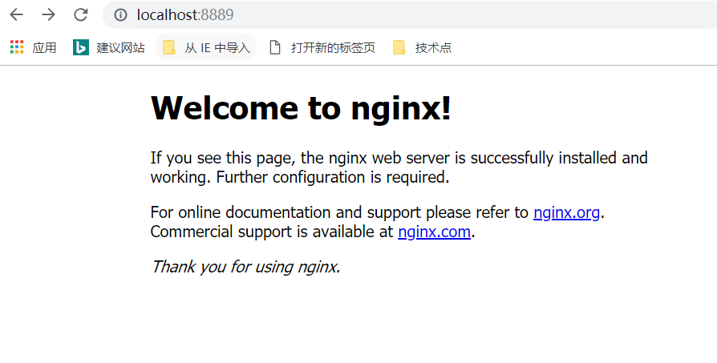
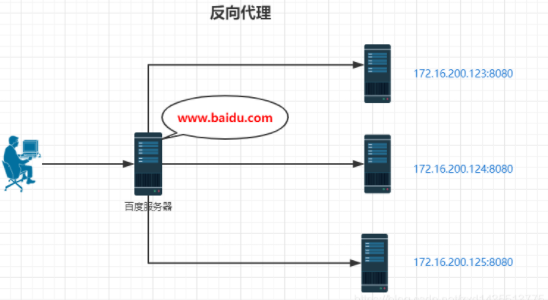

---

---

# Nginx

## 1、什么是nginx

### 1.1 nginx介绍


### 1.2 nginx的安装

1、nginx官方下载地址：<http://nginx.org/>

2、下载完后将压缩包解压即可

3、nginx配置文件为根目录下conf\nginx.conf

### 1.3 Nginx常用命令

```
tasklist /fi "imagename eq nginx.exe"    查看nginx进程
start nginx        启动nginx
nginx -s quit      安全关闭
nginx -s stop      强制关闭
nginx -s reload    改变配置文件时，重启nginx工作进程，使配置生效
nginx -s reopen    打开日志文件
nginx -v           查看版本
nginx -h           查看帮助信息
```

#### 1.3.1 nginx的配置文件详解

```
# 主进程叫master，负责管理子进程，子进程叫worker
# worker_processes配置项表示开启几个业务进程，一般和cpu核数有关
worker_processes  1;

events {
    worker_connections  1024;
}

http {
	# include表示可以引入其他文件，此处表示引入http mime类型
    include       mime.types;
    default_type  application/octet-stream;
    sendfile        on;
    keepalive_timeout  65;

	# 虚拟主机，可以配置多个
    server {
        listen       80;
        server_name  localhost;

        location / {
        	# 路径匹配之后，哪个目录下去匹配相应的网页,html是相对路径
            root   html;
            index  index.html index.htm;
        }

        # 若请求路径像这样：www.xxxx/img/example.png
        # 则访问/img/目录下的文件时，nginx会去/var/www/image/img/目录下找文件
        location /img/ {
            root /var/www/image;
        }

        error_page   500 502 503 504  /50x.html;
        location = /50x.html {
            root   html;
        }
	}
```

1. 全局块
   1. 配置影响nginx全局的指令。一般有运行nginx服务器的用户组，nginx进程pid存放路径，日志存放路径，配置文件引入，允许生成worker process数等。
   2. 上面这行 `worker_processes` 配置，是 `Nginx `服务器并发处理服务的关键配置，该值越大，可以支持的并发处理量也越多，但是会受到硬件、软件等设备的约束。

2. events块
   1. 配置影响nginx服务器或与用户的网络连接。有每个进程的最大连接数，选取哪种事件驱动模型处理连接请求，是否允许同时接受多个网路连接，开启多个网络连接序列化等。
   2. 上述例子就表示每个 `work process` 支持的最大连接数为 `1024`。这部分的配置对`Nginx`的性能影响较大，在实际中应该灵活配置。

3. http块
   1. 可以嵌套多个server，配置代理，缓存，日志定义等绝大多数功能和第三方模块的配置。如文件引入，mime-type定义，日志自定义，是否使用sendfile传输文件，连接超时时间，单连接请求数等。

4. server块
   1. 配置虚拟主机的相关参数，一个http中可以有多个server。
   2. 最常见的配置是本虚拟机主机的监听配置和本虚拟主机的名称或`IP`配置。

5. location块
   1. 配置请求的路由，以及各种页面的处理情况。

### 1.4 启动nginx

#### 1.4.1 启动nginx

##### 1.4.1.1 在nginx 下创建文件夹 logs 和temp


##### 1.4.1.2 利用命令启动nginx

进入nginx的目录，打开命令窗口，输入命令


##### 1.4.1.3 打开页面查看是否启动



注意：nginx的端口号在nginx.conf中配置

## 2、nginx的应用场景

1、http服务器：Nginx是一个http服务器，可以独立提供http服务。可以作为静态网页服务器。

2、虚拟主机：可以实现一台服务器虚拟出多个网站。例如个人网站使用的虚拟主机。

3、反向代理：当网站的访问量达到一定程度后，单台主机不能满足用户的请求时，需要用多台服务器集群可以使用Nginx做反向代理。

4、负载均衡：并且多台服务器可以平均分担负载，不会因为某台服务器负载高宕机而某台闲置的情况。

### 2.1.http反向代理配置

在介绍反向代理之前，先来了解一下正向代理。

正向代理：如果把局域网外的Internet想象成一个巨大的资源库，则局域网中的客户端要访问Internet，则需要通过代理服务器来访问，这种代理服务就称为正向代理，下面是正向代理的原理图。

由于工作环境原因，日常工作只能局限于单位的局域网，如果想要访问互联网，怎么办呢？这就需要用到正向代理，本人经常用正向代理来进行上网。


反向代理：看下面原理图，就一目了然。其实客户端对代理是无感知的，因为客户端不需要任何配置就可以访问，我们只需要将请求发送到反向代理服务器，由反向代理服务器去选择目标服务器获取数据后，在返回给客户端，此时反向代理服务器和目标服务器对外就是一个服务器，暴露的是代理服务器地址，隐藏了真实服务器 IP地址。



```
server {
		listen       80;                                                         
		server_name  localhost;                                               
		client_max_body_size 1024M;
	 
		location / {
			proxy_pass http://localhost:8082;
			proxy_set_header Host $host:$server_port;
		}
	}
```

保存配置文件后重启Nginx，当访问localhost的时候，就相当于访问localhost:8080了

#### 2.1.1反向代理实例

##### 实例一

实现效果：使用 Nginx 反向代理，访问www.123.com直接跳转到127.0.0.1:8080

注意：此处如果要想从www.123.com跳转到本机指定的ip，需要修改本机的hosts文件。此处略过

**配置代码**

```
server {
	listen       80;
	server_name  192.168.17.129;

	location / {
		root   html;
		index  index.html index.htm;
		proxy_pass  http://127.0.0.1:8080
	}

}
```

如上配置，Nginx监听 80端口，访问域名为www.123.com（不加端口号时默认为 80端口），故访问该域名时会跳转到 127.0.0.1:8080 路径上。

> 此处的意思为：nginx 反向代理服务监听 192.168.17.129的80端口，如果有请求过来，则转到proxy_pass配置的对应服务器上，仅此而已。
>
> 在location下，同时配置root和proxy_pass选项时，两个选项只会二选一执行
>
> 此处不能配置https反向代理


##### 实例二

实现效果：使用 Nginx 反向代理，根据访问的路径跳转到不同端口的服务中，Nginx 监听端口为 9001

访问http://192.168.17.129/edu/直接跳转到 127.0.0.1:8080

访问http://192.168.17.129/vod/直接跳转到 127.0.0.1:8081

第一步，需要准备两个 tomcat，一个 8080 端口，一个 8081 端口，并准备好测试的页面
第二步，修改 nginx 的配置文件，在 http 块中配置 server

```
server {
	listen       9001;
	server_name  192.168.17.129;

	location ~ /edu/ {
		proxy_pass  http://127.0.0.1:8080
	}
	
	location ~ /vod/ {
		proxy_pass  http://127.0.0.1:8081
	}

}

```

根据上面的配置，当请求到达 Nginx 反向代理服务器时，会根据请求路径不同进行分发到不同的服务上。


补充：location 指令说明

该指令用于匹配 URL， 语法如下：

```
location [ = | ~ | ~* | ^~] uri {

}
```

- = ：用于不含正则表达式的 uri 前，要求请求字符串与 uri 严格匹配，如果匹配成功，就停止继续向下搜索并立即处理该请求
- ~：用于表示 uri 包含正则表达式，并且区分大小写
- ~*：用于表示 uri 包含正则表达式，并且不区分大小写
- ^~：用于不含正则表达式的 uri 前，要求 Nginx 服务器找到标识 uri 和请求。字符串匹配度最高的 location 后，立即使用此 location 处理请求，而不再使用 location块中的正则 uri 和请求字符串做匹配。

### 2.2 负载均衡配置

#### 2.2.1 负载均衡配置

负载均衡是Nginx常用的一个功能，意思是将请求分摊到多个服务单元上进行执行，例如Web服务器、FTP服务器等，从而共同完成工作任务。简单而言就是当有2台或以上服务器时，根据规则随机的将请求分发到指定的服务器上处理，负载均衡配置一般都需要同时配置反向代理，通过反向代理跳转到负载均衡。而Nginx目前支持自带3种负载均衡策略，还有2种常用的第三方策略。

##### 2.2.1.1 RR

这是Nginx的默认策略，每个请求按时间顺序逐一分配到不同的后端服务器，如果后端服务器down掉，能自动剔除。

```
upstream test {
        server localhost:8080;
    	server localhost:8081;
}
server {
    listen       80;                                                         
    server_name  localhost;                                               
    client_max_body_size 1024M;
 
    location / {
        proxy_pass http://test;
        proxy_set_header Host $host:$server_port;
    }
}
```

假如upstream中其中一个服务8080挂掉了，访问http://localhost 的时候，也不会有问题，会默认跳转到http://localhost:8081,。因为Nginx会自动判断服务器的状态，如果服务器处于不能访问，就不会跳转到这台服务器，所以也避免了一台服务器挂了影响使用的情况，这就是Nginx的默认策略RR。

##### 2.2.1.2 权重

指定每个服务的轮询几率，weight和访问比率成正比，用于后端服务器性能不均的情况。

```
upstream test {
    server localhost:8080 weight=9;
    server localhost:8081 weight=1;
}
server {
    listen       80;                                                         
    server_name  localhost;                                               
    client_max_body_size 1024M;
 
    location / {
        proxy_pass http://test;
        proxy_set_header Host $host:$server_port;
    }
}
```

假如有10次请求，很有可能8081服务被访问1次，8080被访问10次。

##### 2.2.1.3 ip_hash

上面两种方式都有一个问题，那就是下一个请求来的时候请求可能分发到另外一个服务器，当程序不是无状态的时候(比如服务端采用session保存数据)，这时候就有一个很大的很问题。比如把登录信息保存到了session中，那么跳转到另外一台服务器的时候就需要重新登录了，所以很多时候我们需要一个客户只访问一个服务器，那么就需要用ip_hash了，ip_hash的每个请求按访问ip的hash结果分配，这样每个访客固定访问一个后端服务器，可以解决session的问题。

```

upstream test {
    ip_hash;
    server localhost:8080;
    server localhost:8081;
}
server {
    listen       80;                                                         
    server_name  localhost;                                               
    client_max_body_size 1024M;
 
    location / {
        proxy_pass http://test;
        proxy_set_header Host $host:$server_port;
    }
}
```

#### 2.3 跨域问题

web开发领域中，经常采用前后端分离模式。这种模式下，前端和后端分别是独立的web应用程序，比如后端是Java 程序，前端是React或Vue应用。各自独立的web app在互相访问时，势必存在跨域问题。解决跨域问题一般有两种思路：

CORS：在后端服务器设置HTTP响应头，把你需要运行访问的域名加入加入Access-Control-Allow-Origin中。

jsonp：把后端根据请求，构造json数据，并返回，前端用jsonp跨域。

Nginx针对CORS提供了一种跨域解决方案，比如前端后端存在跨域时，前端和后端如果使用http进行交互，请求会被拒绝。这时候可以通过设置后台服务响应头方式解决。

```
server {
    listen 80;
 
    server_name localhost;
 
	location / {
	
	    add_header 'Access-Control-Allow-Origin' '$http_origin';
	    add_header 'Access-Control-Allow-Credentials' 'true';
	    add_header 'Access-Control-Allow-Methods' 'POST, GET, OPTIONS, DELETE, PUT';
	    add_header 'Access-Control-Allow-Headers' 'DNT,X-Mx-ReqToken,Keep-Alive,User-Agent,X-Requested-With,If-Modified-Since,Cache-Control,Content-Type';
	
	    #跨域OPTIONS请求，set response header后直接204返回
	    if ($request_method = 'OPTIONS') {
	            return 204;
	    }
	
	    proxy_set_header X-Real-IP $remote_addr;
	    proxy_set_header X-Forwarded-For $proxy_add_x_forwarded_for;
	
	    proxy_pass http://test;
	}
}

```

## 3、 静态服务器搭建

修改conf下的nginx.conf

### 3.1 nginx配置文件搭建静态服务器

```
    # 配置代理服务器的地址，即Nginx安装的服务器地址、监听端口、默认地址
    server {
        #1.监听8889端口
        listen       8889;
        #对于server_name,如果需要将多个域名的请求进行反向代理，可以配置多个server_name来满足要求
        server_name  localhost;
      
        #访问本地E:/source文件夹 访问路径为localhost:8889/file/a.png 实际访问路径为 E:/source/file/a.png
        location /file/ {
            root E:/source/;
            autoindex on;
        }  
}
```


可以成功访问资源路径，静态服务器搭建完成

## 4、gzip压缩优化

### 4.1 作用

gzip压缩提升网站速度

### 4.2 参数详解

```
gzip配置的常用参数

gzip on|off;  #是否开启gzip

gzip_buffers 32 4K| 16 8K #缓冲(压缩在内存中缓冲几块? 每块多大?)

gzip_comp_level [1-9] #推荐6 压缩级别(级别越高,压的越小,越浪费CPU计算资源)

gzip_disable #正则匹配UA 什么样的Uri不进行gzip

gzip_min_length 200 # 开始压缩的最小长度(再小就不要压缩了,意义不在)

gzip_http_version 1.0|1.1 # 开始压缩的http协议版本(可以不设置,目前几乎全是1.1协议)

gzip_proxied          # 设置请求者代理服务器,该如何缓存内容

gzip_types text/plain application/xml # 对哪些类型的文件用压缩 如txt,xml,html ,css

gzip_vary on|off  # 是否传输gzip压缩标志
```

### 4.3 配置文件修改

在nginx.conf中加入

```
	gzip on;
	gzip_buffers 32 4K;
	gzip_comp_level 6;
    gzip_min_length 100;
	gzip_types application/javascript text/css text/xml;
    gzip_disable "MSIE [1-6]\."; #配置禁用gzip条件，支持正则。此处表示ie6及以下不启用gzip（因为ie低版本不支持）
    gzip_vary on;
```

保存并重启nginx，刷新页面（为了避免缓存，请强制刷新）就能看到效果了。以谷歌浏览器为例，通过F12看请求的响应头部，如下图


说明配置成功，nginx已经成功启用了gzip的压缩优化