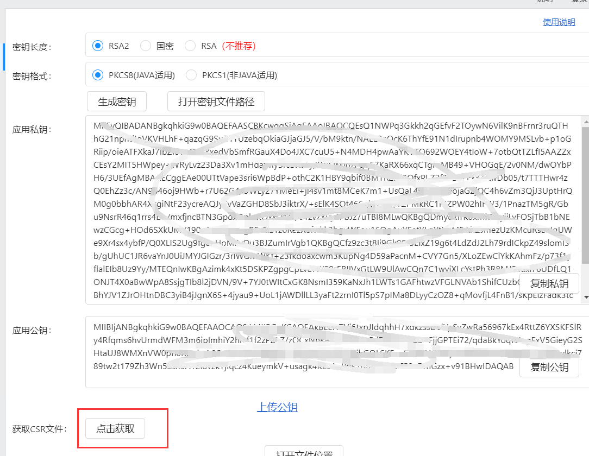

java实现支付宝网页扫码支付

接口文档

<https://docs.open.alipay.com/270>

## 1.蚂蚁金服注册

### 1.注册自由开发者身份

### 2.打开开发中心!

### 2.选择沙箱操作

### 3.点击设置公钥 


### 4.查看密钥生成方法，选择版本下载密钥生成器


### 5.解压并按说明文档操作

### 6.如图所示


### 7.设置密钥


### 将生成的公钥复制粘贴到设置公钥处

8.下载沙箱版支付宝，登陆买家账号


### 8.设置公钥证书方式 

#### 8.1选择公钥

打开支付宝开放平台 开发助手



#### 8.2 生成证书


#### 8.3 证书生成后，选择上传


#### 8.4 解析成功后：


**将应用公钥证书，支付宝公钥证书，支付宝根证书，全部下载到本地。**

## 2.代码环节

新建springcloud工程

1.导入依赖

```
		 <dependency>
            <groupId>com.alipay.sdk</groupId>
            <artifactId>alipay-sdk-java</artifactId>
            <version>4.12.4.ALL</version>
        </dependency>
```

2.创建配置信息类，其中配置信息为在沙箱环境中配置的密钥等信息


```
package com.alipay.config;

import java.io.FileWriter;
import java.io.IOException;

/* *
 *类名：AlipayConfig
 *功能：基础配置类
 *详细：设置帐户有关信息及返回路径
 *修改日期：2017-04-05
 *说明：
 *以下代码只是为了方便商户测试而提供的样例代码，商户可以根据自己网站的需要，按照技术文档编写,并非一定要使用该代码。
 *该代码仅供学习和研究支付宝接口使用，只是提供一个参考。
 */

public class AlipayConfig {
   
//↓↓↓↓↓↓↓↓↓↓请在这里配置您的基本信息↓↓↓↓↓↓↓↓↓↓↓↓↓↓↓

   // 应用ID,您的APPID，收款账号既是您的APPID对应支付宝账号
   public static String app_id = "2016101400681640";
   
   // 商户私钥，您的PKCS8格式RSA2私钥
    public static String merchant_private_key = "你自己的商户私钥";

   // 支付宝公钥,查看地址：https://openhome.alipay.com/platform/keyManage.htm 对应APPID下的支付宝公钥。
    public static String alipay_public_key = "你自己的支付宝公钥";

   // 服务器异步通知页面路径  需http://格式的完整路径，不能加?id=123这类自定义参数，必须外网可以正常访问
   //public static String notify_url = "http://localhost:8080/pay/notify_url.jsp";

   // 页面跳转同步通知页面路径 需http://格式的完整路径，不能加?id=123这类自定义参数，必须外网可以正常访问
   //public static String return_url = "http://localhost:8080/pay/return_url.jsp";

   // 签名方式
   public static String sign_type = "RSA2";
   
   // 字符编码格式
   public static String charset = "utf-8";
   
   // 支付宝网关
   public static String gatewayUrl = "https://openapi.alipaydev.com/gateway.do";
   
   // 支付宝网关
   public static String log_path = "C:\\";


//↑↑↑↑↑↑↑↑↑↑请在这里配置您的基本信息↑↑↑↑↑↑↑↑↑↑↑↑↑↑↑

    /** 
     * 写日志，方便测试（看网站需求，也可以改成把记录存入数据库）
     * @param sWord 要写入日志里的文本内容
     */
    public static void logResult(String sWord) {
        FileWriter writer = null;
        try {
            writer = new FileWriter(log_path + "alipay_log_" + System.currentTimeMillis()+".txt");
            writer.write(sWord);
        } catch (Exception e) {
            e.printStackTrace();
        } finally {
            if (writer != null) {
                try {
                    writer.close();
                } catch (IOException e) {
                    e.printStackTrace();
                }
            }
        }
    }
}
```

3.创建请求方法，方法请求接口[alipay.trade.page.pay](https://docs.open.alipay.com/api_1/alipay.trade.page.pay) ，参数说明文档<https://docs.open.alipay.com/api_1/alipay.trade.page.pay>

| 参数                  | 类型                | 是否必填 | 最大长度 | 描述                                                         |                                               示例值 |
| --------------------- | ------------------- | -------- | -------- | ------------------------------------------------------------ | ---------------------------------------------------: |
| out_trade_no          | String              | 必选     | 64       | 商户订单号,64个字符以内、可包含字母、数字、下划线；需保证在商户端不重复 |                                    20150320010101001 |
| product_code          | String              | 必选     | 64       | 销售产品码，与支付宝签约的产品码名称。  注：目前仅支持FAST_INSTANT_TRADE_PAY |                               FAST_INSTANT_TRADE_PAY |
| total_amount          | Price               | 必选     | 11       | 订单总金额，单位为元，精确到小数点后两位，取值范围[0.01,100000000]。 |                                                88.88 |
| subject               | String              | 必选     | 256      | 订单标题                                                     |                                          Iphone6 16G |
| body                  | String              | 可选     | 128      | 订单描述                                                     |                                          Iphone6 16G |
| time_expire           | String              | 可选     | 32       | 绝对超时时间，格式为yyyy-MM-dd HH:mm:ss                      |                                  2016-12-31 10:05:01 |
| goods_detail          | GoodsDetail[]       | 可选     |          | 订单包含的商品列表信息，json格式，其它说明详见商品明细说明   |                                                      |
| passback_params       | String              | 可选     | 512      | 公用回传参数，如果请求时传递了该参数，则返回给商户时会回传该参数。支付宝只会在同步返回（包括跳转回商户网站）和异步通知时将该参数原样返回。本参数必须进行UrlEncode之后才可以发送给支付宝。 | merchantBizType%3d3C%26merchantBizNo%3d2016010101111 |
| extend_params         | ExtendParams        | 可选     |          | 业务扩展参数                                                 |                                                      |
| goods_type            | String              | 可选     | 2        | 商品主类型 :0-虚拟类商品,1-实物类商品  注：虚拟类商品不支持使用花呗渠道 |                                                    0 |
| timeout_express       | String              | 可选     | 6        | 该笔订单允许的最晚付款时间，逾期将关闭交易。取值范围：1m～15d。m-分钟，h-小时，d-天，1c-当天（1c-当天的情况下，无论交易何时创建，都在0点关闭）。 该参数数值不接受小数点， 如 1.5h，可转换为 90m |                                                  90m |
| promo_params          | String              | 可选     | 512      | 优惠参数  注：仅与支付宝协商后可用                           |                                  {"storeIdType":"1"} |
| royalty_info          | RoyaltyInfo         | 可选     |          | 描述分账信息，json格式，详见分账参数说明                     |                                                      |
| sub_merchant          | SubMerchant         | 可选     |          | 间连受理商户信息体，当前只对特殊银行机构特定场景下使用此字段 |                                                      |
| merchant_order_no     | String              | 可选     | 32       | 商户原始订单号，最大长度限制32位                             |                                          20161008001 |
| enable_pay_channels   | String              | 可选     | 128      | 可用渠道,用户只能在指定渠道范围内支付，多个渠道以逗号分割  注，与disable_pay_channels互斥  渠道列表：https://docs.open.alipay.com/common/wifww7 |                   pcredit,moneyFund,debitCardExpress |
| store_id              | String              | 可选     | 32       | 商户门店编号                                                 |                                               NJ_001 |
| disable_pay_channels  | String              | 可选     | 128      | 禁用渠道,用户不可用指定渠道支付，多个渠道以逗号分割  注，与enable_pay_channels互斥  渠道列表：https://docs.open.alipay.com/common/wifww7 |                   pcredit,moneyFund,debitCardExpress |
| qr_pay_mode           | String              | 可选     | 2        | PC扫码支付的方式，支持前置模式和   跳转模式。  前置模式是将二维码前置到商户  的订单确认页的模式。需要商户在  自己的页面中以 iframe 方式请求  支付宝页面。具体分为以下几种：  0：订单码-简约前置模式，对应 iframe 宽度不能小于600px，高度不能小于300px；  1：订单码-前置模式，对应iframe 宽度不能小于 300px，高度不能小于600px；  3：订单码-迷你前置模式，对应 iframe 宽度不能小于 75px，高度不能小于75px；  4：订单码-可定义宽度的嵌入式二维码，商户可根据需要设定二维码的大小。   跳转模式下，用户的扫码界面是由支付宝生成的，不在商户的域名下。  2：订单码-跳转模式 |                                                    1 |
| qrcode_width          | Number              | 可选     | 4        | 商户自定义二维码宽度  注：qr_pay_mode=4时该参数生效          |                                                  100 |
| settle_info           | SettleInfo          | 可选     |          | 描述结算信息，json格式，详见结算参数说明                     |                                                      |
| invoice_info          | InvoiceInfo         | 可选     |          | 开票信息                                                     |                                                      |
| agreement_sign_params | AgreementSignParams | 可选     |          | 签约参数，支付后签约场景使用                                 |                                                      |
| integration_type      | String              | 可选     | 16       | 请求后页面的集成方式。  取值范围：  1. ALIAPP：支付宝钱包内  2. PCWEB：PC端访问  默认值为PCWEB。 |                                                PCWEB |
| request_from_url      | String              | 可选     | 256      | 请求来源地址。如果使用ALIAPP的集成方式，用户中途取消支付会返回该地址。 |                                             https:// |
| business_params       | String              | 可选     | 512      | 商户传入业务信息，具体值要和支付宝约定，应用于安全，营销等参数直传场景，格式为json格式 |                                       {"data":"123"} |
| ext_user_info         | ExtUserInfo         | 可选     |          | 外部指定买家                                                 |                                                      |

### 2.1付款--公钥方式

```
@RequestMapping("/pay")
    public String pay(HttpServletRequest httpRequest,
                      HttpServletResponse httpResponse, @RequestBody PayModel pyaModel) throws IOException {
       //将订单存储到数据库中,同时设置状态为未支付状态，
        UUID uuid = UUID.randomUUID();
        String string = uuid.toString();
        String out_trade_no = string.replace("-", "");
        AlipayClient alipayClient =  new DefaultAlipayClient(url, APP_ID, APP_PRIVATE_KEY, "json", "utf-8", ALIPAY_PUBLIC_KEY, "RSA2");  //获得初始化的AlipayClient
        AlipayTradePagePayRequest alipayRequest =  new  AlipayTradePagePayRequest(); //创建API对应的request
        //同步返回的调用结果 ---》当用户支付成功后，通过跳转到是商户支付成功页面
        //https://www.domain.com/CallBack/return_url
        //内网穿透：1.将自己本地的ip 发布到公网上
        alipayRequest.setReturnUrl( "http://zrwmuj.natappfree.cc/#/paySuccess" );
        //异步返回的结果 ---》当用户支付成功后，支付宝通过post请求到了你的接口的地址，将支付的参数携带，并且用户进行验签
        alipayRequest.setNotifyUrl( "http://331t2j2729.zicp.vip/notifyUrl" ); //在公共参数中设置回跳和通知地址
        //使用FastJson进行转换
        Map map = new HashMap<>();
       // Map sysMap = new HashMap<>();
        map.put("out_trade_no",out_trade_no);
        map.put("product_code","FAST_INSTANT_TRADE_PAY");
        map.put("total_amount",pyaModel.getTotal());
        map.put("subject",pyaModel.getSubject());
        map.put("body",pyaModel.getBody());
        //map.put("passback_params","merchantBizType%3d3C%26merchantBizNo%3d2016010101111");
       // sysMap.put("sys_service_provider_id","2088511833207846");
       // map.put("extend_params",sysMap);
        //使用
        String string1 = JSONObject.toJSONString(map);
//        alipayRequest.setBizContent( "{"  +
//                "    \"out_trade_no\":\"1234567890098765430000111\","  +
//                "    \"product_code\":\"FAST_INSTANT_TRADE_PAY\","  +
//                "    \"total_amount\":24000.0,"  +
//                "    \"subject\":\"Iphone60 1600G\","  +
//                "    \"body\":\"Iphone60 1600G\","  +
//                "    \"passback_params\":\"merchantBizType%3d3C%26merchantBizNo%3d2016010101111\","  +
//                "    \"extend_params\":{"  +
//                "    \"sys_service_provider_id\":\"2088511833207846\""  +
//                "    }" +
//                "  }" ); //填充业务参数
        alipayRequest.setBizContent(string1);
        String form= "" ;
        try  {
            form = alipayClient.pageExecute(alipayRequest).getBody();  //调用SDK生成表单
        }  catch  (AlipayApiException e) {
            e.printStackTrace();
        }
      /*  httpResponse.setContentType( "text/html;charset=utf-8");
        httpResponse.getWriter().write(form); //直接将完整的表单html输出到页面
        httpResponse.getWriter().flush();
        httpResponse.getWriter().close();*/
        return form;
    }

```

### 2.2 付款---公钥证书方式

```java
   @RequestMapping("/pay")
    public void pay(HttpServletRequest httpRequest,
                      HttpServletResponse httpResponse) throws IOException, AlipayApiException {
        //构造支付宝证书的client
        CertAlipayRequest certAlipayRequest = new CertAlipayRequest();
        //设置请求的支付宝路径 
        certAlipayRequest.setServerUrl("https://openapi.alipaydev.com/gateway.do");
        //设置当前的支付宝appid
        certAlipayRequest.setAppId("2016101800712391");
        //设置应用私钥 应用私钥在支付宝开放平台助手生成crt时自动生成
  certAlipayRequest.setPrivateKey("MIIEvQIBADANBgkqhkiG9w0BAQEFAASCBKcwggSjAgEAAoIBAQCQEsQ1NWPq3Gkkh2qGEfvF2TOywN6VilK9nBFrnr3ruQTHhG21nphdIoVKVHLhF+qazqG9SuZ1YUzebqOkiaGJjaGJ5/V/bM9ktn/NALE2eQcK6ThYfE91N1dIrupnb4WOMY9MSLvb+p1oGRiip/oieATFXkaJ7IbZIe1pQnxYxedVbSmfRGauX4Do4JXC7cuU5+N4MDH4pwAaYKVTO692WOEY4tIoW+7otbQtTZLfI5AAZZxCEsY2MIT5HWpey+WRyLvz23Da3Xv1mHdafmySfcDXaLy/OROMipzPgq57KaRX66xqCTgrbMB49+VHOGgE/2v0NM/dwOYbPH6/3UEfAgMBAAECggEAe00UTtVape3sri6WpBdP+othC2K1HBY9qbif0BMTR2IZDQfxPLZ2f37DxFFx3+KwDb05/t7TTTHwr4zQ0EhZz3c/AN9b46oj9HWb+r7U62G4/UWLy27YMeEi+jl4sv1mt8MCeK7m1+UsQaL4ynwoPseojaGZjQC4h6vZm3QjJ3UptHrQM0g0bbhAR4XxgiNtF23ycreAQJyFvVaZGHD8SbJ3iktrX/+sElK4SQt466qblIzRuyTZPMkRC1MZPW02hIFW3/1PnazTM5gR/Gbu9NsrR46q1rrs4De/mxfjncBTN3GpdxOplqKQxxOr3T/01zvzYuy4PbJz7uTBI8MLwQKBgQDmydxfrK0xMhZ3yiiLvFOSjTbB1bNEwzCGcg+HOd6SXkUMY190+ZvZNyfaagRFsEfz1z0RezXefwkk3bgvWFou16OgAuYFetYLgYtK0MBAhZJmezUzKMcuRsBNqUWe9Xr4sx4ybfP/Q0XLIS2Ug9fg8eHoMSxOu3BJZumIrVgb1QKBgQCfz9zc3t8Ii9Gk0SJ5EIxZ19g6t4LdZdJ2Lh79rdICkpZ49slomI3b/gUhUC1JR6vaYnJ0UiJMYJGIGzr/3rlWGmWKf+23fkdoaxcwm3KupNg4D59aPacnM+CVY7Gn5/XLoZEwClYkKAhmFz/p73f1yflalEIb8Uz9Yy/MTEQnIwKBgAzimk4xKt5DSKPZgpgCpLva7IK39rFRIIVxGtLW9UlAwCQn7C1wvjXLcYstPh3R8MJ5cuxl76UDfLQ1ONJT4X0aBwWpA8SsjgTIb8l2jDVN/9V+7YJ0tWItCxGK8NsmI359KaNxJh1LWTs1GAFhtwzVFGLNVAb1ShifCUzbOL8dAoGARaBhYJV1ZJrOHtnDBC3yiB4jJgnX6S+4jyau9+UoL1jAWDllLL3yaFt2zrnI0Tl5pS7pIMa8DLyyCzOZ8+qMovfjL4FnB1/sKpElzFadk3tcfKhJzB46Wjke6tdBip7kFvDweZa3Sw9qAVi1zu03PY3eptkbKGNsIKV7KK49rzMCgYEAu5zLIuSGgh1rLKnBQwLtNmuNIhj711hgnvMBMA/Au8pFaOq1y8w8FmDy1GQuGSu6cYHSqe5gzIdugzzSjtoqTI0+ndn5HGDGYDg1cY09HVww3QPoLgq14FMwvRRm0UdBrb/sGfkAL1oKcglRgAwxAx2C+wEUH7DEFXkJDp8NS1w=");
        //设置格式化方式
        certAlipayRequest.setFormat("json");
       //设置编码格式
        certAlipayRequest.setCharset("utf-8");
        //设置加密的方式
        certAlipayRequest.setSignType("RSA2");
        //设置应用公钥的绝对路径-->下载的公钥证书
  certAlipayRequest.setCertPath("C:\\Users\\54110\\Desktop\\appCertPublicKey_2016101800712391.crt");
        //设置支付宝公钥的绝对路径-->下载的公钥证书
  certAlipayRequest.setAlipayPublicCertPath("C:\\Users\\54110\\Desktop\\alipayCertPublicKey_RSA2 .crt");
        //设置支付宝根的绝对路径-->下载的公钥证书
        certAlipayRequest.setRootCertPath("C:\\Users\\54110\\Desktop\\alipayRootCert.crt");
       //创建默认的支付宝客户端
        DefaultAlipayClient alipayClient = new DefaultAlipayClient(certAlipayRequest);
          // new AlipayTradeAppPayRequest() 这个模型是app的请求方式
        //创建电脑网站支付的请求客户端 
        AlipayTradePagePayRequest alipayRequest = new AlipayTradePagePayRequest();
		//设置支付宝成功后的同步回调
        alipayRequest.setReturnUrl( "http://domain.com/CallBack/return_url.jsp" );
        //设置支付宝成功后的异步回调
        alipayRequest.setNotifyUrl( "http://domain.com/CallBack/notify_url.jsp" );
        // AlipayTradeAppPayModel 这个模型是app的请求模型
        //AlipayTradePagePayModel 这个模式时web请求模型
        AlipayTradePagePayModel model = new AlipayTradePagePayModel();
        model.setBody("我是测试数据");
        model.setSubject("App支付测试Java");
         //out_trade_no 订单号，客户自定义
        model.setOutTradeNo("1231231231231232123");
        //超时时间
        model.setTimeoutExpress("30m");
        //价格
        model.setTotalAmount("0.01");
        //app支付时productCode参数的值为 "QUICK_MSECURITY_PAY"；
        //web支付时为 FAST_INSTANT_TRADE_PAY
        model.setProductCode("FAST_INSTANT_TRADE_PAY");
		//填充业务参数
        alipayRequest.setBizModel(model); 

        String form="";
        try  {
           //发起请求
            AlipayTradePagePayResponse alipayTradePagePayResponse = alipayClient.pageExecute(alipayRequest);
            //获取返回参数
            form=alipayTradePagePayResponse.getBody();
        }  catch  (AlipayApiException e) {
            e.printStackTrace();
        }
        httpResponse.setContentType( "text/html;charset=utf-8");
        httpResponse.getWriter().write(form); //直接将完整的表单html输出到页面
        httpResponse.getWriter().flush();
        httpResponse.getWriter().close();
    }
```

### 2.1回调接口

```
 @RequestMapping("/returnUrl") //配置需与你的请求支付中的return_url中的路径保持一致
    public void returnUrl(HttpServletRequest request , HttpResponse httpResp) throws AlipayApiException {
        Map<String, String> stringStringMap = convertRequestParamsToMap(request);
        boolean  signVerified = AlipaySignature.rsaCheckV1(stringStringMap, "alipay_public_key", "utf-8", "RSA2");  //调用SDK验证签名
        if (signVerified){
            // TODO 验签成功后，按照支付结果异步通知中的描述，对支付结果中的业务内容进行二次校验，校验成功后在response中返回success并继续商户自身业务处理，校验失败返回failure
            System.out.println(stringStringMap);
        } else {
            // TODO 验签失败则记录异常日志，并在response中返回failure.
        }
    }

    // 将request中的参数转换成Map
    private static Map<String, String> convertRequestParamsToMap(HttpServletRequest request) {
        Map<String, String> retMap = new HashMap<String, String>();

        Set<Map.Entry<String, String[]>> entrySet = request.getParameterMap().entrySet();

        for (Map.Entry<String, String[]> entry : entrySet) {
            String name = entry.getKey();
            String[] values = entry.getValue();
            int valLen = values.length;

            if (valLen == 1) {
                retMap.put(name, values[0]);
            } else if (valLen > 1) {
                StringBuilder sb = new StringBuilder();
                for (String val : values) {
                    sb.append(",").append(val);
                }
                retMap.put(name, sb.toString().substring(1));
            } else {
                retMap.put(name, "");
            }
        }

        return retMap;
    }
```

启动springboot启动类，访问localhost:8080/pay,使用沙箱钱包扫码支付，对比支付完成前后金额

若金额不足，前往沙箱充值，想充多少充多少

### 2.2 在vue页面中需要设置提交Form表单

```
 <div v-html="alipayWap" ref="alipayWap"></div>
```

```
在请求后端的支付后获取到了form表单，我们将form表单进行绑定与 v-html中alipayWap进行绑定，同时我们需要设计，将该form表单自动提交
		this.$nextTick(() => {
                this.$refs.alipayWap.children[0].submit()
              })
```

### 2.3 当使用同步回调时，支付成功后跳转回我们商户的页面

#### 1.使用内网穿透的技术将本地的ip以及前端的端口号进行映射。

在请求支付宝支付时，需要在return_url 中将映射后的公网的域名以及支付成功后的页面的路径进行设置

```
alipayRequest.setReturnUrl( "http://zrwmuj.natappfree.cc/#/paySuccess" );
```

#### 2.在前端工程中的build文件下的webpack.dev.conf.js 中加入一段配置

```
devServer: {
#在devServer中加入如下配置，代表去除Host安全检查。
	disableHostCheck: true,
}
```

#### 3.可以支付完成后，跳转到本地的成功页面 。